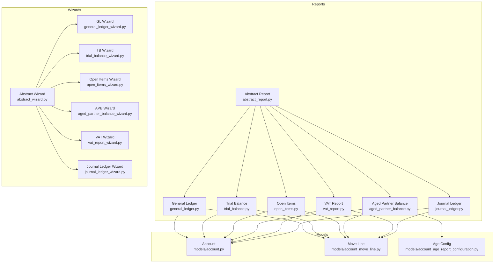
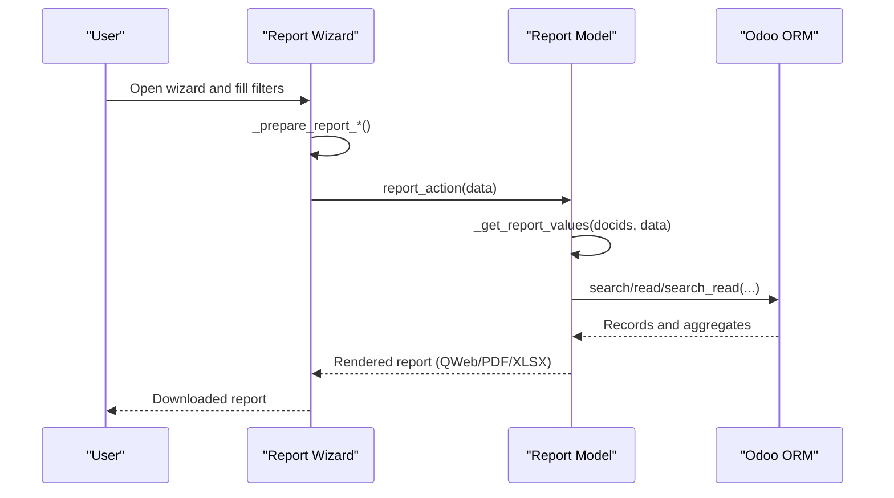
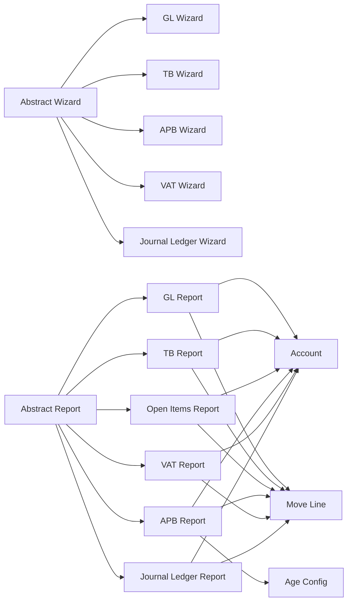

# API Reference

<cite>
**Referenced Files in This Document**
- [abstract_report.py](file://report/abstract_report.py)
- [abstract_wizard.py](file://wizard/abstract_wizard.py)
- [general_ledger.py](file://report/general_ledger.py)
- [general_ledger_wizard.py](file://wizard/general_ledger_wizard.py)
- [trial_balance.py](file://report/trial_balance.py)
- [trial_balance_wizard.py](file://wizard/trial_balance_wizard.py)
- [open_items.py](file://report/open_items.py)
- [aged_partner_balance.py](file://report/aged_partner_balance.py)
- [aged_partner_balance_wizard.py](file://wizard/aged_partner_balance_wizard.py)
- [vat_report.py](file://report/vat_report.py)
- [vat_report_wizard.py](file://wizard/vat_report_wizard.py)
- [journal_ledger.py](file://report/journal_ledger.py)
- [account.py](file://models/account.py)
- [account_move_line.py](file://models/account_move_line.py)
- [account_age_report_configuration.py](file://models/account_age_report_configuration.py)
</cite>

## Table of Contents
1. [Introduction](#introduction)
2. [Project Structure](#project-structure)
3. [Core Components](#core-components)
4. [Architecture Overview](#architecture-overview)
5. [Detailed Component Analysis](#detailed-component-analysis)
6. [Dependency Analysis](#dependency-analysis)
7. [Performance Considerations](#performance-considerations)
8. [Troubleshooting Guide](#troubleshooting-guide)
9. [Conclusion](#conclusion)
10. [Appendices](#appendices)

## Introduction
This API reference documents the programmatic interfaces of the Account Financial Reports module. It covers:
- Abstract report base class methods for data retrieval and processing
- Wizard configuration APIs for parameter validation and report preparation
- Data model interfaces for accounts, move lines, and report configurations
- Report generation endpoints and export interfaces
- Integration patterns and common usage examples

## Project Structure
The module is organized by concerns:
- report/: Abstract report base class and concrete report implementations
- wizard/: Abstract wizard base and concrete wizards for each report
- models/: Odoo ORM models extended for financial reporting needs
- static/: Templates and assets for HTML/PDF/XLSX rendering
- tests/: Unit tests validating report logic and wizard constraints

**Diagram sources**
- [abstract_report.py:1-165](file://report/abstract_report.py#L1-L165)
- [abstract_wizard.py:1-52](file://wizard/abstract_wizard.py#L1-L52)
- [general_ledger.py:1-931](file://report/general_ledger.py#L1-L931)
- [trial_balance.py:1-981](file://report/trial_balance.py#L1-L981)
- [open_items.py:1-310](file://report/open_items.py#L1-L310)
- [aged_partner_balance.py:1-473](file://report/aged_partner_balance.py#L1-L473)
- [vat_report.py:1-244](file://report/vat_report.py#L1-L244)
- [journal_ledger.py:1-376](file://report/journal_ledger.py#L1-L376)
- [general_ledger_wizard.py:1-322](file://wizard/general_ledger_wizard.py#L1-L322)
- [trial_balance_wizard.py:1-285](file://wizard/trial_balance_wizard.py#L1-L285)
- [aged_partner_balance_wizard.py:1-154](file://wizard/aged_partner_balance_wizard.py#L1-L154)
- [vat_report_wizard.py:1-101](file://wizard/vat_report_wizard.py#L1-L101)
- [account.py:1-14](file://models/account.py#L1-L14)
- [account_move_line.py:1-71](file://models/account_move_line.py#L1-L71)
- [account_age_report_configuration.py:1-50](file://models/account_age_report_configuration.py#L1-L50)

**Section sources**
- [abstract_report.py:1-165](file://report/abstract_report.py#L1-L165)
- [abstract_wizard.py:1-52](file://wizard/abstract_wizard.py#L1-L52)

## Core Components
This section documents the abstract base classes and shared utilities used across reports and wizards.

- Abstract Report Base Class
  - Purpose: Provide shared domain construction, move line recalculations, and data retrieval helpers.
  - Key Methods:
    - _get_move_lines_domain_not_reconciled(company_id, account_ids, partner_ids, only_posted_moves, date_from) -> list
      - Builds a domain for unreconciled move lines.
    - _get_new_move_lines_domain(new_ml_ids, account_ids, company_id, partner_ids, only_posted_moves) -> list
      - Builds a domain to fetch newly reconciled move lines.
    - _recalculate_move_lines(move_lines, debit_ids, credit_ids, debit_amount, credit_amount, ml_ids, account_ids, company_id, partner_ids, only_posted_moves, debit_amount_currency, credit_amount_currency) -> list
      - Recomputes residual amounts after reconciliations and returns updated move lines.
    - _get_accounts_data(accounts_ids) -> dict
      - Returns account metadata keyed by account id.
    - _get_journals_data(journals_ids) -> dict
      - Returns journal codes keyed by journal id.
    - _get_ml_fields() -> list
      - Returns the list of fields to fetch for move lines in reports.
  - Notes:
    - COMMON_ML_FIELDS defines the base set of fields returned by move line queries.

- Abstract Wizard Base Class
  - Purpose: Provide shared wizard utilities for export actions and partner defaults.
  - Key Methods:
    - _get_partner_ids_domain() -> list
      - Domain to filter partners by company and type.
    - _default_partners() -> list
      - Computes default partner ids from active context.
    - button_export_html() -> dict
      - Triggers HTML export via report action.
    - button_export_pdf() -> dict
      - Triggers PDF export via report action.
    - button_export_xlsx() -> dict
      - Triggers XLSX export via report action.

**Section sources**
- [abstract_report.py:10-165](file://report/abstract_report.py#L10-L165)
- [abstract_wizard.py:11-52](file://wizard/abstract_wizard.py#L11-L52)

## Architecture Overview
The module follows a layered pattern:
- Wizards collect parameters and prepare data dictionaries passed to report models.
- Report models implement _get_report_values(...) to compute data sets and return them to the QWeb/XLSX engine.
- Shared utilities in the abstract classes encapsulate domain building and data shaping.

**Diagram sources**
- [general_ledger_wizard.py:274-316](file://wizard/general_ledger_wizard.py#L274-L316)
- [general_ledger.py:763-800](file://report/general_ledger.py#L763-L800)
- [abstract_wizard.py:38-52](file://wizard/abstract_wizard.py#L38-L52)

## Detailed Component Analysis

### Abstract Report Base Class
- Responsibilities:
  - Build domains for move lines across reports
  - Recalculate move line residuals considering partial reconciliations
  - Retrieve account and journal metadata
  - Define common move line fields
- Complexity:
  - Domain construction: O(1) per filter; composed lists yield linear-time composition
  - Recalculation: O(N + M) where N is move lines and M is reconciliation records
- Error Handling:
  - Uses Odoo’s ORM exceptions; callers should handle ValidationError/UserError where applicable

**Section sources**
- [abstract_report.py:21-165](file://report/abstract_report.py#L21-L165)

### General Ledger Report
- Purpose: Compute balances, optional grouping by partners/taxes, and optional centralization.
- Key Methods:
  - _get_analytic_data(account_ids) -> dict
  - _get_taxes_data(taxes_ids) -> dict
  - _get_account_type_domain(grouped_by) -> list
  - _get_acc_prt_accounts_ids(company_id, grouped_by) -> list
  - _get_initial_balances_bs_ml_domain(...) -> list
  - _get_initial_balances_pl_ml_domain(...) -> list
  - _get_accounts_initial_balance(initial_domain_bs, initial_domain_pl) -> list
  - _get_initial_balance_fy_pl_ml_domain(...) -> list
  - _get_pl_initial_balance(...) -> dict
  - _get_gl_initial_acc(...) -> list
  - _prepare_gen_ld_data_item(gl) -> dict
  - _prepare_gen_ld_data(gl_initial_acc, domain, grouped_by) -> dict
  - _prepare_gen_ld_data_group_partners(...) -> dict
  - _prepare_gen_ld_data_group_taxes(...) -> dict
  - _get_initial_balance_data(...) -> dict
  - _get_move_line_data(move_line) -> dict
  - _get_period_domain(...) -> list
  - _initialize_data(foreign_currency) -> dict
  - _get_reconciled_after_date_to_ids(full_reconcile_ids, date_to) -> list
  - _prepare_ml_items(move_line, grouped_by) -> list
  - _get_period_ml_data(...) -> tuple
  - _recalculate_cumul_balance(move_lines, last_cumul_balance, rec_after_date_to_ids) -> list
  - _create_account(account, acc_id, gen_led_data, rec_after_date_to_ids) -> dict
  - _create_account_not_show_item(account, acc_id, gen_led_data, rec_after_date_to_ids, grouped_by) -> dict
  - _get_list_grouped_item(data, account, rec_after_date_to_ids, hide_account_at_0, rounding) -> tuple
  - _create_general_ledger(...) -> list
  - _calculate_centralization(centralized_ml, move_line, date_to) -> dict
  - _get_centralized_ml(account, date_to, grouped_by) -> list
  - _get_report_values(docids, data) -> dict
- Data Flow:
  - Initial balances (before period) and period transactions are aggregated
  - Optional grouping by partners/taxes
  - Cumulative balances computed and reconciliations after end date annotated
- Export Integration:
  - Returns data consumed by QWeb HTML/PDF and XLSX templates

**Section sources**
- [general_ledger.py:1-931](file://report/general_ledger.py#L1-L931)

### General Ledger Wizard
- Purpose: Collect filters and prepare report data payload.
- Key Fields:
  - date_from, date_to, fy_start_date, target_move, account_ids, centralize, hide_account_at_0, receivable_accounts_only, payable_accounts_only, partner_ids, account_journal_ids, cost_center_ids, foreign_currency, account_code_from, account_code_to, grouped_by, show_cost_center, domain
- Validation:
  - _check_company_id_date_range_id()
  - _only_one_unaffected_earnings_account()
  - _default_foreign_currency()
  - _init_date_from()
- Methods:
  - _get_account_move_lines_domain() -> list
  - _print_report(report_type) -> dict
  - _prepare_report_general_ledger() -> dict
  - _export(report_type) -> dict
- Usage:
  - Call _export('pdf' | 'html' | 'xlsx') to trigger report generation

**Section sources**
- [general_ledger_wizard.py:1-322](file://wizard/general_ledger_wizard.py#L1-L322)

### Trial Balance Report
- Purpose: Compute trial balance totals with optional grouping by analytic accounts and hierarchy support.
- Key Methods:
  - _get_initial_balances_bs_ml_domain(...) -> list
  - _get_initial_balances_pl_ml_domain(...) -> list
  - _get_period_ml_domain(...) -> list
  - _get_initial_balance_fy_pl_ml_domain(...) -> list
  - _get_pl_initial_balance(...) -> tuple
  - _compute_account_amount(total_amount, tb_initial_acc, tb_period_acc, foreign_currency) -> dict
  - _prepare_total_amount(tb, foreign_currency) -> dict
  - _compute_acc_prt_amount(total_amount, tb, acc_id, prt_id, foreign_currency) -> dict
  - _compute_partner_amount(total_amount, tb_initial_prt, tb_period_prt, foreign_currency) -> tuple
  - _remove_accounts_at_cero(total_amount, show_partner_details, company) -> None
  - _get_data(...) -> tuple
  - _get_data_grouped(total_amount, accounts_data, foreign_currency) -> tuple
  - _get_hierarchy_groups(group_ids, groups_data, foreign_currency) -> dict
  - _get_groups_data(accounts_data, total_amount, foreign_currency) -> dict
  - _get_report_values(...) -> dict

**Section sources**
- [trial_balance.py:1-981](file://report/trial_balance.py#L1-L981)

### Trial Balance Wizard
- Purpose: Configure filters and prepare report payload.
- Key Fields:
  - date_from, date_to, fy_start_date, target_move, show_hierarchy, limit_hierarchy_level, show_hierarchy_level, hide_parent_hierarchy_level, account_ids, hide_account_at_0, receivable_accounts_only, payable_accounts_only, show_partner_details, partner_ids, journal_ids, foreign_currency, account_code_from, account_code_to, grouped_by
- Validation:
  - _check_show_hierarchy_level()
  - _only_one_unaffected_earnings_account()
- Methods:
  - _print_report(report_type) -> dict
  - _prepare_report_trial_balance() -> dict
  - _export(report_type) -> dict

**Section sources**
- [trial_balance_wizard.py:1-285](file://wizard/trial_balance_wizard.py#L1-L285)

### Open Items Report
- Purpose: List unreconciled receivable/payable items up to a date.
- Key Methods:
  - _get_account_partial_reconciled(company_id, date_at_object) -> tuple
  - _get_data(...) -> tuple
  - _calculate_amounts(open_items_move_lines_data) -> dict
  - _order_open_items_by_date(...) -> dict
  - _get_report_values(...) -> dict
  - _get_ml_fields() -> list

**Section sources**
- [open_items.py:1-310](file://report/open_items.py#L1-L310)

### Aged Partner Balance Report
- Purpose: Age receivables/payables by configured intervals.
- Key Methods:
  - _initialize_account(ag_pb_data, acc_id) -> dict
  - _initialize_partner(ag_pb_data, acc_id, prt_id) -> dict
  - _calculate_amounts(ag_pb_data, acc_id, prt_id, residual, due_date, date_at_object) -> dict
  - _get_values_for_range_intervals(num1, num2) -> list
  - _get_account_partial_reconciled(company_id, date_at_object) -> tuple
  - _get_move_lines_data(...) -> tuple
  - _compute_maturity_date(ml, date_at_object) -> None
  - _create_account_list(...) -> list
  - _calculate_percent(aged_partner_data) -> list
  - _get_report_values(...) -> dict
  - _get_ml_fields() -> list

**Section sources**
- [aged_partner_balance.py:1-473](file://report/aged_partner_balance.py#L1-L473)

### Aged Partner Balance Wizard
- Purpose: Configure filters and intervals for aged report.
- Key Fields:
  - date_at, date_from, target_move, account_ids, receivable_accounts_only, payable_accounts_only, partner_ids, show_move_line_details, account_code_from, account_code_to, age_partner_config_id
- Methods:
  - _print_report(report_type) -> dict
  - _prepare_report_aged_partner_balance() -> dict
  - _export(report_type) -> dict

**Section sources**
- [aged_partner_balance_wizard.py:1-154](file://wizard/aged_partner_balance_wizard.py#L1-L154)

### VAT Report
- Purpose: Compute VAT declarations grouped by tax groups or tags.
- Key Methods:
  - _get_tax_data(tax_ids) -> dict
  - _get_tax_report_domain(company_id, date_from, date_to, only_posted_moves) -> list
  - _get_net_report_domain(company_id, date_from, date_to, only_posted_moves) -> list
  - _get_vat_report_data(company_id, date_from, date_to, only_posted_moves) -> tuple
  - _get_tax_group_data(tax_group_ids) -> dict
  - _get_vat_report_group_data(vat_report_data, tax_data, tax_detail) -> list
  - _get_tags_data(tags_ids) -> dict
  - _get_vat_report_tag_data(vat_report_data, tax_data, tax_detail) -> list
  - _get_report_values(...) -> dict
  - _get_ml_fields_vat_report() -> list

**Section sources**
- [vat_report.py:1-244](file://report/vat_report.py#L1-L244)

### VAT Wizard
- Purpose: Configure date range and grouping basis for VAT report.
- Key Fields:
  - date_from, date_to, based_on, tax_detail, target_move
- Methods:
  - _print_report(report_type) -> dict
  - _prepare_vat_report() -> dict
  - _export(report_type) -> dict

**Section sources**
- [vat_report_wizard.py:1-101](file://wizard/vat_report_wizard.py#L1-L101)

### Journal Ledger Report
- Purpose: Render journal entries with optional tax breakdown and grouping.
- Key Methods:
  - _get_journal_ledger_data(journal) -> dict
  - _get_journal_ledgers_domain(wizard, journal_ids, company) -> list
  - _get_journal_ledgers(wizard, journal_ids, company) -> list
  - _get_moves_domain(wizard, journal_ids) -> list
  - _get_moves_order(wizard, journal_ids) -> str
  - _get_moves_data(move) -> dict
  - _get_moves(wizard, journal_ids) -> tuple
  - _get_move_lines_domain(move_ids, wizard, journal_ids) -> list
  - _get_move_lines_order(move_ids, wizard, journal_ids) -> str
  - _get_move_lines_data(ml, wizard, ml_taxes, auto_sequence, exigible) -> dict
  - _get_account_data(accounts) -> dict
  - _get_account_id_data(account) -> dict
  - _get_partner_data(partners) -> dict
  - _get_partner_id_data(partner) -> dict
  - _get_currency_data(currencies) -> dict
  - _get_currency_id_data(currency) -> dict
  - _get_tax_line_data(taxes) -> dict
  - _get_tax_line_id_data(tax) -> dict
  - _get_query_taxes() -> str
  - _get_query_taxes_params(move_lines) -> dict
  - _get_move_lines(move_ids, wizard, journal_ids) -> tuple
  - _get_journal_tax_lines(wizard, moves_data) -> dict
  - _get_report_values(...) -> dict

**Section sources**
- [journal_ledger.py:1-376](file://report/journal_ledger.py#L1-L376)

### Data Model Interfaces

#### Account
- Extended fields:
  - centralized: Boolean
    - Controls whether centralized amounts are shown in reports.

**Section sources**
- [account.py:9-13](file://models/account.py#L9-L13)

#### Account Move Line
- Extended fields:
  - analytic_account_ids: Many2many computed from analytic_distribution
- Methods:
  - _compute_analytic_account_ids(): Compute m2m relation from distribution JSON
  - init(): Create database index on (account_id, partner_id) for performance
  - search_count(domain, limit): Skip expensive counts when context flag is set

**Section sources**
- [account_move_line.py:16-71](file://models/account_move_line.py#L16-L71)

#### Age Report Configuration
- Model: account.age.report.configuration
  - name: Char, required
  - company_id: Many2one, default env.company
  - line_ids: One2many to configuration lines
  - Constraints: Must have at least one configuration line
- Model: account.age.report.configuration.line
  - name: Char, required
  - account_age_report_config_id: Many2one
  - inferior_limit: Integer
  - Constraints: inferior_limit > 0; unique name per config

**Section sources**
- [account_age_report_configuration.py:12-50](file://models/account_age_report_configuration.py#L12-L50)

### Report Generation and Export APIs

- Wizard Export Entrypoints
  - button_export_html(), button_export_pdf(), button_export_xlsx()
    - Trigger report_action with appropriate report_type
  - _export(report_type) -> dict
    - Delegates to _print_report(report_type)
  - _print_report(report_type) -> dict
    - Builds data payload via *_prepare_report_*() and calls ir.actions.report.search(...).report_action(self, data)

- Report Values Entrypoints
  - _get_report_values(docids, data) -> dict
    - Returns structured data for templates and XLSX generators

- Example Workflows
  - General Ledger: Wizard collects filters -> _prepare_report_general_ledger() -> report_action -> _get_report_values() -> render
  - Trial Balance: Wizard collects filters -> _prepare_report_trial_balance() -> report_action -> _get_report_values() -> render
  - Open Items: Wizard collects filters -> _prepare_report_open_items() -> report_action -> _get_report_values() -> render
  - Aged Partner Balance: Wizard collects filters and intervals -> _prepare_report_aged_partner_balance() -> report_action -> _get_report_values() -> render
  - VAT Report: Wizard collects dates and grouping -> _prepare_vat_report() -> report_action -> _get_report_values() -> render
  - Journal Ledger: Wizard collects journals and sorting -> _prepare_report_journal_ledger() -> report_action -> _get_report_values() -> render

**Section sources**
- [abstract_wizard.py:38-52](file://wizard/abstract_wizard.py#L38-L52)
- [general_ledger_wizard.py:274-316](file://wizard/general_ledger_wizard.py#L274-L316)
- [trial_balance_wizard.py:242-285](file://wizard/trial_balance_wizard.py#L242-L285)
- [aged_partner_balance_wizard.py:120-154](file://wizard/aged_partner_balance_wizard.py#L120-L154)
- [vat_report_wizard.py:69-101](file://wizard/vat_report_wizard.py#L69-L101)
- [journal_ledger.py:302-376](file://report/journal_ledger.py#L302-L376)

## Dependency Analysis
- Cohesion:
  - Each report class encapsulates its own domain construction and aggregation logic
  - Wizards encapsulate parameter validation and data preparation
- Coupling:
  - Reports depend on abstract_report.py for shared utilities
  - Wizards depend on abstract_wizard.py for export actions
  - Models are accessed via env.* to retrieve metadata and computed fields
- External Dependencies:
  - Odoo ORM (search, search_read, read_group, browse)
  - ir.actions.report for rendering
  - account.partial.reconcile for reconciliation adjustments

**Diagram sources**
- [abstract_wizard.py:7-52](file://wizard/abstract_wizard.py#L7-L52)
- [abstract_report.py:7-165](file://report/abstract_report.py#L7-L165)
- [general_ledger_wizard.py:18-322](file://wizard/general_ledger_wizard.py#L18-L322)
- [trial_balance_wizard.py:12-285](file://wizard/trial_balance_wizard.py#L12-L285)
- [aged_partner_balance_wizard.py:9-154](file://wizard/aged_partner_balance_wizard.py#L9-L154)
- [vat_report_wizard.py:8-101](file://wizard/vat_report_wizard.py#L8-L101)
- [journal_ledger.py:11-376](file://report/journal_ledger.py#L11-L376)
- [account.py:6-14](file://models/account.py#L6-L14)
- [account_move_line.py:9-71](file://models/account_move_line.py#L9-L71)
- [account_age_report_configuration.py:8-50](file://models/account_age_report_configuration.py#L8-L50)

**Section sources**
- [abstract_wizard.py:7-52](file://wizard/abstract_wizard.py#L7-L52)
- [abstract_report.py:7-165](file://report/abstract_report.py#L7-L165)

## Performance Considerations
- Indexing:
  - Move line indexing on (account_id, partner_id) improves performance for large datasets
- Computed Fields:
  - analytic_account_ids computed from analytic_distribution JSON; pre-fetch and batch operations recommended
- Domain Filtering:
  - Use targeted domains to minimize read_group and search_read workloads
- Reconciliation Recalculation:
  - Partial reconciliations are fetched and merged; avoid unnecessary recomputation by passing minimal sets of ids

[No sources needed since this section provides general guidance]

## Troubleshooting Guide
- Validation Errors:
  - Wizard constraints raise ValidationError/UserError for invalid combinations (e.g., company/date range mismatch, hierarchy level limits)
- Missing Data:
  - Ensure company filters and date ranges are set consistently across wizard and report logic
- Performance Issues:
  - Enable foreign currency only when needed
  - Limit result sets using account/partner filters
  - Use posted moves when appropriate to reduce dataset size

**Section sources**
- [general_ledger_wizard.py:218-232](file://wizard/general_ledger_wizard.py#L218-L232)
- [trial_balance_wizard.py:99-108](file://wizard/trial_balance_wizard.py#L99-L108)
- [aged_partner_balance_wizard.py:75-98](file://wizard/aged_partner_balance_wizard.py#L75-L98)
- [vat_report_wizard.py:54-68](file://wizard/vat_report_wizard.py#L54-L68)

## Conclusion
The Account Financial Reports module exposes a consistent API surface:
- Abstract base classes encapsulate shared report logic
- Wizards provide robust parameter validation and export orchestration
- Reports implement domain-specific aggregation and templating-ready data structures
- Models extend core entities to support advanced reporting needs

[No sources needed since this section summarizes without analyzing specific files]

## Appendices

### API Usage Patterns

- General Ledger
  - Collect filters in wizard
  - Build data payload via _prepare_report_general_ledger()
  - Trigger export via _export('pdf' | 'html' | 'xlsx')
  - Report consumes data in _get_report_values() and returns structured data for templates

- Trial Balance
  - Configure grouping and hierarchy options
  - Use _prepare_report_trial_balance() and _export()

- Open Items
  - Set date_at and optional grouping
  - Use _prepare_report_open_items() and _export()

- Aged Partner Balance
  - Select interval configuration
  - Use _prepare_report_aged_partner_balance() and _export()

- VAT Report
  - Choose grouping basis (tax groups/tags)
  - Use _prepare_vat_report() and _export()

- Journal Ledger
  - Select journals and sorting options
  - Use _prepare_report_journal_ledger() and _export()

**Section sources**
- [general_ledger_wizard.py:290-316](file://wizard/general_ledger_wizard.py#L290-L316)
- [trial_balance_wizard.py:258-285](file://wizard/trial_balance_wizard.py#L258-L285)
- [aged_partner_balance_wizard.py:136-154](file://wizard/aged_partner_balance_wizard.py#L136-L154)
- [vat_report_wizard.py:85-101](file://wizard/vat_report_wizard.py#L85-L101)
- [journal_ledger.py:302-376](file://report/journal_ledger.py#L302-L376)