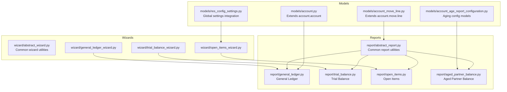
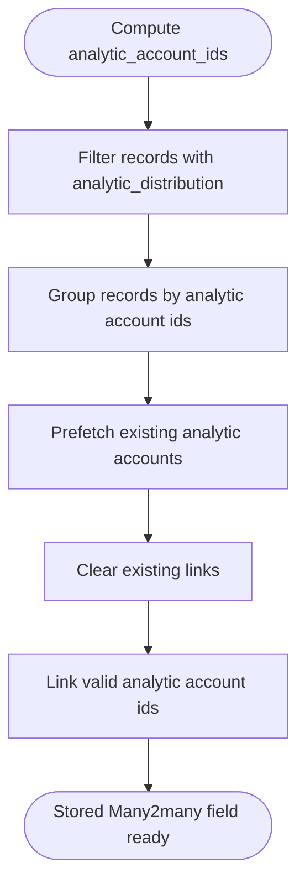
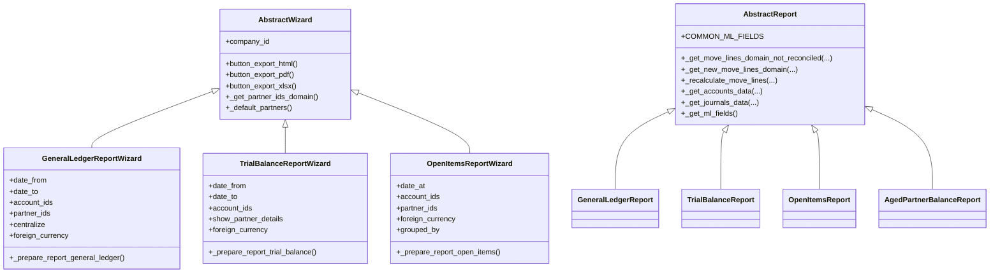
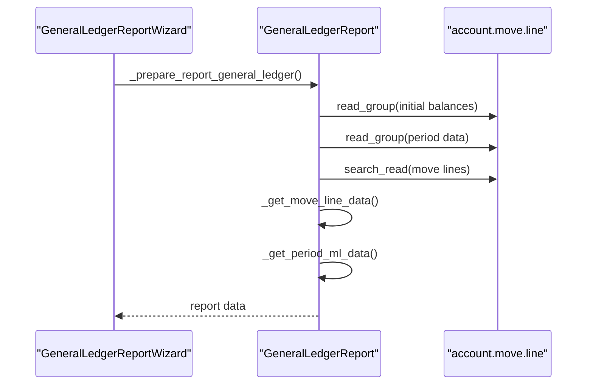
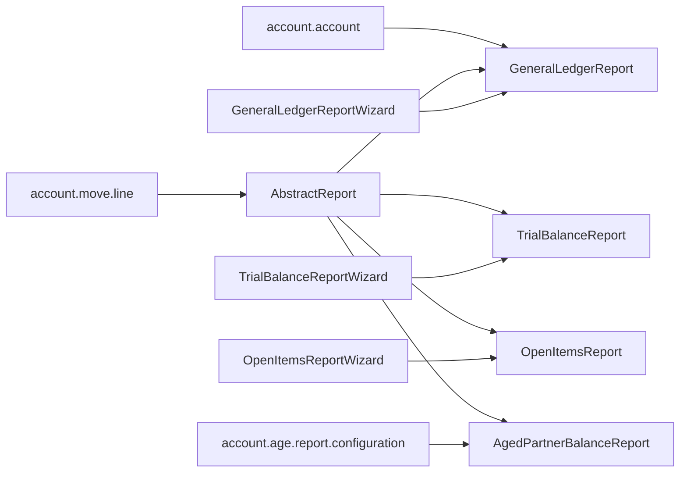

# Data Model Interfaces

<cite>
**Referenced Files in This Document**
- [models/__init__.py](file://models/__init__.py)
- [models/account.py](file://models/account.py)
- [models/account_move_line.py](file://models/account_move_line.py)
- [models/account_age_report_configuration.py](file://models/account_age_report_configuration.py)
- [models/res_config_settings.py](file://models/res_config_settings.py)
- [report/abstract_report.py](file://report/abstract_report.py)
- [report/general_ledger.py](file://report/general_ledger.py)
- [report/trial_balance.py](file://report/trial_balance.py)
- [report/open_items.py](file://report/open_items.py)
- [report/aged_partner_balance.py](file://report/aged_partner_balance.py)
- [wizard/abstract_wizard.py](file://wizard/abstract_wizard.py)
- [wizard/general_ledger_wizard.py](file://wizard/general_ledger_wizard.py)
- [wizard/trial_balance_wizard.py](file://wizard/trial_balance_wizard.py)
- [wizard/open_items_wizard.py](file://wizard/open_items_wizard.py)
</cite>

## Table of Contents
1. [Introduction](#introduction)
2. [Project Structure](#project-structure)
3. [Core Components](#core-components)
4. [Architecture Overview](#architecture-overview)
5. [Detailed Component Analysis](#detailed-component-analysis)
6. [Dependency Analysis](#dependency-analysis)
7. [Performance Considerations](#performance-considerations)
8. [Troubleshooting Guide](#troubleshooting-guide)
9. [Conclusion](#conclusion)

## Introduction
This document describes the data model interfaces used by the financial reporting module. It focuses on:
- Account model extensions
- Move line data structures and computed fields
- Report configuration models for aging partner balances
- Report wizard interfaces and their data preparation
- Integration with Odoo's ORM, query optimization utilities, and data transformation methods
- Examples of model inheritance patterns, custom field additions, and filtering operations
- Performance considerations for large datasets and best practices for extending functionality

## Project Structure
The module organizes financial reporting around three primary layers:
- Models: Odoo models that extend core accounting entities and introduce report-specific configurations
- Reports: Abstract and concrete report classes that define data access, filtering, and transformation logic
- Wizards: Transient models that collect user inputs and prepare structured data for reports

**Diagram sources**
- [models/account.py:6-14](file://models/account.py#L6-L14)
- [models/account_move_line.py:9-71](file://models/account_move_line.py#L9-L71)
- [models/account_age_report_configuration.py:8-50](file://models/account_age_report_configuration.py#L8-L50)
- [models/res_config_settings.py:7-37](file://models/res_config_settings.py#L7-L37)
- [report/abstract_report.py:7-165](file://report/abstract_report.py#L7-L165)
- [report/general_ledger.py:14-931](file://report/general_ledger.py#L14-L931)
- [report/trial_balance.py:12-981](file://report/trial_balance.py#L12-L981)
- [report/open_items.py:13-310](file://report/open_items.py#L13-L310)
- [report/aged_partner_balance.py:12-473](file://report/aged_partner_balance.py#L12-L473)
- [wizard/abstract_wizard.py:7-52](file://wizard/abstract_wizard.py#L7-L52)
- [wizard/general_ledger_wizard.py:18-322](file://wizard/general_ledger_wizard.py#L18-L322)
- [wizard/trial_balance_wizard.py:12-285](file://wizard/trial_balance_wizard.py#L12-L285)
- [wizard/open_items_wizard.py:9-190](file://wizard/open_items_wizard.py#L9-L190)

**Section sources**
- [models/__init__.py:1-7](file://models/__init__.py#L1-L7)

## Core Components

### Account Model Extensions
- Extended model: account.account
  - Field: centralized (Boolean)
    - Purpose: Controls whether centralized amounts are shown in General Ledger reports
    - Behavior: When flagged, detailed lines are suppressed in certain GL views
  - Integration: Used by report classes to compute account-level presentation logic

**Section sources**
- [models/account.py:6-14](file://models/account.py#L6-L14)
- [report/general_ledger.py:14-17](file://report/general_ledger.py#L14-L17)

### Move Line Data Structures and Computed Fields
- Extended model: account.move.line
  - Field: analytic_account_ids (Many2many)
    - Compute method: _compute_analytic_account_ids
      - Logic: Parses analytic_distribution JSON to populate linked analytic accounts
      - Optimization: Uses batch processing and prefetching to minimize database calls
    - Storage: Stored to enable efficient joins and filtering
  - Method: init
    - Purpose: Creates a composite index on (account_id, partner_id) to improve join performance for large datasets
  - Method: search_count
    - Purpose: Skips expensive counts when a context flag is present to improve UI responsiveness

**Diagram sources**
- [models/account_move_line.py:16-38](file://models/account_move_line.py#L16-L38)

**Section sources**
- [models/account_move_line.py:9-71](file://models/account_move_line.py#L9-L71)

### Report Configuration Models (Aging Partner Balance)
- Model: account.age.report.configuration
  - Fields:
    - name (Char, required)
    - company_id (Many2one, res.company)
    - line_ids (One2many, configuration lines)
  - Constraints:
    - At least one configuration line must be present
- Model: account.age.report.configuration.line
  - Fields:
    - name (Char, required)
    - account_age_report_config_id (Many2one)
    - inferior_limit (Integer)
  - Constraints:
    - inferior_limit must be greater than zero
  - SQL Constraint:
    - Unique combination of name and configuration id

**Section sources**
- [models/account_age_report_configuration.py:8-50](file://models/account_age_report_configuration.py#L8-L50)

### Settings Integration for Aging Configurations
- Model: res.config.settings (inherited)
  - Field: age_partner_config_id (Many2one, account.age.report.configuration)
  - Methods:
    - set_values: persists default aging configuration for the wizard
    - get_values: retrieves persisted default aging configuration for the wizard

**Section sources**
- [models/res_config_settings.py:7-37](file://models/res_config_settings.py#L7-L37)

## Architecture Overview
The reporting architecture follows a layered pattern:
- Data Access Layer: Reports inherit common utilities for domain construction, field selection, and grouped reads
- Transformation Layer: Reports transform raw ORM results into structured dictionaries suitable for templates
- Presentation Layer: Wizards collect inputs and package them into report-ready data structures

**Diagram sources**
- [wizard/abstract_wizard.py:7-52](file://wizard/abstract_wizard.py#L7-L52)
- [wizard/general_ledger_wizard.py:18-322](file://wizard/general_ledger_wizard.py#L18-L322)
- [wizard/trial_balance_wizard.py:12-285](file://wizard/trial_balance_wizard.py#L12-L285)
- [wizard/open_items_wizard.py:9-190](file://wizard/open_items_wizard.py#L9-L190)
- [report/abstract_report.py:7-165](file://report/abstract_report.py#L7-L165)
- [report/general_ledger.py:14-931](file://report/general_ledger.py#L14-L931)
- [report/trial_balance.py:12-981](file://report/trial_balance.py#L12-L981)
- [report/open_items.py:13-310](file://report/open_items.py#L13-L310)
- [report/aged_partner_balance.py:12-473](file://report/aged_partner_balance.py#L12-L473)

## Detailed Component Analysis

### Abstract Report Utilities
- Common move line fields: COMMON_ML_FIELDS
- Domain builders:
  - _get_move_lines_domain_not_reconciled: filters unreconciled lines with optional posted-state and partner filters
  - _get_new_move_lines_domain: builds domains for recalculated lines
- Recalculation pipeline:
  - _recalculate_move_lines: merges recalculated lines after reconciliations outside the period
- Data retrieval helpers:
  - _get_accounts_data: fetches account metadata
  - _get_journals_data: fetches journal codes
  - _get_ml_fields: defines the fields to load for move lines

**Section sources**
- [report/abstract_report.py:10-165](file://report/abstract_report.py#L10-L165)

### General Ledger Report
- Key capabilities:
  - Initial balances computation across balance sheet and profit & loss accounts
  - Period move lines aggregation with grouped-by options (partners, taxes)
  - Cumulative balance calculation and centralization logic
  - Foreign currency support with currency conversions
- Domain construction:
  - _get_initial_balances_bs_ml_domain/_get_initial_balances_pl_ml_domain
  - _get_period_domain
- Data transformation:
  - _get_move_line_data: normalizes move line records
  - _get_period_ml_data: aggregates and enriches data with accounts, journals, taxes, analytics
  - Centralization: _calculate_centralization and _get_centralized_ml
- Performance:
  - read_group usage for efficient aggregations
  - search_read with ordered fields for deterministic output

**Diagram sources**
- [wizard/general_ledger_wizard.py:290-311](file://wizard/general_ledger_wizard.py#L290-L311)
- [report/general_ledger.py:108-178](file://report/general_ledger.py#L108-L178)
- [report/general_ledger.py:362-392](file://report/general_ledger.py#L362-L392)
- [report/general_ledger.py:446-558](file://report/general_ledger.py#L446-L558)

**Section sources**
- [report/general_ledger.py:14-931](file://report/general_ledger.py#L14-L931)

### Trial Balance Report
- Capabilities:
  - Computes initial and period balances grouped by account
  - Supports grouping by analytic accounts
  - Hierarchical grouping with account groups
  - Optional partner details and foreign currency
- Domains:
  - _get_initial_balances_bs_ml_domain/_get_initial_balances_pl_ml_domain
  - _get_period_ml_domain
  - _get_initial_balance_fy_pl_ml_domain
- Aggregations:
  - read_group for balances and currency sums
  - _compute_account_amount/_compute_partner_amount for totals
  - _get_hierarchy_groups for parent-child rollups

**Section sources**
- [report/trial_balance.py:12-981](file://report/trial_balance.py#L12-L981)

### Open Items Report
- Focus:
  - Lists unreconciled receivable/payable lines up to a cut-off date
  - Recalculation of residuals for reconciliations occurring after the cut-off
  - Grouping by partner or salesperson
- Methods:
  - _get_account_partial_reconciled: loads partial reconciliations after cut-off
  - _get_data: constructs open items with calculated amounts and labels
  - _calculate_amounts/_order_open_items_by_date: computes totals and sorts

**Section sources**
- [report/open_items.py:13-310](file://report/open_items.py#L13-L310)

### Aged Partner Balance Report
- Features:
  - Aging buckets based on configurable intervals
  - Recalculation of residuals for post-period reconciliations
  - Percent calculations per bucket and per account
- Configuration:
  - Uses account.age.report.configuration via wizard context
- Methods:
  - _initialize_account/_initialize_partner: sets up bucket fields
  - _calculate_amounts/_compute_maturity_date: assigns amounts to buckets
  - _create_account_list/_calculate_percent: structures and percentages

**Section sources**
- [report/aged_partner_balance.py:12-473](file://report/aged_partner_balance.py#L12-L473)

### Wizard Interfaces and Data Preparation
- Abstract Wizard:
  - Provides shared domain construction and export actions
- General Ledger Wizard:
  - Collects date range, accounts, partners, journals, cost centers
  - Prepares centralization, grouping, and foreign currency flags
- Trial Balance Wizard:
  - Collects hierarchy and grouping options
  - Prepares partner details and foreign currency flags
- Open Items Wizard:
  - Collects cut-off date and grouping preferences
  - Prepares foreign currency and partner detail flags

**Section sources**
- [wizard/abstract_wizard.py:7-52](file://wizard/abstract_wizard.py#L7-L52)
- [wizard/general_ledger_wizard.py:18-322](file://wizard/general_ledger_wizard.py#L18-L322)
- [wizard/trial_balance_wizard.py:12-285](file://wizard/trial_balance_wizard.py#L12-L285)
- [wizard/open_items_wizard.py:9-190](file://wizard/open_items_wizard.py#L9-L190)

## Dependency Analysis
- Inheritance patterns:
  - Reports inherit from report.account_financial_report.abstract_report
  - Wizards inherit from account_financial_report_abstract_wizard
  - Models extend core Odoo models (account.account, account.move.line)
- Cross-module dependencies:
  - Reports depend on account.move.line for data and on res.company for currency context
  - Aging reports depend on account.age.report.configuration
  - Wizards feed report classes with structured data dictionaries

**Diagram sources**
- [report/abstract_report.py:7-165](file://report/abstract_report.py#L7-L165)
- [report/general_ledger.py:14-17](file://report/general_ledger.py#L14-L17)
- [report/trial_balance.py:12-15](file://report/trial_balance.py#L12-L15)
- [report/open_items.py:13-16](file://report/open_items.py#L13-L16)
- [report/aged_partner_balance.py:12-15](file://report/aged_partner_balance.py#L12-L15)
- [models/account.py:6-7](file://models/account.py#L6-L7)
- [models/account_move_line.py:9-10](file://models/account_move_line.py#L9-L10)
- [models/account_age_report_configuration.py:8-9](file://models/account_age_report_configuration.py#L8-L9)

**Section sources**
- [report/abstract_report.py:7-165](file://report/abstract_report.py#L7-L165)
- [report/general_ledger.py:14-17](file://report/general_ledger.py#L14-L17)
- [report/trial_balance.py:12-15](file://report/trial_balance.py#L12-L15)
- [report/open_items.py:13-16](file://report/open_items.py#L13-L16)
- [report/aged_partner_balance.py:12-15](file://report/aged_partner_balance.py#L12-L15)
- [models/account.py:6-7](file://models/account.py#L6-L7)
- [models/account_move_line.py:9-10](file://models/account_move_line.py#L9-L10)
- [models/account_age_report_configuration.py:8-9](file://models/account_age_report_configuration.py#L8-L9)

## Performance Considerations
- Index creation:
  - Composite index on (account_id, partner_id) for move lines to speed up joins
- Efficient aggregations:
  - read_group for grouped computations to reduce memory overhead
- Selective field loading:
  - _get_ml_fields limits ORM reads to required fields
- Computed fields storage:
  - analytic_account_ids is stored to avoid repeated parsing and joins
- UI responsiveness:
  - search_count short-circuits under specific context flags

Best practices:
- Prefer read_group for large aggregations
- Use stored computed fields for frequently accessed joins
- Apply domain filters early to reduce dataset sizes
- Avoid unnecessary ORM reads by batching operations

**Section sources**
- [models/account_move_line.py:39-71](file://models/account_move_line.py#L39-L71)
- [report/abstract_report.py:154-165](file://report/abstract_report.py#L154-L165)
- [report/general_ledger.py:108-120](file://report/general_ledger.py#L108-L120)
- [report/trial_balance.py:447-467](file://report/trial_balance.py#L447-L467)

## Troubleshooting Guide
- Aging configuration validation:
  - Ensure at least one configuration line exists
  - Inferior limits must be positive integers
- Wizard-company consistency:
  - Date ranges must belong to the selected company
- Partner defaults:
  - When opening wizards from partner records, defaults exclude child companies and include commercial partners
- Export actions:
  - Use wizard buttons to trigger HTML/PDF/XLSX exports consistently

**Section sources**
- [models/account_age_report_configuration.py:20-25](file://models/account_age_report_configuration.py#L20-L25)
- [models/account_age_report_configuration.py:35-42](file://models/account_age_report_configuration.py#L35-L42)
- [wizard/trial_balance_wizard.py:185-199](file://wizard/trial_balance_wizard.py#L185-L199)
- [wizard/abstract_wizard.py:22-30](file://wizard/abstract_wizard.py#L22-L30)

## Conclusion
The financial reporting module leverages Odoo’s ORM effectively through:
- Model extensions that add computed fields and performance indexes
- Report classes that encapsulate domain building, aggregation, and transformation
- Wizard interfaces that standardize input collection and data packaging
- Validation and constraints ensuring data integrity for aging configurations
Adhering to the outlined patterns enables scalable, maintainable extensions to the reporting suite.