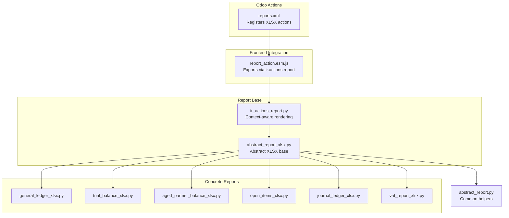
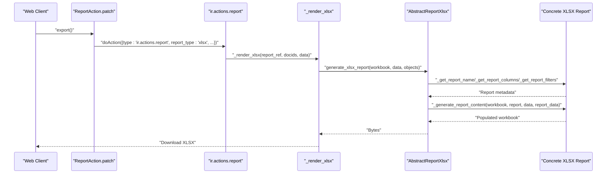
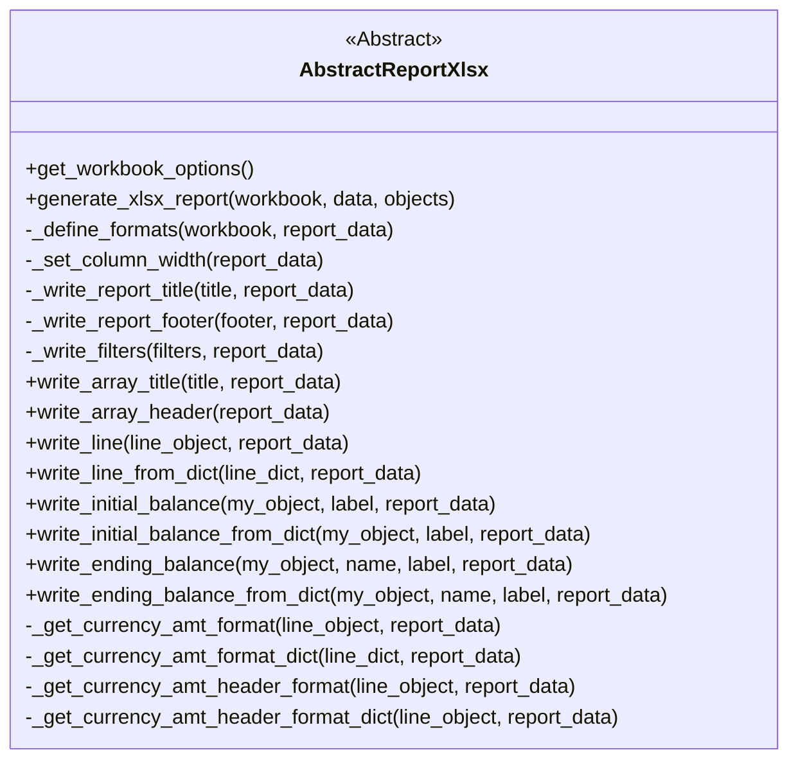
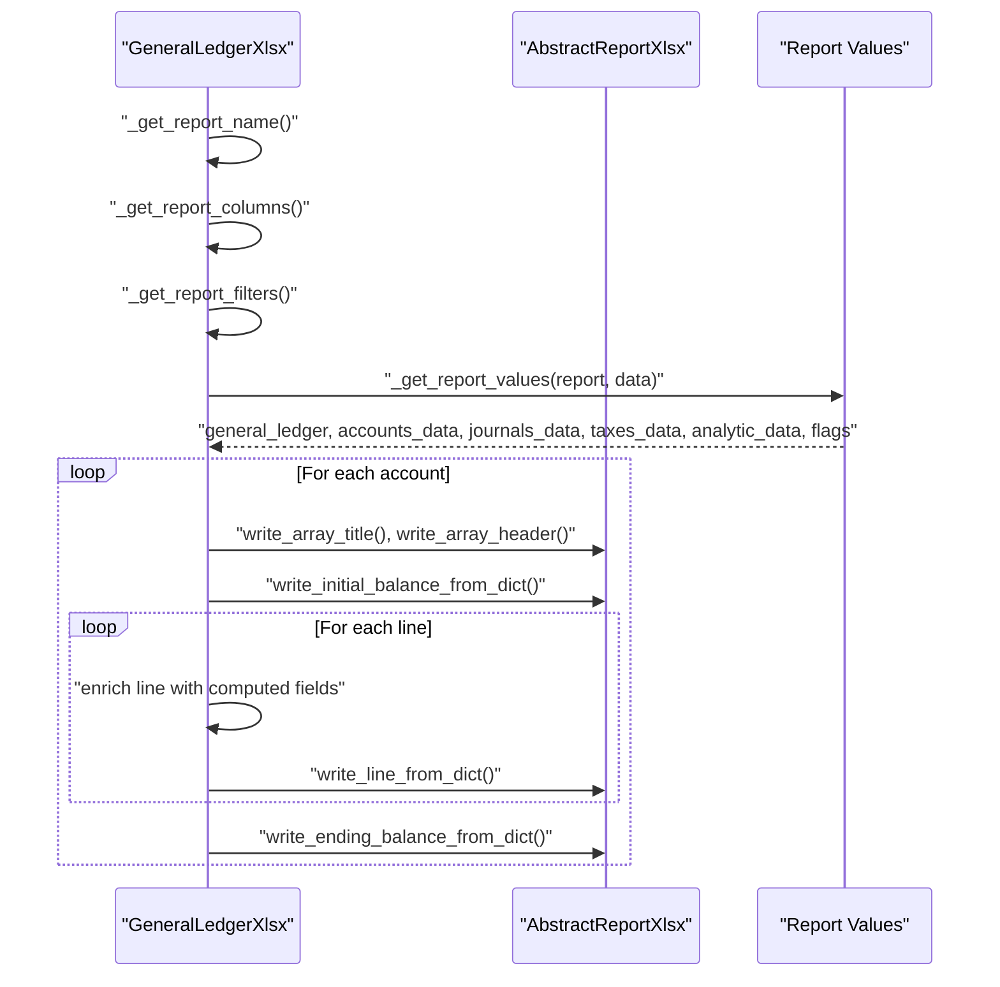
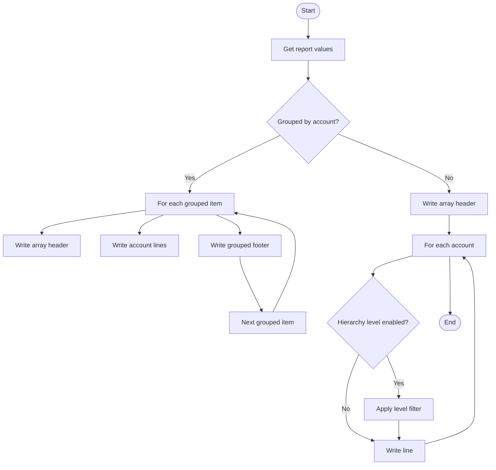
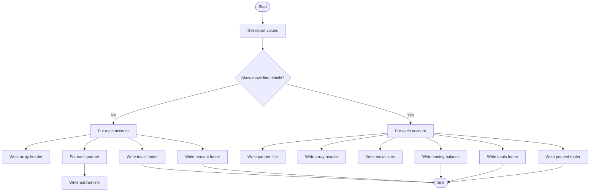
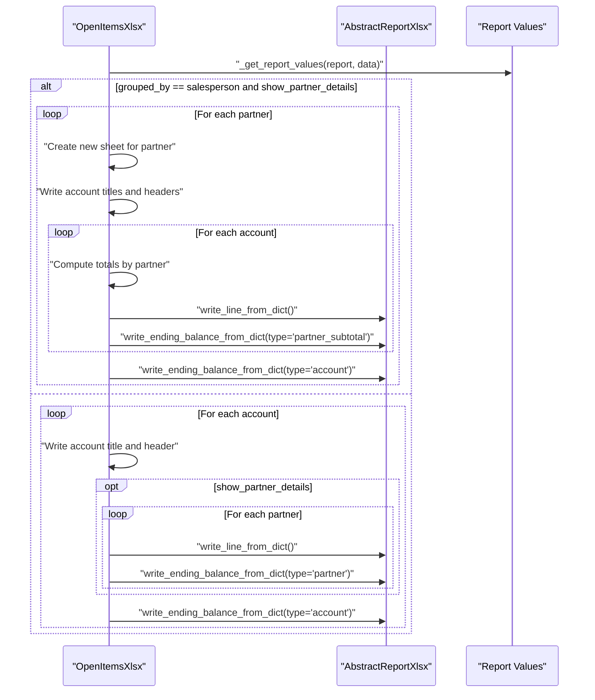
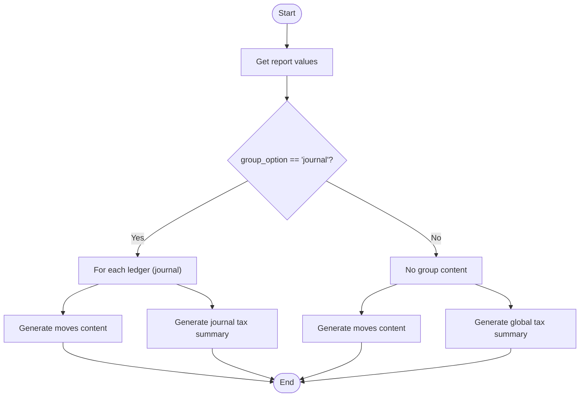
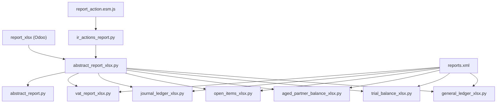

# Export and Integration APIs

<cite>
**Referenced Files in This Document**
- [abstract_report_xlsx.py](file://report/abstract_report_xlsx.py)
- [general_ledger_xlsx.py](file://report/general_ledger_xlsx.py)
- [trial_balance_xlsx.py](file://report/trial_balance_xlsx.py)
- [aged_partner_balance_xlsx.py](file://report/aged_partner_balance_xlsx.py)
- [open_items_xlsx.py](file://report/open_items_xlsx.py)
- [journal_ledger_xlsx.py](file://report/journal_ledger_xlsx.py)
- [vat_report_xlsx.py](file://report/vat_report_xlsx.py)
- [abstract_report.py](file://report/abstract_report.py)
- [ir_actions_report.py](file://models/ir_actions_report.py)
- [report_action.esm.js](file://static/src/js/report_action.esm.js)
- [reports.xml](file://reports.xml)
- [__manifest__.py](file://__manifest__.py)
</cite>

## Table of Contents
1. [Introduction](#introduction)
2. [Project Structure](#project-structure)
3. [Core Components](#core-components)
4. [Architecture Overview](#architecture-overview)
5. [Detailed Component Analysis](#detailed-component-analysis)
6. [Dependency Analysis](#dependency-analysis)
7. [Performance Considerations](#performance-considerations)
8. [Troubleshooting Guide](#troubleshooting-guide)
9. [Conclusion](#conclusion)
10. [Appendices](#appendices)

## Introduction
This document describes the export and integration interfaces that power report data export and external system integration for financial reports. It focuses on the XLSX export functionality, data serialization methods, and report output formatting APIs. It also documents the Excel generation utilities, template processing functions, and file export interfaces. The guide includes method signatures for export operations, data transformation functions, and format conversion utilities. Practical examples illustrate custom export implementations, integration with external reporting systems, and batch processing capabilities. Finally, it covers error handling for export failures, performance optimization for large exports, and best practices for extending export functionality.

## Project Structure
The export system is organized around a shared abstract XLSX report base class and concrete report implementations. Each report defines its own column layout, filters, and content generation logic while inheriting common formatting and writing utilities. The Odoo action registry exposes XLSX reports, and the frontend integrates with the reporting framework to trigger exports.

**Diagram sources**
- [reports.xml:124-172](file://reports.xml#L124-L172)
- [report_action.esm.js:16-39](file://static/src/js/report_action.esm.js#L16-L39)
- [ir_actions_report.py:10-27](file://models/ir_actions_report.py#L10-L27)
- [abstract_report_xlsx.py:8-11](file://report/abstract_report_xlsx.py#L8-L11)
- [general_ledger_xlsx.py:11-14](file://report/general_ledger_xlsx.py#L11-L14)
- [trial_balance_xlsx.py:10-13](file://report/trial_balance_xlsx.py#L10-L13)
- [aged_partner_balance_xlsx.py:9-12](file://report/aged_partner_balance_xlsx.py#L9-L12)
- [open_items_xlsx.py:9-12](file://report/open_items_xlsx.py#L9-L12)
- [journal_ledger_xlsx.py:10-13](file://report/journal_ledger_xlsx.py#L10-L13)
- [vat_report_xlsx.py:8-11](file://report/vat_report_xlsx.py#L8-L11)
- [abstract_report.py:7-19](file://report/abstract_report.py#L7-L19)

**Section sources**
- [reports.xml:1-174](file://reports.xml#L1-L174)
- [report_action.esm.js:1-40](file://static/src/js/report_action.esm.js#L1-L40)
- [ir_actions_report.py:1-28](file://models/ir_actions_report.py#L1-L28)
- [abstract_report_xlsx.py:1-698](file://report/abstract_report_xlsx.py#L1-L698)
- [general_ledger_xlsx.py:1-400](file://report/general_ledger_xlsx.py#L1-L400)
- [trial_balance_xlsx.py:1-324](file://report/trial_balance_xlsx.py#L1-L324)
- [aged_partner_balance_xlsx.py:1-368](file://report/aged_partner_balance_xlsx.py#L1-L368)
- [open_items_xlsx.py:1-350](file://report/open_items_xlsx.py#L1-L350)
- [journal_ledger_xlsx.py:1-269](file://report/journal_ledger_xlsx.py#L1-L269)
- [vat_report_xlsx.py:1-62](file://report/vat_report_xlsx.py#L1-L62)
- [abstract_report.py:1-165](file://report/abstract_report.py#L1-L165)

## Core Components
- Abstract XLSX Report Base: Provides workbook initialization, formatting, column width management, and standardized writing routines for titles, filters, arrays, balances, and totals.
- Concrete Report Implementations: Each report class defines its own report name, columns, filters, and content generation logic by overriding abstract methods.
- Action Registry: XLSX reports are registered via Odoo’s action registry and triggered from the frontend.
- Frontend Export Integration: The frontend patches the report action to convert QWeb report names to XLSX report names and dispatch ir.actions.report with report_type=xlsx.
- Context-Aware Rendering: The report action renderer supports language context injection for localized exports.

Key responsibilities:
- Data serialization: Transform report data dictionaries into Excel cells with appropriate types and formats.
- Formatting: Apply currency-aware numeric formats, bold/italic styles, and merged headers.
- Batch processing: Iterate over grouped data (by account/partner/tax) and render multiple sheets where applicable.
- External integration: Expose consistent report names and parameters for third-party systems.

**Section sources**
- [abstract_report_xlsx.py:8-11](file://report/abstract_report_xlsx.py#L8-L11)
- [general_ledger_xlsx.py:11-14](file://report/general_ledger_xlsx.py#L11-L14)
- [trial_balance_xlsx.py:10-13](file://report/trial_balance_xlsx.py#L10-L13)
- [aged_partner_balance_xlsx.py:9-12](file://report/aged_partner_balance_xlsx.py#L9-L12)
- [open_items_xlsx.py:9-12](file://report/open_items_xlsx.py#L9-L12)
- [journal_ledger_xlsx.py:10-13](file://report/journal_ledger_xlsx.py#L10-L13)
- [vat_report_xlsx.py:8-11](file://report/vat_report_xlsx.py#L8-L11)
- [reports.xml:124-172](file://reports.xml#L124-L172)
- [report_action.esm.js:16-39](file://static/src/js/report_action.esm.js#L16-L39)
- [ir_actions_report.py:10-27](file://models/ir_actions_report.py#L10-L27)

## Architecture Overview
The export pipeline connects the Odoo backend to the frontend and the XLSX engine. The frontend triggers an XLSX export action, which is routed to the report action renderer. The renderer delegates to the report’s XLSX implementation, which uses the abstract base to build the workbook and sheets.

**Diagram sources**
- [report_action.esm.js:16-39](file://static/src/js/report_action.esm.js#L16-L39)
- [ir_actions_report.py:24-27](file://models/ir_actions_report.py#L24-L27)
- [abstract_report_xlsx.py:18-42](file://report/abstract_report_xlsx.py#L18-L42)
- [general_ledger_xlsx.py:134-145](file://report/general_ledger_xlsx.py#L134-L145)
- [trial_balance_xlsx.py:164-178](file://report/trial_balance_xlsx.py#L164-L178)
- [aged_partner_balance_xlsx.py:221-226](file://report/aged_partner_balance_xlsx.py#L221-L226)
- [open_items_xlsx.py:310-323](file://report/open_items_xlsx.py#L310-L323)
- [journal_ledger_xlsx.py:159-176](file://report/journal_ledger_xlsx.py#L159-L176)
- [vat_report_xlsx.py:46-62](file://report/vat_report_xlsx.py#L46-L62)

## Detailed Component Analysis

### Abstract XLSX Report Base
The abstract base encapsulates workbook creation, formatting, and writing primitives. It defines the contract for concrete reports and centralizes reusable logic.

Key methods and responsibilities:
- Workbook options: Enables constant memory mode for large exports.
- Report lifecycle: Initializes report_data, defines formats, writes title/filters/content/footer.
- Column management: Sets widths and writes headers.
- Cell writing: Writes strings, amounts, currency amounts, and merges for titles/footers.
- Balance rows: Writes initial and ending balances with currency-aware formats.
- Currency formatting: Dynamically creates per-currency formats and applies them to amounts.

**Diagram sources**
- [abstract_report_xlsx.py:8-698](file://report/abstract_report_xlsx.py#L8-L698)

**Section sources**
- [abstract_report_xlsx.py:13-16](file://report/abstract_report_xlsx.py#L13-L16)
- [abstract_report_xlsx.py:18-42](file://report/abstract_report_xlsx.py#L18-L42)
- [abstract_report_xlsx.py:43-92](file://report/abstract_report_xlsx.py#L43-L92)
- [abstract_report_xlsx.py:94-100](file://report/abstract_report_xlsx.py#L94-L100)
- [abstract_report_xlsx.py:101-129](file://report/abstract_report_xlsx.py#L101-L129)
- [abstract_report_xlsx.py:131-159](file://report/abstract_report_xlsx.py#L131-L159)
- [abstract_report_xlsx.py:161-186](file://report/abstract_report_xlsx.py#L161-L186)
- [abstract_report_xlsx.py:188-287](file://report/abstract_report_xlsx.py#L188-L287)
- [abstract_report_xlsx.py:289-383](file://report/abstract_report_xlsx.py#L289-L383)
- [abstract_report_xlsx.py:385-524](file://report/abstract_report_xlsx.py#L385-L524)
- [abstract_report_xlsx.py:526-603](file://report/abstract_report_xlsx.py#L526-L603)
- [abstract_report_xlsx.py:605-698](file://report/abstract_report_xlsx.py#L605-L698)

### General Ledger XLSX
Implements the General Ledger report in XLSX format. It defines columns for dates, entries, journals, accounts, taxes, partners, and amounts, with optional cost centers and foreign currency support. Content generation iterates over accounts and partners, writing headers, initial balances, move lines, and ending balances.

Key methods:
- Report name and columns: Builds dynamic columns based on configuration flags.
- Filters: Formats date range, target moves, and toggles.
- Content generation: Iterates accounts and grouped items, enriches lines with computed fields, and writes totals.

**Diagram sources**
- [general_ledger_xlsx.py:16-23](file://report/general_ledger_xlsx.py#L16-L23)
- [general_ledger_xlsx.py:25-92](file://report/general_ledger_xlsx.py#L25-L92)
- [general_ledger_xlsx.py:94-116](file://report/general_ledger_xlsx.py#L94-L116)
- [general_ledger_xlsx.py:134-372](file://report/general_ledger_xlsx.py#L134-L372)
- [abstract_report_xlsx.py:161-186](file://report/abstract_report_xlsx.py#L161-L186)
- [abstract_report_xlsx.py:236-287](file://report/abstract_report_xlsx.py#L236-L287)
- [abstract_report_xlsx.py:289-383](file://report/abstract_report_xlsx.py#L289-L383)

**Section sources**
- [general_ledger_xlsx.py:16-132](file://report/general_ledger_xlsx.py#L16-L132)
- [general_ledger_xlsx.py:134-372](file://report/general_ledger_xlsx.py#L134-L372)
- [abstract_report_xlsx.py:161-186](file://report/abstract_report_xlsx.py#L161-L186)
- [abstract_report_xlsx.py:236-287](file://report/abstract_report_xlsx.py#L236-L287)
- [abstract_report_xlsx.py:289-383](file://report/abstract_report_xlsx.py#L289-L383)

### Trial Balance XLSX
Defines columns for initial/period/ending balances and optional foreign currency columns. Supports grouping by account groups and partner details, with hierarchical level controls.

Key methods:
- Columns: Dynamic columns depending on partner details and foreign currency flags.
- Filters: Date range, target moves, account at zero, foreign currency, hierarchy limits.
- Content generation: Writes grouped totals and account footers with currency-aware formatting.

**Diagram sources**
- [trial_balance_xlsx.py:129-156](file://report/trial_balance_xlsx.py#L129-L156)
- [trial_balance_xlsx.py:164-266](file://report/trial_balance_xlsx.py#L164-L266)
- [abstract_report_xlsx.py:282-323](file://report/abstract_report_xlsx.py#L282-L323)

**Section sources**
- [trial_balance_xlsx.py:24-127](file://report/trial_balance_xlsx.py#L24-L127)
- [trial_balance_xlsx.py:129-156](file://report/trial_balance_xlsx.py#L129-L156)
- [trial_balance_xlsx.py:164-266](file://report/trial_balance_xlsx.py#L164-L266)
- [abstract_report_xlsx.py:282-323](file://report/abstract_report_xlsx.py#L282-L323)

### Aged Partner Balance XLSX
Supports two modes: aggregated partner totals or detailed move lines. Columns vary based on aging configuration and whether move line details are shown.

Key methods:
- Columns: Builds columns dynamically from aging configuration lines and optional detail columns.
- Filters: Date at and target moves.
- Content generation: Writes account titles, partner lines, and aggregated footers with totals and percentages.

**Diagram sources**
- [aged_partner_balance_xlsx.py:188-193](file://report/aged_partner_balance_xlsx.py#L188-L193)
- [aged_partner_balance_xlsx.py:195-210](file://report/aged_partner_balance_xlsx.py#L195-L210)
- [aged_partner_balance_xlsx.py:221-316](file://report/aged_partner_balance_xlsx.py#L221-L316)
- [abstract_report_xlsx.py:329-367](file://report/abstract_report_xlsx.py#L329-L367)

**Section sources**
- [aged_partner_balance_xlsx.py:23-193](file://report/aged_partner_balance_xlsx.py#L23-L193)
- [aged_partner_balance_xlsx.py:195-210](file://report/aged_partner_balance_xlsx.py#L195-L210)
- [aged_partner_balance_xlsx.py:221-316](file://report/aged_partner_balance_xlsx.py#L221-L316)
- [abstract_report_xlsx.py:329-367](file://report/abstract_report_xlsx.py#L329-L367)

### Open Items XLSX
Supports grouping by partner or salesperson. Creates separate sheets for salespeople and computes per-partner totals.

Key methods:
- Columns: Date, entry, journal, account, partner, reference/label, due date, original/residual, optional foreign currency columns.
- Filters: Date at, target moves, account at zero, foreign currency.
- Content generation: Handles grouped_by salesperson and partner modes, writes totals and ending balances.

**Diagram sources**
- [open_items_xlsx.py:104-115](file://report/open_items_xlsx.py#L104-L115)
- [open_items_xlsx.py:117-323](file://report/open_items_xlsx.py#L117-L323)
- [abstract_report_xlsx.py:325-349](file://report/abstract_report_xlsx.py#L325-L349)

**Section sources**
- [open_items_xlsx.py:23-90](file://report/open_items_xlsx.py#L23-L90)
- [open_items_xlsx.py:104-115](file://report/open_items_xlsx.py#L104-L115)
- [open_items_xlsx.py:117-323](file://report/open_items_xlsx.py#L117-L323)
- [abstract_report_xlsx.py:325-349](file://report/abstract_report_xlsx.py#L325-L349)

### Journal Ledger XLSX
Defines columns for entries, dates, accounts, partners, labels, taxes, debits/credits, and optional foreign currency. Supports grouping by journal or no grouping, and generates tax summaries.

Key methods:
- Columns: Configurable columns including auto-sequence and account name toggles.
- Filters: Company, date range, target moves, sorting option, and selected journals.
- Content generation: Writes moves content and tax summaries for each journal or globally.

**Diagram sources**
- [journal_ledger_xlsx.py:118-157](file://report/journal_ledger_xlsx.py#L118-L157)
- [journal_ledger_xlsx.py:159-208](file://report/journal_ledger_xlsx.py#L159-L208)
- [journal_ledger_xlsx.py:210-252](file://report/journal_ledger_xlsx.py#L210-L252)

**Section sources**
- [journal_ledger_xlsx.py:24-68](file://report/journal_ledger_xlsx.py#L24-L68)
- [journal_ledger_xlsx.py:118-157](file://report/journal_ledger_xlsx.py#L118-L157)
- [journal_ledger_xlsx.py:159-208](file://report/journal_ledger_xlsx.py#L159-L208)
- [journal_ledger_xlsx.py:210-252](file://report/journal_ledger_xlsx.py#L210-L252)

### VAT Report XLSX
Defines a simple column layout for code, name, net, and tax amounts. Supports detail by tax when enabled.

Key methods:
- Columns: Code, name, net, tax.
- Filters: Date range and basis (tax tags vs tax groups).
- Content generation: Writes header and iterates over report lines, optionally expanding into tax details.

**Section sources**
- [vat_report_xlsx.py:22-38](file://report/vat_report_xlsx.py#L22-L38)
- [vat_report_xlsx.py:46-62](file://report/vat_report_xlsx.py#L46-L62)

### Frontend Export Integration
The frontend patch intercepts report export actions and converts QWeb report names to XLSX report names. It dispatches an ir.actions.report with report_type=xlsx and passes through data and context.

Key behaviors:
- Detects account financial report names.
- Translates report_name/report_file to XLSX variants.
- Preserves data and context for backend processing.

**Section sources**
- [report_action.esm.js:7-39](file://static/src/js/report_action.esm.js#L7-L39)

### Context-Aware Rendering
The report action renderer supports injecting language context into the export process, enabling localized formatting and labels.

**Section sources**
- [ir_actions_report.py:10-27](file://models/ir_actions_report.py#L10-L27)

### Common Helpers
The abstract report module provides common helpers for move line domains, recalculations, and data retrieval used across reports.

**Section sources**
- [abstract_report.py:21-55](file://report/abstract_report.py#L21-L55)
- [abstract_report.py:57-123](file://report/abstract_report.py#L57-L123)
- [abstract_report.py:125-165](file://report/abstract_report.py#L125-L165)

## Dependency Analysis
The export system relies on Odoo’s report_xlsx module and integrates with the frontend reporting framework. Concrete report classes inherit from the abstract base and depend on shared helpers.

**Diagram sources**
- [abstract_report_xlsx.py](file://report/abstract_report_xlsx.py#L11)
- [general_ledger_xlsx.py](file://report/general_ledger_xlsx.py#L14)
- [trial_balance_xlsx.py](file://report/trial_balance_xlsx.py#L13)
- [aged_partner_balance_xlsx.py](file://report/aged_partner_balance_xlsx.py#L12)
- [open_items_xlsx.py](file://report/open_items_xlsx.py#L12)
- [journal_ledger_xlsx.py](file://report/journal_ledger_xlsx.py#L13)
- [vat_report_xlsx.py](file://report/vat_report_xlsx.py#L11)
- [abstract_report.py](file://report/abstract_report.py#L8)
- [ir_actions_report.py](file://models/ir_actions_report.py#L8)
- [report_action.esm.js](file://static/src/js/report_action.esm.js#L1)
- [reports.xml:124-172](file://reports.xml#L124-L172)

**Section sources**
- [__manifest__.py](file://__manifest__.py#L18)
- [reports.xml:124-172](file://reports.xml#L124-L172)
- [abstract_report_xlsx.py](file://report/abstract_report_xlsx.py#L11)
- [general_ledger_xlsx.py](file://report/general_ledger_xlsx.py#L14)
- [trial_balance_xlsx.py](file://report/trial_balance_xlsx.py#L13)
- [aged_partner_balance_xlsx.py](file://report/aged_partner_balance_xlsx.py#L12)
- [open_items_xlsx.py](file://report/open_items_xlsx.py#L12)
- [journal_ledger_xlsx.py](file://report/journal_ledger_xlsx.py#L13)
- [vat_report_xlsx.py](file://report/vat_report_xlsx.py#L11)
- [abstract_report.py](file://report/abstract_report.py#L8)
- [ir_actions_report.py](file://models/ir_actions_report.py#L8)
- [report_action.esm.js](file://static/src/js/report_action.esm.js#L1)

## Performance Considerations
- Constant memory mode: The abstract base enables constant memory workbook creation to reduce memory footprint during large exports.
- Efficient loops: Concrete reports iterate over precomputed datasets and minimize repeated lookups by caching data dictionaries.
- Conditional columns: Dynamic column definitions avoid unnecessary formatting overhead when optional features (e.g., foreign currency) are disabled.
- Sheet separation: Reports like Open Items create multiple sheets for large datasets, improving readability and reducing per-sheet load.
- Currency formatting: Per-currency formats are cached and reused to avoid redundant format creation.

Best practices:
- Prefer dictionary-based data passing to avoid ORM lookups inside tight loops.
- Use write_line_from_dict for structured data and write_line for object-based data to match report needs.
- Minimize merges and conditional formatting for very large datasets.
- Consider batching and pagination for extremely large datasets.

**Section sources**
- [abstract_report_xlsx.py:13-16](file://report/abstract_report_xlsx.py#L13-L16)
- [open_items_xlsx.py:117-220](file://report/open_items_xlsx.py#L117-L220)
- [journal_ledger_xlsx.py:178-208](file://report/journal_ledger_xlsx.py#L178-L208)

## Troubleshooting Guide
Common issues and resolutions:
- Export fails with missing report name: Ensure the concrete report class implements _get_report_name and returns a valid string.
- Incorrect column widths or missing headers: Verify _get_report_columns returns a dictionary mapping positions to column definitions with header, field, and width keys.
- Amount formatting errors: Confirm currency_id is present and decimal_places are set; the base defines numeric formats based on company currency.
- Foreign currency columns not appearing: Check report flags (e.g., foreign_currency) and ensure currency_id is set on lines.
- Multi-sheet issues: For reports that create multiple sheets (e.g., Open Items by salesperson), ensure each sheet is created with a unique name and row_pos reset.
- Localization problems: Use the context-aware renderer to pass account_financial_report_lang in data to localize labels and formats.

Integration tips:
- Use the frontend export action to trigger XLSX exports; it automatically maps QWeb report names to XLSX variants.
- Pass wizard data and context through the export action; the backend renderer respects context for localization.

**Section sources**
- [abstract_report_xlsx.py:619-625](file://report/abstract_report_xlsx.py#L619-L625)
- [abstract_report_xlsx.py:634-650](file://report/abstract_report_xlsx.py#L634-L650)
- [abstract_report_xlsx.py:652-661](file://report/abstract_report_xlsx.py#L652-L661)
- [ir_actions_report.py:10-13](file://models/ir_actions_report.py#L10-L13)
- [report_action.esm.js:16-39](file://static/src/js/report_action.esm.js#L16-L39)

## Conclusion
The export and integration APIs provide a robust, extensible foundation for financial report exports to XLSX. The abstract base consolidates formatting and writing logic, while concrete report implementations tailor column layouts and content generation to specific report types. The frontend integration ensures seamless export workflows, and the context-aware rendering supports localization. By following the documented patterns and best practices, developers can implement custom exports, integrate with external systems, and optimize performance for large-scale scenarios.

## Appendices

### Method Signatures for Export Operations
- Abstract base:
  - generate_xlsx_report(workbook, data, objects)
  - _define_formats(workbook, report_data)
  - _set_column_width(report_data)
  - _write_report_title(title, report_data)
  - _write_report_footer(footer, report_data)
  - _write_filters(filters, report_data)
  - write_array_title(title, report_data)
  - write_array_header(report_data)
  - write_line(line_object, report_data)
  - write_line_from_dict(line_dict, report_data)
  - write_initial_balance(my_object, label, report_data)
  - write_initial_balance_from_dict(my_object, label, report_data)
  - write_ending_balance(my_object, name, label, report_data)
  - write_ending_balance_from_dict(my_object, name, label, report_data)
  - _get_currency_amt_format(line_object, report_data)
  - _get_currency_amt_format_dict(line_dict, report_data)
  - _get_currency_amt_header_format(line_object, report_data)
  - _get_currency_amt_header_format_dict(line_object, report_data)
  - _generate_report_content(workbook, report, data, report_data)
  - _get_report_name(report, data=False)
  - _get_report_columns(report)
  - _get_report_filters(report)
  - _get_col_count_filter_name()
  - _get_col_count_filter_value()
  - _get_col_pos_initial_balance_label()
  - _get_col_count_final_balance_name()
  - _get_col_pos_final_balance_label()
  - write_non_standard_column(cell_type, col_pos, value)

- Concrete reports override:
  - _get_report_name(report, data=False)
  - _get_report_columns(report)
  - _get_report_filters(report)
  - _get_col_count_filter_name()
  - _get_col_count_filter_value()
  - _get_col_pos_initial_balance_label()
  - _get_col_count_final_balance_name()
  - _get_col_pos_final_balance_label()
  - _generate_report_content(workbook, report, data, report_data)

**Section sources**
- [abstract_report_xlsx.py:18-698](file://report/abstract_report_xlsx.py#L18-L698)
- [general_ledger_xlsx.py:16-132](file://report/general_ledger_xlsx.py#L16-L132)
- [trial_balance_xlsx.py:15-156](file://report/trial_balance_xlsx.py#L15-L156)
- [aged_partner_balance_xlsx.py:14-219](file://report/aged_partner_balance_xlsx.py#L14-L219)
- [open_items_xlsx.py:14-102](file://report/open_items_xlsx.py#L14-L102)
- [journal_ledger_xlsx.py:15-157](file://report/journal_ledger_xlsx.py#L15-L157)
- [vat_report_xlsx.py:13-44](file://report/vat_report_xlsx.py#L13-L44)

### Data Transformation Functions
- Dictionary enrichment: Reports enrich dictionaries with computed fields (e.g., taxes_description, analytic_distribution, currency_name).
- Totals computation: Aggregated totals are computed per account/partner and written as footer lines.
- Currency-aware formatting: Formats are dynamically created and cached per currency to ensure correct numeric representation.

**Section sources**
- [general_ledger_xlsx.py:174-222](file://report/general_ledger_xlsx.py#L174-L222)
- [open_items_xlsx.py:104-115](file://report/open_items_xlsx.py#L104-L115)
- [trial_balance_xlsx.py:268-270](file://report/trial_balance_xlsx.py#L268-L270)
- [abstract_report_xlsx.py:526-603](file://report/abstract_report_xlsx.py#L526-L603)

### Format Conversion Utilities
- Numeric formats: Defined based on company currency decimal places.
- Percent formatting: Specialized percentage format for aged reports.
- Currency-specific formats: Dynamically created and cached per currency.

**Section sources**
- [abstract_report_xlsx.py:83-92](file://report/abstract_report_xlsx.py#L83-L92)
- [abstract_report_xlsx.py:79-81](file://report/abstract_report_xlsx.py#L79-L81)
- [abstract_report_xlsx.py:526-603](file://report/abstract_report_xlsx.py#L526-L603)

### Examples of Custom Export Implementations
- Add a new report:
  - Create a new class inheriting from the abstract base.
  - Implement _get_report_name, _get_report_columns, _get_report_filters, and _generate_report_content.
  - Register an XLSX action in reports.xml with a_f_r.report_<report>_xlsx as report_name.
- Extend an existing report:
  - Override _get_report_columns to add/remove columns.
  - Modify _generate_report_content to change data flow or add extra sheets.
  - Use write_line_from_dict for dictionary-based data and write_line for object-based data.

**Section sources**
- [reports.xml:124-172](file://reports.xml#L124-L172)
- [abstract_report_xlsx.py:619-698](file://report/abstract_report_xlsx.py#L619-L698)

### Integration with External Reporting Systems
- Use the frontend export action to trigger XLSX exports programmatically.
- Pass data and context through the export action; the backend renderer respects context for localization.
- For batch processing, trigger multiple exports sequentially or leverage the action registry to schedule exports.

**Section sources**
- [report_action.esm.js:16-39](file://static/src/js/report_action.esm.js#L16-L39)
- [ir_actions_report.py:10-27](file://models/ir_actions_report.py#L10-L27)

### Best Practices for Extending Export Functionality
- Keep column definitions centralized and dynamic based on report flags.
- Reuse write_line_from_dict/write_line to ensure consistent formatting.
- Cache frequently accessed data dictionaries to improve performance.
- Use constant memory mode and efficient loops for large datasets.
- Localize labels and formats via context-aware rendering.

**Section sources**
- [abstract_report_xlsx.py:13-16](file://report/abstract_report_xlsx.py#L13-L16)
- [abstract_report_xlsx.py:18-42](file://report/abstract_report_xlsx.py#L18-L42)
- [ir_actions_report.py:10-13](file://models/ir_actions_report.py#L10-L13)