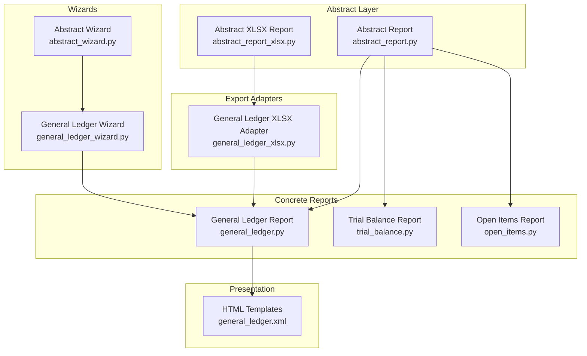
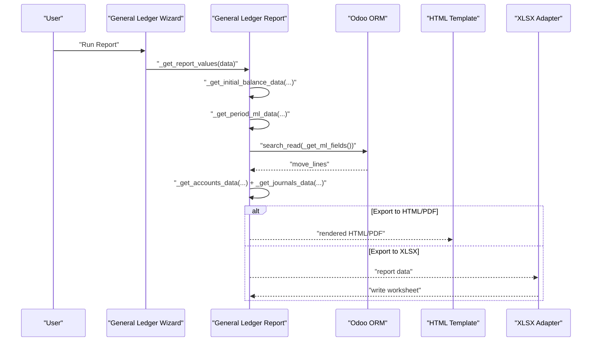
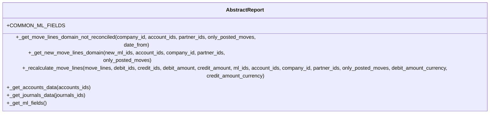
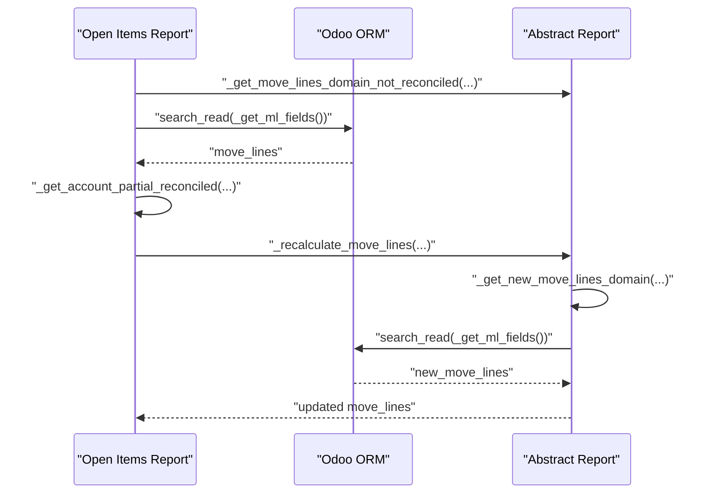
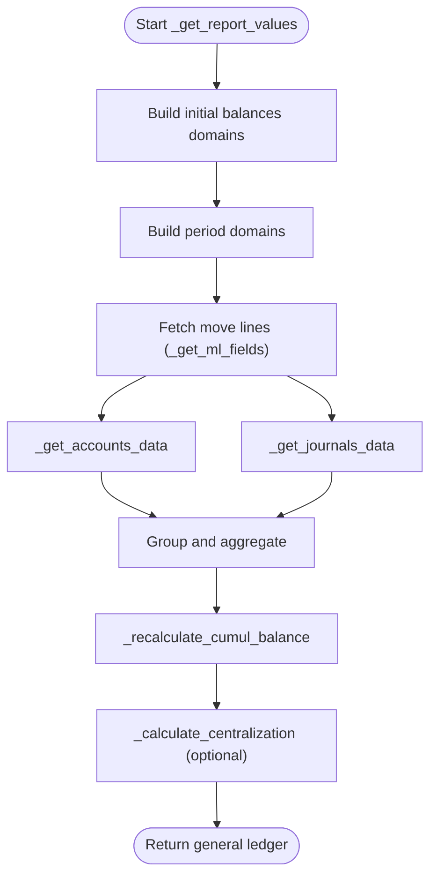
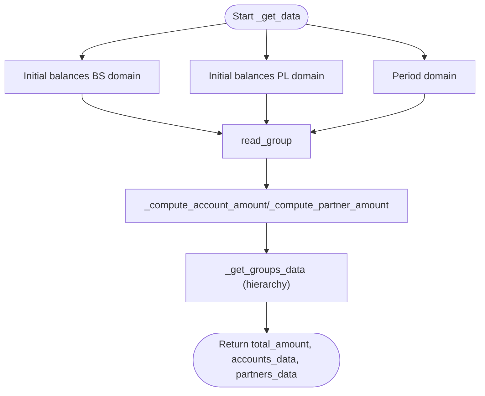
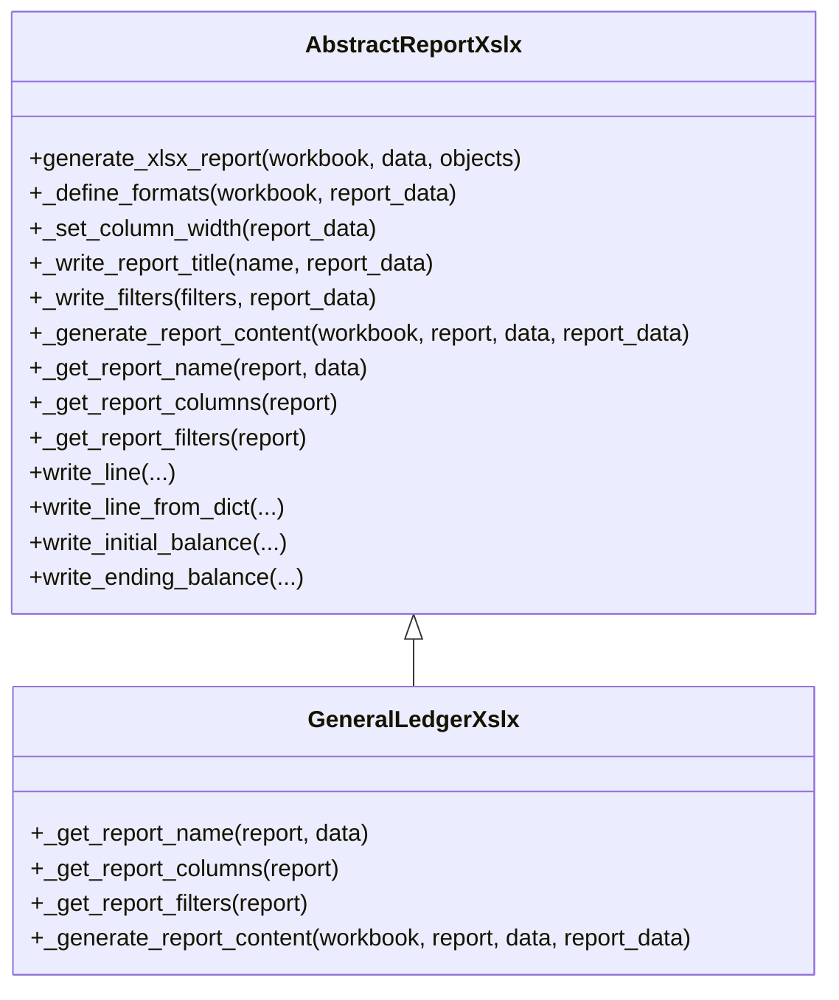
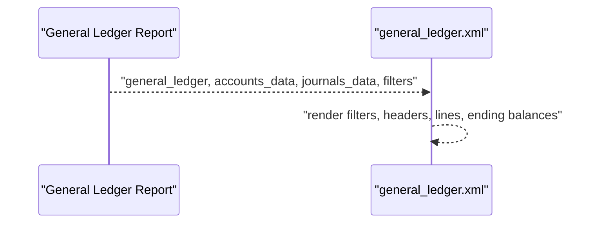
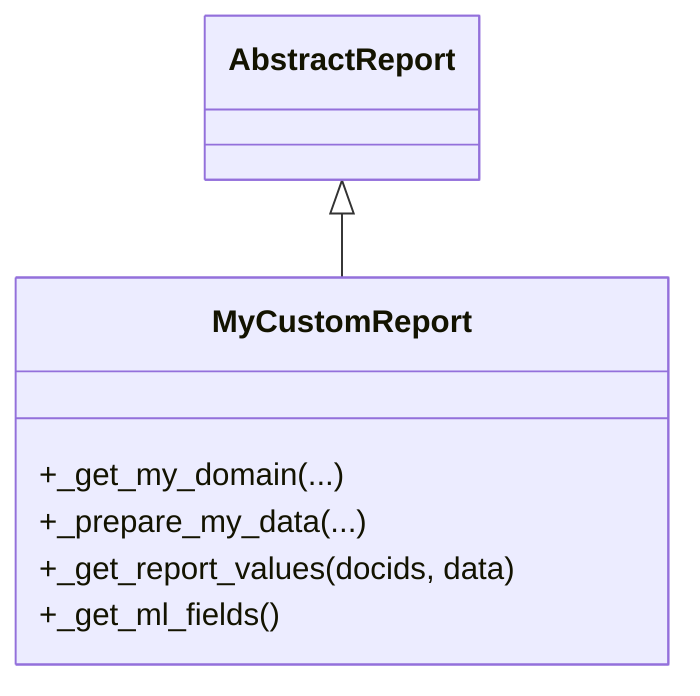
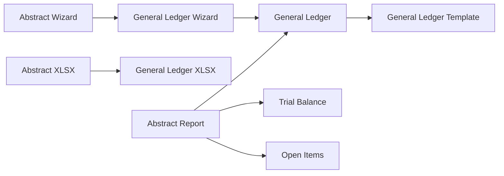

# Report Generation API

<cite>
**Referenced Files in This Document**
- [abstract_report.py](file://report/abstract_report.py)
- [abstract_report_xlsx.py](file://report/abstract_report_xlsx.py)
- [general_ledger.py](file://report/general_ledger.py)
- [trial_balance.py](file://report/trial_balance.py)
- [open_items.py](file://report/open_items.py)
- [general_ledger_xlsx.py](file://report/general_ledger_xlsx.py)
- [general_ledger.xml](file://report/templates/general_ledger.xml)
- [abstract_wizard.py](file://wizard/abstract_wizard.py)
- [general_ledger_wizard.py](file://wizard/general_ledger_wizard.py)
- [account_move_line.py](file://models/account_move_line.py)
</cite>

## Table of Contents
1. [Introduction](#introduction)
2. [Project Structure](#project-structure)
3. [Core Components](#core-components)
4. [Architecture Overview](#architecture-overview)
5. [Detailed Component Analysis](#detailed-component-analysis)
6. [Dependency Analysis](#dependency-analysis)
7. [Performance Considerations](#performance-considerations)
8. [Troubleshooting Guide](#troubleshooting-guide)
9. [Conclusion](#conclusion)

## Introduction
This document describes the report generation interfaces in the Account Financial Reports module. It focuses on the abstract report base class methods that power financial reports such as General Ledger, Trial Balance, and Open Items. It explains method signatures, parameters, return values, usage patterns, and integration with Odoo’s reporting framework (HTML/PDF/XLSX). It also provides guidance on extending the abstract report class for custom implementations, along with error handling strategies and performance considerations.

## Project Structure
The report generation system is organized around:
- An abstract report base class that defines shared data access and calculation helpers
- Concrete report implementations that implement report-specific logic
- XLSX report adapters that render Excel exports
- HTML templates that render PDF/HTML views
- Wizards that collect user input and trigger report generation

**Diagram sources**
- [abstract_report.py:1-165](file://report/abstract_report.py#L1-L165)
- [abstract_report_xlsx.py:1-698](file://report/abstract_report_xlsx.py#L1-L698)
- [general_ledger.py:14-931](file://report/general_ledger.py#L14-L931)
- [trial_balance.py:12-981](file://report/trial_balance.py#L12-L981)
- [open_items.py:13-310](file://report/open_items.py#L13-L310)
- [general_ledger_xlsx.py:11-400](file://report/general_ledger_xlsx.py#L11-L400)
- [general_ledger.xml:1-789](file://report/templates/general_ledger.xml#L1-L789)
- [abstract_wizard.py:7-52](file://wizard/abstract_wizard.py#L7-L52)
- [general_ledger_wizard.py:18-322](file://wizard/general_ledger_wizard.py#L18-L322)

**Section sources**
- [abstract_report.py:1-165](file://report/abstract_report.py#L1-L165)
- [abstract_report_xlsx.py:1-698](file://report/abstract_report_xlsx.py#L1-L698)
- [general_ledger.py:14-931](file://report/general_ledger.py#L14-L931)
- [trial_balance.py:12-981](file://report/trial_balance.py#L12-L981)
- [open_items.py:13-310](file://report/open_items.py#L13-L310)
- [general_ledger_xlsx.py:11-400](file://report/general_ledger_xlsx.py#L11-L400)
- [general_ledger.xml:1-789](file://report/templates/general_ledger.xml#L1-L789)
- [abstract_wizard.py:7-52](file://wizard/abstract_wizard.py#L7-L52)
- [general_ledger_wizard.py:18-322](file://wizard/general_ledger_wizard.py#L18-L322)

## Core Components
This section documents the abstract report base class methods that are central to report generation. These methods define how move lines are queried, recalculated, and aggregated, and how account and journal metadata are prepared.

- Method: _get_move_lines_domain_not_reconciled(company_id, account_ids, partner_ids, only_posted_moves, date_from)
  - Purpose: Build a domain to fetch unreconciled move lines up to a given date.
  - Parameters:
    - company_id: integer ID of the company
    - account_ids: list of account IDs to filter
    - partner_ids: optional list of partner IDs to filter
    - only_posted_moves: boolean to restrict to posted moves
    - date_from: optional start date boundary
  - Returns: list representing an Odoo domain
  - Usage: Used by Open Items report to fetch unreconciled lines and by other reports to build initial balances domains.

- Method: _get_new_move_lines_domain(new_ml_ids, account_ids, company_id, partner_ids, only_posted_moves)
  - Purpose: Build a domain to fetch newly reconciled move lines after a cutoff date.
  - Parameters:
    - new_ml_ids: list of newly reconciled move line IDs
    - account_ids, company_id, partner_ids, only_posted_moves: same semantics as above
  - Returns: list representing an Odoo domain
  - Usage: Used internally by _recalculate_move_lines to include newly reconciled lines.

- Method: _recalculate_move_lines(move_lines, debit_ids, credit_ids, debit_amount, credit_amount, ml_ids, account_ids, company_id, partner_ids, only_posted_moves, debit_amount_currency, credit_amount_currency)
  - Purpose: Recalculate residual amounts for reconciled lines and include newly reconciled lines.
  - Parameters:
    - move_lines: list of existing move line records
    - debit_ids, credit_ids: sets of move line IDs affected by partial reconciliations
    - debit_amount, credit_amount: dicts mapping move line IDs to cumulative debit/credit adjustments
    - ml_ids: set of IDs already included
    - account_ids, company_id, partner_ids, only_posted_moves: filtering criteria
    - debit_amount_currency, credit_amount_currency: currency-side adjustments
  - Returns: updated list of move lines with recalculated residual amounts
  - Usage: Used by Open Items report to reflect reconciliations occurring after the “as at” date.

- Method: _get_accounts_data(accounts_ids)
  - Purpose: Fetch account metadata for rendering.
  - Parameters: accounts_ids: list of account IDs
  - Returns: dict mapping account ID to a structured account record
  - Usage: Used by concrete reports to enrich data with account codes, names, currencies, and grouping info.

- Method: _get_journals_data(journals_ids)
  - Purpose: Fetch journal metadata for rendering.
  - Parameters: journals_ids: list of journal IDs
  - Returns: dict mapping journal ID to a structured journal record
  - Usage: Used by concrete reports to enrich data with journal codes.

- Method: _get_ml_fields()
  - Purpose: Define the list of move line fields to fetch for report processing.
  - Returns: list of field names
  - Usage: Used by concrete reports to optimize queries and ensure consistent fields across reports.

**Section sources**
- [abstract_report.py:21-165](file://report/abstract_report.py#L21-L165)

## Architecture Overview
The report generation pipeline follows a consistent flow:
- Wizard collects parameters and triggers report generation
- Report class builds domains and queries move lines
- Data is aggregated and enriched with account/journal metadata
- Presentation layer renders HTML/PDF or XLSX

**Diagram sources**
- [general_ledger_wizard.py:18-322](file://wizard/general_ledger_wizard.py#L18-L322)
- [general_ledger.py:763-800](file://report/general_ledger.py#L763-L800)
- [general_ledger.xml:1-789](file://report/templates/general_ledger.xml#L1-L789)
- [general_ledger_xlsx.py:134-200](file://report/general_ledger_xlsx.py#L134-L200)

## Detailed Component Analysis

### Abstract Report Base Class
The abstract report class centralizes common logic for:
- Building move line domains
- Recalculating residual amounts for reconciled lines
- Fetching account and journal metadata
- Defining the fields to fetch from move lines

**Diagram sources**
- [abstract_report.py:7-165](file://report/abstract_report.py#L7-L165)

**Section sources**
- [abstract_report.py:7-165](file://report/abstract_report.py#L7-L165)

### Open Items Report (Reconciliation Recalculation)
Open Items uses the reconciliation recalculation to reflect partial reconciliations that occurred after the “as at” date.

**Diagram sources**
- [open_items.py:62-117](file://report/open_items.py#L62-L117)
- [open_items.py:98-111](file://report/open_items.py#L98-L111)
- [abstract_report.py:21-123](file://report/abstract_report.py#L21-L123)

**Section sources**
- [open_items.py:62-117](file://report/open_items.py#L62-L117)
- [abstract_report.py:21-123](file://report/abstract_report.py#L21-L123)

### General Ledger Report (Data Aggregation)
General Ledger builds initial balances and period move lines, aggregates by account/partner/taxes, and computes cumulative balances.

**Diagram sources**
- [general_ledger.py:763-800](file://report/general_ledger.py#L763-L800)
- [general_ledger.py:446-558](file://report/general_ledger.py#L446-L558)
- [general_ledger.py:560-695](file://report/general_ledger.py#L560-L695)

**Section sources**
- [general_ledger.py:763-800](file://report/general_ledger.py#L763-L800)
- [general_ledger.py:446-558](file://report/general_ledger.py#L446-L558)
- [general_ledger.py:560-695](file://report/general_ledger.py#L560-L695)

### Trial Balance Report (Hierarchical Aggregation)
Trial Balance computes initial and period balances, supports grouping by analytical accounts, and enforces hierarchical group processing.

**Diagram sources**
- [trial_balance.py:406-622](file://report/trial_balance.py#L406-L622)
- [trial_balance.py:690-745](file://report/trial_balance.py#L690-L745)

**Section sources**
- [trial_balance.py:406-622](file://report/trial_balance.py#L406-L622)
- [trial_balance.py:690-745](file://report/trial_balance.py#L690-L745)

### XLSX Export Adapter
The XLSX adapter defines the workbook, formats, and column layout, and writes report content.

**Diagram sources**
- [abstract_report_xlsx.py:8-698](file://report/abstract_report_xlsx.py#L8-L698)
- [general_ledger_xlsx.py:11-200](file://report/general_ledger_xlsx.py#L11-L200)

**Section sources**
- [abstract_report_xlsx.py:18-698](file://report/abstract_report_xlsx.py#L18-L698)
- [general_ledger_xlsx.py:11-200](file://report/general_ledger_xlsx.py#L11-L200)

### HTML Template Integration
The HTML template orchestrates filters, account headers, move lines, and ending balances for PDF/HTML output.

**Diagram sources**
- [general_ledger.py:763-800](file://report/general_ledger.py#L763-L800)
- [general_ledger.xml:1-789](file://report/templates/general_ledger.xml#L1-L789)

**Section sources**
- [general_ledger.py:763-800](file://report/general_ledger.py#L763-L800)
- [general_ledger.xml:1-789](file://report/templates/general_ledger.xml#L1-L789)

### Extending the Abstract Report Class
To create a custom report:
- Create a new report class inheriting from the abstract report base class
- Implement report-specific domain builders and data preparation methods
- Optionally override _get_ml_fields to tailor fetched fields
- Implement _get_report_values to return the data structure expected by the presentation layer
- Provide an XLSX adapter if Excel export is required
- Provide HTML templates if PDF/HTML export is required

**Diagram sources**
- [abstract_report.py:7-165](file://report/abstract_report.py#L7-L165)
- [general_ledger.py:763-800](file://report/general_ledger.py#L763-L800)

**Section sources**
- [abstract_report.py:7-165](file://report/abstract_report.py#L7-L165)
- [general_ledger.py:763-800](file://report/general_ledger.py#L763-L800)

## Dependency Analysis
Key dependencies and relationships:
- Concrete reports depend on the abstract report base class for shared data access and calculation helpers
- XLSX adapters depend on the abstract XLSX report base class for workbook and formatting
- Wizards depend on the abstract wizard base class for common UI and export actions
- Templates depend on report data structures produced by concrete reports

**Diagram sources**
- [abstract_report.py:7-165](file://report/abstract_report.py#L7-L165)
- [general_ledger.py:14-931](file://report/general_ledger.py#L14-L931)
- [trial_balance.py:12-981](file://report/trial_balance.py#L12-L981)
- [open_items.py:13-310](file://report/open_items.py#L13-L310)
- [abstract_report_xlsx.py:8-698](file://report/abstract_report_xlsx.py#L8-L698)
- [general_ledger_xlsx.py:11-400](file://report/general_ledger_xlsx.py#L11-L400)
- [abstract_wizard.py:7-52](file://wizard/abstract_wizard.py#L7-L52)
- [general_ledger_wizard.py:18-322](file://wizard/general_ledger_wizard.py#L18-L322)
- [general_ledger.xml:1-789](file://report/templates/general_ledger.xml#L1-L789)

**Section sources**
- [abstract_report.py:7-165](file://report/abstract_report.py#L7-L165)
- [abstract_report_xlsx.py:8-698](file://report/abstract_report_xlsx.py#L8-L698)
- [abstract_wizard.py:7-52](file://wizard/abstract_wizard.py#L7-L52)
- [general_ledger_wizard.py:18-322](file://wizard/general_ledger_wizard.py#L18-L322)
- [general_ledger.py:14-931](file://report/general_ledger.py#L14-L931)
- [trial_balance.py:12-981](file://report/trial_balance.py#L12-L981)
- [open_items.py:13-310](file://report/open_items.py#L13-L310)
- [general_ledger_xlsx.py:11-400](file://report/general_ledger_xlsx.py#L11-L400)
- [general_ledger.xml:1-789](file://report/templates/general_ledger.xml#L1-L789)

## Performance Considerations
- Indexing: The account move line model creates an index on account_id and partner_id to speed up joins during report queries.
- Domain building: Use precise domains to minimize dataset sizes (e.g., include only posted vs draft moves as needed).
- Field selection: Use _get_ml_fields to fetch only required fields, reducing memory and CPU overhead.
- Grouping: Prefer read_group for aggregations to leverage database-level grouping.
- Currency handling: Avoid unnecessary currency conversions; compute totals efficiently and format at render time.
- Reconciliation recalculation: Limit the scope of newly reconciled lines to the “as at” date window to reduce query size.

**Section sources**
- [account_move_line.py:39-71](file://models/account_move_line.py#L39-L71)

## Troubleshooting Guide
Common issues and resolutions:
- Incorrect residual amounts after reconciliation: Verify that _recalculate_move_lines is invoked with correct debit/credit IDs and amounts, and that the new move lines domain includes only reconciled lines after the cutoff date.
- Missing accounts or journals in output: Ensure _get_accounts_data and _get_journals_data are called with the correct IDs and that the IDs are present in the database.
- Excessive memory usage during XLSX export: Reduce the number of rows or split the report into multiple sheets; use constant memory workbook options.
- Incorrect grouping or hierarchy: For Trial Balance, ensure group hierarchy is processed in the correct order and parent groups are initialized before children.
- Wizard export buttons not working: Confirm that the wizard inherits from the abstract wizard and that the export methods are called with the correct report type.

**Section sources**
- [abstract_report.py:21-123](file://report/abstract_report.py#L21-L123)
- [abstract_report_xlsx.py:13-16](file://report/abstract_report_xlsx.py#L13-L16)
- [abstract_wizard.py:38-52](file://wizard/abstract_wizard.py#L38-L52)
- [trial_balance.py:690-745](file://report/trial_balance.py#L690-L745)

## Conclusion
The Account Financial Reports module provides a robust, extensible foundation for financial reporting. The abstract report base class encapsulates shared logic for domain building, reconciliation recalculation, and metadata enrichment. Concrete reports implement report-specific data preparation and aggregation, while XLSX and HTML adapters handle export and presentation. Following the documented patterns ensures reliable, maintainable, and performant report implementations.