# Wizard Configuration API

<cite>
**Referenced Files in This Document**
- [abstract_wizard.py](file://wizard/abstract_wizard.py)
- [aged_partner_balance_wizard.py](file://wizard/aged_partner_balance_wizard.py)
- [general_ledger_wizard.py](file://wizard/general_ledger_wizard.py)
- [trial_balance_wizard.py](file://wizard/trial_balance_wizard.py)
- [open_items_wizard.py](file://wizard/open_items_wizard.py)
- [vat_report_wizard.py](file://wizard/vat_report_wizard.py)
- [aged_partner_balance_wizard_view.xml](file://wizard/aged_partner_balance_wizard_view.xml)
- [general_ledger_wizard_view.xml](file://wizard/general_ledger_wizard_view.xml)
- [trial_balance_wizard_view.xml](file://wizard/trial_balance_wizard_view.xml)
- [open_items_wizard_view.xml](file://wizard/open_items_wizard_view.xml)
- [vat_report_wizard_view.xml](file://wizard/vat_report_wizard_view.xml)
- [abstract_report.py](file://report/abstract_report.py)
- [aged_partner_balance.py](file://report/aged_partner_balance.py)
- [general_ledger.py](file://report/general_ledger.py)
- [trial_balance.py](file://report/trial_balance.py)
- [open_items.py](file://report/open_items.py)
- [vat_report.py](file://report/vat_report.py)
- [__manifest__.py](file://__manifest__.py)
</cite>

## Table of Contents
1. [Introduction](#introduction)
2. [Project Structure](#project-structure)
3. [Core Components](#core-components)
4. [Architecture Overview](#architecture-overview)
5. [Detailed Component Analysis](#detailed-component-analysis)
6. [Dependency Analysis](#dependency-analysis)
7. [Performance Considerations](#performance-considerations)
8. [Troubleshooting Guide](#troubleshooting-guide)
9. [Conclusion](#conclusion)

## Introduction
This document describes the wizard configuration interfaces used to collect report parameters and trigger report generation across financial reports. It focuses on the abstract wizard base class, concrete wizard implementations, parameter validation, domain construction, and the integration between wizard inputs and report execution. It also provides usage examples, error handling guidance, and best practices for extending wizard functionality.

## Project Structure
The wizard configuration system is organized around a shared abstract wizard class and per-report wizard implementations. Each wizard defines fields for report parameters, validation logic, and export actions. Views define the user interface for each wizard. Report models transform wizard data into structured datasets for rendering.

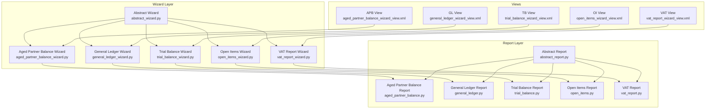

**Diagram sources**
- [abstract_wizard.py:1-52](file://wizard/abstract_wizard.py#L1-L52)
- [aged_partner_balance_wizard.py:1-154](file://wizard/aged_partner_balance_wizard.py#L1-L154)
- [general_ledger_wizard.py:1-322](file://wizard/general_ledger_wizard.py#L1-L322)
- [trial_balance_wizard.py:1-285](file://wizard/trial_balance_wizard.py#L1-L285)
- [open_items_wizard.py:1-190](file://wizard/open_items_wizard.py#L1-L190)
- [vat_report_wizard.py:1-101](file://wizard/vat_report_wizard.py#L1-L101)
- [aged_partner_balance_wizard_view.xml:1-96](file://wizard/aged_partner_balance_wizard_view.xml#L1-L96)
- [general_ledger_wizard_view.xml:1-164](file://wizard/general_ledger_wizard_view.xml#L1-L164)
- [trial_balance_wizard_view.xml:1-159](file://wizard/trial_balance_wizard_view.xml#L1-L159)
- [open_items_wizard_view.xml:1-119](file://wizard/open_items_wizard_view.xml#L1-L119)
- [vat_report_wizard_view.xml:1-61](file://wizard/vat_report_wizard_view.xml#L1-L61)
- [abstract_report.py:1-165](file://report/abstract_report.py#L1-L165)
- [aged_partner_balance.py:1-473](file://report/aged_partner_balance.py#L1-L473)
- [general_ledger.py:1-931](file://report/general_ledger.py#L1-L931)
- [trial_balance.py:1-981](file://report/trial_balance.py#L1-L981)
- [open_items.py:1-310](file://report/open_items.py#L1-L310)
- [vat_report.py:1-244](file://report/vat_report.py#L1-L244)

**Section sources**
- [__manifest__.py:19-46](file://__manifest__.py#L19-L46)

## Core Components
This section documents the abstract wizard base class and the concrete wizard implementations, focusing on field definitions, validation, and report preparation utilities.

- Abstract Wizard Base
  - Purpose: Provides shared fields and export actions across all report wizards.
  - Key fields:
    - company_id: Many2one res.company with default to current company.
  - Methods:
    - _get_partner_ids_domain(): Returns a domain filtering partners by company and type.
    - _default_partners(): Computes default partner values from active context.
    - button_export_html(): Triggers HTML export via _export().
    - button_export_pdf(): Triggers PDF export via _export().
    - button_export_xlsx(): Triggers XLSX export via _export().
    - _export(report_type): Delegates to concrete wizard’s _print_report(report_type).

- Aged Partner Balance Wizard
  - Fields:
    - date_at, date_from, target_move, account_ids, receivable_accounts_only, payable_accounts_only, partner_ids, show_move_line_details, account_code_from, account_code_to, age_partner_config_id.
  - Validation and helpers:
    - on_change_account_range(): Auto-populates account_ids from code range and filters by company.
    - onchange_company_id(): Adjusts domains and filters for company changes.
    - onchange_account_ids(): Restricts account_ids domain to reconcileable accounts.
    - onchange_type_accounts_only(): Filters accounts by receivable/payable types.
  - Export and preparation:
    - _print_report(report_type): Selects report by type and calls report_action.
    - _prepare_report_aged_partner_balance(): Builds data dictionary for report execution.

- General Ledger Wizard
  - Fields:
    - date_range_id, date_from, date_to, fy_start_date, target_move, account_ids, centralize, hide_account_at_0, receivable_accounts_only, payable_accounts_only, partner_ids, account_journal_ids, cost_center_ids, only_one_unaffected_earnings_account, foreign_currency, account_code_from, account_code_to, grouped_by, show_cost_center, domain.
  - Validation and helpers:
    - _get_account_move_lines_domain(): Evaluates domain string into a list.
    - on_change_account_range(): Populates account_ids from code range with company filter.
    - _init_date_from(): Initializes date_from to the beginning of the fiscal year if applicable.
    - _default_foreign_currency(): Defaults based on user group membership.
    - _compute_fy_start_date(): Computes fiscal year start date.
    - _only_one_unaffected_earnings_account(): Checks single unaffected earnings account per company.
    - onchange_company_id(): Updates domains and filters for company changes.
    - onchange_date_range_id(): Syncs date_from/date_to with selected date_range_id.
    - _check_company_id_date_range_id(): Validates company consistency with date_range_id.
    - onchange_type_accounts_only(): Filters accounts by receivable/payable types.
    - onchange_partner_ids(): Enables receivable/payable filters when partners are selected.
    - _compute_unaffected_earnings_account(): Computes unaffected earnings account for the company.
  - Export and preparation:
    - _print_report(report_type): Selects report by type and calls report_action.
    - _prepare_report_general_ledger(): Builds data dictionary for report execution.
    - _export(report_type): Delegates to _print_report.
    - _get_atr_from_dict(obj_id, data, key): Safely retrieves nested values by id.

- Trial Balance Wizard
  - Fields:
    - date_range_id, date_from, date_to, fy_start_date, target_move, show_hierarchy, limit_hierarchy_level, show_hierarchy_level, hide_parent_hierarchy_level, account_ids, hide_account_at_0, receivable_accounts_only, payable_accounts_only, show_partner_details, partner_ids, journal_ids, only_one_unaffected_earnings_account, foreign_currency, account_code_from, account_code_to, grouped_by.
  - Validation and helpers:
    - on_change_account_range(): Populates account_ids from code range with company filter.
    - _check_show_hierarchy_level(): Validates hierarchy level constraints.
    - _compute_fy_start_date(): Computes fiscal year start date.
    - _only_one_unaffected_earnings_account(): Checks single unaffected earnings account per company.
    - onchange_company_id(): Updates domains and filters for company changes.
    - onchange_date_range_id(): Syncs date_from/date_to with selected date_range_id.
    - _check_company_id_date_range_id(): Validates company consistency with date_range_id.
    - onchange_type_accounts_only(): Filters accounts by receivable/payable types.
    - onchange_show_partner_details(): Adjusts filters when enabling partner details.
    - _compute_unaffected_earnings_account(): Computes unaffected earnings account for the company.
  - Export and preparation:
    - _print_report(report_type): Selects report by type and calls report_action.
    - _prepare_report_trial_balance(): Builds data dictionary for report execution.
    - _export(report_type): Delegates to _print_report.

- Open Items Wizard
  - Fields:
    - date_at, date_from, target_move, account_ids, hide_account_at_0, receivable_accounts_only, payable_accounts_only, partner_ids, foreign_currency, show_partner_details, account_code_from, account_code_to, grouped_by.
  - Validation and helpers:
    - on_change_account_range(): Populates account_ids from code range with reconcileable filter and company filter.
    - _default_foreign_currency(): Defaults based on user group membership.
    - onchange_company_id(): Adjusts domains and filters for company changes.
    - onchange_account_ids(): Restricts account_ids domain to reconcileable accounts.
    - onchange_type_accounts_only(): Filters accounts by receivable/payable types.
    - _calculate_amounts_by_partner(): Aggregates residual amounts by account and partner.
  - Export and preparation:
    - _print_report(report_type): Selects report by type and calls report_action.
    - _prepare_report_open_items(): Builds data dictionary for report execution.
    - _export(report_type): Delegates to _print_report.

- VAT Report Wizard
  - Fields:
    - date_range_id, date_from, date_to, based_on, tax_detail, target_move.
  - Validation and helpers:
    - onchange_company_id(): Updates date_range_id domain based on company.
    - onchange_date_range_id(): Syncs date_from/date_to with selected date_range_id.
    - _check_company_id_date_range_id(): Validates company consistency with date_range_id.
  - Export and preparation:
    - _print_report(report_type): Selects report by type and calls report_action.
    - _prepare_vat_report(): Builds data dictionary for report execution.
    - _export(report_type): Delegates to _print_report.

**Section sources**
- [abstract_wizard.py:7-52](file://wizard/abstract_wizard.py#L7-L52)
- [aged_partner_balance_wizard.py:9-154](file://wizard/aged_partner_balance_wizard.py#L9-L154)
- [general_ledger_wizard.py:18-322](file://wizard/general_ledger_wizard.py#L18-L322)
- [trial_balance_wizard.py:12-285](file://wizard/trial_balance_wizard.py#L12-L285)
- [open_items_wizard.py:9-190](file://wizard/open_items_wizard.py#L9-L190)
- [vat_report_wizard.py:8-101](file://wizard/vat_report_wizard.py#L8-L101)

## Architecture Overview
The wizard-to-report pipeline follows a consistent pattern:
- Wizard collects parameters and validates them.
- Wizard prepares a data dictionary containing wizard_id and report-specific parameters.
- Wizard delegates to ir.actions.report to render the report in the requested format.
- Report model transforms the data into structured datasets and renders templates.

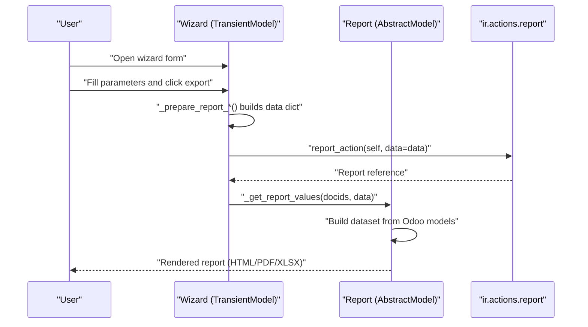

**Diagram sources**
- [aged_partner_balance_wizard.py:120-154](file://wizard/aged_partner_balance_wizard.py#L120-L154)
- [general_ledger_wizard.py:274-316](file://wizard/general_ledger_wizard.py#L274-L316)
- [trial_balance_wizard.py:242-285](file://wizard/trial_balance_wizard.py#L242-L285)
- [open_items_wizard.py:154-190](file://wizard/open_items_wizard.py#L154-L190)
- [vat_report_wizard.py:69-101](file://wizard/vat_report_wizard.py#L69-L101)
- [aged_partner_balance.py:411-465](file://report/aged_partner_balance.py#L411-L465)
- [general_ledger.py:763-800](file://report/general_ledger.py#L763-L800)
- [trial_balance.py:406-622](file://report/trial_balance.py#L406-L622)
- [open_items.py:245-297](file://report/open_items.py#L245-L297)
- [vat_report.py:203-234](file://report/vat_report.py#L203-L234)

## Detailed Component Analysis

### Abstract Wizard Base Class
The abstract wizard defines shared behavior and fields used by all report wizards.

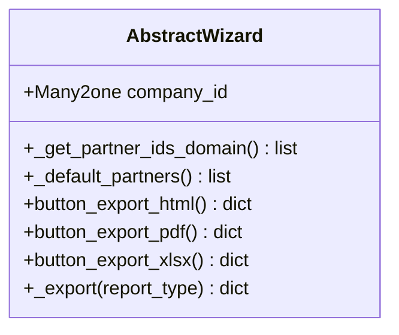

**Diagram sources**
- [abstract_wizard.py:7-52](file://wizard/abstract_wizard.py#L7-L52)

**Section sources**
- [abstract_wizard.py:7-52](file://wizard/abstract_wizard.py#L7-L52)

### Aged Partner Balance Wizard
Key behaviors:
- Field-level validation and auto-filtering via onchange handlers.
- Domain construction for accounts and partners.
- Report preparation and export delegation.

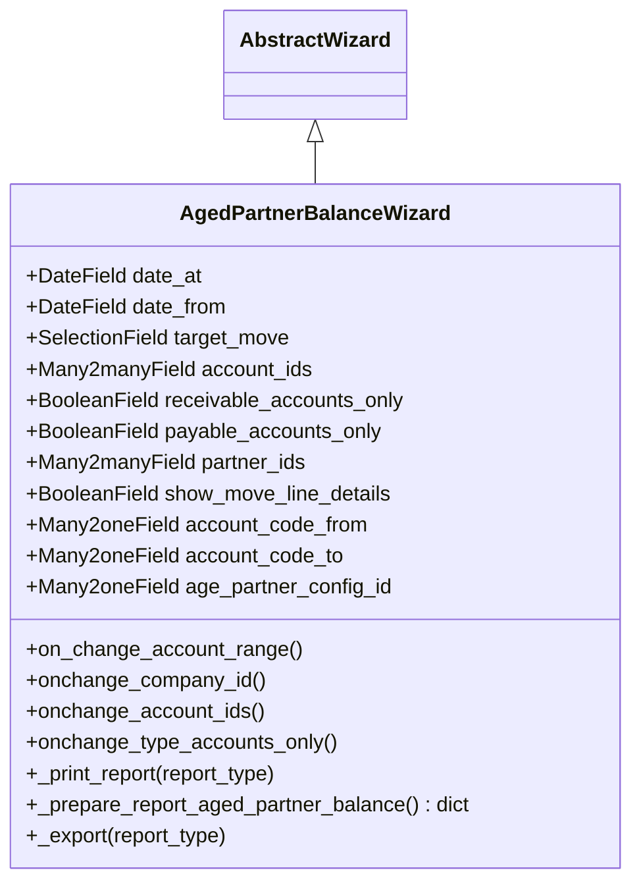

**Diagram sources**
- [aged_partner_balance_wizard.py:9-154](file://wizard/aged_partner_balance_wizard.py#L9-L154)
- [abstract_wizard.py:7-52](file://wizard/abstract_wizard.py#L7-L52)

**Section sources**
- [aged_partner_balance_wizard.py:9-154](file://wizard/aged_partner_balance_wizard.py#L9-L154)

### General Ledger Wizard
Key behaviors:
- Fiscal year computation and date range synchronization.
- Multi-domain filtering for accounts, journals, partners, and analytic centers.
- Centralization and foreign currency toggles.
- Validation constraints for company-date_range consistency.

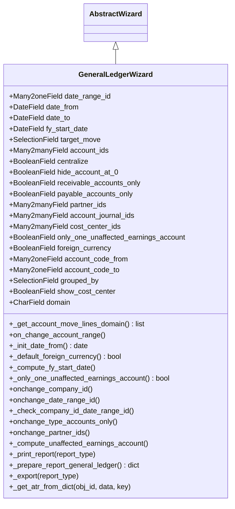

**Diagram sources**
- [general_ledger_wizard.py:18-322](file://wizard/general_ledger_wizard.py#L18-L322)
- [abstract_wizard.py:7-52](file://wizard/abstract_wizard.py#L7-L52)

**Section sources**
- [general_ledger_wizard.py:18-322](file://wizard/general_ledger_wizard.py#L18-L322)

### Trial Balance Wizard
Key behaviors:
- Hierarchical grouping controls and validation for hierarchy levels.
- Partner detail toggling and analytic grouping support.
- Unaffected earnings account handling.

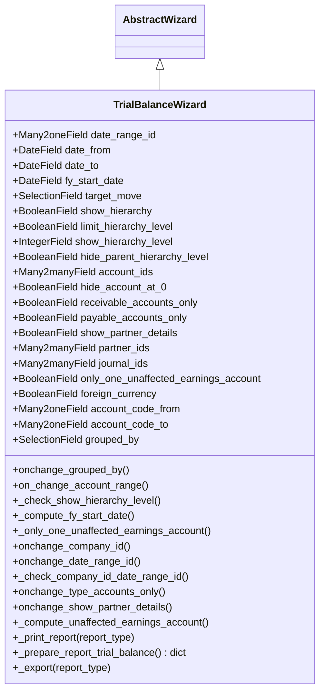

**Diagram sources**
- [trial_balance_wizard.py:12-285](file://wizard/trial_balance_wizard.py#L12-L285)
- [abstract_wizard.py:7-52](file://wizard/abstract_wizard.py#L7-L52)

**Section sources**
- [trial_balance_wizard.py:12-285](file://wizard/trial_balance_wizard.py#L12-L285)

### Open Items Wizard
Key behaviors:
- Partner grouping options and salesperson grouping.
- Foreign currency defaults and reconciliation adjustments.

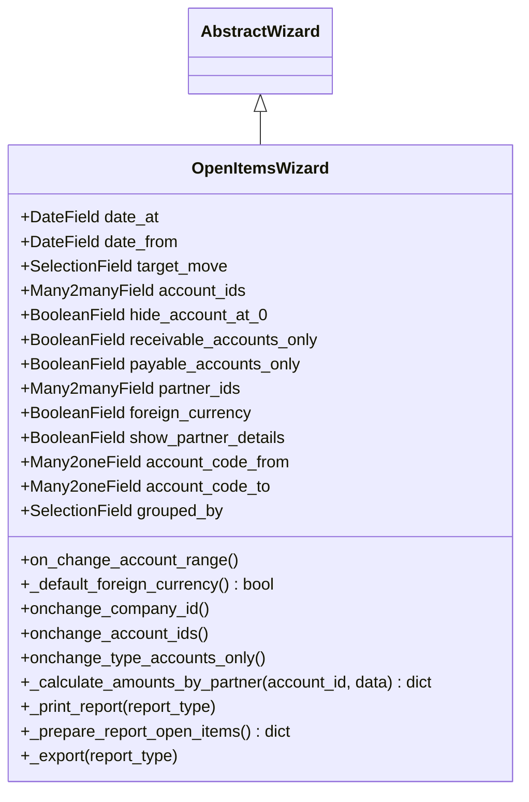

**Diagram sources**
- [open_items_wizard.py:9-190](file://wizard/open_items_wizard.py#L9-L190)
- [abstract_wizard.py:7-52](file://wizard/abstract_wizard.py#L7-L52)

**Section sources**
- [open_items_wizard.py:9-190](file://wizard/open_items_wizard.py#L9-L190)

### VAT Report Wizard
Key behaviors:
- Tax basis selection (tax tags vs tax groups).
- Date range synchronization and company validation.

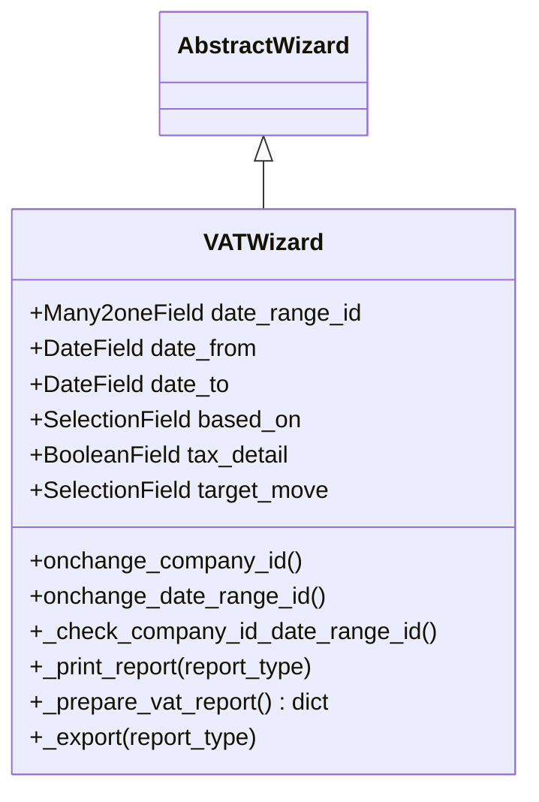

**Diagram sources**
- [vat_report_wizard.py:8-101](file://wizard/vat_report_wizard.py#L8-L101)
- [abstract_wizard.py:7-52](file://wizard/abstract_wizard.py#L7-L52)

**Section sources**
- [vat_report_wizard.py:8-101](file://wizard/vat_report_wizard.py#L8-L101)

### Report Preparation Utilities and Data Transformation
Report models transform wizard-provided parameters into structured datasets. They rely on shared abstract report utilities for domain construction and field definitions.

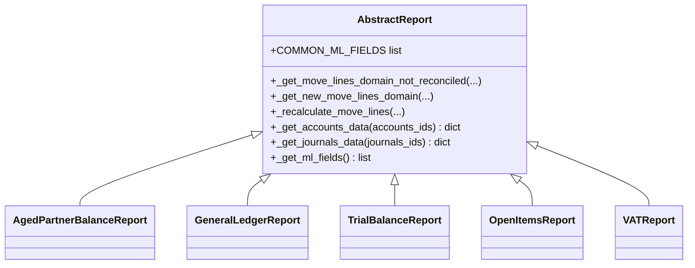

**Diagram sources**
- [abstract_report.py:7-165](file://report/abstract_report.py#L7-L165)
- [aged_partner_balance.py:12-473](file://report/aged_partner_balance.py#L12-L473)
- [general_ledger.py:14-931](file://report/general_ledger.py#L14-L931)
- [trial_balance.py:12-981](file://report/trial_balance.py#L12-L981)
- [open_items.py:13-310](file://report/open_items.py#L13-L310)
- [vat_report.py:10-244](file://report/vat_report.py#L10-L244)

**Section sources**
- [abstract_report.py:7-165](file://report/abstract_report.py#L7-L165)
- [aged_partner_balance.py:12-473](file://report/aged_partner_balance.py#L12-L473)
- [general_ledger.py:14-931](file://report/general_ledger.py#L14-L931)
- [trial_balance.py:12-981](file://report/trial_balance.py#L12-L981)
- [open_items.py:13-310](file://report/open_items.py#L13-L310)
- [vat_report.py:10-244](file://report/vat_report.py#L10-L244)

### Wizard Parameter Validation Flow
Validation logic is implemented via Odoo’s computed fields, domain updates, and constraints. The flow below illustrates typical validation steps for company-dependent fields.

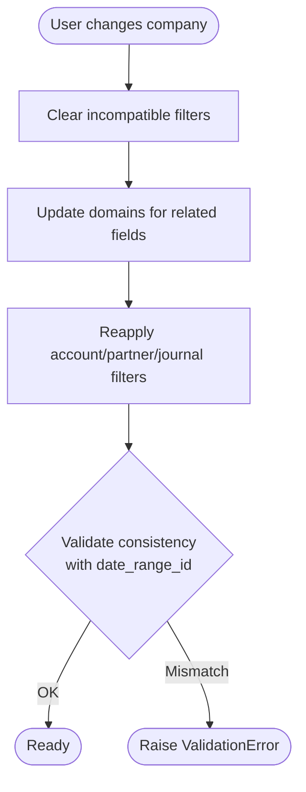

**Diagram sources**
- [general_ledger_wizard.py:218-232](file://wizard/general_ledger_wizard.py#L218-L232)
- [trial_balance_wizard.py:185-199](file://wizard/trial_balance_wizard.py#L185-L199)
- [vat_report_wizard.py:54-68](file://wizard/vat_report_wizard.py#L54-L68)

**Section sources**
- [general_ledger_wizard.py:218-232](file://wizard/general_ledger_wizard.py#L218-L232)
- [trial_balance_wizard.py:185-199](file://wizard/trial_balance_wizard.py#L185-L199)
- [vat_report_wizard.py:54-68](file://wizard/vat_report_wizard.py#L54-L68)

## Dependency Analysis
Wizards depend on:
- Abstract wizard base for shared fields and export actions.
- Views for UI exposure and button bindings.
- Report models for data transformation and rendering.

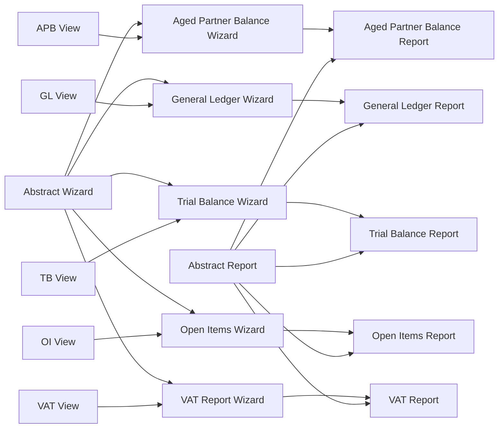

**Diagram sources**
- [abstract_wizard.py:7-52](file://wizard/abstract_wizard.py#L7-L52)
- [aged_partner_balance_wizard.py:9-154](file://wizard/aged_partner_balance_wizard.py#L9-L154)
- [general_ledger_wizard.py:18-322](file://wizard/general_ledger_wizard.py#L18-L322)
- [trial_balance_wizard.py:12-285](file://wizard/trial_balance_wizard.py#L12-L285)
- [open_items_wizard.py:9-190](file://wizard/open_items_wizard.py#L9-L190)
- [vat_report_wizard.py:8-101](file://wizard/vat_report_wizard.py#L8-L101)
- [aged_partner_balance_wizard_view.xml:1-96](file://wizard/aged_partner_balance_wizard_view.xml#L1-L96)
- [general_ledger_wizard_view.xml:1-164](file://wizard/general_ledger_wizard_view.xml#L1-L164)
- [trial_balance_wizard_view.xml:1-159](file://wizard/trial_balance_wizard_view.xml#L1-L159)
- [open_items_wizard_view.xml:1-119](file://wizard/open_items_wizard_view.xml#L1-L119)
- [vat_report_wizard_view.xml:1-61](file://wizard/vat_report_wizard_view.xml#L1-L61)
- [abstract_report.py:7-165](file://report/abstract_report.py#L7-L165)
- [aged_partner_balance.py:12-473](file://report/aged_partner_balance.py#L12-L473)
- [general_ledger.py:14-931](file://report/general_ledger.py#L14-L931)
- [trial_balance.py:12-981](file://report/trial_balance.py#L12-L981)
- [open_items.py:13-310](file://report/open_items.py#L13-L310)
- [vat_report.py:10-244](file://report/vat_report.py#L10-L244)

**Section sources**
- [__manifest__.py:19-46](file://__manifest__.py#L19-L46)

## Performance Considerations
- Domain filtering: Use company-aware domains to limit query scope and improve performance.
- Reduce unnecessary joins: Filter by ids early (e.g., account_ids, partner_ids) to minimize dataset sizes.
- Centralization: Enable centralization only when needed to avoid extra aggregation work.
- Foreign currency: Enable only when required to reduce additional computations.
- Grouping: Prefer grouped_by options judiciously to avoid heavy read_group operations.

## Troubleshooting Guide
Common issues and resolutions:
- Company and date range mismatch:
  - Symptom: ValidationError when selecting a date range.
  - Resolution: Ensure the wizard’s company matches the date range’s company.
  - Section sources
    - [general_ledger_wizard.py:218-232](file://wizard/general_ledger_wizard.py#L218-L232)
    - [trial_balance_wizard.py:185-199](file://wizard/trial_balance_wizard.py#L185-L199)
    - [vat_report_wizard.py:54-68](file://wizard/vat_report_wizard.py#L54-L68)
- Hierarchy level validation:
  - Symptom: UserError when hierarchy level is not positive.
  - Resolution: Set show_hierarchy_level to a positive integer.
  - Section sources
    - [trial_balance_wizard.py:99-108](file://wizard/trial_balance_wizard.py#L99-L108)
- Multi-company visibility:
  - Symptom: Company field not visible.
  - Resolution: Ensure the user belongs to the appropriate group for multi-company visibility.
  - Section sources
    - [aged_partner_balance_wizard_view.xml:10-14](file://wizard/aged_partner_balance_wizard_view.xml#L10-L14)
    - [general_ledger_wizard_view.xml:10-14](file://wizard/general_ledger_wizard_view.xml#L10-L14)
    - [trial_balance_wizard_view.xml:17-23](file://wizard/trial_balance_wizard_view.xml#L17-L23)
    - [open_items_wizard_view.xml:9-15](file://wizard/open_items_wizard_view.xml#L9-L15)
    - [vat_report_wizard_view.xml:8-14](file://wizard/vat_report_wizard_view.xml#L8-L14)
- Report availability:
  - Symptom: Export buttons disabled.
  - Resolution: Verify company-specific unaffected earnings account constraints and module dependencies.
  - Section sources
    - [general_ledger_wizard.py:96-101](file://wizard/general_ledger_wizard.py#L96-L101)
    - [trial_balance_wizard.py:111-119](file://wizard/trial_balance_wizard.py#L111-L119)
    - [general_ledger_wizard_view.xml:96-104](file://wizard/general_ledger_wizard_view.xml#L96-L104)
    - [trial_balance_wizard_view.xml:111-119](file://wizard/trial_balance_wizard_view.xml#L111-L119)

## Conclusion
The wizard configuration API provides a consistent, extensible framework for collecting report parameters, validating inputs, and preparing data for report execution. By leveraging the abstract wizard base and per-report wizards, developers can implement robust financial reporting interfaces with minimal duplication. Adhering to the validation patterns and performance recommendations ensures reliable and efficient report generation.