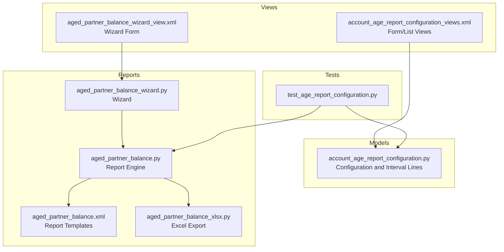
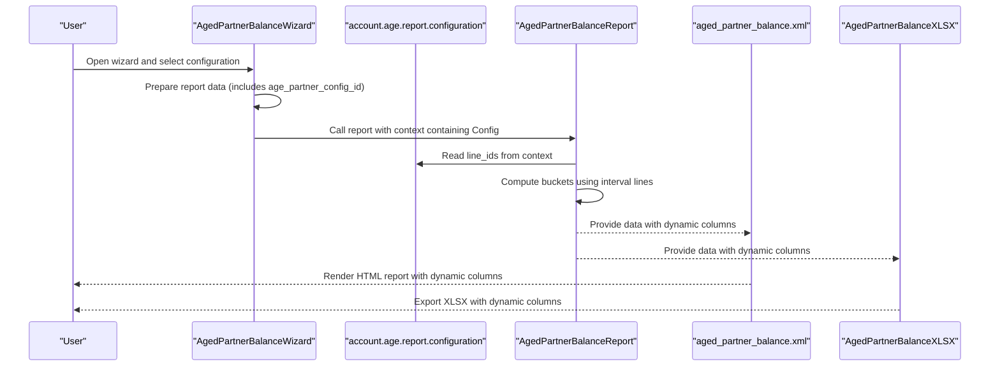
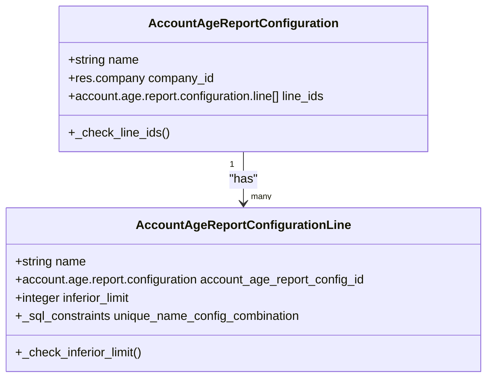
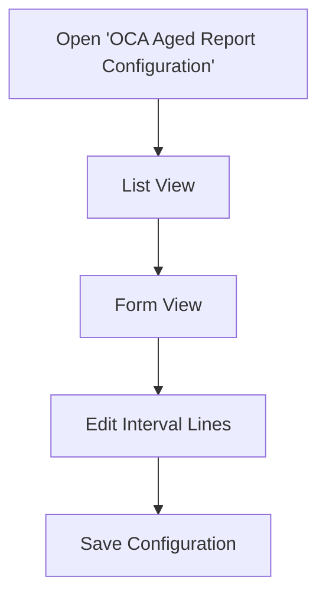
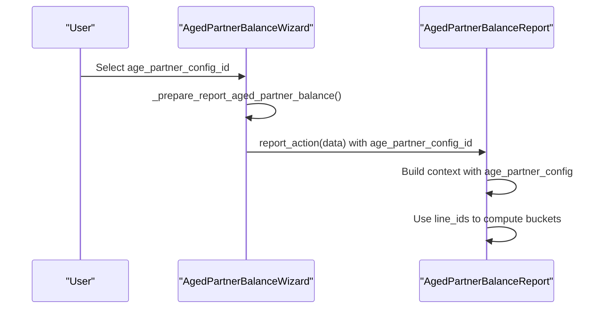
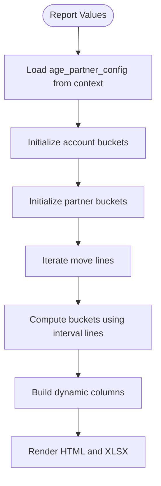
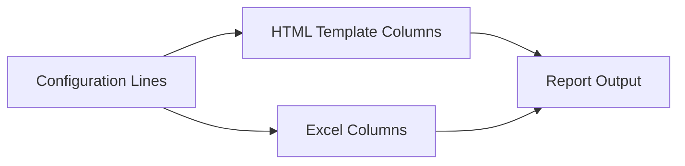
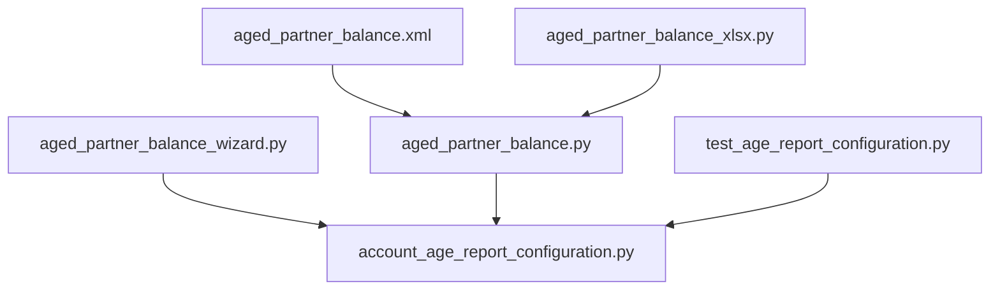

# Aging Report Configuration

<cite>
**Referenced Files in This Document**
- [account_age_report_configuration.py](file://models/account_age_report_configuration.py)
- [account_age_report_configuration_views.xml](file://view/account_age_report_configuration_views.xml)
- [aged_partner_balance.py](file://report/aged_partner_balance.py)
- [aged_partner_balance_wizard.py](file://wizard/aged_partner_balance_wizard.py)
- [aged_partner_balance_wizard_view.xml](file://wizard/aged_partner_balance_wizard_view.xml)
- [aged_partner_balance.xml](file://report/templates/aged_partner_balance.xml)
- [aged_partner_balance_xlsx.py](file://report/aged_partner_balance_xlsx.py)
- [test_age_report_configuration.py](file://tests/test_age_report_configuration.py)
- [README.rst](file://README.rst)
- [__manifest__.py](file://__manifest__.py)
- [menuitems.xml](file://menuitems.xml)
</cite>

## Table of Contents
1. [Introduction](#introduction)
2. [Project Structure](#project-structure)
3. [Core Components](#core-components)
4. [Architecture Overview](#architecture-overview)
5. [Detailed Component Analysis](#detailed-component-analysis)
6. [Dependency Analysis](#dependency-analysis)
7. [Performance Considerations](#performance-considerations)
8. [Troubleshooting Guide](#troubleshooting-guide)
9. [Conclusion](#conclusion)
10. [Appendices](#appendices)

## Introduction
This document explains how to configure aging report parameters in the Account Financial Reports module. It focuses on the aging configuration model, how to define custom aging periods, configure interval lengths, and set up aging criteria. It also documents the user interface for managing aging configurations through Odoo’s view system, and clarifies how different aging setups affect report output. Step-by-step instructions are provided for creating new configurations, modifying existing ones, and testing changes. Examples illustrate common aging period setups such as 30/60/90-day aging, monthly intervals, and custom period lengths. Validation rules, constraints, and best practices are addressed to ensure reliable configuration management.

## Project Structure
The aging report configuration spans several modules:
- Model definition for aging configuration and interval lines
- Views for creating and editing configurations
- Wizard for selecting an aging configuration when generating the report
- Report rendering logic and templates that consume the configuration
- Tests validating constraints and behavior

**Diagram sources**
- [account_age_report_configuration.py:1-50](file://models/account_age_report_configuration.py#L1-L50)
- [account_age_report_configuration_views.xml:1-42](file://view/account_age_report_configuration_views.xml#L1-L42)
- [aged_partner_balance_wizard.py:1-154](file://wizard/aged_partner_balance_wizard.py#L1-L154)
- [aged_partner_balance.py:1-473](file://report/aged_partner_balance.py#L1-L473)
- [aged_partner_balance.xml:1-812](file://report/templates/aged_partner_balance.xml#L1-L812)
- [aged_partner_balance_xlsx.py:80-279](file://report/aged_partner_balance_xlsx.py#L80-L279)
- [test_age_report_configuration.py:1-43](file://tests/test_age_report_configuration.py#L1-L43)

**Section sources**
- [__manifest__.py:19-46](file://__manifest__.py#L19-L46)
- [menuitems.xml:1-46](file://menuitems.xml#L1-L46)

## Core Components
- Aging configuration model: Holds the configuration header and a collection of interval lines.
- Interval line model: Defines each aging bucket with a name and an inferior limit.
- Wizard: Allows selecting a configuration when generating the Aged Partner Balance report.
- Report engine: Uses the selected configuration to compute buckets and render the report.
- Templates and Excel exporter: Dynamically build columns based on the configuration.

Key responsibilities:
- Enforce constraints on configuration completeness and interval limits.
- Compute aging buckets using the configuration’s interval lines.
- Render dynamic columns in HTML and Excel outputs.

**Section sources**
- [account_age_report_configuration.py:8-50](file://models/account_age_report_configuration.py#L8-L50)
- [aged_partner_balance_wizard.py:43-45](file://wizard/aged_partner_balance_wizard.py#L43-L45)
- [aged_partner_balance.py:28-90](file://report/aged_partner_balance.py#L28-L90)
- [aged_partner_balance.xml:119-136](file://report/templates/aged_partner_balance.xml#L119-L136)
- [aged_partner_balance_xlsx.py:87-97](file://report/aged_partner_balance_xlsx.py#L87-L97)

## Architecture Overview
The aging configuration is a master-detail model. The wizard selects a configuration, which is passed into the report engine via context. The report engine computes buckets using the configuration’s interval lines and renders dynamic columns in both HTML and Excel.

**Diagram sources**
- [aged_partner_balance_wizard.py:136-149](file://wizard/aged_partner_balance_wizard.py#L136-L149)
- [aged_partner_balance.py:422-465](file://report/aged_partner_balance.py#L422-L465)
- [aged_partner_balance.xml:119-136](file://report/templates/aged_partner_balance.xml#L119-L136)
- [aged_partner_balance_xlsx.py:87-97](file://report/aged_partner_balance_xlsx.py#L87-L97)

## Detailed Component Analysis

### Aging Configuration Model
The configuration model defines:
- Header: name and company_id
- Detail lines: name, configuration link, and inferior_limit

Validation rules:
- At least one configuration line is required.
- Each inferior_limit must be greater than zero.
- Interval names must be unique within a configuration.

**Diagram sources**
- [account_age_report_configuration.py:8-50](file://models/account_age_report_configuration.py#L8-L50)

**Section sources**
- [account_age_report_configuration.py:20-24](file://models/account_age_report_configuration.py#L20-L24)
- [account_age_report_configuration.py:35-41](file://models/account_age_report_configuration.py#L35-L41)
- [account_age_report_configuration.py:43-49](file://models/account_age_report_configuration.py#L43-L49)

### Aging Configuration UI
The configuration UI provides:
- List view: shows name and company
- Form view: allows editing name, company, and interval lines
- Action to open the configuration window

**Diagram sources**
- [account_age_report_configuration_views.xml:6-41](file://view/account_age_report_configuration_views.xml#L6-L41)

**Section sources**
- [account_age_report_configuration_views.xml:6-41](file://view/account_age_report_configuration_views.xml#L6-L41)

### Wizard Integration
The wizard exposes a field to select an aging configuration and passes it to the report engine. The wizard prepares the report payload, including the configuration ID.

**Diagram sources**
- [aged_partner_balance_wizard.py:43-45](file://wizard/aged_partner_balance_wizard.py#L43-L45)
- [aged_partner_balance_wizard.py:136-149](file://wizard/aged_partner_balance_wizard.py#L136-L149)
- [aged_partner_balance.py:422-465](file://report/aged_partner_balance.py#L422-L465)

**Section sources**
- [aged_partner_balance_wizard.py:43-45](file://wizard/aged_partner_balance_wizard.py#L43-L45)
- [aged_partner_balance_wizard.py:136-149](file://wizard/aged_partner_balance_wizard.py#L136-L149)

### Report Engine Behavior
The report engine:
- Reads the configuration from context
- Initializes buckets for each account and partner
- Computes buckets based on due dates and the configuration’s interval lines
- Builds dynamic columns for HTML and Excel outputs

**Diagram sources**
- [aged_partner_balance.py:28-90](file://report/aged_partner_balance.py#L28-L90)
- [aged_partner_balance.py:143-252](file://report/aged_partner_balance.py#L143-L252)
- [aged_partner_balance.xml:119-136](file://report/templates/aged_partner_balance.xml#L119-L136)
- [aged_partner_balance_xlsx.py:87-97](file://report/aged_partner_balance_xlsx.py#L87-L97)

**Section sources**
- [aged_partner_balance.py:28-90](file://report/aged_partner_balance.py#L28-L90)
- [aged_partner_balance.py:143-252](file://report/aged_partner_balance.py#L143-L252)
- [aged_partner_balance.xml:119-136](file://report/templates/aged_partner_balance.xml#L119-L136)
- [aged_partner_balance_xlsx.py:87-97](file://report/aged_partner_balance_xlsx.py#L87-L97)

### Template and Excel Column Generation
Templates and Excel exporter dynamically generate columns based on the configuration’s interval lines:
- Headers reflect the interval names
- Footer totals and percentages use interval IDs to compute percent columns

**Diagram sources**
- [aged_partner_balance.xml:119-136](file://report/templates/aged_partner_balance.xml#L119-L136)
- [aged_partner_balance_xlsx.py:87-97](file://report/aged_partner_balance_xlsx.py#L87-L97)

**Section sources**
- [aged_partner_balance.xml:119-136](file://report/templates/aged_partner_balance.xml#L119-L136)
- [aged_partner_balance_xlsx.py:87-97](file://report/aged_partner_balance_xlsx.py#L87-L97)

## Dependency Analysis
- The wizard depends on the configuration model via a Many2one field.
- The report engine reads the configuration from context and uses its line_ids.
- Templates and Excel exporter depend on the presence of configuration lines to render dynamic columns.
- Tests validate constraints enforced by the configuration model.

**Diagram sources**
- [aged_partner_balance_wizard.py:43-45](file://wizard/aged_partner_balance_wizard.py#L43-L45)
- [account_age_report_configuration.py:8-50](file://models/account_age_report_configuration.py#L8-L50)
- [aged_partner_balance.py:422-465](file://report/aged_partner_balance.py#L422-L465)
- [aged_partner_balance.xml:119-136](file://report/templates/aged_partner_balance.xml#L119-L136)
- [aged_partner_balance_xlsx.py:87-97](file://report/aged_partner_balance_xlsx.py#L87-L97)
- [test_age_report_configuration.py:1-43](file://tests/test_age_report_configuration.py#L1-L43)

**Section sources**
- [test_age_report_configuration.py:1-43](file://tests/test_age_report_configuration.py#L1-L43)

## Performance Considerations
- Bucket computation iterates over move lines; keep configuration lines minimal to reduce iteration overhead.
- Using fewer interval lines reduces dynamic column generation in templates and Excel exports.
- Avoid excessive interval granularity to prevent misclassification and unnecessary computation.

[No sources needed since this section provides general guidance]

## Troubleshooting Guide
Common issues and resolutions:
- Missing configuration lines: Creating a configuration without any interval lines raises a validation error. Ensure at least one interval line is present.
- Invalid inferior limit: Setting an inferior limit to zero or below triggers a validation error. Use positive integers only.
- Duplicate interval names: Names must be unique within a configuration. Change names to resolve conflicts.
- Report not reflecting custom intervals: Verify that the wizard selects the intended configuration and that the report is regenerated after changes.

Validation and tests:
- Constraint checks are enforced in the configuration model.
- Tests confirm that missing lines and invalid limits trigger errors.

**Section sources**
- [account_age_report_configuration.py:20-24](file://models/account_age_report_configuration.py#L20-L24)
- [account_age_report_configuration.py:35-41](file://models/account_age_report_configuration.py#L35-L41)
- [test_age_report_configuration.py:31-42](file://tests/test_age_report_configuration.py#L31-L42)

## Conclusion
The aging report configuration system enables flexible, user-defined aging periods for the Aged Partner Balance report. By modeling configurations as master-detail records and passing them into the report engine via context, the system dynamically generates columns and computes buckets. Adhering to validation rules ensures robust configurations, while the wizard and views provide straightforward management. Following the step-by-step instructions below will help you create, modify, and validate configurations reliably.

[No sources needed since this section summarizes without analyzing specific files]

## Appendices

### Step-by-Step: Create a New Aging Configuration
1. Navigate to Settings > Invoicing > OCA Aged Report Configuration.
2. Open the “Configurations” action and create a new record.
3. Enter a name for the configuration and select the company.
4. Add interval lines:
   - Provide a name for each interval (e.g., “0-15”, “16-30”, “31+”).
   - Set the inferior limit for each interval (must be positive).
5. Save the configuration.

**Section sources**
- [README.rst:67-92](file://README.rst#L67-L92)
- [account_age_report_configuration_views.xml:6-41](file://view/account_age_report_configuration_views.xml#L6-L41)
- [account_age_report_configuration.py:35-41](file://models/account_age_report_configuration.py#L35-L41)

### Step-by-Step: Modify an Existing Aging Configuration
1. Open the configuration record.
2. Edit the name or company if needed.
3. Adjust interval lines:
   - Change names to update column labels.
   - Update inferior limits to redefine bucket boundaries.
4. Ensure names remain unique within the configuration.
5. Save the record.

**Section sources**
- [account_age_report_configuration.py:43-49](file://models/account_age_report_configuration.py#L43-L49)
- [account_age_report_configuration.py:35-41](file://models/account_age_report_configuration.py#L35-L41)

### Step-by-Step: Test Configuration Changes
1. Open the Aged Partner Balance wizard.
2. Select the configuration you modified.
3. Generate the report (PDF/HTML/XLSX).
4. Verify that:
   - Dynamic columns match the configuration names.
   - Buckets are computed correctly based on due dates and interval limits.
   - Totals and percentages reflect the new configuration.

**Section sources**
- [aged_partner_balance_wizard.py:136-149](file://wizard/aged_partner_balance_wizard.py#L136-L149)
- [aged_partner_balance.py:422-465](file://report/aged_partner_balance.py#L422-L465)
- [aged_partner_balance.xml:119-136](file://report/templates/aged_partner_balance.xml#L119-L136)
- [aged_partner_balance_xlsx.py:87-97](file://report/aged_partner_balance_xlsx.py#L87-L97)

### Example Aging Period Setups
- 30/60/90-day aging:
  - Configure intervals with inferior limits 30, 60, 90.
  - This creates buckets for current, 1–30 days, 31–60 days, 61–90 days, and over 90 days.
- Monthly intervals:
  - Configure intervals with inferior limits 30, 60, 90, 120 to represent monthly buckets.
- Custom period lengths:
  - Use any positive integer limits to define bespoke buckets (e.g., 15, 45, 75).

**Section sources**
- [README.rst:75-86](file://README.rst#L75-L86)
- [aged_partner_balance.py:76-89](file://report/aged_partner_balance.py#L76-L89)

### Best Practices
- Keep interval names descriptive and consistent across companies.
- Use ascending inferior limits to ensure correct bucket assignment.
- Limit the number of intervals to improve performance and readability.
- Validate configurations periodically to catch duplicates or invalid limits early.

[No sources needed since this section provides general guidance]