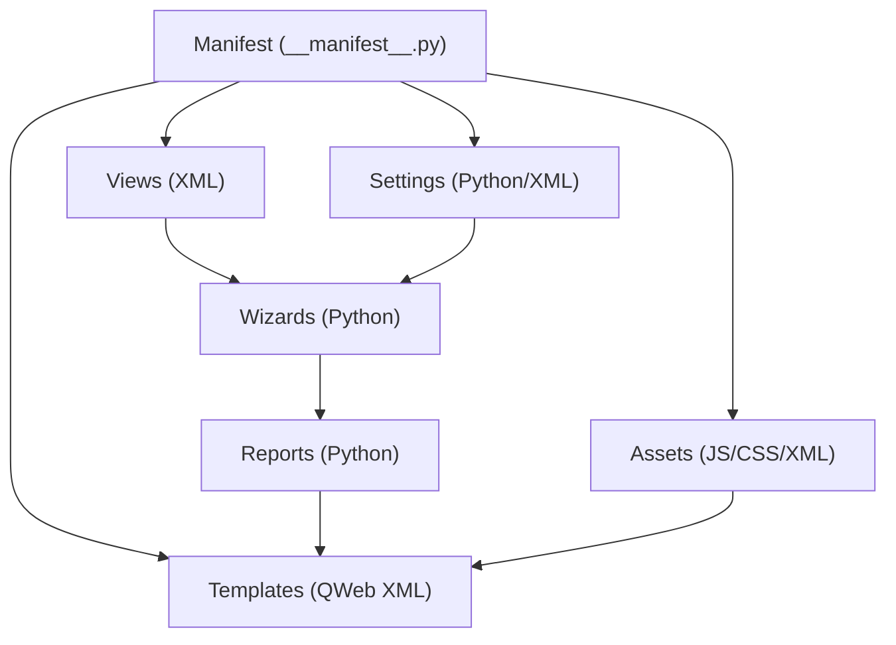
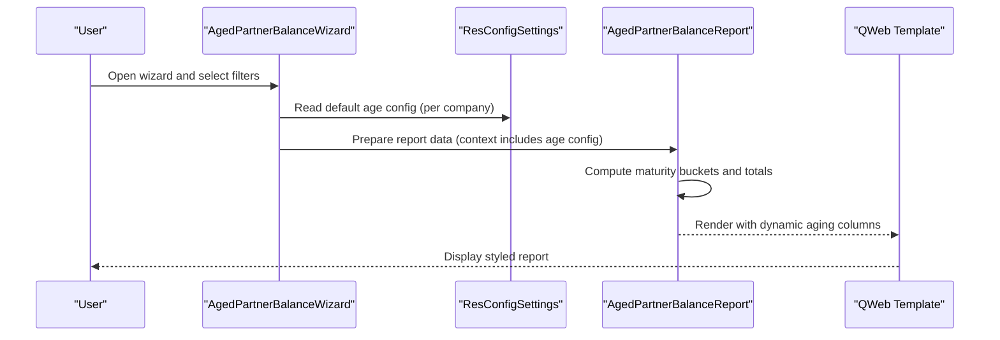
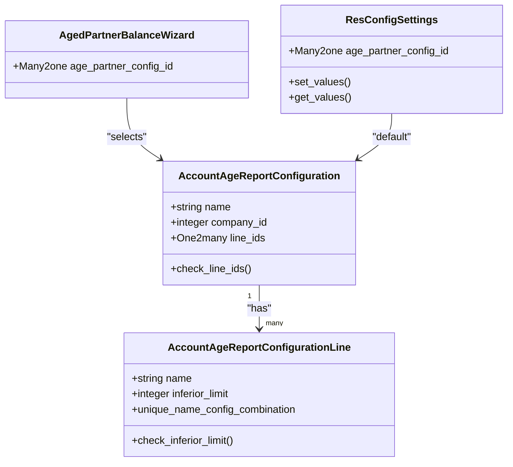
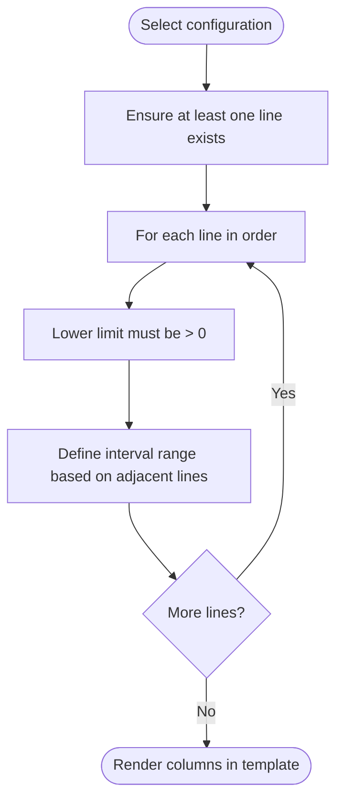
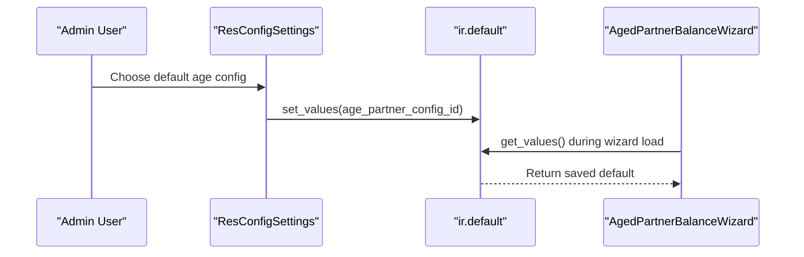
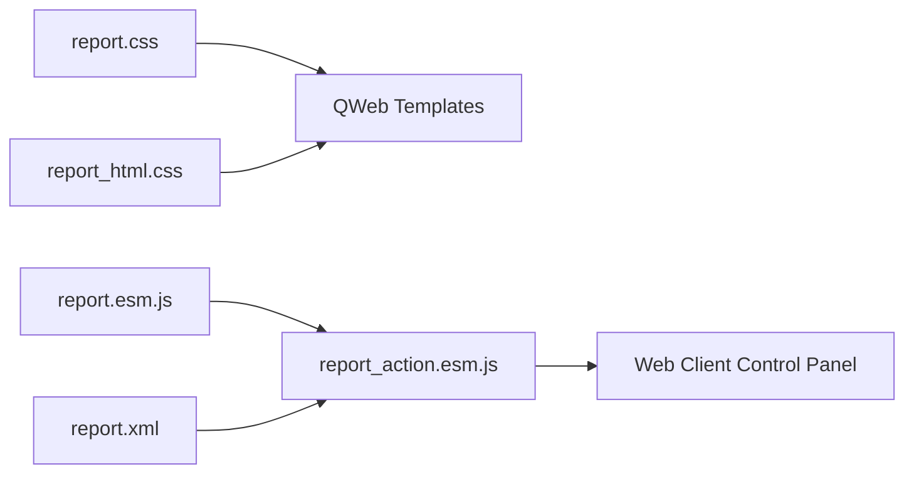
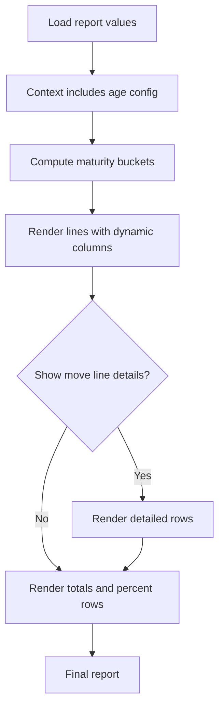
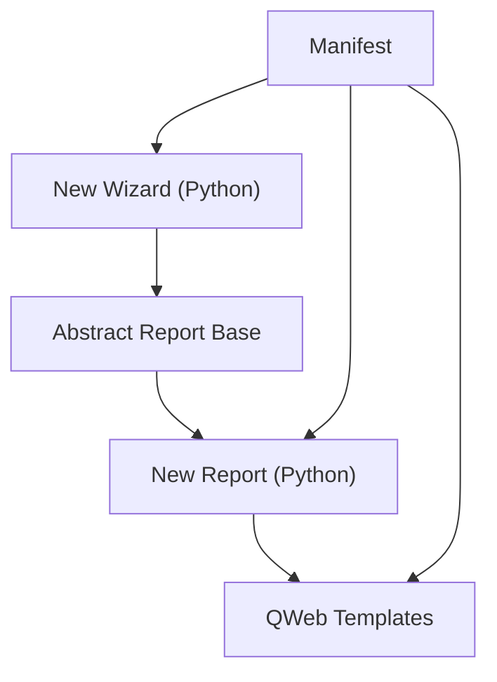
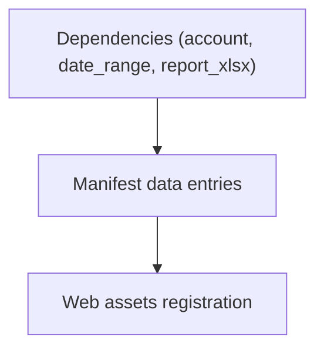

# Configuration and Customization

<cite>
**Referenced Files in This Document**
- [__manifest__.py](file://__manifest__.py)
- [CONFIGURE.md](file://readme/CONFIGURE.md)
- [res_config_settings.py](file://models/res_config_settings.py)
- [account_age_report_configuration.py](file://models/account_age_report_configuration.py)
- [aged_partner_balance_wizard.py](file://wizard/aged_partner_balance_wizard.py)
- [aged_partner_balance.py](file://report/aged_partner_balance.py)
- [abstract_report.py](file://report/abstract_report.py)
- [report.css](file://static/src/css/report.css)
- [report_html.css](file://static/src/css/report_html.css)
- [report.esm.js](file://static/src/js/report.esm.js)
- [report_action.esm.js](file://static/src/js/report_action.esm.js)
- [report.xml](file://static/src/xml/report.xml)
- [res_config_settings_views.xml](file://view/res_config_settings_views.xml)
- [account_age_report_configuration_views.xml](file://view/account_age_report_configuration_views.xml)
- [aged_partner_balance.xml](file://report/templates/aged_partner_balance.xml)
- [account_financial_report.pot](file://i18n/account_financial_report.pot)
</cite>

## Table of Contents
1. [Introduction](#introduction)
2. [Project Structure](#project-structure)
3. [Core Components](#core-components)
4. [Architecture Overview](#architecture-overview)
5. [Detailed Component Analysis](#detailed-component-analysis)
6. [Dependency Analysis](#dependency-analysis)
7. [Performance Considerations](#performance-considerations)
8. [Troubleshooting Guide](#troubleshooting-guide)
9. [Conclusion](#conclusion)
10. [Appendices](#appendices)

## Introduction
This document explains how to configure and customize the Account Financial Reports module, with a focus on the aging report configuration system, global settings, frontend customization, extending report functionality, and internationalization/localization support. It provides practical guidance for setting up customized aging periods, adjusting global defaults, styling and enhancing the report UI, adding new report types, and adapting behaviors to local needs.

## Project Structure
The module follows an Odoo-standard layout:
- Manifest declares dependencies, views, templates, and backend assets.
- Models define core data structures and wizard logic.
- Wizards collect user inputs and prepare report data.
- Reports compute and render data via QWeb templates.
- Frontend assets include CSS, JS, and XML patches for the web client.
- Views and settings integrate with Odoo’s configuration UI.
- Internationalization resources provide translations.

**Diagram sources**
- [__manifest__.py:19-52](file://__manifest__.py#L19-L52)
- [res_config_settings_views.xml:5-50](file://view/res_config_settings_views.xml#L5-L50)

**Section sources**
- [__manifest__.py:19-52](file://__manifest__.py#L19-L52)

## Core Components
- Aging report configuration model and lines define dynamic aging intervals.
- Aged Partner Balance wizard collects filters and prepares report context.
- Report engine computes balances, maturity buckets, and totals.
- Abstract report base provides shared helpers for data retrieval and reconciliation adjustments.
- Frontend assets enhance report rendering and interactivity.
- Global settings expose default aging configuration per company.

Key configuration touchpoints:
- Aging configuration model and wizard field binding.
- Settings integration to set default configuration per company.
- Templates that render aging columns dynamically based on configuration.

**Section sources**
- [account_age_report_configuration.py:8-50](file://models/account_age_report_configuration.py#L8-L50)
- [aged_partner_balance_wizard.py:43-45](file://wizard/aged_partner_balance_wizard.py#L43-L45)
- [res_config_settings.py:10-36](file://models/res_config_settings.py#L10-L36)
- [aged_partner_balance.py:411-465](file://report/aged_partner_balance.py#L411-L465)
- [abstract_report.py:10-165](file://report/abstract_report.py#L10-L165)

## Architecture Overview
The aging report pipeline integrates user input, configuration, computation, and rendering:

**Diagram sources**
- [aged_partner_balance_wizard.py:120-154](file://wizard/aged_partner_balance_wizard.py#L120-L154)
- [res_config_settings.py:15-36](file://models/res_config_settings.py#L15-L36)
- [aged_partner_balance.py:411-465](file://report/aged_partner_balance.py#L411-L465)
- [aged_partner_balance.xml:14-91](file://report/templates/aged_partner_balance.xml#L14-L91)

## Detailed Component Analysis

### Aging Report Configuration System
The aging configuration enables organizations to define custom maturity bands displayed in the Aged Partner Balance report. The system comprises:
- A configuration header with company scoping.
- A set of ordered interval lines with inclusive lower limits.
- Validation constraints ensuring completeness and positive limits.
- A wizard field to select a configuration for a report run.
- A settings integration to set a default configuration per company.

How intervals work:
- Each line defines an inclusive lower bound; the upper bound is determined by the next line’s lower bound.
- The first interval starts from 0 up to the first line’s lower bound.
- The last interval covers “greater than” the previous upper bound.

**Diagram sources**
- [account_age_report_configuration.py:20-49](file://models/account_age_report_configuration.py#L20-L49)
- [aged_partner_balance.py:76-90](file://report/aged_partner_balance.py#L76-L90)

**Section sources**
- [account_age_report_configuration.py:8-50](file://models/account_age_report_configuration.py#L8-L50)
- [account_age_report_configuration_views.xml:6-41](file://view/account_age_report_configuration_views.xml#L6-L41)
- [aged_partner_balance_wizard.py:43-45](file://wizard/aged_partner_balance_wizard.py#L43-L45)
- [res_config_settings.py:10-36](file://models/res_config_settings.py#L10-L36)

### Global Configuration Options (Settings)
Global defaults are stored via Odoo’s default registry and surfaced in the invoicing settings block. Users can:
- Select a default aging configuration for the Aged Partner Balance wizard.
- Navigate to the configuration records directly from the settings view.
- Persist defaults per company.

**Diagram sources**
- [res_config_settings.py:15-36](file://models/res_config_settings.py#L15-L36)
- [res_config_settings_views.xml:9-48](file://view/res_config_settings_views.xml#L9-L48)

**Section sources**
- [res_config_settings.py:10-36](file://models/res_config_settings.py#L10-L36)
- [res_config_settings_views.xml:5-50](file://view/res_config_settings_views.xml#L5-L50)
- [CONFIGURE.md:23-27](file://readme/CONFIGURE.md#L23-L27)

### Frontend Customization (CSS, JS, XML)
The module exposes backend assets and patches the report action to improve usability and styling.

- CSS:
  - Base report styles for tables, alignment, and responsive printing.
  - HTML-specific tweaks for readable fonts and spacing.
- JavaScript:
  - A patch to ReportAction adds an Export button for financial reports.
  - A reusable hook enriches clickable cells with quick actions to related records.
- XML:
  - Extends the web client control panel to add Export button conditionally.

**Diagram sources**
- [report.css:1-149](file://static/src/css/report.css#L1-L149)
- [report_html.css:1-11](file://static/src/css/report_html.css#L1-L11)
- [report.esm.js:1-73](file://static/src/js/report.esm.js#L1-L73)
- [report_action.esm.js:1-40](file://static/src/js/report_action.esm.js#L1-L40)
- [report.xml:1-19](file://static/src/xml/report.xml#L1-L19)

**Section sources**
- [report.css:1-149](file://static/src/css/report.css#L1-L149)
- [report_html.css:1-11](file://static/src/css/report_html.css#L1-L11)
- [report.esm.js:12-72](file://static/src/js/report.esm.js#L12-L72)
- [report_action.esm.js:7-39](file://static/src/js/report_action.esm.js#L7-L39)
- [report.xml:3-17](file://static/src/xml/report.xml#L3-L17)

### Report Rendering and Dynamic Columns
The Aged Partner Balance template renders:
- Filters display (date at, target moves).
- Dynamic aging columns driven by the selected configuration.
- Optional detailed move lines with maturity computations per row.
- Cumulative totals and percentages per account/partner.

**Diagram sources**
- [aged_partner_balance.py:411-465](file://report/aged_partner_balance.py#L411-L465)
- [aged_partner_balance.xml:14-91](file://report/templates/aged_partner_balance.xml#L14-L91)

**Section sources**
- [aged_partner_balance.py:411-465](file://report/aged_partner_balance.py#L411-L465)
- [aged_partner_balance.xml:14-91](file://report/templates/aged_partner_balance.xml#L14-L91)

### Extending Report Functionality and Adding New Report Types
Guidance for extending the module:
- Add a new wizard model inheriting the abstract wizard to define filters and prepare data.
- Create a new report Python class inheriting the abstract report base to compute data and totals.
- Define QWeb templates for filters, lines, and totals.
- Register the report action and templates in the manifest.
- Expose wizard views and menus similarly to existing reports.
- Keep data retrieval and reconciliation logic in the abstract base to reduce duplication.

[No sources needed since this diagram shows conceptual workflow, not actual code structure]

**Section sources**
- [abstract_report.py:10-165](file://report/abstract_report.py#L10-L165)
- [__manifest__.py:19-52](file://__manifest__.py#L19-L52)

### Internationalization Support and Localization
Translation workflow:
- The POT file lists translatable terms for UI labels, report headers, and wizard messages.
- PO files under i18n provide localized strings for multiple languages.
- Translations are integrated automatically by Odoo when installed.

Localization considerations:
- Use translated labels for aging intervals and maturity buckets in templates.
- Ensure date and monetary widgets localize according to the user’s language and company currency.
- Validate that column widths and page breaks remain readable across languages.

**Section sources**
- [account_financial_report.pot:16-280](file://i18n/account_financial_report.pot#L16-L280)

## Dependency Analysis
The module depends on core Odoo modules and optional reporting libraries. Assets are registered for the web client. Views and templates are declared in the manifest.

**Diagram sources**
- [__manifest__.py:18](file://__manifest__.py#L18)
- [__manifest__.py:47-52](file://__manifest__.py#L47-L52)

**Section sources**
- [__manifest__.py:18-52](file://__manifest__.py#L18-L52)

## Performance Considerations
- Minimize large datasets by applying filters early (accounts, partners, date ranges).
- Prefer computed totals and percentages server-side to reduce client rendering overhead.
- Use efficient domains and avoid unnecessary joins in report queries.
- Cache repeated lookups (accounts, journals) to reduce database hits.

[No sources needed since this section provides general guidance]

## Troubleshooting Guide
Common issues and resolutions:
- Missing configuration lines: Ensure at least one interval line exists; otherwise, a validation error is raised.
- Non-positive lower limits: Interval lower bounds must be greater than zero.
- Default not applied: Verify the default value is set in settings and retrieved during wizard load.
- Styling inconsistencies: Confirm CSS overrides are loaded after base styles and that responsive classes are applied consistently.

**Section sources**
- [account_age_report_configuration.py:20-41](file://models/account_age_report_configuration.py#L20-L41)
- [res_config_settings.py:15-36](file://models/res_config_settings.py#L15-L36)

## Conclusion
The Account Financial Reports module offers a flexible aging configuration system, global defaults via settings, and a robust frontend customization framework. By leveraging the provided models, wizards, and templates, organizations can tailor aging reports to local needs while maintaining maintainability and performance.

## Appendices

### Configuration Quick Reference
- Configure aging intervals:
  - Go to Settings → Invoicing → OCA Aged Report Configuration.
  - Click Configurations and create a new record with interval lines.
  - Inferior limits define ranges; first interval starts from 0 up to the first limit.
- Set default configuration:
  - Choose a default aging configuration in the same settings block.
  - Defaults apply when opening the Aged Partner Balance wizard.
- Run the report:
  - Open the wizard, select filters and configuration, then print or export.

**Section sources**
- [CONFIGURE.md:1-27](file://readme/CONFIGURE.md#L1-L27)