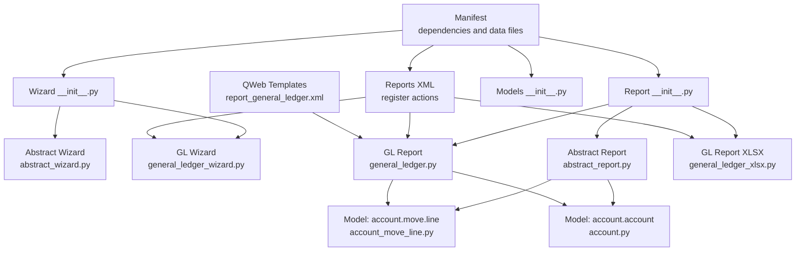
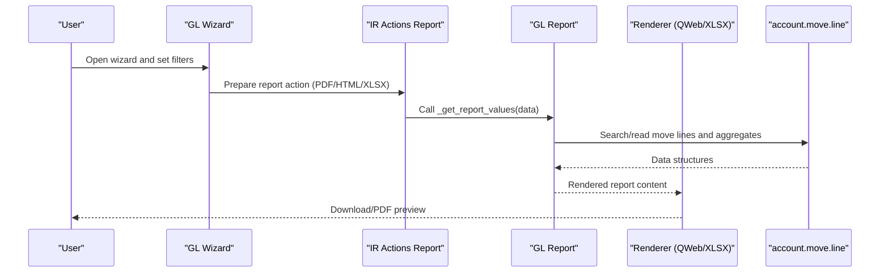
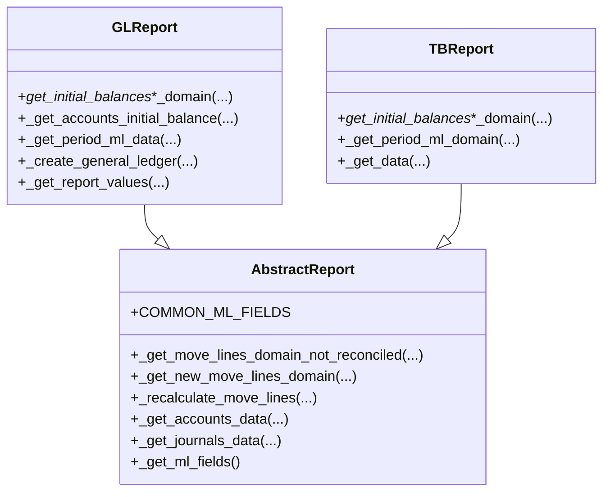
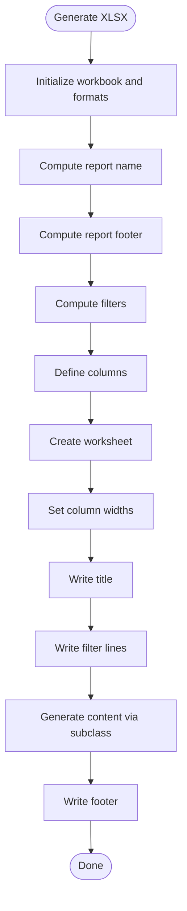
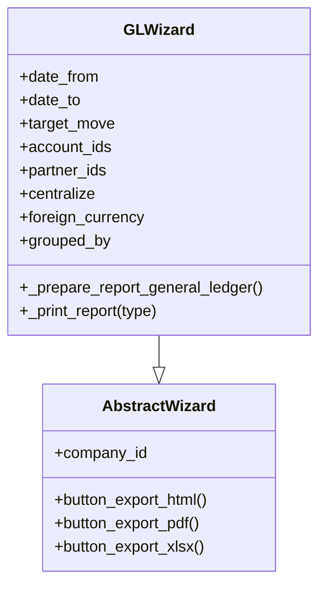
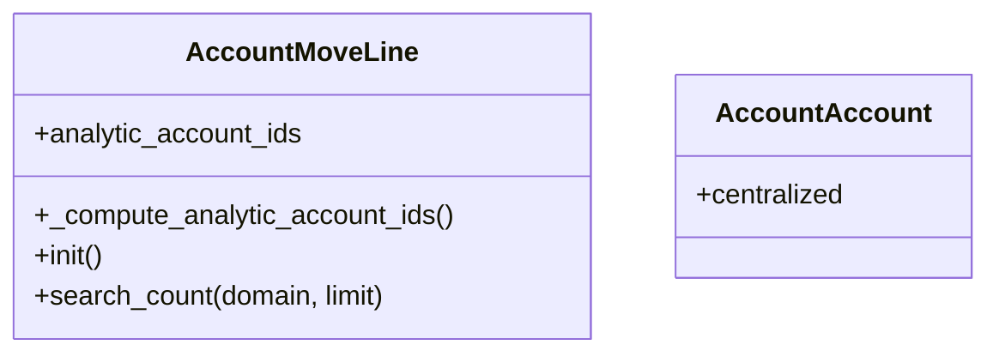
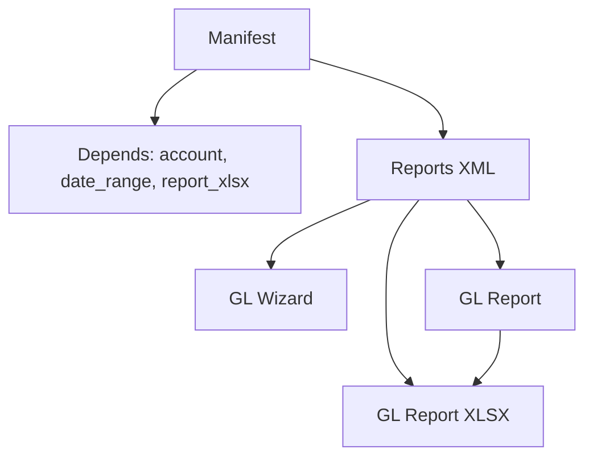

# Extension Development Guidelines

<cite>
**Referenced Files in This Document**
- [__manifest__.py](file://__manifest__.py)
- [__init__.py](file://report/__init__.py)
- [models/__init__.py](file://models/__init__.py)
- [wizard/__init__.py](file://wizard/__init__.py)
- [abstract_report.py](file://report/abstract_report.py)
- [abstract_report_xlsx.py](file://report/abstract_report_xlsx.py)
- [general_ledger.py](file://report/general_ledger.py)
- [general_ledger_xlsx.py](file://report/general_ledger_xlsx.py)
- [trial_balance.py](file://report/trial_balance.py)
- [abstract_wizard.py](file://wizard/abstract_wizard.py)
- [general_ledger_wizard.py](file://wizard/general_ledger_wizard.py)
- [account_move_line.py](file://models/account_move_line.py)
- [account.py](file://models/account.py)
- [reports.xml](file://reports.xml)
- [report_general_ledger.xml](file://view/report_general_ledger.xml)
</cite>

## Table of Contents
1. [Introduction](#introduction)
2. [Project Structure](#project-structure)
3. [Core Components](#core-components)
4. [Architecture Overview](#architecture-overview)
5. [Detailed Component Analysis](#detailed-component-analysis)
6. [Dependency Analysis](#dependency-analysis)
7. [Performance Considerations](#performance-considerations)
8. [Troubleshooting Guide](#troubleshooting-guide)
9. [Conclusion](#conclusion)
10. [Appendices](#appendices)

## Introduction
This document provides a comprehensive guide for extending and customizing the Account Financial Reports module. It explains the abstract report framework, wizard system, and data model extension points. It also includes step-by-step instructions for implementing new report types, integrating with Odoo’s reporting framework, and addressing performance, error handling, and security considerations.

## Project Structure
The module follows a layered structure:
- report: Abstract report base classes and concrete report implementations (HTML and XLSX variants)
- wizard: Abstract wizard base class and concrete wizards for each report
- models: Extensions to Odoo core models (account.move.line, account.account)
- view: QWeb templates for HTML report rendering
- static: Assets for frontend integration
- data: XML actions and views for report registration

**Diagram sources**
- [__manifest__.py:18-52](file://__manifest__.py#L18-L52)
- [reports.xml:22-172](file://reports.xml#L22-L172)
- [wizard/__init__.py:1-8](file://wizard/__init__.py#L1-L8)
- [report/__init__.py:6-19](file://report/__init__.py#L6-L19)
- [models/__init__.py:1-6](file://models/__init__.py#L1-L6)
- [abstract_wizard.py:7-52](file://abstract_wizard.py#L7-L52)
- [general_ledger_wizard.py:18-322](file://general_ledger_wizard.py#L18-L322)
- [abstract_report.py:7-165](file://abstract_report.py#L7-L165)
- [general_ledger.py:14-931](file://general_ledger.py#L14-L931)
- [general_ledger_xlsx.py:11-400](file://general_ledger_xlsx.py#L11-L400)
- [account_move_line.py:9-71](file://account_move_line.py#L9-L71)
- [account.py:6-14](file://account.py#L6-L14)
- [report_general_ledger.xml:3-9](file://report_general_ledger.xml#L3-L9)

**Section sources**
- [__manifest__.py:18-52](file://__manifest__.py#L18-L52)
- [reports.xml:22-172](file://reports.xml#L22-L172)
- [wizard/__init__.py:1-8](file://wizard/__init__.py#L1-L8)
- [report/__init__.py:6-19](file://report/__init__.py#L6-L19)
- [models/__init__.py:1-6](file://models/__init__.py#L1-L6)

## Core Components
- Abstract report framework:
  - Base report model defines common move line fields, reconciliation recalculations, and helpers to fetch account/journal data.
  - XLSX report base class orchestrates workbook creation, formatting, column definitions, and content writing.
- Concrete report implementations:
  - General Ledger and Trial Balance implement report-specific data retrieval, grouping, and aggregation.
- Wizard system:
  - Abstract wizard provides shared UI controls and export actions.
  - Concrete wizard encapsulates report filters, defaults, and preparation of report data dictionaries.
- Data model extensions:
  - account.move.line adds computed analytic account ids and performance-related database initialization.
  - account.account adds centralized flag for General Ledger.

Key extension points:
- Implement a new report by inheriting the abstract report base and overriding data retrieval and grouping logic.
- Implement a new XLSX report by inheriting the abstract XLSX report base and defining columns, filters, and content generation.
- Extend the wizard by inheriting the abstract wizard and adding new filters and default logic.

**Section sources**
- [abstract_report.py:7-165](file://abstract_report.py#L7-L165)
- [abstract_report_xlsx.py:8-698](file://abstract_report_xlsx.py#L8-L698)
- [general_ledger.py:14-931](file://general_ledger.py#L14-L931)
- [general_ledger_xlsx.py:11-400](file://general_ledger_xlsx.py#L11-L400)
- [abstract_wizard.py:7-52](file://abstract_wizard.py#L7-L52)
- [general_ledger_wizard.py:18-322](file://general_ledger_wizard.py#L18-L322)
- [account_move_line.py:9-71](file://account_move_line.py#L9-L71)
- [account.py:6-14](file://account.py#L6-L14)

## Architecture Overview
The module integrates wizard-driven configuration with report engines and output renderers:
- Wizard collects filters and prepares a data dictionary.
- Report engine computes aggregated data and structures.
- Output renderer (QWeb or XLSX) renders the final report.

**Diagram sources**
- [general_ledger_wizard.py:274-315](file://general_ledger_wizard.py#L274-L315)
- [reports.xml:22-36](file://reports.xml#L22-L36)
- [general_ledger.py:763-800](file://general_ledger.py#L763-L800)
- [general_ledger_xlsx.py:134-137](file://general_ledger_xlsx.py#L134-L137)
- [account_move_line.py:9-71](file://account_move_line.py#L9-L71)

## Detailed Component Analysis

### Abstract Report Framework
The abstract report base provides:
- Common move line fields and reconciliation recalculations.
- Helpers to build domains for posted vs draft moves, unreconciled lines, and new move lines.
- Methods to fetch account and journal metadata.

**Diagram sources**
- [abstract_report.py:7-165](file://abstract_report.py#L7-L165)
- [general_ledger.py:14-931](file://general_ledger.py#L14-L931)
- [trial_balance.py:12-981](file://trial_balance.py#L12-L981)

**Section sources**
- [abstract_report.py:7-165](file://abstract_report.py#L7-L165)
- [general_ledger.py:14-931](file://general_ledger.py#L14-L931)
- [trial_balance.py:12-981](file://trial_balance.py#L12-L981)

### Abstract XLSX Report Framework
The abstract XLSX report base:
- Defines workbook options and formats.
- Orchestrates report generation: title, filters, columns, content, footer.
- Provides helpers to write initial/ending balances and arrays.

**Diagram sources**
- [abstract_report_xlsx.py:18-42](file://abstract_report_xlsx.py#L18-L42)
- [abstract_report_xlsx.py:101-129](file://abstract_report_xlsx.py#L101-L129)
- [abstract_report_xlsx.py:131-159](file://abstract_report_xlsx.py#L131-L159)
- [abstract_report_xlsx.py:605-609](file://abstract_report_xlsx.py#L605-L609)

**Section sources**
- [abstract_report_xlsx.py:8-698](file://abstract_report_xlsx.py#L8-L698)

### Wizard System Architecture
The wizard system:
- Abstract wizard defines shared fields and export actions.
- Concrete wizard defines report-specific filters, defaults, and data preparation.

**Diagram sources**
- [abstract_wizard.py:7-52](file://abstract_wizard.py#L7-L52)
- [general_ledger_wizard.py:18-322](file://general_ledger_wizard.py#L18-L322)

**Section sources**
- [abstract_wizard.py:7-52](file://abstract_wizard.py#L7-L52)
- [general_ledger_wizard.py:18-322](file://general_ledger_wizard.py#L18-L322)

### Data Model Extension Points
- account.move.line:
  - Computed analytic account ids from analytic distribution.
  - Index optimization for performance.
  - search_count override to improve UI responsiveness.
- account.account:
  - centralized flag for General Ledger centralization.

**Diagram sources**
- [account_move_line.py:9-71](file://account_move_line.py#L9-L71)
- [account.py:6-14](file://account.py#L6-L14)

**Section sources**
- [account_move_line.py:9-71](file://account_move_line.py#L9-L71)
- [account.py:6-14](file://account.py#L6-L14)

### Implementing a New Report Type
Step-by-step guide:
1. Define a new report engine:
   - Create a new Python class inheriting the abstract report base.
   - Implement data retrieval methods (domains, read_group aggregations, grouping).
   - Implement the report values entry point to return structured data.
   - Reference: [abstract_report.py:7-165](file://abstract_report.py#L7-L165), [general_ledger.py:763-800](file://general_ledger.py#L763-L800)
2. Define a new XLSX report renderer:
   - Create a new Python class inheriting the abstract XLSX report base.
   - Override report name, columns, filters, and content generation.
   - Reference: [abstract_report_xlsx.py:18-42](file://abstract_report_xlsx.py#L18-L42), [general_ledger_xlsx.py:134-137](file://general_ledger_xlsx.py#L134-L137)
3. Create wizard filters and defaults:
   - Extend the abstract wizard with new fields and defaults.
   - Implement data preparation and export routing.
   - Reference: [abstract_wizard.py:7-52](file://abstract_wizard.py#L7-L52), [general_ledger_wizard.py:274-315](file://general_ledger_wizard.py#L274-L315)
4. Register the report:
   - Add actions in reports.xml for QWeb and XLSX outputs.
   - Reference: [reports.xml:22-172](file://reports.xml#L22-L172)
5. Template creation:
   - Create QWeb template(s) for HTML rendering.
   - Reference: [report_general_ledger.xml:3-9](file://report_general_ledger.xml#L3-L9)
6. Output generation:
   - Ensure the wizard routes to the correct report action and renderer.
   - Reference: [general_ledger_wizard.py:274-315](file://general_ledger_wizard.py#L274-L315)

Integration patterns:
- Use the abstract report base to reuse move line field definitions and reconciliation logic.
- Use the abstract XLSX base to standardize formatting and column layout.
- Reuse wizard exports to unify UI actions across report types.

**Section sources**
- [abstract_report.py:7-165](file://abstract_report.py#L7-L165)
- [abstract_report_xlsx.py:18-42](file://abstract_report_xlsx.py#L18-L42)
- [general_ledger.py:763-800](file://general_ledger.py#L763-L800)
- [general_ledger_xlsx.py:134-137](file://general_ledger_xlsx.py#L134-L137)
- [abstract_wizard.py:7-52](file://abstract_wizard.py#L7-L52)
- [general_ledger_wizard.py:274-315](file://general_ledger_wizard.py#L274-L315)
- [reports.xml:22-172](file://reports.xml#L22-L172)
- [report_general_ledger.xml:3-9](file://report_general_ledger.xml#L3-L9)

### Common Extension Scenarios
- Adding new report filters:
  - Extend the wizard with new Many2one/Selection fields and domain computation.
  - Propagate filters to the report data dictionary and adjust domains accordingly.
  - Reference: [general_ledger_wizard.py:35-91](file://general_ledger_wizard.py#L35-L91), [general_ledger.py:363-391](file://general_ledger.py#L363-L391)
- Implementing custom calculation methods:
  - Override report methods to compute derived fields or groupings.
  - Use read_group and search_read to aggregate data efficiently.
  - Reference: [general_ledger.py:108-120](file://general_ledger.py#L108-L120), [trial_balance.py:406-622](file://trial_balance.py#L406-L622)
- Integrating with external systems:
  - Use the report data dictionary to pass external identifiers or computed values.
  - Ensure the XLSX renderer writes additional columns as needed.
  - Reference: [general_ledger_xlsx.py:26-92](file://general_ledger_xlsx.py#L26-L92)

**Section sources**
- [general_ledger_wizard.py:35-91](file://general_ledger_wizard.py#L35-L91)
- [general_ledger.py:363-391](file://general_ledger.py#L363-L391)
- [general_ledger.py:108-120](file://general_ledger.py#L108-L120)
- [trial_balance.py:406-622](file://trial_balance.py#L406-L622)
- [general_ledger_xlsx.py:26-92](file://general_ledger_xlsx.py#L26-L92)

## Dependency Analysis
Module dependencies and integration points:
- Manifest declares dependencies on account, date_range, and report_xlsx.
- Reports XML registers actions for each report type (QWeb PDF/HTML and XLSX).
- Wizard and report classes depend on Odoo ORM and report_xlsx abstract base.

**Diagram sources**
- [__manifest__.py:18-18](file://__manifest__.py#L18-L18)
- [reports.xml:22-172](file://reports.xml#L22-L172)

**Section sources**
- [__manifest__.py:18-18](file://__manifest__.py#L18-L18)
- [reports.xml:22-172](file://reports.xml#L22-L172)

## Performance Considerations
- Database indexing:
  - The module creates an index on account.move.line for account_id and partner_id to speed up initial balance queries.
  - Reference: [account_move_line.py:53-62](file://account_move_line.py#L53-L62)
- Efficient aggregations:
  - Use read_group for grouped computations to minimize memory overhead.
  - Reference: [general_ledger.py:109-120](file://general_ledger.py#L109-L120), [trial_balance.py:447-467](file://trial_balance.py#L447-L467)
- UI responsiveness:
  - search_count override prevents expensive counts during domain widget updates.
  - Reference: [account_move_line.py:65-70](file://account_move_line.py#L65-L70)

Best practices:
- Prefer read_group and search_read with minimal fields.
- Cache computed data where appropriate.
- Avoid unnecessary ORM calls inside tight loops.

**Section sources**
- [account_move_line.py:53-62](file://account_move_line.py#L53-L62)
- [general_ledger.py:109-120](file://general_ledger.py#L109-L120)
- [trial_balance.py:447-467](file://trial_balance.py#L447-L467)
- [account_move_line.py:65-70](file://account_move_line.py#L65-L70)

## Troubleshooting Guide
Common issues and resolutions:
- Incorrect report filters:
  - Verify wizard data preparation and ensure filters are passed to report domains.
  - Reference: [general_ledger_wizard.py:290-311](file://general_ledger_wizard.py#L290-L311)
- Missing or incorrect data:
  - Confirm move line fields and reconciliation recalculations align with expectations.
  - Reference: [abstract_report.py:57-123](file://abstract_report.py#L57-L123)
- XLSX formatting anomalies:
  - Ensure column definitions and formats are correctly returned by the XLSX report.
  - Reference: [abstract_report_xlsx.py:131-159](file://abstract_report_xlsx.py#L131-L159), [general_ledger_xlsx.py:25-92](file://general_ledger_xlsx.py#L25-L92)
- Performance regressions:
  - Check for missing indexes and excessive search_count calls.
  - Reference: [account_move_line.py:53-62](file://account_move_line.py#L53-L62), [account_move_line.py:65-70](file://account_move_line.py#L65-L70)

Testing strategies:
- Unit tests for report data retrieval and grouping.
- Wizard validation for domain constraints and defaults.
- Integration tests for export actions and rendered outputs.

**Section sources**
- [general_ledger_wizard.py:290-311](file://general_ledger_wizard.py#L290-L311)
- [abstract_report.py:57-123](file://abstract_report.py#L57-L123)
- [abstract_report_xlsx.py:131-159](file://abstract_report_xlsx.py#L131-L159)
- [general_ledger_xlsx.py:25-92](file://general_ledger_xlsx.py#L25-L92)
- [account_move_line.py:53-62](file://account_move_line.py#L53-L62)
- [account_move_line.py:65-70](file://account_move_line.py#L65-L70)

## Conclusion
The Account Financial Reports module offers a robust, extensible framework for building financial reports. By leveraging the abstract report and XLSX base classes, wizard system, and model extensions, developers can implement new report types efficiently while maintaining compatibility and performance. Following the guidelines and best practices outlined here ensures reliable integrations and smooth maintenance across module updates.

## Appendices

### Security Considerations and Access Control
- Access rights:
  - Ensure report actions and wizards are properly exposed via security rules.
  - Reference: [__manifest__.py:20-21](file://__manifest__.py#L20-L21)
- Data visibility:
  - Wizard filters should restrict data by company and related entities.
  - Reference: [abstract_wizard.py:11-20](file://abstract_wizard.py#L11-L20), [general_ledger_wizard.py:184-209](file://general_ledger_wizard.py#L184-L209)
- Export permissions:
  - Restrict XLSX and PDF exports to authorized users via groups and access rights.

**Section sources**
- [__manifest__.py:20-21](file://__manifest__.py#L20-L21)
- [abstract_wizard.py:11-20](file://abstract_wizard.py#L11-L20)
- [general_ledger_wizard.py:184-209](file://general_ledger_wizard.py#L184-L209)