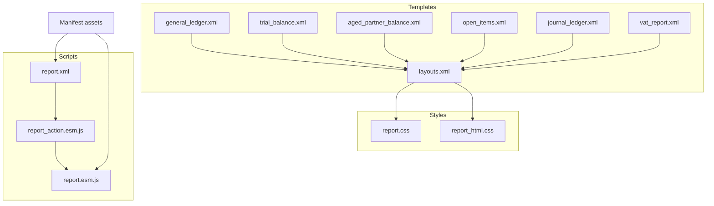
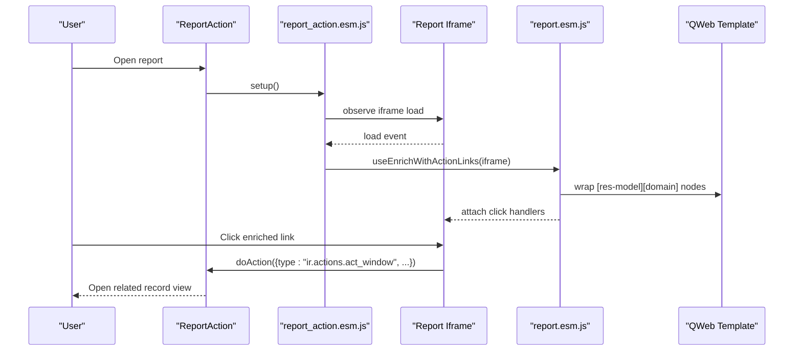
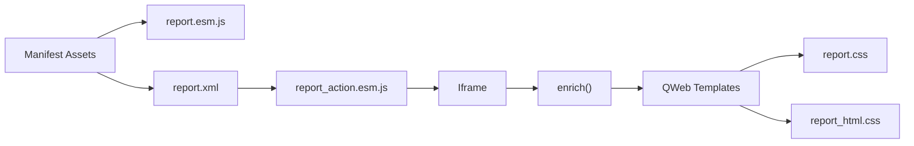

# Frontend Customization

<cite>
**Referenced Files in This Document**
- [__manifest__.py](file://__manifest__.py)
- [reports.xml](file://reports.xml)
- [layouts.xml](file://report/templates/layouts.xml)
- [general_ledger.xml](file://report/templates/general_ledger.xml)
- [trial_balance.xml](file://report/templates/trial_balance.xml)
- [aged_partner_balance.xml](file://report/templates/aged_partner_balance.xml)
- [open_items.xml](file://report/templates/open_items.xml)
- [journal_ledger.xml](file://report/templates/journal_ledger.xml)
- [vat_report.xml](file://report/templates/vat_report.xml)
- [report.css](file://static/src/css/report.css)
- [report_html.css](file://static/src/css/report_html.css)
- [report.esm.js](file://static/src/js/report.esm.js)
- [report_action.esm.js](file://static/src/js/report_action.esm.js)
- [report.xml](file://static/src/xml/report.xml)
</cite>

## Table of Contents
1. [Introduction](#introduction)
2. [Project Structure](#project-structure)
3. [Core Components](#core-components)
4. [Architecture Overview](#architecture-overview)
5. [Detailed Component Analysis](#detailed-component-analysis)
6. [Dependency Analysis](#dependency-analysis)
7. [Performance Considerations](#performance-considerations)
8. [Troubleshooting Guide](#troubleshooting-guide)
9. [Conclusion](#conclusion)
10. [Appendices](#appendices)

## Introduction
This document explains how to customize the frontend appearance and behavior of financial reports in the Account Financial Reports module. It covers:
- CSS styling system for report-specific stylesheets and HTML rendering
- JavaScript enhancement for report actions, dynamic content, and interactive features
- XML template system for report layout customization and content modification
- Guidance on overriding default styles, adding custom CSS classes, and responsive design
- Asset pipeline integration and packaging of custom frontend resources
- Browser compatibility, performance optimization, and accessibility considerations
- Troubleshooting and best practices for maintaining customizations during module updates

## Project Structure
The frontend customization spans three layers:
- Templates: QWeb XML templates define report layout and content
- Styles: CSS files provide report-specific presentation
- Scripts: JavaScript enhances interactivity and integrates with Odoo’s report action framework

**Diagram sources**
- [layouts.xml:1-44](file://report/templates/layouts.xml#L1-L44)
- [general_ledger.xml:1-11](file://report/templates/general_ledger.xml#L1-L11)
- [trial_balance.xml:1-11](file://report/templates/trial_balance.xml#L1-L11)
- [aged_partner_balance.xml:1-13](file://report/templates/aged_partner_balance.xml#L1-L13)
- [open_items.xml:1-11](file://report/templates/open_items.xml#L1-L11)
- [journal_ledger.xml:1-13](file://report/templates/journal_ledger.xml#L1-L13)
- [vat_report.xml:1-11](file://report/templates/vat_report.xml#L1-L11)
- [report.css:1-149](file://static/src/css/report.css#L1-L149)
- [report_html.css:1-11](file://static/src/css/report_html.css#L1-L11)
- [report.esm.js:1-73](file://static/src/js/report.esm.js#L1-L73)
- [report_action.esm.js:1-40](file://static/src/js/report_action.esm.js#L1-L40)
- [report.xml:1-19](file://static/src/xml/report.xml#L1-L19)
- [__manifest__.py:47-52](file://__manifest__.py#L47-L52)

**Section sources**
- [__manifest__.py:47-52](file://__manifest__.py#L47-L52)
- [layouts.xml:1-44](file://report/templates/layouts.xml#L1-L44)

## Core Components
- Layout templates: Provide container and internal layout with embedded stylesheets and footer pagination.
- Report templates: Define content tables, headers, rows, and totals using semantic classes for styling.
- Stylesheets: Provide base report styles and HTML-specific adjustments.
- JavaScript: Enhances clickable cells to open related records via Odoo actions and adds export button integration.
- XML extension: Adds an Export button to the report control panel for HTML reports.

Key frontend hooks:
- Internal layout article wraps report content and injects report.css.
- HTML container includes report_html.css and report_layout.
- Interactive links are enabled via a hook that wraps elements with res-model and domain attributes.

**Section sources**
- [layouts.xml:3-42](file://report/templates/layouts.xml#L3-L42)
- [report.css:1-149](file://static/src/css/report.css#L1-L149)
- [report_html.css:1-11](file://static/src/css/report_html.css#L1-L11)
- [report.esm.js:12-55](file://static/src/js/report.esm.js#L12-L55)
- [report_action.esm.js:7-39](file://static/src/js/report_action.esm.js#L7-L39)
- [report.xml:3-17](file://static/src/xml/report.xml#L3-L17)

## Architecture Overview
The frontend rendering pipeline connects Odoo actions to templates and assets:

**Diagram sources**
- [report_action.esm.js:7-39](file://static/src/js/report_action.esm.js#L7-L39)
- [report.esm.js:12-72](file://static/src/js/report.esm.js#L12-L72)
- [report.xml:3-17](file://static/src/xml/report.xml#L3-L17)

## Detailed Component Analysis

### CSS Styling System
- report.css: Defines table-as-layout classes (act_as_table, act_as_row, act_as_cell), data table styles, totals, labels, alignment, and page layout for print/pdf.
- report_html.css: Provides HTML report-specific adjustments (typography, cell sizing).

Common classes:
- act_as_table/data_table/totals_table: Full-width containers with borders and center alignment.
- act_as_row.labels: Header row styling.
- act_as_cell.amount/left/right: Monetary and alignment variants.
- .o_account_financial_reports_page: Page container with margins and font family.
- .custom_footer/.page_break: Footer and page break controls.

Responsive considerations:
- Use act_as_table semantics to adapt to print/pagination.
- Keep fixed widths in templates for PDF consistency; rely on print media queries for responsive tweaks if needed.

Overriding defaults:
- Add custom CSS classes to templates (e.g., inside existing act_as_* containers) and include them via the asset pipeline.
- Override report.css by extending the stylesheet in your custom module and ensuring precedence through asset ordering.

**Section sources**
- [report.css:5-149](file://static/src/css/report.css#L5-L149)
- [report_html.css:1-11](file://static/src/css/report_html.css#L1-L11)

### JavaScript Enhancement System
- report.esm.js:
  - Utility toTitleCase for readable titles.
  - enrich(): Wraps elements with res-model and domain attributes with anchor tags and attaches click handlers to open related records.
  - useEnrichWithActionLinks(): Hook to initialize enrichment on mount; handles iframe load events.

- report_action.esm.js:
  - Patches ReportAction to detect account financial reports.
  - Adds an Export button via XML extension.
  - Implements export() to trigger XLSX generation with derived report names.

- report.xml:
  - Extends web.ReportAction to add an Export button when isAccountFinancialReport is true.

Interactive features:
- Clickable monetary and reference cells open related records (moves, accounts, journals, partners).
- Export button triggers XLSX download for the current report.

**Section sources**
- [report.esm.js:3-72](file://static/src/js/report.esm.js#L3-L72)
- [report_action.esm.js:7-39](file://static/src/js/report_action.esm.js#L7-L39)
- [report.xml:3-17](file://static/src/xml/report.xml#L3-L17)

### XML Template System
- layouts.xml:
  - html_container: Includes assets backend and report_html.css; sets body class; wraps content with web.report_layout.
  - internal_layout: Wraps report content in an article with embedded report.css; renders footer with timestamp and page info.

- Report templates (general_ledger, trial_balance, aged_partner_balance, open_items, journal_ledger, vat_report):
  - Use act_as_* classes to build tables and rows.
  - Employ res-model and domain attributes on spans to enable interactive links.
  - Include filters, headers, and totals using QWeb constructs.

Customization tips:
- Modify headers and totals by editing the respective templates.
- Add custom columns by introducing new act_as_cell elements and populating with t-out expressions.
- Wrap content in page_break divs to control pagination.

**Section sources**
- [layouts.xml:3-42](file://report/templates/layouts.xml#L3-L42)
- [general_ledger.xml:105-134](file://report/templates/general_ledger.xml#L105-L134)
- [trial_balance.xml:180-212](file://report/templates/trial_balance.xml#L180-L212)
- [aged_partner_balance.xml:92-108](file://report/templates/aged_partner_balance.xml#L92-L108)
- [open_items.xml:213-234](file://report/templates/open_items.xml#L213-L234)
- [journal_ledger.xml:93-172](file://report/templates/journal_ledger.xml#L93-L172)
- [vat_report.xml:147-166](file://report/templates/vat_report.xml#L147-L166)

### Asset Pipeline Integration
- Manifest assets:
  - web.assets_backend includes static/src/js/* and static/src/xml/**/*.
  - Ensure custom JS/XML is included alongside default ones to extend functionality.

- Stylesheets:
  - report.css is injected into internal_layout.
  - report_html.css is injected into html_container.

Packaging custom resources:
- Place custom CSS/JS under static/src and reference them in assets.
- Prefer extending templates/styles rather than replacing them to minimize upgrade conflicts.

**Section sources**
- [__manifest__.py:47-52](file://__manifest__.py#L47-L52)
- [layouts.xml:5-19](file://report/templates/layouts.xml#L5-L19)
- [reports.xml:22-36](file://reports.xml#L22-L36)

## Dependency Analysis
The frontend stack depends on:
- Odoo’s ReportAction and web assets
- QWeb templates for rendering
- CSS for presentation
- JavaScript for interactivity

**Diagram sources**
- [__manifest__.py:47-52](file://__manifest__.py#L47-L52)
- [report.xml:3-17](file://static/src/xml/report.xml#L3-L17)
- [report_action.esm.js:7-39](file://static/src/js/report_action.esm.js#L7-L39)
- [report.esm.js:12-72](file://static/src/js/report.esm.js#L12-L72)
- [layouts.xml:5-19](file://report/templates/layouts.xml#L5-L19)

**Section sources**
- [__manifest__.py:47-52](file://__manifest__.py#L47-L52)
- [report_action.esm.js:7-39](file://static/src/js/report_action.esm.js#L7-L39)
- [report.esm.js:12-72](file://static/src/js/report.esm.js#L12-L72)

## Performance Considerations
- Minimize DOM manipulation: leverage act_as_* classes to render tables efficiently.
- Avoid excessive inline styles: prefer reusable CSS classes to reduce template bloat.
- Limit heavy computations in templates: precompute aggregates in Python where possible.
- Use page_break strategically to control pagination and reduce memory usage in long reports.
- Keep asset sizes small: defer non-critical enhancements and compress CSS/JS.

## Troubleshooting Guide
Common issues and resolutions:
- Links not clickable:
  - Ensure elements have res-model and domain attributes and are wrapped by the enrichment hook.
  - Verify useEnrichWithActionLinks is called after iframe load.

- Export button missing:
  - Confirm report_action.esm.js patch applies and report_name starts with the module prefix.
  - Ensure XML extension is loaded via assets.

- Styles not applied:
  - Check that report.css/report_html.css are included in internal_layout/html_container.
  - Verify asset inclusion in web.assets_backend.

- Print layout problems:
  - Adjust act_as_* classes and widths in templates.
  - Use report.css overrides for print-specific tweaks.

- XLSX export errors:
  - Validate report_name transformation and ensure report_file/context are passed correctly.

**Section sources**
- [report.esm.js:12-72](file://static/src/js/report.esm.js#L12-L72)
- [report_action.esm.js:7-39](file://static/src/js/report_action.esm.js#L7-L39)
- [layouts.xml:5-19](file://report/templates/layouts.xml#L5-L19)
- [reports.xml:125-172](file://reports.xml#L125-L172)

## Conclusion
The Account Financial Reports module provides a robust, extensible frontend system. By leveraging QWeb templates, CSS classes, and JavaScript hooks, you can tailor report appearance and behavior while maintaining compatibility with Odoo’s reporting framework. Follow the guidance here to implement customizations safely and keep them resilient across updates.

## Appendices

### A. Common Customizations
- Add a logo/header/footer:
  - Insert HTML in the internal_layout article or template pages.
  - Use act_as_table and act_as_row for structured layout.

- Change color scheme:
  - Override report.css variables or add new classes with custom colors.
  - Apply classes to act_as_row/act_as_cell elements.

- Responsive design:
  - Use print media queries in custom CSS to adjust widths and spacing.
  - Keep fixed widths for PDF stability; use flexible layouts for HTML preview.

- Dynamic columns:
  - Extend templates to include new act_as_cell headers and populate with t-out expressions.

- Export integration:
  - Ensure report_action.esm.js detects your report and exposes Export.

**Section sources**
- [layouts.xml:14-42](file://report/templates/layouts.xml#L14-L42)
- [report.css:5-149](file://static/src/css/report.css#L5-L149)
- [report_action.esm.js:7-39](file://static/src/js/report_action.esm.js#L7-L39)

### B. Best Practices for Upgrades
- Prefer inheritance and extension over replacement:
  - Use t-inherit and t-extension in XML.
  - Override CSS via additional classes rather than modifying core stylesheets.

- Keep custom assets separate:
  - Place custom JS/CSS in your own module to isolate changes.

- Test across browsers:
  - Validate print/PDF output and HTML preview in target browsers.

- Version-aware patches:
  - Guard patches with module prefixes and feature checks.

**Section sources**
- [__manifest__.py:47-52](file://__manifest__.py#L47-L52)
- [report_action.esm.js:7-39](file://static/src/js/report_action.esm.js#L7-L39)