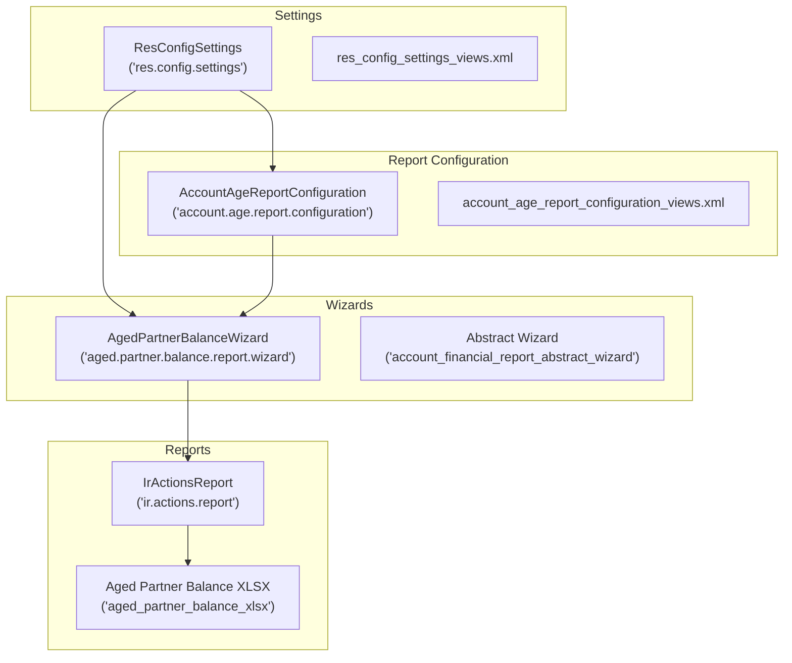
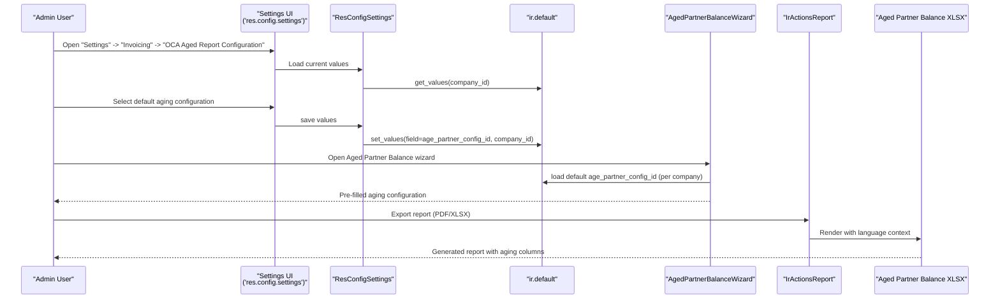
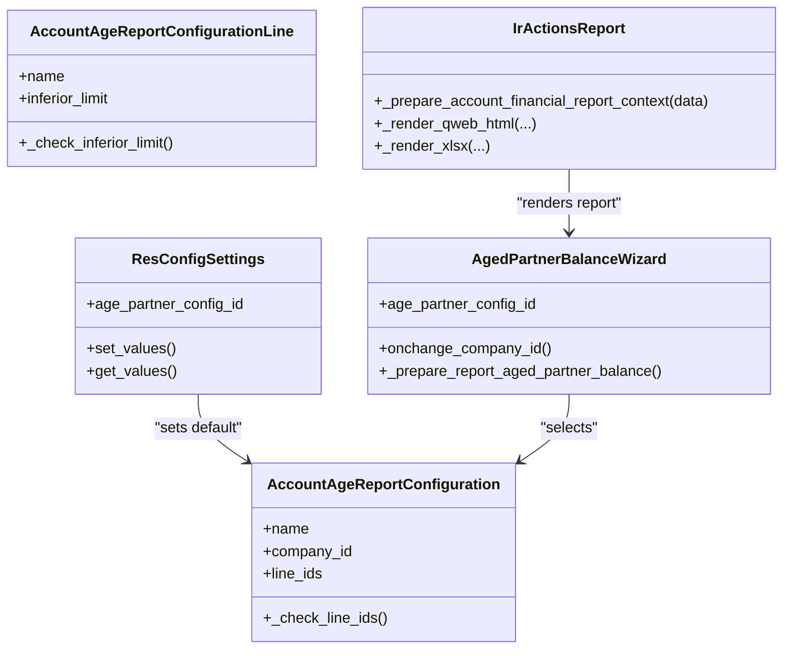
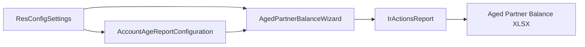

# Global Settings and Preferences

<cite>
**Referenced Files in This Document**
- [__manifest__.py](file://__manifest__.py)
- [models/res_config_settings.py](file://models/res_config_settings.py)
- [view/res_config_settings_views.xml](file://view/res_config_settings_views.xml)
- [models/account_age_report_configuration.py](file://models/account_age_report_configuration.py)
- [view/account_age_report_configuration_views.xml](file://view/account_age_report_configuration_views.xml)
- [wizard/aged_partner_balance_wizard.py](file://wizard/aged_partner_balance_wizard.py)
- [wizard/abstract_wizard.py](file://wizard/abstract_wizard.py)
- [models/ir_actions_report.py](file://models/ir_actions_report.py)
- [report/aged_partner_balance_xlsx.py](file://report/aged_partner_balance_xlsx.py)
- [readme/CONFIGURE.md](file://readme/CONFIGURE.md)
</cite>

## Table of Contents
1. [Introduction](#introduction)
2. [Project Structure](#project-structure)
3. [Core Components](#core-components)
4. [Architecture Overview](#architecture-overview)
5. [Detailed Component Analysis](#detailed-component-analysis)
6. [Dependency Analysis](#dependency-analysis)
7. [Performance Considerations](#performance-considerations)
8. [Troubleshooting Guide](#troubleshooting-guide)
9. [Conclusion](#conclusion)
10. [Appendices](#appendices)

## Introduction
This document explains the global configuration settings and preferences for the Account Financial Reports module. It focuses on the Odoo settings model that controls module-wide behavior, including default report options, display preferences, and system-wide parameters. It also details how to access and modify settings via Odoo’s configuration interface, the relationship between module settings and individual report configurations, and best practices for managing defaults, multi-company behavior, and user-specific preferences. Guidance is included for validation, backup, and migration considerations during upgrades.

## Project Structure
The configuration system spans several modules:
- Settings model and UI: defines and persists global defaults for report wizards.
- Report configuration model: stores reusable report-specific settings (e.g., aging intervals).
- Wizard models: capture per-run report parameters and apply defaults from settings.
- Report rendering: applies language and column configuration derived from settings and wizard selections.

**Diagram sources**
- [models/res_config_settings.py:7-36](file://models/res_config_settings.py#L7-L36)
- [view/res_config_settings_views.xml:5-48](file://view/res_config_settings_views.xml#L5-L48)
- [models/account_age_report_configuration.py:8-49](file://models/account_age_report_configuration.py#L8-L49)
- [view/account_age_report_configuration_views.xml:6-40](file://view/account_age_report_configuration_views.xml#L6-L40)
- [wizard/aged_partner_balance_wizard.py:9-154](file://wizard/aged_partner_balance_wizard.py#L9-L154)
- [wizard/abstract_wizard.py:7-52](file://wizard/abstract_wizard.py#L7-L52)
- [models/ir_actions_report.py:7-28](file://models/ir_actions_report.py#L7-L28)
- [report/aged_partner_balance_xlsx.py:84-97](file://report/aged_partner_balance_xlsx.py#L84-L97)

**Section sources**
- [__manifest__.py:19-46](file://__manifest__.py#L19-L46)
- [readme/CONFIGURE.md:1-27](file://readme/CONFIGURE.md#L1-L27)

## Core Components
- Global settings model: Extends Odoo’s configuration to persist a default aging configuration per company.
- Aging configuration model: Stores interval definitions for the Aged Partner Balance report.
- Wizard model: Collects report parameters and applies defaults from global settings.
- Report rendering: Applies language and dynamically builds columns from the selected aging configuration.

Key responsibilities:
- Persist defaults for wizard fields using Odoo’s default registry scoped by company.
- Enforce validation rules for aging configuration entries.
- Provide UI blocks for configuration in the Settings app.
- Propagate language preferences to report rendering.

**Section sources**
- [models/res_config_settings.py:7-36](file://models/res_config_settings.py#L7-L36)
- [models/account_age_report_configuration.py:8-49](file://models/account_age_report_configuration.py#L8-L49)
- [wizard/aged_partner_balance_wizard.py:9-154](file://wizard/aged_partner_balance_wizard.py#L9-L154)
- [models/ir_actions_report.py:10-27](file://models/ir_actions_report.py#L10-L27)

## Architecture Overview
The configuration architecture integrates settings persistence, wizard defaults, and report rendering:

**Diagram sources**
- [view/res_config_settings_views.xml:5-48](file://view/res_config_settings_views.xml#L5-L48)
- [models/res_config_settings.py:15-36](file://models/res_config_settings.py#L15-L36)
- [wizard/aged_partner_balance_wizard.py:43-45](file://wizard/aged_partner_balance_wizard.py#L43-L45)
- [models/ir_actions_report.py:10-27](file://models/ir_actions_report.py#L10-L27)
- [report/aged_partner_balance_xlsx.py:84-97](file://report/aged_partner_balance_xlsx.py#L84-L97)

## Detailed Component Analysis

### Global Settings Model (ResConfigSettings)
- Purpose: Adds a field to set a default aging configuration for the Aged Partner Balance wizard, scoped per company.
- Persistence: Uses Odoo’s default registry to store the default value keyed by wizard model and field, with company scoping.
- UI integration: Inherits the base settings form and adds a dedicated block with a link to manage configurations.

Behavior highlights:
- set_values writes the default for the wizard field under the current company.
- get_values reads the default for the wizard field under the current company.
- The wizard reads this default when initialized, pre-filling the aging configuration.

Security and scoping:
- Defaults are stored per company, ensuring isolation across companies.
- Access to the settings UI is controlled by standard Odoo access rights.

**Section sources**
- [models/res_config_settings.py:7-36](file://models/res_config_settings.py#L7-L36)
- [view/res_config_settings_views.xml:5-48](file://view/res_config_settings_views.xml#L5-L48)

### Aging Report Configuration Model
- Purpose: Defines reusable aging interval configurations for the Aged Partner Balance report.
- Structure: Header record with company and lines; each line defines an interval’s label and lower bound.
- Validation:
  - At least one line is required.
  - Lower bounds must be greater than zero.
  - Line names are unique per configuration.

Multi-company behavior:
- Company field is set by default to the current company.
- Wizard filtering ensures compatibility with the selected company.

**Section sources**
- [models/account_age_report_configuration.py:8-49](file://models/account_age_report_configuration.py#L8-L49)
- [view/account_age_report_configuration_views.xml:6-40](file://view/account_age_report_configuration_views.xml#L6-L40)

### Wizard Model: Aged Partner Balance Wizard
- Purpose: Captures report parameters and prepares the report payload.
- Default application: Reads the default aging configuration from settings and applies it to the wizard.
- Company-aware filtering: Adjusts domains for accounts and partners based on the selected company.
- Report preparation: Builds a data dictionary passed to the report action, including the selected aging configuration.

User-specific preferences:
- Language preference is passed via the report context and applied during rendering.

**Section sources**
- [wizard/aged_partner_balance_wizard.py:9-154](file://wizard/aged_partner_balance_wizard.py#L9-L154)
- [wizard/abstract_wizard.py:7-52](file://wizard/abstract_wizard.py#L7-L52)

### Report Rendering and Column Definition
- Language context: The report action sets the language from wizard data, ensuring localized output.
- Dynamic columns: The XLSX renderer constructs columns based on the selected aging configuration lines, using their names as headers.

**Section sources**
- [models/ir_actions_report.py:10-27](file://models/ir_actions_report.py#L10-L27)
- [report/aged_partner_balance_xlsx.py:84-97](file://report/aged_partner_balance_xlsx.py#L84-L97)

### Class Relationships

**Diagram sources**
- [models/res_config_settings.py:7-36](file://models/res_config_settings.py#L7-L36)
- [models/account_age_report_configuration.py:8-49](file://models/account_age_report_configuration.py#L8-L49)
- [wizard/aged_partner_balance_wizard.py:9-154](file://wizard/aged_partner_balance_wizard.py#L9-L154)
- [models/ir_actions_report.py:7-28](file://models/ir_actions_report.py#L7-L28)

## Dependency Analysis
- Settings depend on:
  - Aging configuration model for the selectable defaults.
  - Wizard model for applying defaults at runtime.
- Wizard depends on:
  - Abstract wizard for shared behavior and company-aware filtering.
  - Aging configuration model for report-specific parameters.
- Report rendering depends on:
  - Wizard-provided language context.
  - Aging configuration for dynamic column generation.

**Diagram sources**
- [models/res_config_settings.py:7-36](file://models/res_config_settings.py#L7-L36)
- [models/account_age_report_configuration.py:8-49](file://models/account_age_report_configuration.py#L8-L49)
- [wizard/aged_partner_balance_wizard.py:9-154](file://wizard/aged_partner_balance_wizard.py#L9-L154)
- [models/ir_actions_report.py:7-28](file://models/ir_actions_report.py#L7-L28)
- [report/aged_partner_balance_xlsx.py:84-97](file://report/aged_partner_balance_xlsx.py#L84-L97)

**Section sources**
- [__manifest__.py:19-46](file://__manifest__.py#L19-L46)

## Performance Considerations
- Defaults retrieval uses Odoo’s default registry, which is efficient and cached per session/company.
- Aging configuration loading occurs once per wizard initialization; keep the number of lines reasonable to avoid excessive column rendering.
- Report rendering with many columns can increase memory usage; consider limiting aging intervals to necessary ranges.

## Troubleshooting Guide
Common issues and resolutions:
- No aging configuration selected:
  - Ensure at least one configuration exists and has lines defined.
  - Verify the configuration belongs to the current company or is company-less for global availability.
- Invalid lower bounds:
  - Lower bounds must be greater than zero; adjust lines accordingly.
- Missing default applied:
  - Confirm the default is set in Settings under the correct company.
  - Clear browser cache if the wizard still does not reflect the default after saving.
- Multi-company mismatch:
  - Ensure the selected aging configuration matches the wizard’s company.
  - Reconfigure defaults per company if separate behaviors are required.

Validation and constraints:
- Aging configuration requires at least one line.
- Each line’s lower bound must be positive.
- Line names must be unique within a configuration.

Backup and migration:
- Back up database before upgrading to preserve settings and configurations.
- Review upgrade notes for changes to default fields or wizard behavior.
- After upgrade, re-open Settings to confirm defaults are still applied.

**Section sources**
- [models/account_age_report_configuration.py:20-49](file://models/account_age_report_configuration.py#L20-L49)
- [models/res_config_settings.py:15-36](file://models/res_config_settings.py#L15-L36)
- [readme/CONFIGURE.md:1-27](file://readme/CONFIGURE.md#L1-L27)

## Conclusion
The Account Financial Reports module centralizes key report defaults through a dedicated settings model and a reusable configuration model for aging intervals. Defaults are persisted per company and automatically applied to wizards, while report rendering adapts dynamically to user-selected configurations and language preferences. Proper validation and scoping ensure reliable behavior across multi-company environments.

## Appendices

### How to Configure Defaults and Preferences
- Access the settings UI:
  - Navigate to Settings > Invoicing > OCA Aged Report Configuration.
- Define aging intervals:
  - Click “Configurations” and create a new record.
  - Add lines with meaningful names and positive lower bounds.
- Set default aging configuration:
  - Choose the desired configuration in the settings block.
  - Save the settings; the default is applied per company.
- Apply to reports:
  - Open the Aged Partner Balance wizard; the default appears preselected.
  - Export the report in PDF or XLSX; columns reflect the selected aging configuration.

**Section sources**
- [readme/CONFIGURE.md:1-27](file://readme/CONFIGURE.md#L1-L27)
- [view/res_config_settings_views.xml:5-48](file://view/res_config_settings_views.xml#L5-L48)
- [view/account_age_report_configuration_views.xml:6-40](file://view/account_age_report_configuration_views.xml#L6-L40)

### Security Implications and Best Practices
- Defaults are company-scoped; configure per company to prevent cross-company leakage.
- Restrict access to Settings to trusted users to maintain consistent defaults.
- Keep aging configurations minimal and meaningful to avoid overwhelming users.
- Regularly review and back up configurations before upgrades.

### Examples of Common Scenarios
- Default date ranges:
  - While the aging wizard does not store default date ranges in settings, date defaults are computed in the wizard and can be aligned with company fiscal settings.
- Currency display options:
  - General Ledger supports a “Show foreign currency” option; defaults are derived from user group membership and can be overridden per report run.
- Company-specific defaults:
  - Set distinct aging configurations per company and apply defaults separately in Settings to enforce company-specific reporting standards.

**Section sources**
- [wizard/general_ledger_wizard.py:128-129](file://wizard/general_ledger_wizard.py#L128-L129)
- [wizard/aged_partner_balance_wizard.py:43-45](file://wizard/aged_partner_balance_wizard.py#L43-L45)