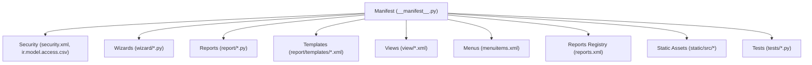
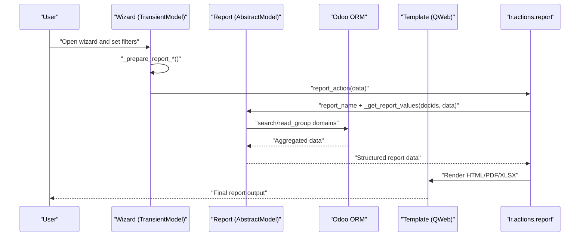
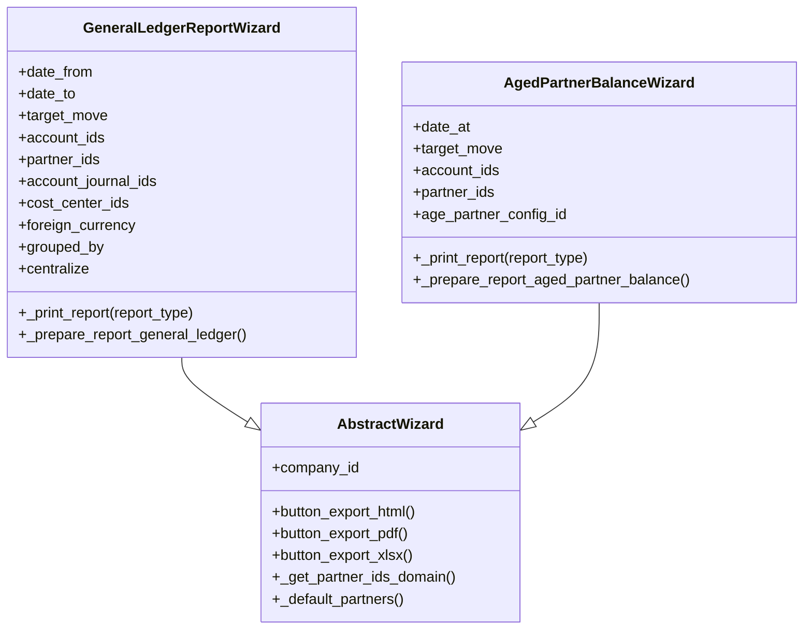
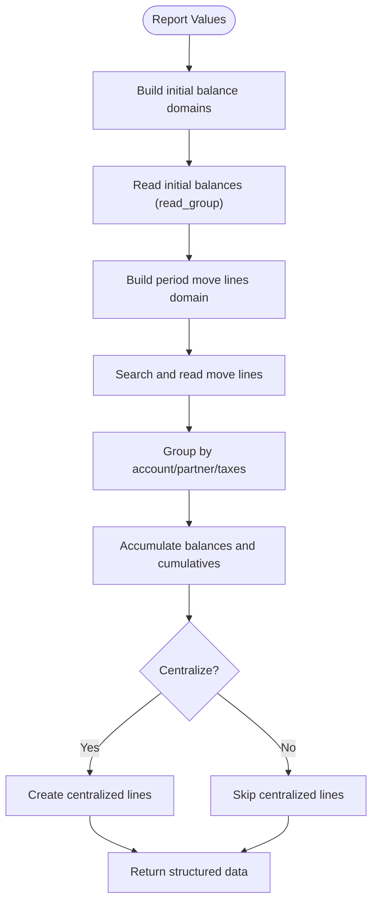
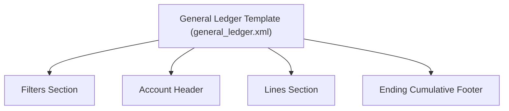
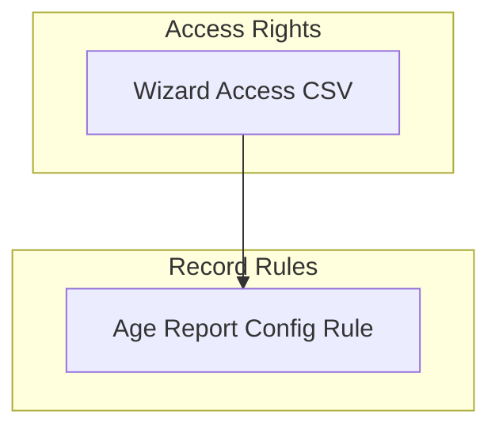
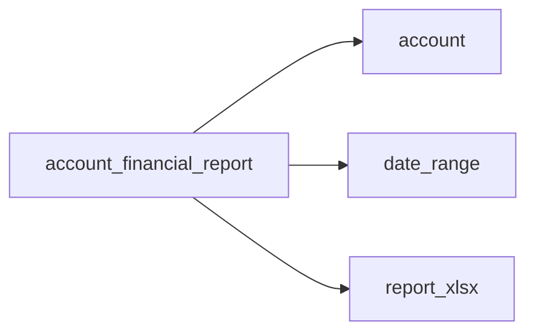

# Deployment and Maintenance

<cite>
**Referenced Files in This Document**
- [__manifest__.py](file://__manifest__.py)
- [README.rst](file://README.rst)
- [readme/DESCRIPTION.md](file://readme/DESCRIPTION.md)
- [readme/CONFIGURE.md](file://readme/CONFIGURE.md)
- [pyproject.toml](file://pyproject.toml)
- [security/security.xml](file://security/security.xml)
- [security/ir.model.access.csv](file://security/ir.model.access.csv)
- [models/account_age_report_configuration.py](file://models/account_age_report_configuration.py)
- [models/account.py](file://models/account.py)
- [models/account_move_line.py](file://models/account_move_line.py)
- [models/ir_actions_report.py](file://models/ir_actions_report.py)
- [models/res_config_settings.py](file://models/res_config_settings.py)
- [wizard/abstract_wizard.py](file://wizard/abstract_wizard.py)
- [wizard/general_ledger_wizard.py](file://wizard/general_ledger_wizard.py)
- [wizard/aged_partner_balance_wizard.py](file://wizard/aged_partner_balance_wizard.py)
- [report/abstract_report.py](file://report/abstract_report.py)
- [report/general_ledger.py](file://report/general_ledger.py)
- [report/templates/general_ledger.xml](file://report/templates/general_ledger.xml)
- [reports.xml](file://reports.xml)
- [menuitems.xml](file://menuitems.xml)
- [static/src/js/report.esm.js](file://static/src/js/report.esm.js)
- [static/src/js/report_action.esm.js](file://static/src/js/report_action.esm.js)
- [static/src/xml/report.xml](file://static/src/xml/report.xml)
- [tests/test_general_ledger.py](file://tests/test_general_ledger.py)
- [tests/test_aged_partner_balance.py](file://tests/test_aged_partner_balance.py)
</cite>

## Table of Contents
1. [Introduction](#introduction)
2. [Project Structure](#project-structure)
3. [Core Components](#core-components)
4. [Architecture Overview](#architecture-overview)
5. [Detailed Component Analysis](#detailed-component-analysis)
6. [Dependency Analysis](#dependency-analysis)
7. [Performance Considerations](#performance-considerations)
8. [Troubleshooting Guide](#troubleshooting-guide)
9. [Conclusion](#conclusion)
10. [Appendices](#appendices)

## Introduction
This document provides comprehensive deployment and maintenance guidance for the Account Financial Reports module. It covers production deployment procedures, Odoo server configuration, module installation, environment-specific settings, maintenance tasks (updates, performance monitoring, backups), upgrade procedures, dependency management, compatibility considerations, monitoring/logging strategies, security and access control, audit trail requirements, and scaling guidance for high-volume reporting environments.

## Project Structure
The module follows Odoo’s standard addon structure with clear separation of concerns:
- Manifest defines metadata, dependencies, views, reports, assets, and installability.
- Security files define access control and record rules.
- Wizards encapsulate user input and report preparation.
- Reports implement data retrieval and aggregation logic.
- Templates render HTML/PDF/XLSX outputs.
- Tests validate core report logic.
- Static assets provide frontend enhancements.
- XML files register menus, reports, and views.

**Diagram sources**
- [__manifest__.py:1-58](file://__manifest__.py#L1-L58)
- [security/security.xml:1-9](file://security/security.xml#L1-L9)
- [security/ir.model.access.csv:1-10](file://security/ir.model.access.csv#L1-L10)
- [wizard/general_ledger_wizard.py:1-322](file://wizard/general_ledger_wizard.py#L1-L322)
- [report/general_ledger.py:1-931](file://report/general_ledger.py#L1-L931)
- [report/templates/general_ledger.xml:1-789](file://report/templates/general_ledger.xml#L1-L789)
- [menuitems.xml](file://menuitems.xml)
- [reports.xml](file://reports.xml)
- [static/src/js/report.esm.js](file://static/src/js/report.esm.js)
- [tests/test_general_ledger.py](file://tests/test_general_ledger.py)

**Section sources**
- [__manifest__.py:1-58](file://__manifest__.py#L1-L58)
- [README.rst:35-44](file://README.rst#L35-L44)

## Core Components
- Manifest and build: Declares dependencies, data, assets, and installability; build backend configuration.
- Security: Access rights and record rules for wizards and configurations.
- Wizards: User input forms for report parameters and export actions.
- Reports: Backend logic to fetch and aggregate data, prepare totals, and group results.
- Templates: QWeb templates rendering HTML/PDF/XLSX outputs.
- Static assets: Frontend scripts and XML assets for UI enhancements.
- Tests: Unit tests validating report behavior.

Key responsibilities:
- Manifest: Module metadata, dependencies, data files, assets, license, and installability.
- Security: Enforce access control and multicompany isolation via record rules.
- Wizards: Prepare wizard data and dispatch to appropriate report action.
- Reports: Build domains, read groups, and structured data for templates.
- Templates: Render final outputs with filters, totals, and grouped rows.
- Assets: Extend web client behavior for report actions.

**Section sources**
- [__manifest__.py:7-57](file://__manifest__.py#L7-L57)
- [pyproject.toml:1-4](file://pyproject.toml#L1-L4)
- [security/security.xml:3-8](file://security/security.xml#L3-L8)
- [security/ir.model.access.csv:1-10](file://security/ir.model.access.csv#L1-L10)
- [wizard/abstract_wizard.py:7-52](file://wizard/abstract_wizard.py#L7-L52)
- [report/abstract_report.py:7-165](file://report/abstract_report.py#L7-L165)
- [report/general_ledger.py:14-931](file://report/general_ledger.py#L14-L931)
- [report/templates/general_ledger.xml:1-789](file://report/templates/general_ledger.xml#L1-L789)

## Architecture Overview
End-to-end flow from user input to rendered report:

**Diagram sources**
- [wizard/general_ledger_wizard.py:274-315](file://wizard/general_ledger_wizard.py#L274-L315)
- [report/general_ledger.py:763-931](file://report/general_ledger.py#L763-L931)
- [report/templates/general_ledger.xml:1-789](file://report/templates/general_ledger.xml#L1-L789)
- [models/ir_actions_report.py](file://models/ir_actions_report.py)

## Detailed Component Analysis

### Wizard Layer
- Abstract wizard provides shared behavior for partner filtering, company scoping, and export actions.
- General ledger wizard supports date ranges, journals, partners, cost centers, grouping, and centralization.
- Aged partner balance wizard supports interval configuration and target moves.

**Diagram sources**
- [wizard/abstract_wizard.py:7-52](file://wizard/abstract_wizard.py#L7-L52)
- [wizard/general_ledger_wizard.py:18-322](file://wizard/general_ledger_wizard.py#L18-L322)
- [wizard/aged_partner_balance_wizard.py:9-154](file://wizard/aged_partner_balance_wizard.py#L9-L154)

**Section sources**
- [wizard/abstract_wizard.py:7-52](file://wizard/abstract_wizard.py#L7-L52)
- [wizard/general_ledger_wizard.py:18-322](file://wizard/general_ledger_wizard.py#L18-L322)
- [wizard/aged_partner_balance_wizard.py:9-154](file://wizard/aged_partner_balance_wizard.py#L9-L154)

### Report Layer
- Abstract report defines common move line fields, domains, and helpers for residual amounts and currency handling.
- General ledger report builds initial balances, period move lines, grouped items, and centralized entries.

**Diagram sources**
- [report/abstract_report.py:21-165](file://report/abstract_report.py#L21-L165)
- [report/general_ledger.py:108-800](file://report/general_ledger.py#L108-L800)

**Section sources**
- [report/abstract_report.py:7-165](file://report/abstract_report.py#L7-L165)
- [report/general_ledger.py:14-931](file://report/general_ledger.py#L14-L931)

### Template Rendering
- QWeb templates render filters, headers, grouped lists, and totals.
- Templates bind to report data and expose interactive links to related records.

**Diagram sources**
- [report/templates/general_ledger.xml:3-134](file://report/templates/general_ledger.xml#L3-L134)
- [report/templates/general_ledger.xml:135-789](file://report/templates/general_ledger.xml#L135-L789)

**Section sources**
- [report/templates/general_ledger.xml:1-789](file://report/templates/general_ledger.xml#L1-L789)

### Security and Access Control
- Access rights grant base group_user read/write/create/unlink permissions for all report wizards and configuration records.
- Record rules restrict age report configuration visibility to the current company and global records.

**Diagram sources**
- [security/ir.model.access.csv:1-10](file://security/ir.model.access.csv#L1-L10)
- [security/security.xml:3-8](file://security/security.xml#L3-L8)

**Section sources**
- [security/ir.model.access.csv:1-10](file://security/ir.model.access.csv#L1-L10)
- [security/security.xml:3-8](file://security/security.xml#L3-L8)

### Configuration and Environment-Specific Settings
- Dynamic intervals for Aged Partner Balance are configured under invoicing settings.
- Foreign currency display is controlled by user group membership and wizard options.

**Section sources**
- [readme/CONFIGURE.md:1-27](file://readme/CONFIGURE.md#L1-L27)
- [readme/DESCRIPTION.md:19-22](file://readme/DESCRIPTION.md#L19-L22)
- [wizard/general_ledger_wizard.py:63-69](file://wizard/general_ledger_wizard.py#L63-L69)

## Dependency Analysis
Module dependencies declared in manifest:
- account: Core accounting models and move lines.
- date_range: Optional date range support in wizards.
- report_xlsx: XLSX export capability.

**Diagram sources**
- [__manifest__.py:18](file://__manifest__.py#L18)

**Section sources**
- [__manifest__.py:18](file://__manifest__.py#L18)

## Performance Considerations
- Use read_group aggregations to minimize memory footprint for initial balances.
- Apply precise domains to limit dataset size (company, accounts, partners, journals, dates).
- Prefer grouped_by options judiciously; grouping increases computation and memory.
- Centralization reduces row counts but adds extra processing; enable only when needed.
- Foreign currency computations add sum operations; disable if not required.
- Avoid “All Entries” mode when possible; draft entries increase joins and filtering complexity.
- Indexes on account.move.line (date, account_id, partner_id, journal_id, company_id) improve query performance.

[No sources needed since this section provides general guidance]

## Troubleshooting Guide
Common issues and resolutions:
- VAT Report constraints: Tax “Account tags” in invoice/credit note repartitions must be distinct for accurate reporting.
- Aged Partner Balance intervals: Ensure configuration lines have strictly positive inferior limits and unique names per config.
- Multicompany behavior: Verify company scoping in wizards and record rules.
- Export failures: Confirm report action registration and template availability.

Operational checks:
- Validate wizard domains and defaults for company/partner filtering.
- Inspect report domains and grouping logic for correctness.
- Review logs for ORM exceptions during read_group/search_read operations.

**Section sources**
- [README.rst:97-103](file://README.rst#L97-L103)
- [models/account_age_report_configuration.py:20-49](file://models/account_age_report_configuration.py#L20-L49)
- [wizard/general_ledger_wizard.py:218-232](file://wizard/general_ledger_wizard.py#L218-L232)

## Conclusion
The Account Financial Reports module is a robust, extensible reporting suite built on Odoo’s standard patterns. By following the deployment and maintenance practices outlined here—careful environment configuration, strict access control, disciplined upgrades, and performance-aware usage—you can operate reliable, secure, and scalable financial reporting in production.

[No sources needed since this section summarizes without analyzing specific files]

## Appendices

### A. Deployment Procedures (Production)
- Prerequisites
  - Odoo server with PostgreSQL database.
  - Required addons installed: account, date_range, report_xlsx.
- Install the module
  - Place the module folder under Odoo’s addons path.
  - Restart Odoo and update apps list; install the module.
- Post-installation
  - Configure Aged Partner Balance intervals under invoicing settings.
  - Assign appropriate groups for access to report wizards.
  - Verify report actions and templates are registered.

**Section sources**
- [__manifest__.py:18](file://__manifest__.py#L18)
- [readme/CONFIGURE.md:1-27](file://readme/CONFIGURE.md#L1-L27)
- [security/ir.model.access.csv:1-10](file://security/ir.model.access.csv#L1-L10)

### B. Maintenance Tasks
- Regular updates
  - Keep Odoo and dependencies aligned with supported versions.
  - Monitor changelog and roadmap for breaking changes.
- Performance monitoring
  - Track long-running report queries and slow read_groups.
  - Observe CPU/memory usage during peak periods.
- Backups
  - Schedule regular database and filestore backups.
  - Test restore procedures periodically.

**Section sources**
- [README.rst:104-126](file://README.rst#L104-L126)
- [README.rst:127-136](file://README.rst#L127-L136)

### C. Upgrade Procedures
- Compatibility matrix
  - Align module version with Odoo version (as indicated by manifest).
- Pre-upgrade steps
  - Backup database and filestore.
  - Review dependency changes and deprecations.
- Upgrade steps
  - Update module via Odoo interface or CLI.
  - Run migrations and recompile assets if needed.
- Post-upgrade verification
  - Validate report outputs and wizard behavior.
  - Confirm access rights and record rules remain effective.

**Section sources**
- [__manifest__.py:9](file://__manifest__.py#L9)
- [README.rst:198-200](file://README.rst#L198-L200)

### D. Monitoring and Logging Strategies
- Report generation activity
  - Enable Odoo logging for report actions and template rendering.
  - Track slow queries and repeated read_groups.
- Error tracking
  - Capture ORM exceptions and validation errors.
  - Monitor wizard constraint violations and domain mismatches.
- Performance optimization
  - Tune database indexes and query plans.
  - Reduce report scope (smaller date ranges, fewer accounts/partners).

**Section sources**
- [report/general_ledger.py:108-800](file://report/general_ledger.py#L108-L800)
- [wizard/general_ledger_wizard.py:218-232](file://wizard/general_ledger_wizard.py#L218-L232)

### E. Security and Audit Trail
- Access control
  - Restrict report wizards to authorized users via access rights.
  - Enforce record rules for age report configuration per company.
- Financial data handling
  - Limit exposure of sensitive financial data to authorized roles.
  - Use company scoping and multicompany-aware domains.
- Audit trail
  - Maintain logs of report generation requests and exports.
  - Track configuration changes for aging intervals.

**Section sources**
- [security/ir.model.access.csv:1-10](file://security/ir.model.access.csv#L1-L10)
- [security/security.xml:3-8](file://security/security.xml#L3-L8)
- [models/account_age_report_configuration.py:12-18](file://models/account_age_report_configuration.py#L12-L18)

### F. Scaling Considerations
- High-volume environments
  - Optimize database indexes and partition large datasets.
  - Use smaller date ranges and targeted filters.
  - Offload heavy reports to background jobs if feasible.
- Concurrency
  - Ensure database connection pooling and transaction isolation.
  - Avoid concurrent writes while generating large reports.

**Section sources**
- [report/general_ledger.py:108-800](file://report/general_ledger.py#L108-L800)
- [wizard/general_ledger_wizard.py:93-209](file://wizard/general_ledger_wizard.py#L93-L209)

### G. Testing Guidance
- Unit tests
  - Validate general ledger and aged partner balance report outputs.
  - Assert grouping, totals, and foreign currency behavior.
- Regression checks
  - After upgrades, rerun tests covering report domains and templates.

**Section sources**
- [tests/test_general_ledger.py](file://tests/test_general_ledger.py)
- [tests/test_aged_partner_balance.py](file://tests/test_aged_partner_balance.py)