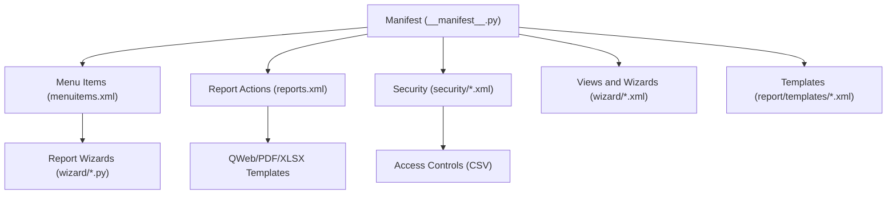
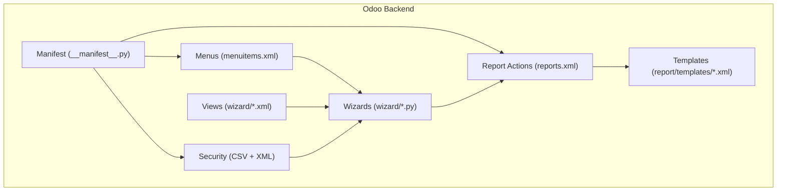
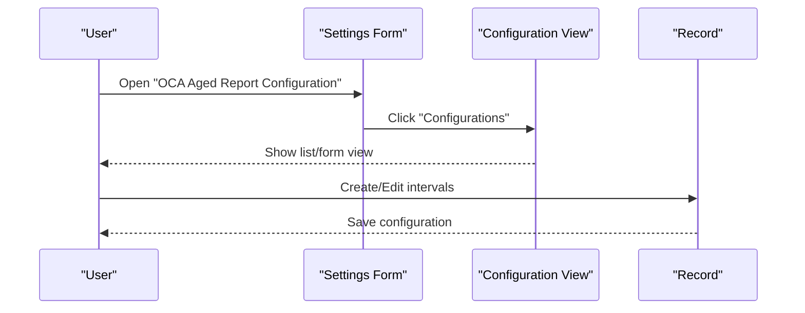
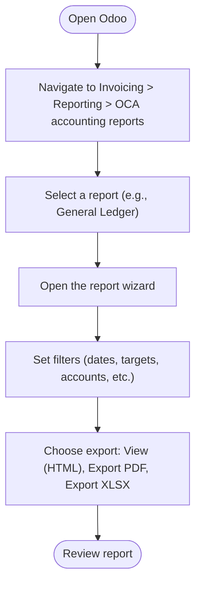
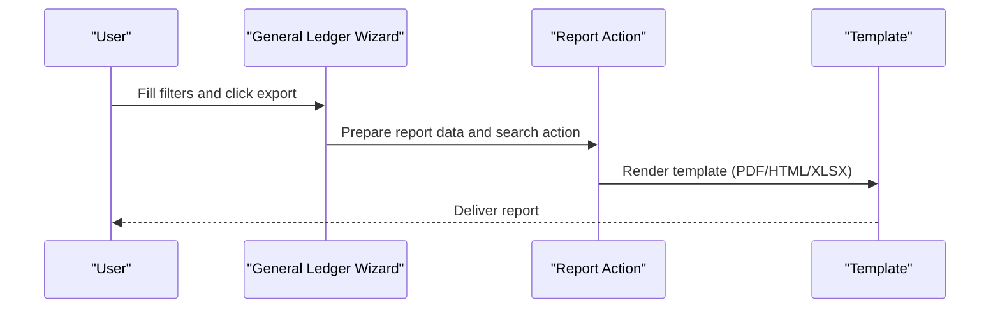
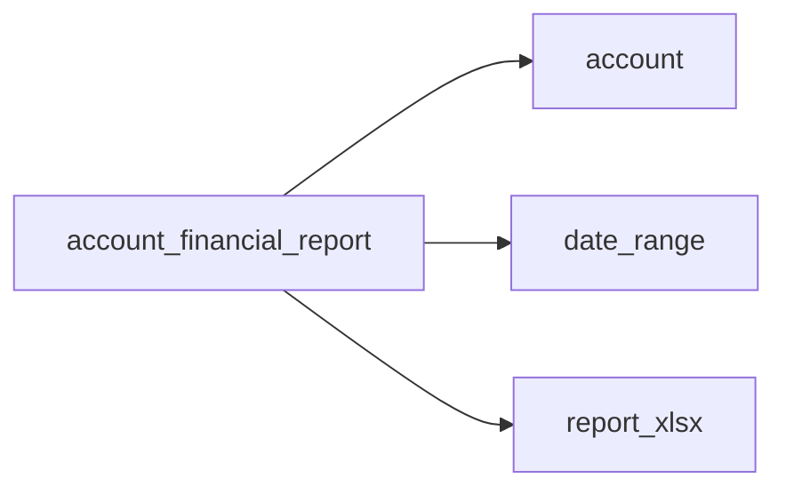

# Getting Started

<cite>
**Referenced Files in This Document**
- [__manifest__.py](file://__manifest__.py)
- [README.rst](file://README.rst)
- [menuitems.xml](file://menuitems.xml)
- [reports.xml](file://reports.xml)
- [security/security.xml](file://security/security.xml)
- [security/ir.model.access.csv](file://security/ir.model.access.csv)
- [view/res_config_settings_views.xml](file://view/res_config_settings_views.xml)
- [view/account_age_report_configuration_views.xml](file://view/account_age_report_configuration_views.xml)
- [wizard/aged_partner_balance_wizard_view.xml](file://wizard/aged_partner_balance_wizard_view.xml)
- [wizard/general_ledger_wizard.py](file://wizard/general_ledger_wizard.py)
- [wizard/trial_balance_wizard.py](file://wizard/trial_balance_wizard.py)
- [report/templates/layouts.xml](file://report/templates/layouts.xml)
- [__init__.py](file://__init__.py)
- [models/__init__.py](file://models/__init__.py)
- [wizard/__init__.py](file://wizard/__init__.py)
</cite>

## Table of Contents
1. [Introduction](#introduction)
2. [Project Structure](#project-structure)
3. [Core Components](#core-components)
4. [Architecture Overview](#architecture-overview)
5. [Detailed Component Analysis](#detailed-component-analysis)
6. [Dependency Analysis](#dependency-analysis)
7. [Performance Considerations](#performance-considerations)
8. [Troubleshooting Guide](#troubleshooting-guide)
9. [Conclusion](#conclusion)
10. [Appendices](#appendices)

## Introduction
This guide helps you install and get started with the Account Financial Reports module in Odoo. It covers prerequisites, installation, activation, configuration, and how to generate your first financial report. You will also find troubleshooting tips and verification steps to ensure everything is working correctly.

## Project Structure
The module extends Odoo’s accounting reporting capabilities with wizards, QWeb/PDF/XLSX reports, views, and security rules. Key areas include:
- Manifest and data declarations for dependencies and views
- Menu items under the Invoicing / Reporting section
- Report actions and templates for HTML/PDF/XLSX outputs
- Wizards for each report type with filters and export options
- Security rules and access controls
- Configuration views for Aged Partner Balance intervals

**Diagram sources**
- [__manifest__.py:1-58](file://__manifest__.py#L1-L58)
- [menuitems.xml:1-46](file://menuitems.xml#L1-L46)
- [reports.xml:1-174](file://reports.xml#L1-L174)
- [security/security.xml:1-9](file://security/security.xml#L1-L9)
- [security/ir.model.access.csv:1-10](file://security/ir.model.access.csv#L1-L10)
- [wizard/aged_partner_balance_wizard_view.xml:1-96](file://wizard/aged_partner_balance_wizard_view.xml#L1-L96)
- [report/templates/layouts.xml:1-44](file://report/templates/layouts.xml#L1-L44)

**Section sources**
- [__manifest__.py:1-58](file://__manifest__.py#L1-L58)
- [menuitems.xml:1-46](file://menuitems.xml#L1-L46)
- [reports.xml:1-174](file://reports.xml#L1-L174)
- [security/security.xml:1-9](file://security/security.xml#L1-L9)
- [security/ir.model.access.csv:1-10](file://security/ir.model.access.csv#L1-L10)
- [wizard/aged_partner_balance_wizard_view.xml:1-96](file://wizard/aged_partner_balance_wizard_view.xml#L1-L96)
- [report/templates/layouts.xml:1-44](file://report/templates/layouts.xml#L1-L44)

## Core Components
- Dependencies: The module depends on core Odoo modules and external libraries declared in the manifest.
- Menus: Adds a dedicated “OCA accounting reports” group under Invoicing / Reporting with actions for each report.
- Report Actions: Defines QWeb PDF/HTML and XLSX actions per report.
- Wizards: Per-report wizards with filters (dates, targets, accounts, partners, journals, analytic, foreign currency).
- Security: Access rights and record rules for report configurations.
- Configuration: Settings view to define default Aged Partner Balance intervals.

Key responsibilities:
- Activation via Odoo Apps or manual installation
- Basic configuration of Aged Partner Balance intervals
- Generating reports through wizards and exporting to PDF/XLSX/HTML

**Section sources**
- [__manifest__.py:18-46](file://__manifest__.py#L18-L46)
- [README.rst:35-48](file://README.rst#L35-L48)
- [menuitems.xml:3-44](file://menuitems.xml#L3-L44)
- [reports.xml:20-172](file://reports.xml#L20-L172)
- [security/ir.model.access.csv:1-10](file://security/ir.model.access.csv#L1-L10)
- [view/res_config_settings_views.xml:8-48](file://view/res_config_settings_views.xml#L8-L48)

## Architecture Overview
The module follows Odoo’s standard pattern:
- Manifest declares dependencies, views, assets, and report actions.
- Menu items route to report wizards.
- Wizards collect parameters and trigger report generation.
- Report actions render QWeb templates and produce PDF/XLSX/HTML outputs.
- Security ensures controlled access to report configurations and wizards.

**Diagram sources**
- [__manifest__.py:18-56](file://__manifest__.py#L18-L56)
- [menuitems.xml:3-44](file://menuitems.xml#L3-L44)
- [reports.xml:20-172](file://reports.xml#L20-L172)
- [security/security.xml:3-8](file://security/security.xml#L3-L8)
- [security/ir.model.access.csv:2-9](file://security/ir.model.access.csv#L2-L9)
- [wizard/general_ledger_wizard.py:18-322](file://wizard/general_ledger_wizard.py#L18-L322)
- [wizard/trial_balance_wizard.py:12-285](file://wizard/trial_balance_wizard.py#L12-L285)
- [report/templates/layouts.xml:3-42](file://report/templates/layouts.xml#L3-L42)

## Detailed Component Analysis

### Installation and Activation
- Prerequisites:
  - Odoo version compatible with the module version indicated in the manifest.
  - Required core modules: account, date_range, report_xlsx.
- Installation methods:
  - Odoo Apps: Search for the module and install.
  - Manual installation: Place the module folder in your Odoo addons path and update the module list.
- Activate the module:
  - Go to Apps > Update Apps List, search for the module, and click Install.

Verification:
- Confirm the module appears in Installed Apps.
- Check that the “OCA accounting reports” menu item is visible under Invoicing / Reporting.

**Section sources**
- [__manifest__.py:8-18](file://__manifest__.py#L8-L18)
- [README.rst:35-36](file://README.rst#L35-L36)

### Initial Setup and Configuration
- Aged Partner Balance Intervals:
  - Navigate to Settings > Invoicing > OCA Aged Report Configuration.
  - Set a default configuration per company if desired.
  - Manage interval configurations via the “Configurations” action.
- Access to configuration:
  - The settings block integrates into the Accounting settings form.
  - The configuration model supports list and form views.

**Diagram sources**
- [view/res_config_settings_views.xml:8-48](file://view/res_config_settings_views.xml#L8-L48)
- [view/account_age_report_configuration_views.xml:36-41](file://view/account_age_report_configuration_views.xml#L36-L41)

**Section sources**
- [README.rst:62-93](file://README.rst#L62-L93)
- [view/res_config_settings_views.xml:8-48](file://view/res_config_settings_views.xml#L8-L48)
- [view/account_age_report_configuration_views.xml:36-41](file://view/account_age_report_configuration_views.xml#L36-L41)

### Accessing the Financial Reporting Interface
- Main menu location:
  - Invoicing > Reporting > OCA accounting reports.
- Available reports:
  - General Ledger, Journal Ledger, Trial Balance, Open Items, Aged Partner Balance, VAT Report.
- Access via menu items:
  - Each report has a dedicated menu item with an action pointing to its wizard.

**Diagram sources**
- [menuitems.xml:3-44](file://menuitems.xml#L3-L44)
- [wizard/aged_partner_balance_wizard_view.xml:65-84](file://wizard/aged_partner_balance_wizard_view.xml#L65-L84)

**Section sources**
- [README.rst:35-43](file://README.rst#L35-L43)
- [menuitems.xml:3-44](file://menuitems.xml#L3-L44)
- [wizard/aged_partner_balance_wizard_view.xml:65-84](file://wizard/aged_partner_balance_wizard_view.xml#L65-L84)

### Generating Your First Report
- General Ledger example:
  - Open the General Ledger wizard.
  - Select company, date range, target moves (posted/all), and optional filters (accounts, partners, journals, analytic, foreign currency).
  - Choose export type: View (HTML), Export PDF, or Export XLSX.
  - The wizard prepares the report data and triggers the appropriate report action.

**Diagram sources**
- [wizard/general_ledger_wizard.py:274-322](file://wizard/general_ledger_wizard.py#L274-L322)
- [reports.xml:22-36](file://reports.xml#L22-L36)
- [report/templates/layouts.xml:3-42](file://report/templates/layouts.xml#L3-L42)

**Section sources**
- [wizard/general_ledger_wizard.py:274-322](file://wizard/general_ledger_wizard.py#L274-L322)
- [reports.xml:22-36](file://reports.xml#L22-L36)
- [report/templates/layouts.xml:3-42](file://report/templates/layouts.xml#L3-L42)

### Security and Access Controls
- Access rights:
  - CSV grants base.group_user read/write/create/delete permissions for all report wizards and configuration records.
- Record rules:
  - A rule restricts configuration records to the current company or False (global).
- Implication:
  - Users need appropriate accounting permissions to access reports and configuration.

**Section sources**
- [security/ir.model.access.csv:2-9](file://security/ir.model.access.csv#L2-L9)
- [security/security.xml:3-8](file://security/security.xml#L3-L8)

### Report Templates and Assets
- Layouts:
  - Shared HTML layout and internal layout templates integrate assets and page numbering.
- Assets:
  - JavaScript and XML assets loaded for backend report actions.
- Paper format:
  - Standard paper format defined for PDF reports.

**Section sources**
- [report/templates/layouts.xml:3-42](file://report/templates/layouts.xml#L3-L42)
- [__manifest__.py:47-52](file://__manifest__.py#L47-L52)
- [reports.xml:4-18](file://reports.xml#L4-L18)

## Dependency Analysis
The module relies on:
- account: Core accounting data and journals.
- date_range: Date range filtering for wizards.
- report_xlsx: XLSX export capability.

**Diagram sources**
- [__manifest__.py:18](file://__manifest__.py#L18)

**Section sources**
- [__manifest__.py:18](file://__manifest__.py#L18)

## Performance Considerations
- Use appropriate filters (accounts, partners, journals, analytic) to reduce dataset size.
- Prefer “Posted” target moves when not requiring unposted entries.
- Limit hierarchy levels in Trial Balance when dealing with large account groups.
- Enable foreign currency only when needed to avoid extra computations.

[No sources needed since this section provides general guidance]

## Troubleshooting Guide
- Module does not appear in Apps:
  - Verify the module folder is placed in the correct Odoo addons path.
  - Update the Apps list and search again.
- Missing dependencies:
  - Ensure the required modules (account, date_range, report_xlsx) are installed and up-to-date.
- Reports not generating:
  - Confirm report actions exist and templates are present.
  - Check that the wizard has valid filters and company context.
- Access denied:
  - Ensure the user belongs to the correct groups and has access to report wizards and configuration records.
- Aged Partner Balance intervals not applied:
  - Verify default configuration is set per company and intervals are defined in the configuration view.

**Section sources**
- [__manifest__.py:18](file://__manifest__.py#L18)
- [reports.xml:20-172](file://reports.xml#L20-L172)
- [security/ir.model.access.csv:2-9](file://security/ir.model.access.csv#L2-L9)
- [view/res_config_settings_views.xml:8-48](file://view/res_config_settings_views.xml#L8-L48)

## Conclusion
You are now ready to install the Account Financial Reports module, configure Aged Partner Balance intervals, and generate financial reports. Use the wizards to set filters and export formats, and rely on the security and access controls to manage permissions. If issues arise, consult the troubleshooting section and verify dependencies and report actions.

[No sources needed since this section summarizes without analyzing specific files]

## Appendices

### Quick Reference: First-Time User Steps
- Install the module via Apps or manually.
- Configure Aged Partner Balance intervals in Settings > Invoicing > OCA Aged Report Configuration.
- Navigate to Invoicing > Reporting > OCA accounting reports.
- Open a report wizard, set filters, and choose export type.
- Review the generated report (HTML/PDF/XLSX).

**Section sources**
- [README.rst:62-93](file://README.rst#L62-L93)
- [menuitems.xml:3-44](file://menuitems.xml#L3-L44)
- [wizard/aged_partner_balance_wizard_view.xml:65-84](file://wizard/aged_partner_balance_wizard_view.xml#L65-L84)