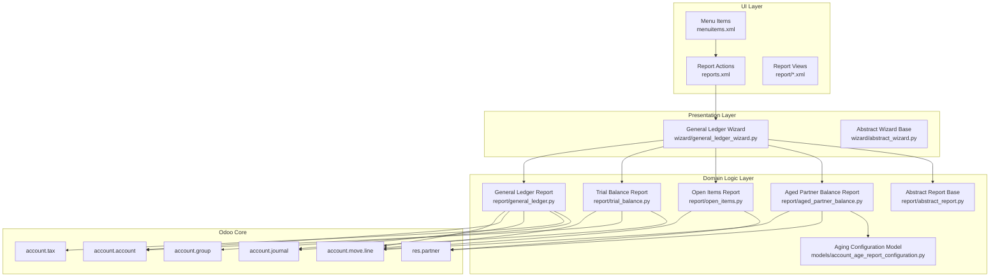
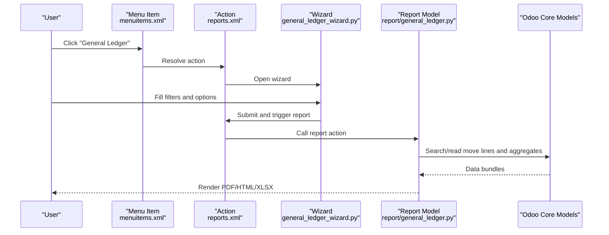
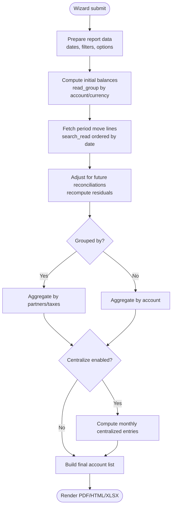
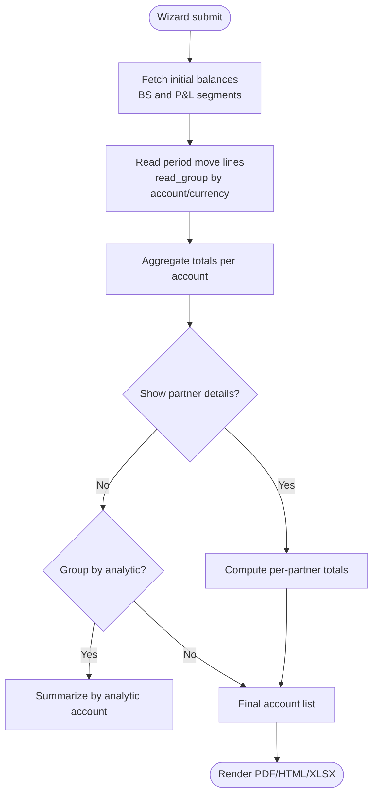
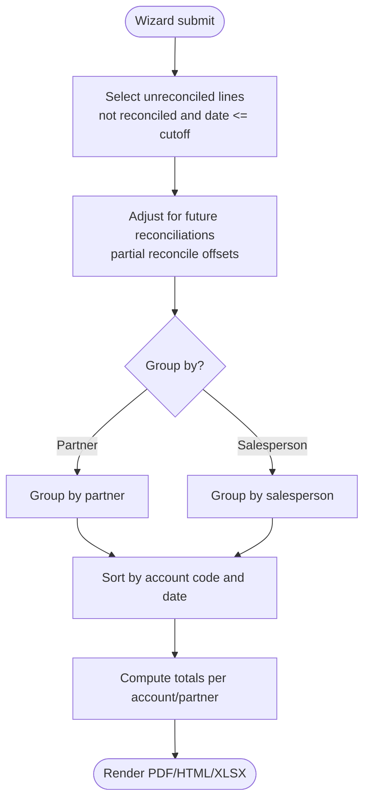
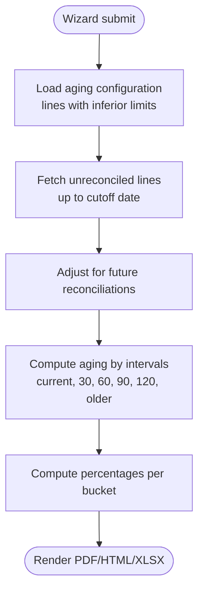
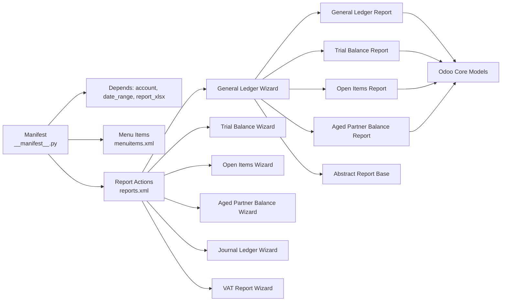

# Project Overview

<cite>
**Referenced Files in This Document**
- [__manifest__.py](file://__manifest__.py)
- [README.rst](file://README.rst)
- [DESCRIPTION.md](file://readme/DESCRIPTION.md)
- [models/__init__.py](file://models/__init__.py)
- [report/__init__.py](file://report/__init__.py)
- [wizard/__init__.py](file://wizard/__init__.py)
- [models/account_age_report_configuration.py](file://models/account_age_report_configuration.py)
- [report/abstract_report.py](file://report/abstract_report.py)
- [report/general_ledger.py](file://report/general_ledger.py)
- [report/trial_balance.py](file://report/trial_balance.py)
- [report/open_items.py](file://report/open_items.py)
- [report/aged_partner_balance.py](file://report/aged_partner_balance.py)
- [wizard/abstract_wizard.py](file://wizard/abstract_wizard.py)
- [wizard/general_ledger_wizard.py](file://wizard/general_ledger_wizard.py)
- [menuitems.xml](file://menuitems.xml)
- [reports.xml](file://reports.xml)
</cite>

## Table of Contents
1. [Introduction](#introduction)
2. [Project Structure](#project-structure)
3. [Core Components](#core-components)
4. [Architecture Overview](#architecture-overview)
5. [Detailed Component Analysis](#detailed-component-analysis)
6. [Dependency Analysis](#dependency-analysis)
7. [Performance Considerations](#performance-considerations)
8. [Troubleshooting Guide](#troubleshooting-guide)
9. [Conclusion](#conclusion)

## Introduction
Account Financial Reports is an Odoo ERP extension that delivers enterprise-grade financial reporting capabilities beyond Odoo’s standard offerings. It provides six core financial reports: General Ledger, Trial Balance, Open Items, Aged Partner Balance, VAT Report, and Journal Ledger. These reports are designed for deep financial analysis, compliance-ready outputs, and multi-currency support. The module integrates tightly with Odoo’s accounting core, leveraging account move lines, journals, partners, taxes, and analytic distributions to produce accurate, configurable, and exportable reports in PDF, HTML, and Excel (XLSX).

Key benefits include:
- Enhanced financial visibility with detailed line items and cumulative balances
- Flexible filters for dates, companies, journals, partners, accounts, analytic accounts, and custom domains
- Multi-currency support for foreign currency accounts and balances
- Configurable aging intervals for Aged Partner Balance via dedicated configuration records
- Export formats suitable for internal review and external audit submissions

## Project Structure
The module follows a layered Odoo architecture:
- Manifest and metadata define dependencies and views/actions
- Wizards collect user inputs and prepare report data
- Report models compute and aggregate data from Odoo’s core accounting tables
- XML templates render PDF/HTML/XLSX outputs
- Views and menus expose report wizards and actions under the Invoicing Reporting section

**Diagram sources**
- [menuitems.xml:1-46](file://menuitems.xml#L1-L46)
- [reports.xml:1-174](file://reports.xml#L1-L174)
- [wizard/general_ledger_wizard.py:1-322](file://wizard/general_ledger_wizard.py#L1-L322)
- [wizard/abstract_wizard.py:1-52](file://wizard/abstract_wizard.py#L1-L52)
- [report/general_ledger.py:1-931](file://report/general_ledger.py#L1-L931)
- [report/trial_balance.py:1-981](file://report/trial_balance.py#L1-L981)
- [report/open_items.py:1-310](file://report/open_items.py#L1-L310)
- [report/aged_partner_balance.py:1-473](file://report/aged_partner_balance.py#L1-L473)
- [report/abstract_report.py:1-165](file://report/abstract_report.py#L1-L165)
- [models/account_age_report_configuration.py:1-50](file://models/account_age_report_configuration.py#L1-L50)

**Section sources**
- [__manifest__.py:1-58](file://__manifest__.py#L1-L58)
- [README.rst:35-44](file://README.rst#L35-L44)
- [DESCRIPTION.md:1-22](file://readme/DESCRIPTION.md#L1-L22)
- [menuitems.xml:1-46](file://menuitems.xml#L1-L46)
- [reports.xml:1-174](file://reports.xml#L1-L174)

## Core Components
- Abstract Report Base: Provides shared helpers for move line queries, reconciliation adjustments, and common field sets across all reports.
- Report Implementations:
  - General Ledger: Supports grouping by partners/taxes, centralization, foreign currency, and filters for journals, analytic accounts, and custom domains.
  - Trial Balance: Computes initial and ending balances with optional grouping by analytic accounts and partner details.
  - Open Items: Lists unreconciled receivables/payables with maturity dates and aging buckets.
  - Aged Partner Balance: Computes receivables/payables aging using configurable intervals and displays percentages.
  - VAT Report: Generates VAT-related statements aligned with tax tags and repartition settings.
  - Journal Ledger: Summarizes postings by journal with optional filtering and grouping.
- Wizards:
  - Abstract Wizard: Shared logic for exporting to PDF/HTML/XLSX and default partner selection.
  - General Ledger Wizard: Comprehensive filters and options including date ranges, account ranges, receivable/payable toggles, centralization, and foreign currency.
- Aging Configuration Model: Defines dynamic aging intervals for Aged Partner Balance.

**Section sources**
- [report/abstract_report.py:1-165](file://report/abstract_report.py#L1-L165)
- [report/general_ledger.py:1-931](file://report/general_ledger.py#L1-L931)
- [report/trial_balance.py:1-981](file://report/trial_balance.py#L1-L981)
- [report/open_items.py:1-310](file://report/open_items.py#L1-L310)
- [report/aged_partner_balance.py:1-473](file://report/aged_partner_balance.py#L1-L473)
- [wizard/abstract_wizard.py:1-52](file://wizard/abstract_wizard.py#L1-L52)
- [wizard/general_ledger_wizard.py:1-322](file://wizard/general_ledger_wizard.py#L1-L322)
- [models/account_age_report_configuration.py:1-50](file://models/account_age_report_configuration.py#L1-L50)

## Architecture Overview
The module adheres to Odoo’s standard reporting pipeline:
- User triggers a report via a wizard action in the Invoicing → Reporting → OCA accounting reports menu.
- The wizard validates inputs and prepares a data payload.
- The report action resolves to either QWeb (PDF/HTML) or XLSX (Excel) generation.
- Report models fetch and aggregate data from Odoo’s core accounting tables using optimized read_group and search_read operations.
- Templates render the final output with consistent styling and pagination.

**Diagram sources**
- [menuitems.xml:1-46](file://menuitems.xml#L1-L46)
- [reports.xml:20-36](file://reports.xml#L20-L36)
- [wizard/general_ledger_wizard.py:274-322](file://wizard/general_ledger_wizard.py#L274-L322)
- [report/general_ledger.py:763-800](file://report/general_ledger.py#L763-L800)

## Detailed Component Analysis

### General Ledger Report
Purpose:
- Presents detailed transactional data per account with optional grouping by partners or taxes, cumulative balances, and centralization summaries.

Key features:
- Filters: date range, company, journals, partners, accounts, analytic accounts, custom domain
- Options: grouped_by (none/partners/taxes), centralize, hide accounts at 0, foreign currency, receivable/payable toggles
- Computation: initial balances, period transactions, reconciliation adjustments, cumulative balance recalculation, centralization entries

**Diagram sources**
- [wizard/general_ledger_wizard.py:290-311](file://wizard/general_ledger_wizard.py#L290-L311)
- [report/general_ledger.py:763-800](file://report/general_ledger.py#L763-L800)
- [report/general_ledger.py:446-558](file://report/general_ledger.py#L446-L558)

**Section sources**
- [report/general_ledger.py:1-931](file://report/general_ledger.py#L1-L931)
- [wizard/general_ledger_wizard.py:1-322](file://wizard/general_ledger_wizard.py#L1-L322)

### Trial Balance Report
Purpose:
- Produces a summary of account balances at a given moment, supporting optional grouping by analytic accounts and partner details.

Highlights:
- Initial and profit & loss initial balances
- Optional grouping by analytic accounts
- Hide accounts at 0 and foreign currency toggles
- Partner details for receivable/payable accounts

**Diagram sources**
- [report/trial_balance.py:406-622](file://report/trial_balance.py#L406-L622)
- [wizard/general_ledger_wizard.py:290-311](file://wizard/general_ledger_wizard.py#L290-L311)

**Section sources**
- [report/trial_balance.py:1-981](file://report/trial_balance.py#L1-L981)

### Open Items Report
Purpose:
- Lists unreconciled receivables/payables up to a specified date, grouped optionally by partner or salesperson, with maturity dates and residual amounts.

Highlights:
- Future reconciliations adjustment
- Grouping options and partner detail toggles
- Sorting by account code and date

**Diagram sources**
- [report/open_items.py:62-189](file://report/open_items.py#L62-L189)
- [report/open_items.py:208-243](file://report/open_items.py#L208-L243)

**Section sources**
- [report/open_items.py:1-310](file://report/open_items.py#L1-L310)

### Aged Partner Balance Report
Purpose:
- Displays receivables/payables aging using configurable intervals and computes percentages relative to total balances.

Highlights:
- Dynamic aging configuration via account.age.report.configuration
- Interval-based aging computation with configurable thresholds
- Optional move-line details per partner

**Diagram sources**
- [report/aged_partner_balance.py:411-465](file://report/aged_partner_balance.py#L411-L465)
- [models/account_age_report_configuration.py:1-50](file://models/account_age_report_configuration.py#L1-L50)

**Section sources**
- [report/aged_partner_balance.py:1-473](file://report/aged_partner_balance.py#L1-L473)
- [models/account_age_report_configuration.py:1-50](file://models/account_age_report_configuration.py#L1-L50)

### VAT Report
Purpose:
- Generates VAT statements aligned with tax tags and tax repartition settings.

Notes:
- Known limitation: requires distinct “Account tags” for invoice/credit note repartitions per tax to ensure correctness.

**Section sources**
- [README.rst:97-99](file://README.rst#L97-L99)

### Journal Ledger
Purpose:
- Summarizes postings by journal with optional filtering and grouping.

**Section sources**
- [README.rst:38-43](file://README.rst#L38-L43)
- [reports.xml:37-52](file://reports.xml#L37-L52)

## Dependency Analysis
Module dependencies and integration points:
- Core dependencies: account, date_range, report_xlsx
- Integrates with Odoo core models: account.move.line, account.account, account.journal, account.tax, res.partner, account.group, account.partial.reconcile
- Exposes actions and menus under Invoicing → Reporting → OCA accounting reports
- Provides both QWeb (PDF/HTML) and XLSX exports

**Diagram sources**
- [__manifest__.py:18-52](file://__manifest__.py#L18-L52)
- [menuitems.xml:1-46](file://menuitems.xml#L1-L46)
- [reports.xml:1-174](file://reports.xml#L1-L174)

**Section sources**
- [__manifest__.py:1-58](file://__manifest__.py#L1-L58)
- [menuitems.xml:1-46](file://menuitems.xml#L1-L46)
- [reports.xml:1-174](file://reports.xml#L1-L174)

## Performance Considerations
- Efficient aggregation: Reports extensively use read_group to compute sums and balances in a single pass, reducing Python-side loops.
- Selective fetching: search_read orders and limits fields to only those required for rendering.
- Centralization: Monthly centralized entries reduce row counts in final outputs.
- Foreign currency: Optional currency fields are included only when enabled, minimizing overhead.
- Reconciliation adjustments: Future reconciliations are computed once and reused to adjust residual amounts efficiently.

[No sources needed since this section provides general guidance]

## Troubleshooting Guide
Common issues and resolutions:
- VAT Report validity: Ensure each tax has distinct “Account tags” for invoice/credit note repartitions; otherwise, VAT Report results may be invalid.
- Aging configuration: Must define at least one configuration line; otherwise, validation errors occur.
- Target moves mismatch: When selecting “All Entries,” ensure the wizard’s target_move setting aligns with the desired state filtering.
- Multi-company behavior: Confirm wizard company matches date range company to avoid validation errors.
- Hide accounts at 0: When enabled, accounts with zero balances and no transactions may be excluded; verify rounding precision and filters.

**Section sources**
- [README.rst:97-103](file://README.rst#L97-L103)
- [models/account_age_report_configuration.py:20-25](file://models/account_age_report_configuration.py#L20-L25)
- [wizard/general_ledger_wizard.py:218-232](file://wizard/general_ledger_wizard.py#L218-L232)

## Conclusion
Account Financial Reports extends Odoo’s core accounting with robust, enterprise-grade financial reporting. Its six report modules—General Ledger, Trial Balance, Open Items, Aged Partner Balance, VAT Report, and Journal Ledger—cover essential financial analysis needs. The module’s wizard-driven UI, flexible filters, multi-currency support, and export formats make it suitable for accountants, finance professionals, and ERP administrators who require compliance-ready, customizable financial insights.