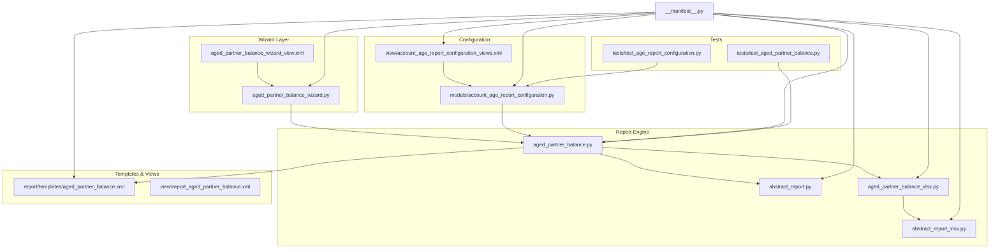
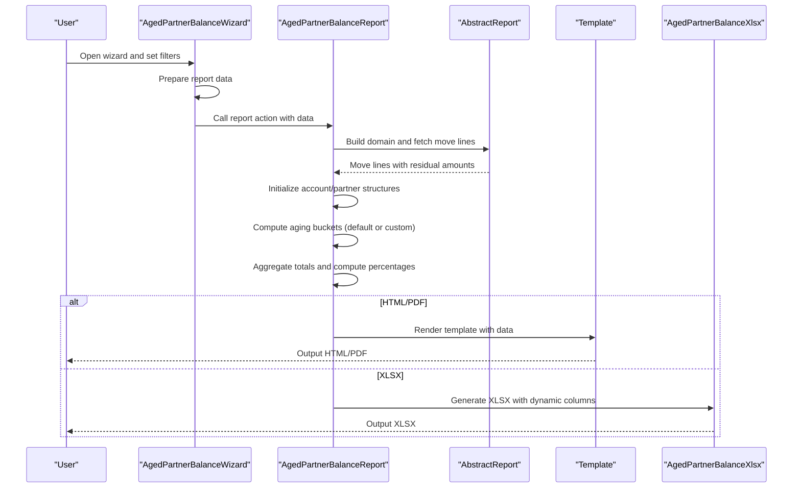
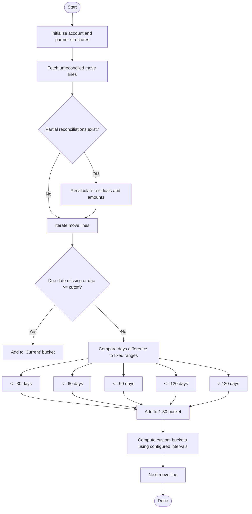
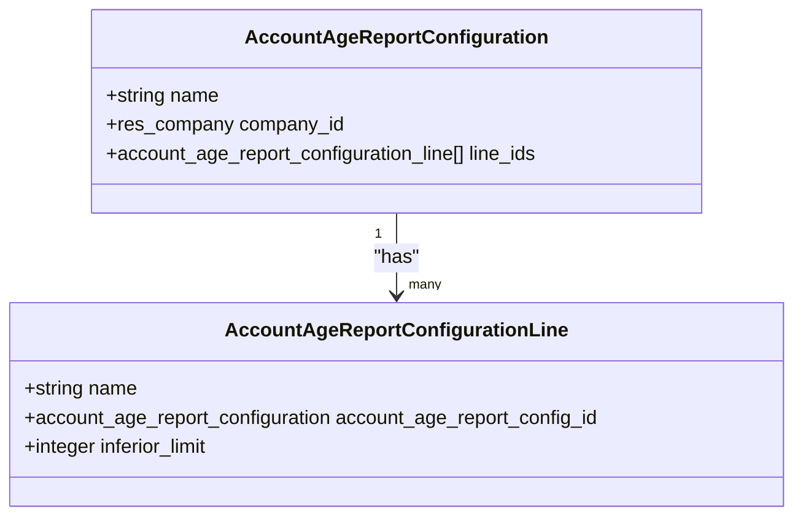
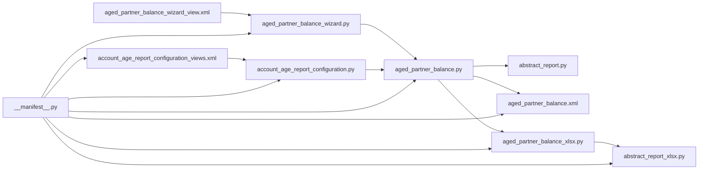

# Aged Partner Balance Report

<cite>
**Referenced Files in This Document**
- [aged_partner_balance.py](file://report/aged_partner_balance.py)
- [account_age_report_configuration.py](file://models/account_age_report_configuration.py)
- [aged_partner_balance_wizard.py](file://wizard/aged_partner_balance_wizard.py)
- [aged_partner_balance.xml](file://report/templates/aged_partner_balance.xml)
- [report_aged_partner_balance.xml](file://view/report_aged_partner_balance.xml)
- [aged_partner_balance_xlsx.py](file://report/aged_partner_balance_xlsx.py)
- [abstract_report.py](file://report/abstract_report.py)
- [abstract_report_xlsx.py](file://report/abstract_report_xlsx.py)
- [aged_partner_balance_wizard_view.xml](file://wizard/aged_partner_balance_wizard_view.xml)
- [account_age_report_configuration_views.xml](file://view/account_age_report_configuration_views.xml)
- [test_aged_partner_balance.py](file://tests/test_aged_partner_balance.py)
- [test_age_report_configuration.py](file://tests/test_age_report_configuration.py)
- [__manifest__.py](file://__manifest__.py)
</cite>

## Table of Contents
1. [Introduction](#introduction)
2. [Project Structure](#project-structure)
3. [Core Components](#core-components)
4. [Architecture Overview](#architecture-overview)
5. [Detailed Component Analysis](#detailed-component-analysis)
6. [Dependency Analysis](#dependency-analysis)
7. [Performance Considerations](#performance-considerations)
8. [Troubleshooting Guide](#troubleshooting-guide)
9. [Conclusion](#conclusion)
10. [Appendices](#appendices)

## Introduction
The Aged Partner Balance Report provides a detailed view of outstanding receivables and payables by aging periods. It categorizes open items into customizable aging buckets based on due dates and displays totals and percentages per account and partner. Users can configure aging intervals independently of the default fixed buckets, enabling flexible reporting tailored to business needs.

## Project Structure
The report is implemented as part of the Account Financial Reports module. Key components include:
- Wizard for collecting user inputs and preparing report data
- Backend report engine that computes aging buckets and aggregates totals
- Template rendering for HTML/PDF output
- XLSX exporter for spreadsheet output
- Configuration model for custom aging intervals
- Tests validating report generation and configuration constraints

**Diagram sources**
- [aged_partner_balance.py:12-473](file://report/aged_partner_balance.py#L12-L473)
- [abstract_report.py:7-165](file://report/abstract_report.py#L7-L165)
- [aged_partner_balance_xlsx.py:9-368](file://report/aged_partner_balance_xlsx.py#L9-L368)
- [abstract_report_xlsx.py:8-698](file://report/abstract_report_xlsx.py#L8-L698)
- [aged_partner_balance_wizard.py:9-154](file://wizard/aged_partner_balance_wizard.py#L9-L154)
- [aged_partner_balance_wizard_view.xml:1-96](file://wizard/aged_partner_balance_wizard_view.xml#L1-L96)
- [aged_partner_balance.xml:1-812](file://report/templates/aged_partner_balance.xml#L1-L812)
- [report_aged_partner_balance.xml:1-10](file://view/report_aged_partner_balance.xml#L1-L10)
- [account_age_report_configuration.py:8-50](file://models/account_age_report_configuration.py#L8-L50)
- [account_age_report_configuration_views.xml:1-42](file://view/account_age_report_configuration_views.xml#L1-L42)
- [test_aged_partner_balance.py:1-125](file://tests/test_aged_partner_balance.py#L1-L125)
- [test_age_report_configuration.py:1-43](file://tests/test_age_report_configuration.py#L1-L43)
- [__manifest__.py:1-58](file://__manifest__.py#L1-L58)

**Section sources**
- [__manifest__.py:19-46](file://__manifest__.py#L19-L46)

## Core Components
- AgedPartnerBalanceReport: Computes aging buckets, aggregates totals per account/partner, and calculates percentages.
- AccountAgeReportConfiguration: Stores custom aging interval definitions.
- AgedPartnerBalanceWizard: Collects filters and prepares report data.
- Templates: Render HTML/PDF output with dynamic columns based on configuration.
- XLSX Exporter: Generates spreadsheets with dynamic columns and percent footers.
- Abstract Report Base: Provides shared domain building, reconciliation recalculation, and data retrieval utilities.

Key outputs include:
- Aggregated totals per account and partner across aging buckets
- Percentages per bucket relative to residual totals
- Optional detailed move-line breakdown per partner

**Section sources**
- [aged_partner_balance.py:12-473](file://report/aged_partner_balance.py#L12-L473)
- [account_age_report_configuration.py:8-50](file://models/account_age_report_configuration.py#L8-L50)
- [aged_partner_balance_wizard.py:9-154](file://wizard/aged_partner_balance_wizard.py#L9-L154)
- [aged_partner_balance.xml:14-812](file://report/templates/aged_partner_balance.xml#L14-L812)
- [aged_partner_balance_xlsx.py:9-368](file://report/aged_partner_balance_xlsx.py#L9-L368)
- [abstract_report.py:7-165](file://report/abstract_report.py#L7-L165)

## Architecture Overview
The report pipeline:
1. Wizard collects filters and opens the report action.
2. Report engine builds domains, retrieves unreconciled move lines, recalculates residuals considering partial reconciliations, and initializes data structures.
3. Aging buckets are computed using either default fixed buckets or custom configuration intervals.
4. Totals and percentages are calculated per account and partner.
5. Templates render HTML/PDF; XLSX exporter writes spreadsheets with dynamic columns.

**Diagram sources**
- [aged_partner_balance_wizard.py:120-154](file://wizard/aged_partner_balance_wizard.py#L120-L154)
- [aged_partner_balance.py:411-465](file://report/aged_partner_balance.py#L411-L465)
- [abstract_report.py:21-165](file://report/abstract_report.py#L21-L165)
- [aged_partner_balance.xml:14-812](file://report/templates/aged_partner_balance.xml#L14-L812)
- [aged_partner_balance_xlsx.py:221-368](file://report/aged_partner_balance_xlsx.py#L221-L368)

## Detailed Component Analysis

### Aging Algorithm and Bucket Calculation
The algorithm determines aging buckets using two modes:
- Default fixed buckets: Not due, 1–30 days, 31–60 days, 61–90 days, 91–120 days, older than 120 days.
- Custom configuration buckets: Defined by intervals with strictly positive inferior limits. Buckets are computed based on the number of days difference between maturity date and cutoff date, mapped to configured ranges.

**Diagram sources**
- [aged_partner_balance.py:48-90](file://report/aged_partner_balance.py#L48-L90)
- [aged_partner_balance.py:254-303](file://report/aged_partner_balance.py#L254-L303)

**Section sources**
- [aged_partner_balance.py:48-90](file://report/aged_partner_balance.py#L48-L90)
- [aged_partner_balance.py:254-303](file://report/aged_partner_balance.py#L254-L303)

### Dynamic Configuration System
Custom aging intervals are defined via a configuration model with:
- Name: Human-readable label for the interval
- Company: Company scope
- Line items: Ordered list of intervals with strictly positive inferior limits

The report reads the configuration from the context and dynamically generates:
- Column headers named after interval lines
- Bucket totals per account and partner
- Percent columns derived from the configured bucket IDs

**Diagram sources**
- [account_age_report_configuration.py:8-50](file://models/account_age_report_configuration.py#L8-L50)

**Section sources**
- [account_age_report_configuration.py:8-50](file://models/account_age_report_configuration.py#L8-L50)
- [account_age_report_configuration_views.xml:6-42](file://view/account_age_report_configuration_views.xml#L6-L42)

### Report Data Model and Fields
The report organizes data into:
- Accounts: aggregated totals per account including residual, current, fixed buckets, custom buckets, and partner list
- Partners: per-partner totals and move-line details when enabled
- Move lines: optional detailed rows with date, entry, journal, account, partner, reference/label, due date, residual, and bucket allocations

Fields per account/partner include:
- Residual: total outstanding
- Current: not due
- Fixed buckets: 1–30, 31–60, 61–90, 91–120, older
- Custom buckets: named per configuration line
- Percent columns: percent_current, percent_30_days, percent_60_days, percent_90_days, percent_120_days, percent_older, plus percent_<custom_bucket_id>

**Section sources**
- [aged_partner_balance.py:17-46](file://report/aged_partner_balance.py#L17-L46)
- [aged_partner_balance.py:304-362](file://report/aged_partner_balance.py#L304-L362)
- [aged_partner_balance.py:364-409](file://report/aged_partner_balance.py#L364-L409)
- [aged_partner_balance.xml:140-207](file://report/templates/aged_partner_balance.xml#L140-L207)
- [aged_partner_balance.xml:208-508](file://report/templates/aged_partner_balance.xml#L208-L508)

### Filtering Capabilities
Filters supported by the wizard:
- Company: restricts accounts and partners to selected company
- Date at: cutoff date for maturity comparisons
- Date from: optional start date for move lines
- Target moves: posted vs all entries
- Receivable accounts only / Payable accounts only: mutually exclusive or combined filters
- Account code range: inclusive range of account codes
- Partner filter: many2many selection
- Show move line details: toggles detailed rows per partner

These filters are translated into domains and passed to the report engine.

**Section sources**
- [aged_partner_balance_wizard.py:16-45](file://wizard/aged_partner_balance_wizard.py#L16-L45)
- [aged_partner_balance_wizard.py:47-97](file://wizard/aged_partner_balance_wizard.py#L47-L97)
- [aged_partner_balance_wizard.py:103-118](file://wizard/aged_partner_balance_wizard.py#L103-L118)
- [aged_partner_balance_wizard_view.xml:16-64](file://wizard/aged_partner_balance_wizard_view.xml#L16-L64)

### Output Formats and Rendering
- HTML/PDF: rendered via templates with dynamic columns. When no custom configuration is selected, default fixed buckets are shown; otherwise, custom bucket columns are used.
- XLSX: generated with dynamic columns and percent footers. The exporter merges the report’s computed data into sheets.

**Section sources**
- [aged_partner_balance.xml:14-812](file://report/templates/aged_partner_balance.xml#L14-L812)
- [aged_partner_balance_xlsx.py:23-194](file://report/aged_partner_balance_xlsx.py#L23-L194)
- [report_aged_partner_balance.xml:3-9](file://view/report_aged_partner_balance.xml#L3-L9)

### Percentage Calculations
Percentages are computed as:
- For each account: bucket amount divided by residual total, multiplied by 100, rounded to two decimals
- Special handling when residual is near zero to avoid division by zero

**Section sources**
- [aged_partner_balance.py:364-409](file://report/aged_partner_balance.py#L364-L409)

## Dependency Analysis
- Wizard depends on the report engine and configuration model.
- Report engine inherits from abstract base and uses reconciliation utilities.
- Templates depend on the computed data structures and configuration presence.
- XLSX exporter depends on the report engine and abstract XLSX base.
- Configuration model enforces constraints on interval definitions.

**Diagram sources**
- [aged_partner_balance_wizard.py:9-154](file://wizard/aged_partner_balance_wizard.py#L9-L154)
- [aged_partner_balance.py:12-473](file://report/aged_partner_balance.py#L12-L473)
- [abstract_report.py:7-165](file://report/abstract_report.py#L7-L165)
- [aged_partner_balance.xml:1-812](file://report/templates/aged_partner_balance.xml#L1-812)
- [aged_partner_balance_xlsx.py:9-368](file://report/aged_partner_balance_xlsx.py#L9-L368)
- [abstract_report_xlsx.py:8-698](file://report/abstract_report_xlsx.py#L8-L698)
- [account_age_report_configuration.py:8-50](file://models/account_age_report_configuration.py#L8-L50)
- [account_age_report_configuration_views.xml:1-42](file://view/account_age_report_configuration_views.xml#L1-L42)
- [aged_partner_balance_wizard_view.xml:1-96](file://wizard/aged_partner_balance_wizard_view.xml#L1-L96)
- [__manifest__.py:19-46](file://__manifest__.py#L19-L46)

**Section sources**
- [__manifest__.py:19-46](file://__manifest__.py#L19-L46)

## Performance Considerations
- Domain filtering: The abstract base builds efficient domains to limit move lines to unreconciled entries within company and optional posted/draft states.
- Partial reconciliation recalculation: When partial reconciliations occur before the cutoff date, the engine fetches additional lines and adjusts residual amounts to reflect net balances.
- Iterative aggregation: The report iterates move lines once, initializing structures and aggregating totals in a single pass.
- Dynamic columns: Template and exporter adapt to configuration, avoiding unnecessary columns when default buckets are used.

Recommendations:
- Use date_from and company filters to reduce dataset size.
- Prefer posted entries when possible to minimize draft lines processing.
- Limit account and partner selections to focused ranges.
- Configure custom intervals judiciously to avoid excessive columns.

**Section sources**
- [abstract_report.py:21-55](file://report/abstract_report.py#L21-L55)
- [abstract_report.py:57-123](file://report/abstract_report.py#L57-L123)
- [aged_partner_balance.py:143-252](file://report/aged_partner_balance.py#L143-L252)

## Troubleshooting Guide
Common issues and resolutions:
- No data returned:
  - Verify company filter and date range.
  - Ensure accounts are reconcilable and match the receivable/payable filter.
- Unexpected bucket allocations:
  - Confirm due dates are set on move lines.
  - Check custom interval configuration for overlapping or invalid limits.
- Validation errors on configuration:
  - Intervals must have strictly positive inferior limits.
  - At least one interval line must be defined.

Validation and tests:
- Configuration constraints prevent empty interval lists and non-positive inferior limits.
- Tests confirm report generation works with and without custom configuration.

**Section sources**
- [account_age_report_configuration.py:20-41](file://models/account_age_report_configuration.py#L20-L41)
- [test_age_report_configuration.py:31-43](file://tests/test_age_report_configuration.py#L31-L43)
- [test_aged_partner_balance.py:55-125](file://tests/test_aged_partner_balance.py#L55-L125)

## Conclusion
The Aged Partner Balance Report offers robust, configurable receivables/payables aging with support for both default fixed buckets and custom interval configurations. Its modular architecture separates concerns across wizard, engine, templates, and exporters, enabling flexible filtering, dynamic column rendering, and reliable performance through targeted domain filtering and reconciliation adjustments.

## Appendices

### Typical Aging Analysis Scenarios and Configurations
- Scenario 1: Standard monthly aging
  - Use default fixed buckets for quick review.
- Scenario 2: Industry-specific buckets
  - Define intervals such as “Net 30” (≤30), “Net 60” (31–60), “Over 60” (>60) using custom configuration.
- Scenario 3: Internal policy buckets
  - Configure “Current”, “1–30 days”, “31–60 days”, “61–90 days”, “91–120 days”, “Over 120 days” to align with collections policies.

Configuration steps:
- Create a configuration record with name and company.
- Add interval lines with unique names and strictly positive inferior limits.
- Select the configuration in the wizard to apply custom buckets.

**Section sources**
- [account_age_report_configuration.py:12-18](file://models/account_age_report_configuration.py#L12-L18)
- [account_age_report_configuration.py:31-33](file://models/account_age_report_configuration.py#L31-L33)
- [account_age_report_configuration.py:38-41](file://models/account_age_report_configuration.py#L38-L41)
- [aged_partner_balance_wizard.py:43-45](file://wizard/aged_partner_balance_wizard.py#L43-L45)