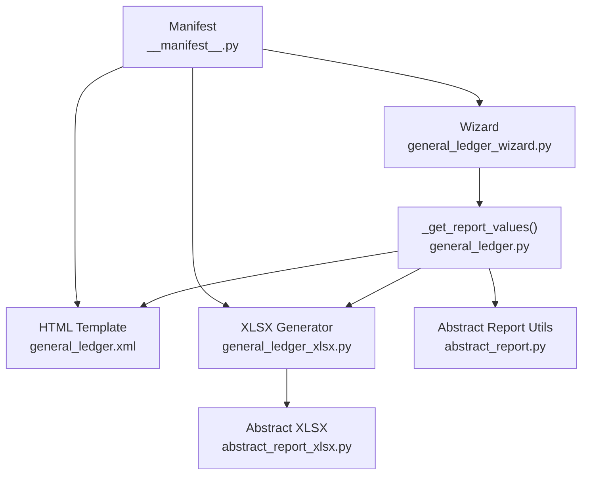
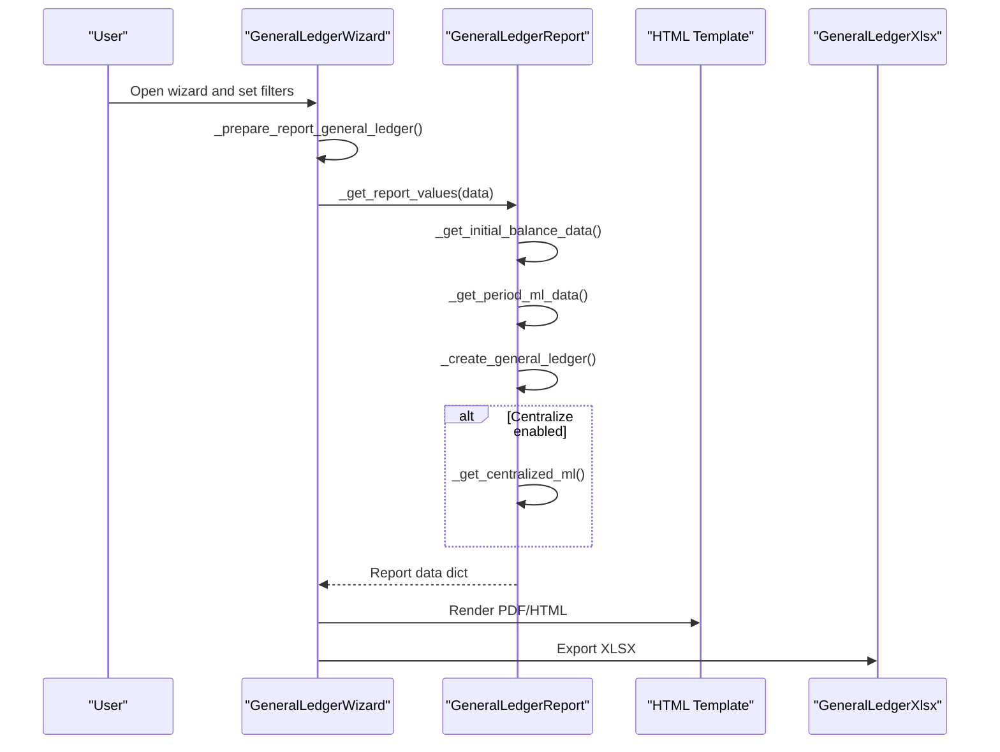
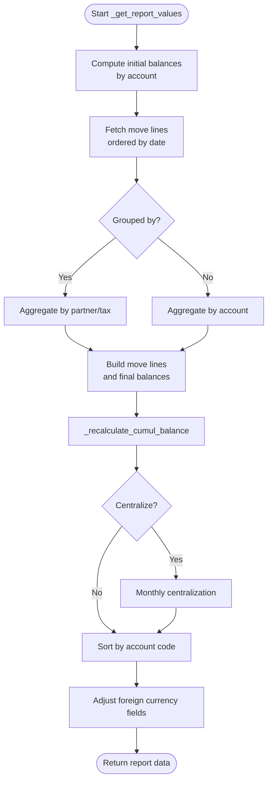
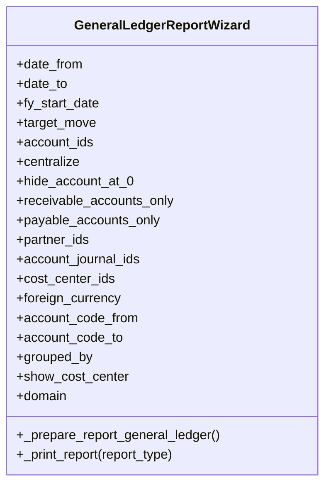
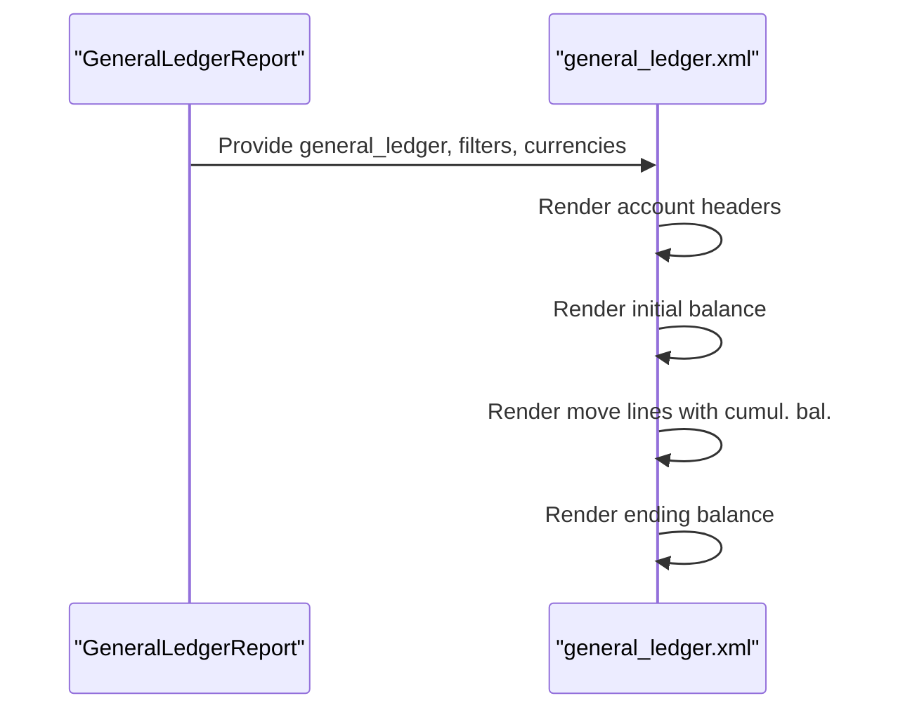
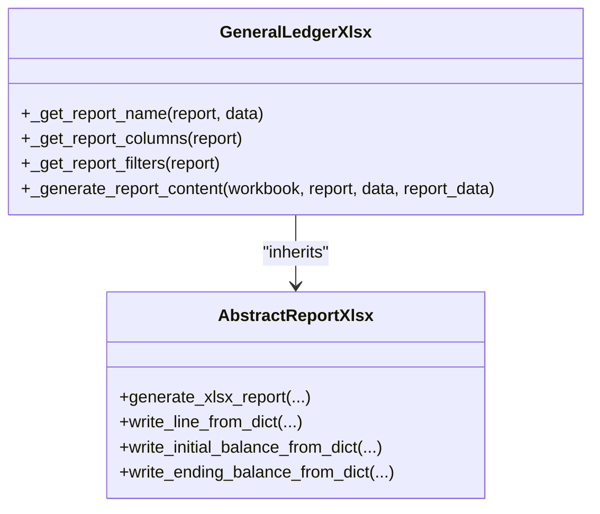
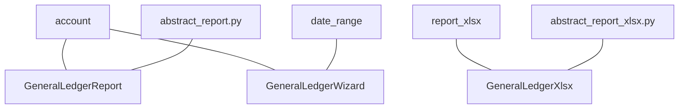

# General Ledger Report

<cite>
**Referenced Files in This Document**
- [general_ledger.py](file://report/general_ledger.py)
- [general_ledger_wizard.py](file://wizard/general_ledger_wizard.py)
- [general_ledger_xlsx.py](file://report/general_ledger_xlsx.py)
- [abstract_report.py](file://report/abstract_report.py)
- [abstract_report_xlsx.py](file://report/abstract_report_xlsx.py)
- [general_ledger.xml](file://report/templates/general_ledger.xml)
- [report_general_ledger.xml](file://view/report_general_ledger.xml)
- [general_ledger_wizard_view.xml](file://wizard/general_ledger_wizard_view.xml)
- [DESCRIPTION.md](file://readme/DESCRIPTION.md)
- [__manifest__.py](file://__manifest__.py)
- [README.rst](file://README.rst)
</cite>

## Table of Contents
1. [Introduction](#introduction)
2. [Project Structure](#project-structure)
3. [Core Components](#core-components)
4. [Architecture Overview](#architecture-overview)
5. [Detailed Component Analysis](#detailed-component-analysis)
6. [Dependency Analysis](#dependency-analysis)
7. [Performance Considerations](#performance-considerations)
8. [Troubleshooting Guide](#troubleshooting-guide)
9. [Conclusion](#conclusion)
10. [Appendices](#appendices)

## Introduction
The General Ledger Report provides transaction-level detail of account move lines with cumulative balances and optional grouping by partners or taxes. It supports filtering by date range, accounts, partners, journals, and analytic cost centers, and offers multi-currency display with proper exchange rate handling. Outputs include PDF, HTML, and XLSX formats. The wizard exposes configuration options for grouping, centralization, currency display, and additional domain filters.

## Project Structure
The module organizes the General Ledger Report across models, wizards, templates, and XLSX generation:

- Report engine and data processing: [general_ledger.py](file://report/general_ledger.py)
- Wizard and UI: [general_ledger_wizard.py](file://wizard/general_ledger_wizard.py), [general_ledger_wizard_view.xml](file://wizard/general_ledger_wizard_view.xml)
- Templates for HTML/PDF: [general_ledger.xml](file://report/templates/general_ledger.xml), [report_general_ledger.xml](file://view/report_general_ledger.xml)
- XLSX export: [general_ledger_xlsx.py](file://report/general_ledger_xlsx.py), [abstract_report_xlsx.py](file://report/abstract_report_xlsx.py)
- Shared report utilities: [abstract_report.py](file://report/abstract_report.py)
- Module metadata and dependencies: [__manifest__.py](file://__manifest__.py), [DESCRIPTION.md](file://readme/DESCRIPTION.md), [README.rst](file://README.rst)

**Diagram sources**
- [general_ledger.py:763-931](file://report/general_ledger.py#L763-L931)
- [general_ledger_wizard.py:274-322](file://wizard/general_ledger_wizard.py#L274-L322)
- [general_ledger.xml:1-789](file://report/templates/general_ledger.xml#L1-L789)
- [general_ledger_xlsx.py:134-373](file://report/general_ledger_xlsx.py#L134-L373)
- [abstract_report_xlsx.py:18-42](file://report/abstract_report_xlsx.py#L18-L42)
- [abstract_report.py:154-165](file://report/abstract_report.py#L154-L165)
- [__manifest__.py:19-46](file://__manifest__.py#L19-L46)

**Section sources**
- [__manifest__.py:19-46](file://__manifest__.py#L19-L46)
- [README.rst:35-48](file://README.rst#L35-L48)

## Core Components
- Report engine: Computes initial/final balances, aggregates move lines, recalculates cumulative balances, and optionally centralizes monthly entries. See [general_ledger.py:108-177](file://report/general_ledger.py#L108-L177), [general_ledger.py:446-558](file://report/general_ledger.py#L446-L558), [general_ledger.py:561-569](file://report/general_ledger.py#L561-L569), [general_ledger.py:641-695](file://report/general_ledger.py#L641-L695), [general_ledger.py:763-931](file://report/general_ledger.py#L763-L931).
- Wizard: Collects filters and parameters, prepares report data dictionary. See [general_ledger_wizard.py:18-322](file://wizard/general_ledger_wizard.py#L18-L322).
- HTML/PDF template: Renders filters, account headers, move lines, and cumulative balances. See [general_ledger.xml:12-789](file://report/templates/general_ledger.xml#L12-L789), [report_general_ledger.xml:1-10](file://view/report_general_ledger.xml#L1-L10).
- XLSX generator: Builds columns, writes filters, initial/ending balances, and move lines with currency handling. See [general_ledger_xlsx.py:25-92](file://report/general_ledger_xlsx.py#L25-L92), [general_ledger_xlsx.py:134-373](file://report/general_ledger_xlsx.py#L134-L373), [abstract_report_xlsx.py:18-42](file://report/abstract_report_xlsx.py#L18-L42).

**Section sources**
- [general_ledger.py:108-177](file://report/general_ledger.py#L108-L177)
- [general_ledger.py:446-558](file://report/general_ledger.py#L446-L558)
- [general_ledger.py:561-569](file://report/general_ledger.py#L561-L569)
- [general_ledger.py:641-695](file://report/general_ledger.py#L641-L695)
- [general_ledger.py:763-931](file://report/general_ledger.py#L763-L931)
- [general_ledger_wizard.py:274-322](file://wizard/general_ledger_wizard.py#L274-L322)
- [general_ledger.xml:12-789](file://report/templates/general_ledger.xml#L12-L789)
- [report_general_ledger.xml:1-10](file://view/report_general_ledger.xml#L1-L10)
- [general_ledger_xlsx.py:25-92](file://report/general_ledger_xlsx.py#L25-L92)
- [general_ledger_xlsx.py:134-373](file://report/general_ledger_xlsx.py#L134-L373)
- [abstract_report_xlsx.py:18-42](file://report/abstract_report_xlsx.py#L18-L42)

## Architecture Overview
End-to-end flow from wizard to output:

**Diagram sources**
- [general_ledger_wizard.py:274-322](file://wizard/general_ledger_wizard.py#L274-L322)
- [general_ledger.py:763-931](file://report/general_ledger.py#L763-L931)
- [general_ledger.xml:12-789](file://report/templates/general_ledger.xml#L12-L789)
- [general_ledger_xlsx.py:134-373](file://report/general_ledger_xlsx.py#L134-L373)

## Detailed Component Analysis

### Report Engine: GeneralLedgerReport
- Initial and period domains: Builds base domains for initial/final balances and transaction lines, applying filters for company, posted state, partners, journals, and cost centers. See [general_ledger.py:74-106](file://report/general_ledger.py#L74-L106), [general_ledger.py:363-391](file://report/general_ledger.py#L363-L391).
- Initial balances: Aggregates BS and PL initial balances by account; computes profit & loss carry-forward when applicable. See [general_ledger.py:108-120](file://report/general_ledger.py#L108-L120), [general_ledger.py:122-160](file://report/general_ledger.py#L122-L160).
- Move line aggregation: Reads move lines ordered by date and entry, builds per-account and per-group (partner/tax) structures, updates final balances. See [general_ledger.py:446-558](file://report/general_ledger.py#L446-L558).
- Cumulative balances: Recomputes running balance per line and marks reconciliations post cutoff date. See [general_ledger.py:561-569](file://report/general_ledger.py#L561-L569), [general_ledger.py:571-585](file://report/general_ledger.py#L571-L585), [general_ledger.py:587-605](file://report/general_ledger.py#L587-L605), [general_ledger.py:607-639](file://report/general_ledger.py#L607-L639).
- Grouping modes: Partners and taxes grouping supported via grouped-by logic; missing items are labeled appropriately. See [general_ledger.py:200-227](file://report/general_ledger.py#L200-L227), [general_ledger.py:229-256](file://report/general_ledger.py#L229-L256).
- Centralization: Monthly centralized entries per journal when centralized mode is enabled. See [general_ledger.py:698-760](file://report/general_ledger.py#L698-L760).
- Multi-currency adjustments: Normalizes initial/final balances and sets per-account currency for final balances. See [general_ledger.py:837-892](file://report/general_ledger.py#L837-L892).
- Output packaging: Returns structured data for templates/XLSX, including accounts, journals, taxes, analytics, and reconciliation metadata. See [general_ledger.py:893-915](file://report/general_ledger.py#L893-L915).

**Diagram sources**
- [general_ledger.py:763-931](file://report/general_ledger.py#L763-L931)

**Section sources**
- [general_ledger.py:74-106](file://report/general_ledger.py#L74-L106)
- [general_ledger.py:108-120](file://report/general_ledger.py#L108-L120)
- [general_ledger.py:122-160](file://report/general_ledger.py#L122-L160)
- [general_ledger.py:363-391](file://report/general_ledger.py#L363-L391)
- [general_ledger.py:446-558](file://report/general_ledger.py#L446-L558)
- [general_ledger.py:561-569](file://report/general_ledger.py#L561-L569)
- [general_ledger.py:571-605](file://report/general_ledger.py#L571-L605)
- [general_ledger.py:607-639](file://report/general_ledger.py#L607-L639)
- [general_ledger.py:698-760](file://report/general_ledger.py#L698-L760)
- [general_ledger.py:837-892](file://report/general_ledger.py#L837-L892)
- [general_ledger.py:893-915](file://report/general_ledger.py#L893-L915)

### Wizard: GeneralLedgerReportWizard
- Filters and parameters:
  - Date range and fiscal year start computation.
  - Target moves: posted/all entries.
  - Accounts: explicit list, code range, receivable/payable filters.
  - Partners, journals, cost centers, and additional domain.
  - Grouping: none/partners/taxes.
  - Display preferences: hide at 0, foreign currency, centralization, show cost center.
- Actions: prepare report data dictionary and export actions for PDF/HTML/XLSX. See [general_ledger_wizard.py:18-322](file://wizard/general_ledger_wizard.py#L18-L322), [general_ledger_wizard_view.xml:1-164](file://wizard/general_ledger_wizard_view.xml#L1-L164).

**Diagram sources**
- [general_ledger_wizard.py:18-322](file://wizard/general_ledger_wizard.py#L18-L322)

**Section sources**
- [general_ledger_wizard.py:25-91](file://wizard/general_ledger_wizard.py#L25-L91)
- [general_ledger_wizard.py:93-151](file://wizard/general_ledger_wizard.py#L93-L151)
- [general_ledger_wizard.py:274-322](file://wizard/general_ledger_wizard.py#L274-L322)
- [general_ledger_wizard_view.xml:1-164](file://wizard/general_ledger_wizard_view.xml#L1-L164)

### Templates: HTML/PDF Rendering
- Filters display and report title.
- Account-level rendering with initial/ending cumulative balances.
- Partner/tax grouping rendering with separate sections.
- Multi-currency columns and reconciliation indicators.
See [general_ledger.xml:12-789](file://report/templates/general_ledger.xml#L12-L789), [report_general_ledger.xml:1-10](file://view/report_general_ledger.xml#L1-L10).

**Diagram sources**
- [general_ledger.py:893-915](file://report/general_ledger.py#L893-L915)
- [general_ledger.xml:12-789](file://report/templates/general_ledger.xml#L12-L789)

**Section sources**
- [general_ledger.xml:12-789](file://report/templates/general_ledger.xml#L12-L789)
- [report_general_ledger.xml:1-10](file://view/report_general_ledger.xml#L1-L10)

### XLSX Export: GeneralLedgerXlsx
- Column definitions include date, entry, journal, account, taxes, partner, ref/label, reconcile, debit, credit, cumulative balance, and optional foreign currency columns.
- Writes filters, initial/ending balances, and move lines; computes cumulative currency totals per line.
- Uses shared XLSX framework for formatting and currency-specific formats.
See [general_ledger_xlsx.py:25-92](file://report/general_ledger_xlsx.py#L25-L92), [general_ledger_xlsx.py:134-373](file://report/general_ledger_xlsx.py#L134-L373), [abstract_report_xlsx.py:18-42](file://report/abstract_report_xlsx.py#L18-L42).

**Diagram sources**
- [general_ledger_xlsx.py:16-92](file://report/general_ledger_xlsx.py#L16-L92)
- [general_ledger_xlsx.py:134-373](file://report/general_ledger_xlsx.py#L134-L373)
- [abstract_report_xlsx.py:18-42](file://report/abstract_report_xlsx.py#L18-L42)

**Section sources**
- [general_ledger_xlsx.py:25-92](file://report/general_ledger_xlsx.py#L25-L92)
- [general_ledger_xlsx.py:134-373](file://report/general_ledger_xlsx.py#L134-L373)
- [abstract_report_xlsx.py:18-42](file://report/abstract_report_xlsx.py#L18-L42)

## Dependency Analysis
- Dependencies: depends on account, date_range, and report_xlsx modules. See [__manifest__.py:18-18](file://__manifest__.py#L18-L18).
- Shared move-line fields and helpers: COMMON_ML_FIELDS and _get_ml_fields are reused across reports. See [abstract_report.py:10-19](file://report/abstract_report.py#L10-L19), [abstract_report.py:154-165](file://report/abstract_report.py#L154-L165).

**Diagram sources**
- [__manifest__.py:18-18](file://__manifest__.py#L18-L18)
- [abstract_report.py:10-19](file://report/abstract_report.py#L10-L19)
- [abstract_report.py:154-165](file://report/abstract_report.py#L154-L165)
- [abstract_report_xlsx.py:18-42](file://report/abstract_report_xlsx.py#L18-L42)

**Section sources**
- [__manifest__.py:18-18](file://__manifest__.py#L18-L18)
- [abstract_report.py:10-19](file://report/abstract_report.py#L10-L19)
- [abstract_report.py:154-165](file://report/abstract_report.py#L154-L165)
- [abstract_report_xlsx.py:18-42](file://report/abstract_report_xlsx.py#L18-L42)

## Performance Considerations
- Efficient aggregations: Uses read_group for initial balances and targeted search_read with ordering to minimize memory footprint. See [general_ledger.py:109-118](file://report/general_ledger.py#L109-L118), [general_ledger.py:472-474](file://report/general_ledger.py#L472-L474).
- Constant memory workbook option: XLSX generator enables constant memory mode for large datasets. See [abstract_report_xlsx.py:13-16](file://report/abstract_report_xlsx.py#L13-L16).
- Sorting: Final sort by account code performed once at the end to ensure deterministic output. See [general_ledger.py:836-836](file://report/general_ledger.py#L836-L836).
- Centralization: Monthly centralization reduces rows when enabled, improving readability and reducing export size. See [general_ledger.py:738-760](file://report/general_ledger.py#L738-L760).

[No sources needed since this section provides general guidance]

## Troubleshooting Guide
- Unaffected earnings account constraint: The wizard indicates when only one unaffected earnings account exists per company; otherwise, the report cannot be computed. See [general_ledger_wizard.py:144-151](file://wizard/general_ledger_wizard.py#L144-L151), [general_ledger_wizard_view.xml:96-104](file://wizard/general_ledger_wizard_view.xml#L96-L104).
- Foreign currency availability: If an account lacks secondary currency configuration, foreign currency columns may not display. See [README.rst:50-51](file://README.rst#L50-L51).
- Multi-currency normalization: The report normalizes initial/final balances and sets per-account currency for final balances when foreign currency is enabled. See [general_ledger.py:837-892](file://report/general_ledger.py#L837-L892).
- Reconciliation after cutoff: Reconciliations occurring after the report’s date_to are marked accordingly in the cumulative balance calculation. See [general_ledger.py:567-568](file://report/general_ledger.py#L567-L568).

**Section sources**
- [general_ledger_wizard.py:144-151](file://wizard/general_ledger_wizard.py#L144-L151)
- [general_ledger_wizard_view.xml:96-104](file://wizard/general_ledger_wizard_view.xml#L96-L104)
- [README.rst:50-51](file://README.rst#L50-L51)
- [general_ledger.py:567-568](file://report/general_ledger.py#L567-L568)
- [general_ledger.py:837-892](file://report/general_ledger.py#L837-L892)

## Conclusion
The General Ledger Report delivers comprehensive transaction-level visibility with robust grouping, cumulative balances, and multi-currency support. Its modular architecture separates concerns across wizard configuration, report computation, templating, and XLSX generation, enabling flexible filtering and efficient performance.

[No sources needed since this section summarizes without analyzing specific files]

## Appendices

### Data Fields and Output Columns
- Transaction-level fields: date, entry, journal, account, taxes, partner, reference/label, reconcile number, debit, credit, cumulative balance, and optional foreign currency and cumulative currency.
- Columns definition and rendering are driven by the HTML template and XLSX generator. See [general_ledger.xml:135-644](file://report/templates/general_ledger.xml#L135-L644), [general_ledger_xlsx.py:25-92](file://report/general_ledger_xlsx.py#L25-L92).

**Section sources**
- [general_ledger.xml:135-644](file://report/templates/general_ledger.xml#L135-L644)
- [general_ledger_xlsx.py:25-92](file://report/general_ledger_xlsx.py#L25-L92)

### Filtering Capabilities
- Date range: date_from, date_to, computed fy_start_date.
- Accounts: explicit ids or code range.
- Partners: many2many filter.
- Journals: many2many filter.
- Cost centers: many2many filter.
- Additional domain: arbitrary domain applied to move lines.
- Target moves: posted/all entries.
- Grouping: none/partners/taxes.
- Display preferences: hide at 0, foreign currency, centralization, show cost center.

**Section sources**
- [general_ledger_wizard.py:25-91](file://wizard/general_ledger_wizard.py#L25-L91)
- [general_ledger_wizard.py:93-151](file://wizard/general_ledger_wizard.py#L93-L151)
- [general_ledger_wizard_view.xml:1-164](file://wizard/general_ledger_wizard_view.xml#L1-L164)

### Multi-Currency Support and Exchange Rate Handling
- Foreign currency toggle controls display of foreign currency and cumulative currency columns.
- Final balances are normalized and currency-specific formatting is applied in XLSX.
- Per-line currency handling ensures accurate cumulative currency totals when currency differs from company currency.

**Section sources**
- [general_ledger_wizard.py:63-69](file://wizard/general_ledger_wizard.py#L63-L69)
- [general_ledger_xlsx.py:70-88](file://report/general_ledger_xlsx.py#L70-L88)
- [general_ledger.py:837-892](file://report/general_ledger.py#L837-L892)

### Output Formats
- PDF/HTML: Generated via the HTML template pipeline.
- XLSX: Generated via the XLSX generator using shared formatting utilities.

**Section sources**
- [general_ledger_wizard.py:274-322](file://wizard/general_ledger_wizard.py#L274-L322)
- [general_ledger.xml:12-789](file://report/templates/general_ledger.xml#L12-L789)
- [general_ledger_xlsx.py:134-373](file://report/general_ledger_xlsx.py#L134-L373)
- [abstract_report_xlsx.py:18-42](file://report/abstract_report_xlsx.py#L18-L42)

### Typical Use Cases and Common Configurations
- Full-year transaction view with cumulative balances by account.
- Partner-level grouping to analyze receivables/payables movements.
- Taxes grouping to review tax-related entries.
- Centralized monthly entries for journals with high transaction volume.
- Foreign currency display for multi-entity setups.

[No sources needed since this section provides general guidance]