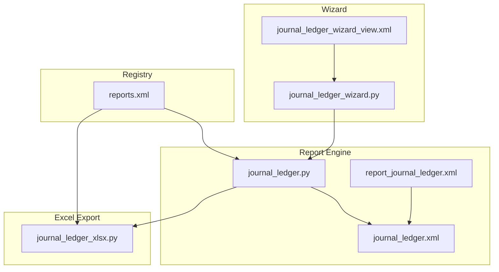
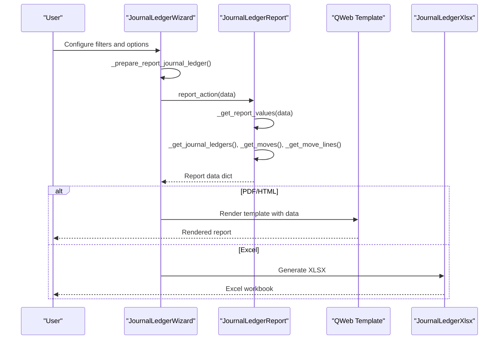
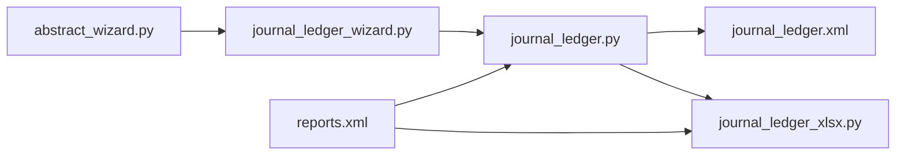

# Journal Ledger Report

<cite>
**Referenced Files in This Document**
- [journal_ledger.py](file://report/journal_ledger.py)
- [journal_ledger_xlsx.py](file://report/journal_ledger_xlsx.py)
- [journal_ledger_wizard.py](file://wizard/journal_ledger_wizard.py)
- [journal_ledger_wizard_view.xml](file://wizard/journal_ledger_wizard_view.xml)
- [journal_ledger.xml](file://report/templates/journal_ledger.xml)
- [report_journal_ledger.xml](file://view/report_journal_ledger.xml)
- [reports.xml](file://reports.xml)
- [abstract_wizard.py](file://wizard/abstract_wizard.py)
- [test_journal_ledger.py](file://tests/test_journal_ledger.py)
- [__manifest__.py](file://__manifest__.py)
</cite>

## Table of Contents
1. [Introduction](#introduction)
2. [Project Structure](#project-structure)
3. [Core Components](#core-components)
4. [Architecture Overview](#architecture-overview)
5. [Detailed Component Analysis](#detailed-component-analysis)
6. [Dependency Analysis](#dependency-analysis)
7. [Performance Considerations](#performance-considerations)
8. [Troubleshooting Guide](#troubleshooting-guide)
9. [Conclusion](#conclusion)
10. [Appendices](#appendices)

## Introduction
The Journal Ledger Report provides a comprehensive view of financial transactions organized by journal type. It enables users to analyze posted and draft entries, group by journal or no group, sort by entry number or date, and export to PDF, HTML, or Excel. The report aggregates transaction lines, computes totals per journal, and presents tax summaries for each journal. It supports filtering by date range, journals, and move state, and offers display options such as foreign currency, account names, and auto-generated sequences.

## Project Structure
The Journal Ledger Report spans wizard configuration, backend report logic, QWeb templates, and XLSX export. The wizard collects user selections and prepares report data. The report engine queries journals, moves, and move lines, groups and sorts data, and passes it to templates for rendering. The XLSX generator builds worksheets per journal and a consolidated tax summary.

**Diagram sources**
- [journal_ledger_wizard.py:1-162](file://wizard/journal_ledger_wizard.py#L1-L162)
- [journal_ledger_wizard_view.xml:1-76](file://wizard/journal_ledger_wizard_view.xml#L1-L76)
- [journal_ledger.py:1-376](file://report/journal_ledger.py#L1-L376)
- [journal_ledger.xml:1-512](file://report/templates/journal_ledger.xml#L1-L512)
- [report_journal_ledger.xml:1-10](file://view/report_journal_ledger.xml#L1-L10)
- [journal_ledger_xlsx.py:1-269](file://report/journal_ledger_xlsx.py#L1-L269)
- [reports.xml:1-174](file://reports.xml#L1-L174)

**Section sources**
- [__manifest__.py:19-46](file://__manifest__.py#L19-L46)
- [reports.xml:37-52](file://reports.xml#L37-L52)
- [reports.xml:133-140](file://reports.xml#L133-L140)

## Core Components
- Wizard: Collects date range, journals, move target, sort option, group option, and display preferences. Prepares report data dictionary passed to the report engine.
- Report Engine: Builds journal lists, retrieves moves and move lines, groups by journal, computes totals, and aggregates tax lines per journal.
- Templates: Render grouped or ungrouped views, headers, rows, and tax summaries.
- XLSX Export: Generates worksheets per journal and a consolidated tax summary with configurable columns.

Key data fields exposed to templates and XLSX:
- Journal: id, name, currency, totals (debit, credit)
- Moves: id, journal_id, entry number/name
- Move Lines: date, journal_id, account_id, partner_id, label, debit, credit, company_currency_id, amount_currency, currency_id, tax_line_id, tax_ids, base/tax debits/credits/balances, auto_sequence
- Tax lines per journal: tax_name, tax_code, base_debit, base_credit, base_balance, tax_debit, tax_credit, tax_balance

**Section sources**
- [journal_ledger_wizard.py:14-37](file://wizard/journal_ledger_wizard.py#L14-L37)
- [journal_ledger.py:15-25](file://report/journal_ledger.py#L15-L25)
- [journal_ledger.py:65-70](file://report/journal_ledger.py#L65-L70)
- [journal_ledger.py:96-129](file://report/journal_ledger.py#L96-L129)
- [journal_ledger.py:251-300](file://report/journal_ledger.py#L251-L300)
- [journal_ledger_xlsx.py:24-68](file://report/journal_ledger_xlsx.py#L24-L68)

## Architecture Overview
The report pipeline starts from the wizard, which prepares a data payload and triggers the report action. The report engine executes database queries, performs grouping and aggregation, and returns structured data to templates and XLSX exporter.

**Diagram sources**
- [journal_ledger_wizard.py:80-122](file://wizard/journal_ledger_wizard.py#L80-L122)
- [journal_ledger.py:302-375](file://report/journal_ledger.py#L302-L375)
- [journal_ledger.xml:5-55](file://report/templates/journal_ledger.xml#L5-L55)
- [journal_ledger_xlsx.py:159-176](file://report/journal_ledger_xlsx.py#L159-L176)

## Detailed Component Analysis

### Wizard Configuration
The wizard defines:
- Periods: date_from, date_to, date_range_id
- Options: move_target (all/posted/draft), sort_option (move_name/date), group_option (journal/no group), foreign_currency, with_account_name, with_auto_sequence
- Journals: Many2many selection
- Actions: View (HTML), Export PDF, Export XLSX

Behavior highlights:
- Company change filters journals by company and clears incompatible date ranges.
- If no journals selected, defaults to all journals for the chosen company.
- Exports route to either QWeb PDF/HTML or XLSX depending on selection.

**Section sources**
- [journal_ledger_wizard.py:14-37](file://wizard/journal_ledger_wizard.py#L14-L37)
- [journal_ledger_wizard.py:40-53](file://wizard/journal_ledger_wizard.py#L40-L53)
- [journal_ledger_wizard.py:60-78](file://wizard/journal_ledger_wizard.py#L60-L78)
- [journal_ledger_wizard.py:96-117](file://wizard/journal_ledger_wizard.py#L96-L117)
- [journal_ledger_wizard_view.xml:8-64](file://wizard/journal_ledger_wizard_view.xml#L8-L64)

### Report Engine Logic
Core steps:
- Build journal list ordered by name, including currency and company currency fallback.
- Retrieve moves filtered by journals, date range, and move state (all/posted/draft).
- Sort moves by entry number or date.
- Load move lines, compute tax-related fields, and build per-move line dictionaries.
- Group moves by journal and compute journal totals (debit/credit).
- Aggregate tax lines per journal and attach to journal data.

Sorting and grouping:
- Sorting: entry number (name) ascending or date ascending with secondary entry number.
- Grouping: by journal or no group (flat list of moves).

Performance optimizations:
- Disables prefetch for move lines to reduce memory overhead during large datasets.
- Uses raw SQL to fetch tax relations for move lines and checks tax exigibility via IDs to avoid repeated recordset creation.

**Section sources**
- [journal_ledger.py:35-43](file://report/journal_ledger.py#L35-L43)
- [journal_ledger.py:45-55](file://report/journal_ledger.py#L45-L55)
- [journal_ledger.py:57-63](file://report/journal_ledger.py#L57-L63)
- [journal_ledger.py:72-82](file://report/journal_ledger.py#L72-L82)
- [journal_ledger.py:184-249](file://report/journal_ledger.py#L184-L249)
- [journal_ledger.py:251-300](file://report/journal_ledger.py#L251-L300)
- [journal_ledger.py:302-375](file://report/journal_ledger.py#L302-L375)

### Templates and Output Presentation
- HTML/PDF: Two presentation modes:
  - Group by journal: Each journal gets a page with header, table header, totals row, and move lines.
  - No group: Single page with header, table header, and all moves.
- Tax summaries:
  - Per-journal tax sheets show aggregated base/tax amounts and balances.
  - Consolidated tax summary when not grouped.
- Columns include entry, date, account (and optional name), partner, label, taxes, debit, credit, and optionally currency and amount in currency.

**Section sources**
- [journal_ledger.xml:33-54](file://report/templates/journal_ledger.xml#L33-L54)
- [journal_ledger.xml:67-92](file://report/templates/journal_ledger.xml#L67-L92)
- [journal_ledger.xml:93-172](file://report/templates/journal_ledger.xml#L93-L172)
- [journal_ledger.xml:207-315](file://report/templates/journal_ledger.xml#L207-L315)
- [journal_ledger.xml:316-414](file://report/templates/journal_ledger.xml#L316-L414)
- [journal_ledger.xml:415-510](file://report/templates/journal_ledger.xml#L415-L510)
- [report_journal_ledger.xml:3-8](file://view/report_journal_ledger.xml#L3-L8)

### XLSX Export
- Column configuration adapts to display options (auto sequence, account name, foreign currency).
- Generates one worksheet per journal with move lines and a separate tax summary sheet per journal.
- Filters summary includes company, date range, target moves, sort option, and selected journals.

**Section sources**
- [journal_ledger_xlsx.py:24-68](file://report/journal_ledger_xlsx.py#L24-L68)
- [journal_ledger_xlsx.py:118-157](file://report/journal_ledger_xlsx.py#L118-L157)
- [journal_ledger_xlsx.py:159-208](file://report/journal_ledger_xlsx.py#L159-L208)

### Filtering Capabilities
- Date range: date_from and date_to.
- Journals: selection of one or multiple journals; defaults to all company journals if none selected.
- Move state: all, posted, or draft.
- Sorting: by entry number or by date.
- Grouping: by journal or no group.
- Display options: foreign currency, account name, auto sequence.

**Section sources**
- [journal_ledger.py:45-55](file://report/journal_ledger.py#L45-L55)
- [journal_ledger.py:57-63](file://report/journal_ledger.py#L57-L63)
- [journal_ledger_wizard.py:14-37](file://wizard/journal_ledger_wizard.py#L14-L37)
- [journal_ledger_wizard.py:96-117](file://wizard/journal_ledger_wizard.py#L96-L117)

### Transaction Analysis Features
- Individual entries are displayed with full detail: date, account (and optional name), partner, label, taxes, debit, credit, and currency fields when enabled.
- Auto sequence allows ordering within a move for consistent presentation.
- Tax analysis: per-line tax line and additional taxes are aggregated per journal with base and tax amounts and balances.

**Section sources**
- [journal_ledger.py:96-129](file://report/journal_ledger.py#L96-L129)
- [journal_ledger.py:251-300](file://report/journal_ledger.py#L251-L300)
- [journal_ledger_xlsx.py:124-157](file://report/journal_ledger_xlsx.py#L124-L157)

### Output Formats
- HTML/PDF: Rendered via QWeb templates with grouped or flat layout and tax summaries.
- Excel: XLSX workbook with one sheet per journal and a tax summary sheet per journal.

**Section sources**
- [reports.xml:38-52](file://reports.xml#L38-L52)
- [reports.xml:133-140](file://reports.xml#L133-L140)
- [journal_ledger_xlsx.py:159-176](file://report/journal_ledger_xlsx.py#L159-L176)

## Dependency Analysis
The wizard depends on the abstract wizard for common actions and company context. The report engine depends on Odoo ORM and SQL for efficient data retrieval. The XLSX exporter inherits from the abstract XLSX report base. The registry defines report actions for PDF/HTML and XLSX.

**Diagram sources**
- [abstract_wizard.py:38-51](file://wizard/abstract_wizard.py#L38-L51)
- [journal_ledger_wizard.py:12](file://wizard/journal_ledger_wizard.py#L12)
- [journal_ledger.py:11-13](file://report/journal_ledger.py#L11-L13)
- [journal_ledger_xlsx.py:10-13](file://report/journal_ledger_xlsx.py#L10-L13)
- [reports.xml:37-52](file://reports.xml#L37-L52)
- [reports.xml:133-140](file://reports.xml#L133-L140)

**Section sources**
- [abstract_wizard.py:38-51](file://wizard/abstract_wizard.py#L38-L51)
- [reports.xml:37-52](file://reports.xml#L37-L52)
- [reports.xml:133-140](file://reports.xml#L133-L140)

## Performance Considerations
- Disable prefetch for move lines to reduce memory footprint on large datasets.
- Use raw SQL to fetch tax relations for move lines and compute tax exigibility via ID sets to avoid repeated recordset creation.
- Group moves by journal early to minimize repeated lookups.
- Order queries by move_id and date to ensure deterministic output and efficient joins.
- Limit data to required fields and computed aggregates to reduce payload sizes.

**Section sources**
- [journal_ledger.py:187-192](file://report/journal_ledger.py#L187-L192)
- [journal_ledger.py:204-202](file://report/journal_ledger.py#L204-L202)
- [journal_ledger.py:310-315](file://report/journal_ledger.py#L310-L315)

## Troubleshooting Guide
- No journals selected: The wizard defaults to all journals for the selected company. Verify company_id and journal domain filtering.
- Incorrect date range: Ensure date_from <= date_to and align with company’s fiscal year if applicable.
- Move state mismatch: When move_target is set to posted or draft, only matching moves are included.
- Large dataset slowness: Confirm that prefetch is disabled for move lines and that sorting and grouping are applied as configured.
- Excel export missing data: Verify that the XLSX action is registered and that the report name matches the wizard’s export route.

**Section sources**
- [journal_ledger_wizard.py:60-78](file://wizard/journal_ledger_wizard.py#L60-L78)
- [journal_ledger_wizard.py:96-117](file://wizard/journal_ledger_wizard.py#L96-L117)
- [journal_ledger.py:45-55](file://report/journal_ledger.py#L45-L55)
- [reports.xml:133-140](file://reports.xml#L133-L140)

## Conclusion
The Journal Ledger Report provides a flexible, efficient mechanism to analyze financial transactions by journal. Its wizard-driven configuration supports robust filtering and sorting, while the report engine ensures scalable performance for large datasets. The templates and XLSX exporter deliver clear, actionable insights with optional tax summaries and currency details.

## Appendices

### Typical Journal Analysis Scenarios
- Monthly reconciliation: Filter by date range and group by journal to review posted entries and totals.
- Tax reporting: Use “no group” mode to consolidate entries and review tax summaries across journals.
- Audit trail: Enable auto sequence and account name to track entries precisely and verify account details.
- Multi-currency review: Activate foreign currency to compare amounts in functional and transaction currencies.

### Example Workflows
- Select company, define date range, choose journals, set move_target to posted, sort by date, group by journal, and export to PDF/HTML or XLSX.
- For consolidated analysis, select “no group,” enable foreign currency and account names, and export to Excel for pivot analysis.