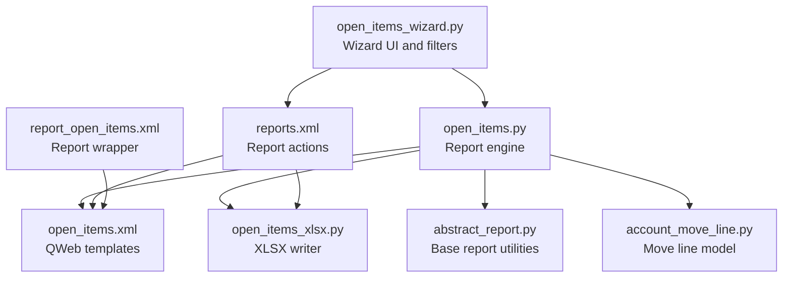
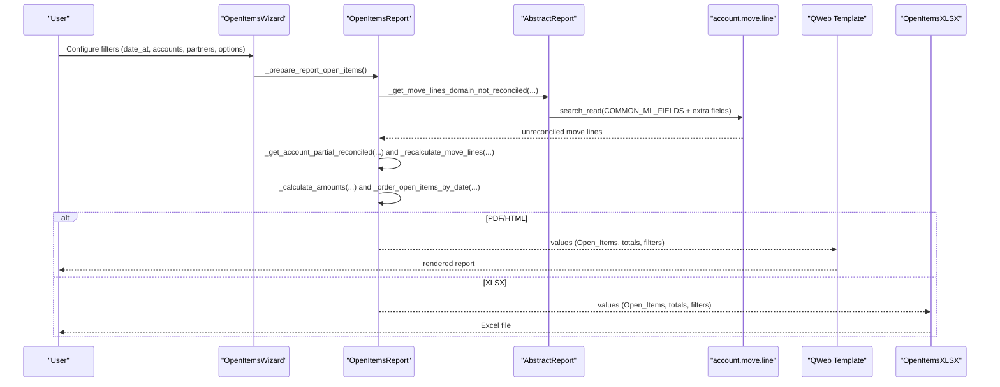
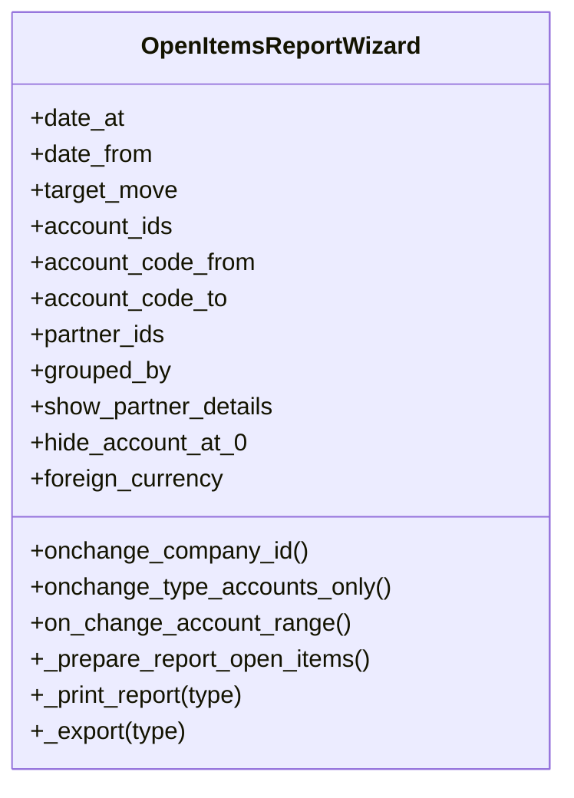
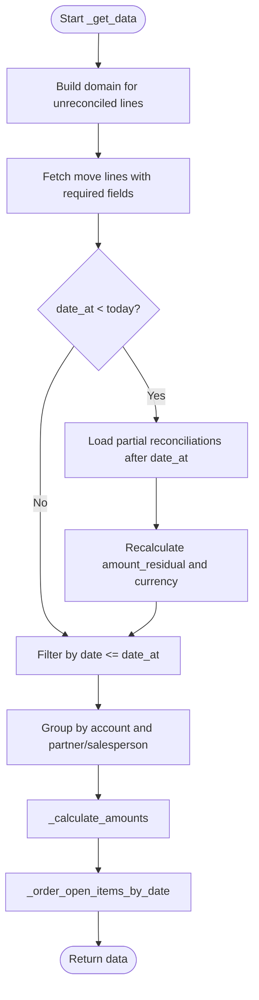
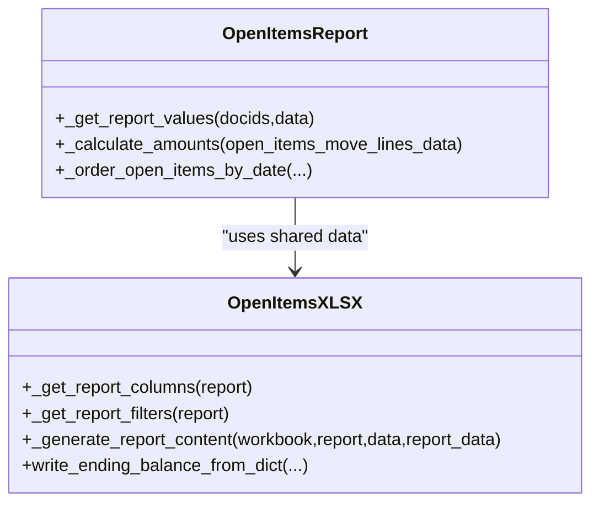
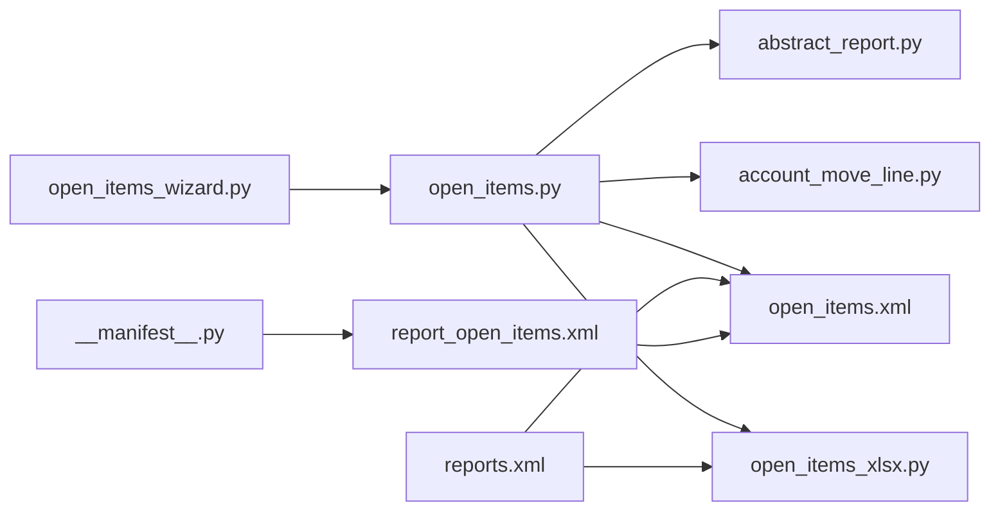

# Open Items Report

<cite>
**Referenced Files in This Document**
- [open_items.py](file://report/open_items.py)
- [open_items_wizard.py](file://wizard/open_items_wizard.py)
- [open_items.xml](file://report/templates/open_items.xml)
- [open_items_wizard_view.xml](file://wizard/open_items_wizard_view.xml)
- [open_items_xlsx.py](file://report/open_items_xlsx.py)
- [abstract_report.py](file://report/abstract_report.py)
- [account_move_line.py](file://models/account_move_line.py)
- [reports.xml](file://reports.xml)
- [report_open_items.xml](file://view/report_open_items.xml)
- [test_open_items.py](file://tests/test_open_items.py)
- [__manifest__.py](file://__manifest__.py)
- [menuitems.xml](file://menuitems.xml)
</cite>

## Table of Contents
1. [Introduction](#introduction)
2. [Project Structure](#project-structure)
3. [Core Components](#core-components)
4. [Architecture Overview](#architecture-overview)
5. [Detailed Component Analysis](#detailed-component-analysis)
6. [Dependency Analysis](#dependency-analysis)
7. [Performance Considerations](#performance-considerations)
8. [Troubleshooting Guide](#troubleshooting-guide)
9. [Conclusion](#conclusion)
10. [Appendices](#appendices)

## Introduction
The Open Items Report tracks outstanding receivable and payable balances by displaying unpaid invoice and bill lines that remain open at a selected reporting date. It identifies unpaid items by filtering unreconciled move lines, computes residual balances, and organizes results by account and partner. The report supports grouping by partner or salesperson, optional foreign currency display, and export to PDF and Excel (XLSX). It also provides detailed transaction histories for each open item and offers filtering by company, accounts, partners, date ranges, and target moves.

## Project Structure
The Open Items Report spans several modules:
- Wizard: collects user selections (dates, accounts, partners, grouping, options).
- Report engine: queries unreconciled move lines, recalculates residual balances considering partial reconciliations up to the reporting date, aggregates totals, and orders output.
- Templates: render HTML/PDF and define XLSX column layout and totals.
- Tests: validate wizard defaults and grouping behavior.

**Diagram sources**
- [open_items_wizard.py:1-190](file://wizard/open_items_wizard.py#L1-L190)
- [open_items.py:1-310](file://report/open_items.py#L1-L310)
- [open_items.xml:1-455](file://report/templates/open_items.xml#L1-L455)
- [open_items_xlsx.py:1-350](file://report/open_items_xlsx.py#L1-L350)
- [abstract_report.py:1-165](file://report/abstract_report.py#L1-L165)
- [account_move_line.py:1-71](file://models/account_move_line.py#L1-L71)
- [reports.xml:1-174](file://reports.xml#L1-L174)
- [report_open_items.xml:1-10](file://view/report_open_items.xml#L1-L10)

**Section sources**
- [open_items_wizard.py:1-190](file://wizard/open_items_wizard.py#L1-L190)
- [open_items.py:1-310](file://report/open_items.py#L1-L310)
- [open_items.xml:1-455](file://report/templates/open_items.xml#L1-L455)
- [open_items_xlsx.py:1-350](file://report/open_items_xlsx.py#L1-L350)
- [abstract_report.py:1-165](file://report/abstract_report.py#L1-L165)
- [account_move_line.py:1-71](file://models/account_move_line.py#L1-L71)
- [reports.xml:1-174](file://reports.xml#L1-L174)
- [report_open_items.xml:1-10](file://view/report_open_items.xml#L1-L10)

## Core Components
- Wizard: captures filters (date_at, date_from, target_move, show_partner_details, grouped_by, hide_account_at_0, foreign_currency, account_code_from/to, account_ids, partner_ids), and prepares report data.
- Report engine: builds domain for unreconciled move lines, retrieves fields, recalculates residual balances considering partial reconciliations up to date_at, computes totals, and sorts output.
- Templates: render HTML/PDF with filters, headers, rows, and ending balances; support grouped-by-salesperson and grouped-by-partner views.
- XLSX writer: defines columns, filters, and writes arrays and totals per account/partner/salesperson.

Key data fields exposed to the report:
- Partner: id, name
- Invoice/Bill: move_name (entry), journal code, account code/name
- Reference/Label: ref_label
- Dates: date, date_maturity
- Amounts: original, amount_residual, optional foreign currency equivalents
- Currency: currency_name, amount_currency, amount_residual_currency

Output formats:
- PDF/HTML via QWeb template
- XLSX via XLSX report writer

**Section sources**
- [open_items_wizard.py:16-66](file://wizard/open_items_wizard.py#L16-L66)
- [open_items.py:62-189](file://report/open_items.py#L62-L189)
- [open_items.xml:235-380](file://report/templates/open_items.xml#L235-L380)
- [open_items_xlsx.py:23-71](file://report/open_items_xlsx.py#L23-L71)

## Architecture Overview
The Open Items Report follows a standard Odoo reporting pipeline:
- Wizard collects parameters and opens the report action.
- Report engine executes domain queries, recalculates balances, and organizes data.
- Templates render the report in HTML/PDF or XLSX writer produces Excel output.

**Diagram sources**
- [open_items_wizard.py:170-189](file://wizard/open_items_wizard.py#L170-L189)
- [open_items.py:62-189](file://report/open_items.py#L62-L189)
- [abstract_report.py:22-55](file://report/abstract_report.py#L22-L55)
- [open_items.xml:13-211](file://report/templates/open_items.xml#L13-L211)
- [open_items_xlsx.py:310-323](file://report/open_items_xlsx.py#L310-L323)

## Detailed Component Analysis

### Wizard: Filters and Output Selection
- Filters:
  - date_at: Reporting date (required)
  - date_from: Optional lower bound for line selection
  - target_move: "All Posted Entries" or "All Entries"
  - account_ids: Accounts to include (reconcile=True)
  - account_code_from/to: Range-based account selection
  - partner_ids: Partners to include
  - grouped_by: "Partners" or "Partner Salesperson"
  - show_partner_details: Toggle per-partner detail view
  - hide_account_at_0: Hide accounts with zero residual
  - foreign_currency: Show foreign currency columns
- Actions: View (HTML), Export PDF, Export XLSX.

**Diagram sources**
- [open_items_wizard.py:9-190](file://wizard/open_items_wizard.py#L9-L190)

**Section sources**
- [open_items_wizard.py:16-66](file://wizard/open_items_wizard.py#L16-L66)
- [open_items_wizard_view.xml:1-119](file://wizard/open_items_wizard_view.xml#L1-L119)

### Report Engine: Outstanding Item Tracking
- Domain construction excludes reconciled lines and applies company, accounts, partners, and target moves filters.
- Retrieves fields including amount_residual, date_maturity, currency-related fields, and original amounts (derived from debit/credit).
- Recalculation logic:
  - Loads partial reconciliations occurring after the reporting date but affecting lines included up to date_at.
  - Adjusts amount_residual and amount_residual_currency for affected move lines.
- Aggregation:
  - Computes totals per account and per account-partner combination.
- Sorting:
  - Orders by account code, then by date and partner depending on grouping and detail level.

**Diagram sources**
- [open_items.py:62-189](file://report/open_items.py#L62-L189)
- [abstract_report.py:57-123](file://report/abstract_report.py#L57-L123)

**Section sources**
- [open_items.py:62-189](file://report/open_items.py#L62-L189)
- [abstract_report.py:22-55](file://report/abstract_report.py#L22-L55)

### Templates: Rendering and Output Formats
- HTML/PDF:
  - Filters section shows Date at, Target moves, and Hide account at 0.
  - Headers include Date, Entry, Journal, Account, Partner, Ref - Label, Due date, Original, Residual, and optional foreign currency columns.
  - Rows display line details; ending balances computed per account or per partner.
  - Supports grouped-by-salesperson and grouped-by-partner modes.
- XLSX:
  - Defines columns and filters.
  - Writes arrays per account and per partner/salesperson with totals.

**Diagram sources**
- [open_items.py:245-297](file://report/open_items.py#L245-L297)
- [open_items_xlsx.py:9-350](file://report/open_items_xlsx.py#L9-L350)

**Section sources**
- [open_items.xml:13-211](file://report/templates/open_items.xml#L13-L211)
- [open_items_xlsx.py:23-71](file://report/open_items_xlsx.py#L23-L71)
- [open_items_xlsx.py:310-323](file://report/open_items_xlsx.py#L310-L323)

### Aging Analysis and Overdue Categories
- The Open Items Report does not implement aging buckets or overdue categories. It focuses on outstanding balances at a specific reporting date and presents line-level details with due dates and residual amounts. Users can sort by due date or apply external filters to approximate aging analysis.

**Section sources**
- [open_items.py:112-189](file://report/open_items.py#L112-L189)
- [open_items.xml:235-380](file://report/templates/open_items.xml#L235-L380)

### Filtering Options
- Company: wizard filters accounts and partners by company.
- Accounts: explicit selection or code-range selection; optional receivable/payable-only toggles.
- Partners: explicit selection; default derived from active context when invoked from partner actions.
- Date range: date_at (required) and optional date_from.
- Target moves: posted vs all entries.
- Grouping: by partner or by salesperson (based on partner’s salesperson).
- Display options: show partner details, hide account at 0, foreign currency.

**Section sources**
- [open_items_wizard.py:16-66](file://wizard/open_items_wizard.py#L16-L66)
- [open_items_wizard.py:98-118](file://wizard/open_items_wizard.py#L98-L118)
- [open_items_wizard.py:124-139](file://wizard/open_items_wizard.py#L124-L139)
- [open_items_wizard.py:67-93](file://wizard/open_items_wizard.py#L67-L93)
- [open_items_wizard.py:40-44](file://wizard/open_items_wizard.py#L40-L44)
- [open_items_wizard_view.xml:16-64](file://wizard/open_items_wizard_view.xml#L16-L64)

### Output Formats and Transaction History
- PDF/HTML: Full transaction history per account and partner, with ending balances.
- XLSX: Tabular export with the same columns and totals.

**Section sources**
- [open_items.xml:13-211](file://report/templates/open_items.xml#L13-L211)
- [open_items_xlsx.py:23-71](file://report/open_items_xlsx.py#L23-L71)

### Wizard Configuration and Controls
- Access: Menu item under OCA accounting reports.
- Buttons: View (HTML), Export PDF, Export XLSX.
- Context binding: When opened from a partner, default receivable/payable filters can be pre-set.

**Section sources**
- [menuitems.xml:27-32](file://menuitems.xml#L27-L32)
- [open_items_wizard_view.xml:65-87](file://open_items_wizard_view.xml#L65-L87)
- [open_items_wizard_view.xml:98-117](file://open_items_wizard_view.xml#L98-L117)

## Dependency Analysis
- Dependencies:
  - Wizard depends on abstract wizard base and account model.
  - Report engine inherits from abstract report base and uses account.move.line fields.
  - Templates depend on report values and company currency.
  - XLSX writer depends on report engine values and abstract XLSX base.
  - Actions register PDF/HTML/XLSX reports for the wizard.

**Diagram sources**
- [open_items_wizard.py:14](file://wizard/open_items_wizard.py#L14)
- [open_items.py:16](file://report/open_items.py#L16)
- [abstract_report.py:8](file://report/abstract_report.py#L8)
- [account_move_line.py:9](file://models/account_move_line.py#L9)
- [open_items.xml:3](file://report/templates/open_items.xml#L3)
- [open_items_xlsx.py:12](file://report/open_items_xlsx.py#L12)
- [reports.xml:69-84](file://reports.xml#L69-L84)
- [reports.xml:149-156](file://reports.xml#L149-L156)
- [__manifest__.py:19](file://__manifest__.py#L19)
- [report_open_items.xml:3](file://view/report_open_items.xml#L3)

**Section sources**
- [reports.xml:69-84](file://reports.xml#L69-L84)
- [reports.xml:149-156](file://reports.xml#L149-L156)
- [__manifest__.py:19](file://__manifest__.py#L19)

## Performance Considerations
- Indexing: The account.move.line model creates an index on (account_id, partner_id) to improve join performance during large-domain searches.
- Partial reconciliation recalculation: The report loads partial reconciliations occurring after the reporting date and recalculates residual amounts for affected lines, which can be costly on large datasets. Limiting date_at and date_from reduces the dataset size.
- Field selection: The report requests only necessary fields to minimize memory overhead.
- Sorting and aggregation: Sorting by account code and date/partner minimizes rendering overhead; totals are computed incrementally.

Recommendations:
- Use date_from and date_at to constrain the dataset.
- Narrow account and partner filters early.
- Prefer grouped-by-partner mode for large datasets to reduce page breaks.
- Enable foreign currency only when needed.

**Section sources**
- [account_move_line.py:39-62](file://models/account_move_line.py#L39-L62)
- [open_items.py:82-111](file://report/open_items.py#L82-L111)
- [abstract_report.py:154-165](file://report/abstract_report.py#L154-L165)

## Troubleshooting Guide
- No data shown:
  - Verify target_move and date_from/date_at filters.
  - Confirm accounts are reconcileable and belong to the selected company.
  - Ensure partners are selected if filtering by specific partners.
- Foreign currency columns missing:
  - Check foreign_currency option and user group permissions for multi-currency.
- Totals mismatch:
  - hide_account_at_0 hides zero balances; uncheck to include.
  - For partner-level totals, ensure show_partner_details is enabled.
- Large datasets slow:
  - Reduce date range and refine account/partner filters.
  - Disable foreign currency and partner details if unnecessary.

**Section sources**
- [open_items_wizard.py:30-37](file://wizard/open_items_wizard.py#L30-L37)
- [open_items_wizard.py:45-51](file://wizard/open_items_wizard.py#L45-L51)
- [open_items_wizard.py:98-118](file://wizard/open_items_wizard.py#L98-L118)

## Conclusion
The Open Items Report provides a focused view of unpaid receivables and payables at a given date, with robust filtering, grouping, and export capabilities. While it does not implement aging buckets, it delivers detailed transaction histories and accurate residual balances by leveraging Odoo’s reconciliation model and efficient indexing. For large datasets, careful use of filters and grouping is essential to maintain performance.

## Appendices

### Data Fields and Definitions
- Partner: id, name
- Entry: move_name, entry_id
- Journal: journal_id, journal code
- Account: account_id, account code/name
- Reference/Label: ref_label
- Dates: date, date_maturity
- Amounts: original, amount_residual, amount_currency, amount_residual_currency
- Currency: currency_id, currency_name

**Section sources**
- [open_items.py:152-171](file://report/open_items.py#L152-L171)
- [open_items.xml:235-380](file://report/templates/open_items.xml#L235-L380)
- [open_items_xlsx.py:23-71](file://report/open_items_xlsx.py#L23-L71)

### Typical Analysis Scenarios
- Receivable aging at period-end: Select receivable accounts, set date_at to month-end, enable foreign_currency if applicable, and review outstanding balances by customer.
- Payable reconciliation check: Choose payable accounts, filter by vendor, set date_at to reporting date, and confirm residual balances align with supplier statements.
- Cross-company comparison: Use company filter in wizard, compare outstanding balances across subsidiaries.

[No sources needed since this section provides general guidance]