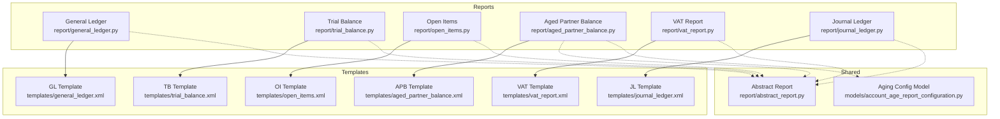
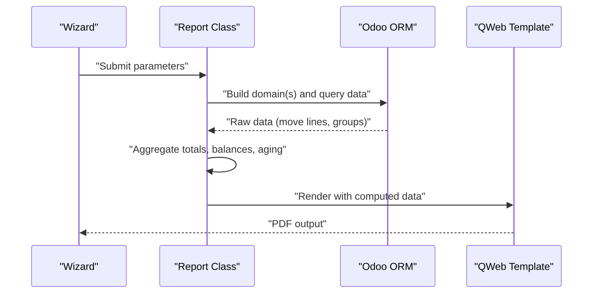
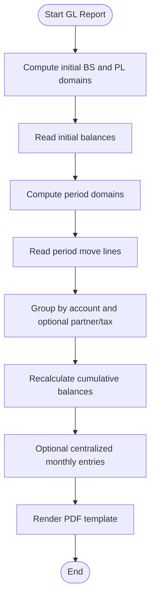
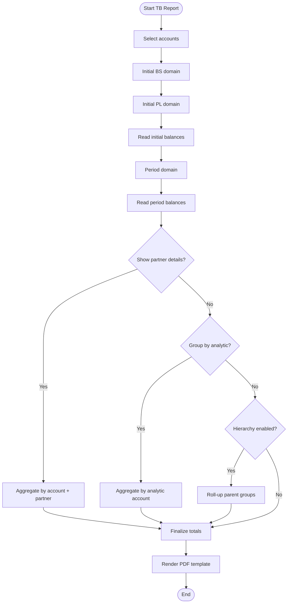
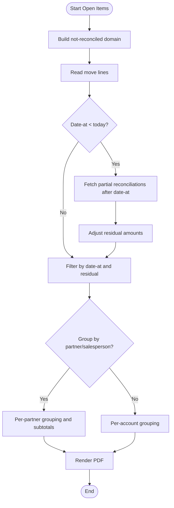
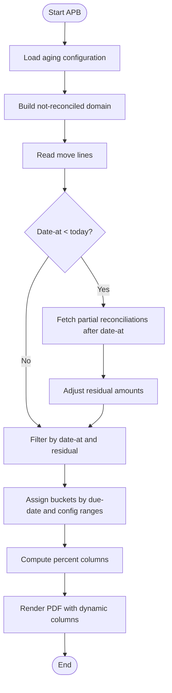
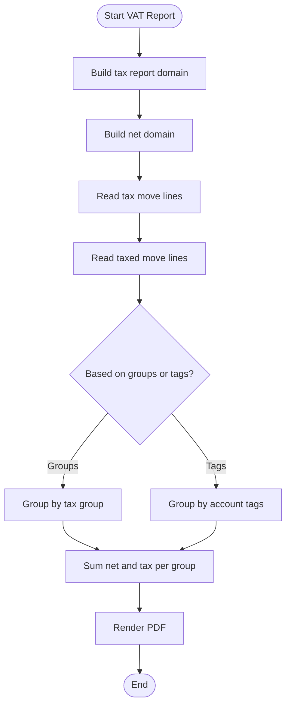
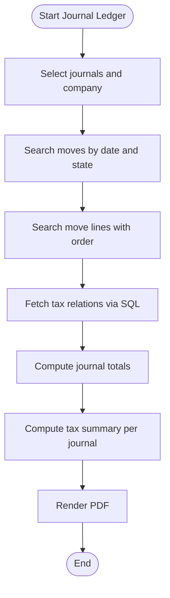
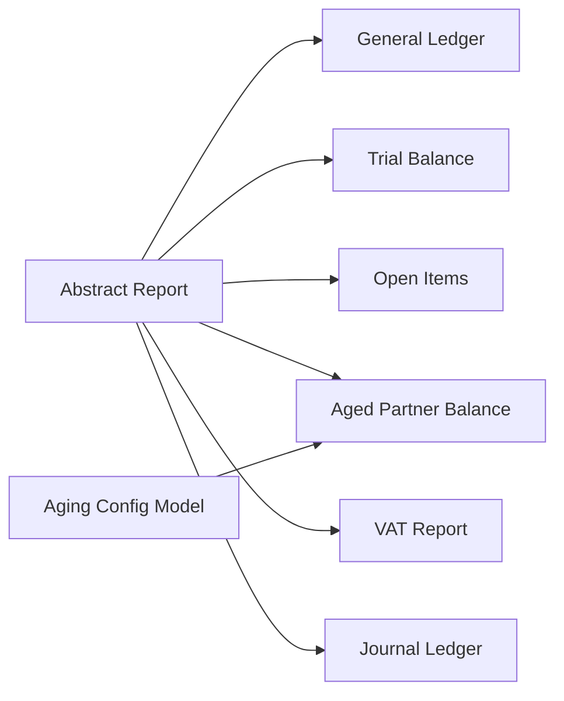

# Report Specifications

<cite>
**Referenced Files in This Document**
- [general_ledger.py](file://report/general_ledger.py)
- [trial_balance.py](file://report/trial_balance.py)
- [open_items.py](file://report/open_items.py)
- [aged_partner_balance.py](file://report/aged_partner_balance.py)
- [vat_report.py](file://report/vat_report.py)
- [journal_ledger.py](file://report/journal_ledger.py)
- [abstract_report.py](file://report/abstract_report.py)
- [account_age_report_configuration.py](file://models/account_age_report_configuration.py)
- [general_ledger.xml](file://report/templates/general_ledger.xml)
- [trial_balance.xml](file://report/templates/trial_balance.xml)
- [open_items.xml](file://report/templates/open_items.xml)
- [aged_partner_balance.xml](file://report/templates/aged_partner_balance.xml)
- [vat_report.xml](file://report/templates/vat_report.xml)
- [journal_ledger.xml](file://report/templates/journal_ledger.xml)
</cite>

## Table of Contents
1. [Introduction](#introduction)
2. [Project Structure](#project-structure)
3. [Core Components](#core-components)
4. [Architecture Overview](#architecture-overview)
5. [Detailed Component Analysis](#detailed-component-analysis)
6. [Dependency Analysis](#dependency-analysis)
7. [Performance Considerations](#performance-considerations)
8. [Troubleshooting Guide](#troubleshooting-guide)
9. [Conclusion](#conclusion)

## Introduction
This document provides comprehensive specifications for financial reports included in the accounting module. It covers each report’s purpose, data fields, calculations, output formats, filtering capabilities, and export options. Reports documented here include the General Ledger, Trial Balance, Open Items, Aged Partner Balance, VAT Report, and Journal Ledger.

## Project Structure
The reporting system is organized around Odoo QWeb templates and Python report classes. Each report has:
- A Python report class implementing data retrieval and aggregation logic
- An XML template defining the HTML output and column layout
- Wizard forms for user input (filters, date ranges, grouping options)
- Optional model configurations (e.g., aging period definitions)

**Diagram sources**
- [general_ledger.py:14-931](file://report/general_ledger.py#L14-L931)
- [trial_balance.py:12-981](file://report/trial_balance.py#L12-L981)
- [open_items.py:13-310](file://report/open_items.py#L13-L310)
- [aged_partner_balance.py:12-473](file://report/aged_partner_balance.py#L12-L473)
- [vat_report.py:10-244](file://report/vat_report.py#L10-L244)
- [journal_ledger.py:11-376](file://report/journal_ledger.py#L11-L376)
- [abstract_report.py:7-165](file://report/abstract_report.py#L7-L165)
- [account_age_report_configuration.py:8-50](file://models/account_age_report_configuration.py#L8-L50)
- [general_ledger.xml:1-789](file://report/templates/general_ledger.xml#L1-L789)
- [trial_balance.xml:1-993](file://report/templates/trial_balance.xml#L1-L993)
- [open_items.xml:1-455](file://report/templates/open_items.xml#L1-L455)
- [aged_partner_balance.xml:1-812](file://report/templates/aged_partner_balance.xml#L1-L812)
- [vat_report.xml:1-168](file://report/templates/vat_report.xml#L1-L168)
- [journal_ledger.xml:1-512](file://report/templates/journal_ledger.xml#L1-L512)

**Section sources**
- [general_ledger.py:14-931](file://report/general_ledger.py#L14-L931)
- [trial_balance.py:12-981](file://report/trial_balance.py#L12-L981)
- [open_items.py:13-310](file://report/open_items.py#L13-L310)
- [aged_partner_balance.py:12-473](file://report/aged_partner_balance.py#L12-L473)
- [vat_report.py:10-244](file://report/vat_report.py#L10-L244)
- [journal_ledger.py:11-376](file://report/journal_ledger.py#L11-L376)
- [abstract_report.py:7-165](file://report/abstract_report.py#L7-L165)
- [account_age_report_configuration.py:8-50](file://models/account_age_report_configuration.py#L8-L50)
- [general_ledger.xml:1-789](file://report/templates/general_ledger.xml#L1-L789)
- [trial_balance.xml:1-993](file://report/templates/trial_balance.xml#L1-L993)
- [open_items.xml:1-455](file://report/templates/open_items.xml#L1-L455)
- [aged_partner_balance.xml:1-812](file://report/templates/aged_partner_balance.xml#L1-L812)
- [vat_report.xml:1-168](file://report/templates/vat_report.xml#L1-L168)
- [journal_ledger.xml:1-512](file://report/templates/journal_ledger.xml#L1-L512)

## Core Components
- Abstract Report: Provides shared helpers for move line domains, recalculations, and common field sets used across reports.
- Aging Configuration Model: Defines customizable aging intervals for the Aged Partner Balance report.
- Report Classes: Implement data extraction, grouping, and aggregation logic for each report type.
- Templates: Define HTML output, column headers, and formatting for each report.

Key shared capabilities:
- Filtering by date range, company, accounts, partners, journals, and target moves (posted vs draft).
- Foreign currency support with separate columns and conversions.
- Grouping options (partners, taxes, analytic accounts) where applicable.
- Export formats: PDF via QWeb templates.

**Section sources**
- [abstract_report.py:7-165](file://report/abstract_report.py#L7-L165)
- [account_age_report_configuration.py:8-50](file://models/account_age_report_configuration.py#L8-L50)

## Architecture Overview
Each report follows a consistent pattern:
- Wizard collects parameters (dates, accounts, partners, filters).
- Report class builds domains and executes read_group/search_read queries.
- Aggregation logic computes totals, balances, and aging buckets.
- Templates render the final output with proper formatting and optional totals.

**Diagram sources**
- [general_ledger.py:763-800](file://report/general_ledger.py#L763-L800)
- [trial_balance.py:406-622](file://report/trial_balance.py#L406-L622)
- [open_items.py:245-297](file://report/open_items.py#L245-L297)
- [aged_partner_balance.py:411-465](file://report/aged_partner_balance.py#L411-L465)
- [vat_report.py:203-234](file://report/vat_report.py#L203-L234)
- [journal_ledger.py:302-375](file://report/journal_ledger.py#L302-L375)

## Detailed Component Analysis

### General Ledger Report
Purpose:
- Transaction-level detail ledger with cumulative balances, optional partner grouping, and tax breakdown.

Key capabilities:
- Initial and period balances computation with separate handling for profit-and-loss accounts.
- Partner grouping and tax grouping modes.
- Cumulative balance calculation across transactions.
- Centralized monthly entries for selected accounts.
- Reconciliation adjustments for future reconciliations after the reporting period.

Data fields:
- Header: Company, currency, date range, filters.
- Account rows: Code, name, initial and ending balances.
- Transaction lines: Date, entry, journal, account, taxes, partner, reference/label, matching number, debit, credit, cumulative balance, optional foreign currency columns.

Calculations:
- Initial balances split between balance sheet and profit-and-loss accounts.
- Cumulative balance updated per line using previous balance.
- Centralized entries aggregated by journal and month up to the reporting end date.

Grouping options:
- Group by partners or taxes when requested; otherwise show per-account lines.

Output format:
- PDF via QWeb template with grouped sections per account and optional per-partner subsections.

Technical specifications:
- Domains filter by company, accounts, partners, journals, and target moves.
- Foreign currency columns enabled when configured.
- Unaffected earnings integration adds profit-and-loss balances to selected accounts.

**Section sources**
- [general_ledger.py:14-931](file://report/general_ledger.py#L14-L931)
- [general_ledger.xml:1-789](file://report/templates/general_ledger.xml#L1-L789)

**Diagram sources**
- [general_ledger.py:258-695](file://report/general_ledger.py#L258-L695)

### Trial Balance Report
Purpose:
- Trial balance across accounts with optional partner detail and account hierarchy/grouping.

Key capabilities:
- Separate handling of balance sheet and profit-and-loss initial balances.
- Partner detail mode aggregates by account and partner.
- Account hierarchy/grouping with parent-child roll-up.
- Analytic account grouping option.
- Unaffected earnings integration for profit-and-loss adjustments.

Data fields:
- Account rows: Code, name, initial balance, debit, credit, period balance, ending balance, optional foreign currency columns.
- Partner rows (when enabled): Partner name, same balance columns.
- Group rows (when grouping by analytic accounts): Group name, account list, totals.

Calculations:
- Summarize debits/credits per account and partner.
- Compute ending balances by adding period balances to initial balances.
- Hierarchical roll-up sums parent groups from children.
- Profit-and-loss adjustment added to the unaffected earnings account when present.

Grouping options:
- By analytic accounts (alternative to standard account list).
- By account groups with parent aggregation.

Output format:
- PDF via QWeb template with optional grouped sections and totals.

Technical specifications:
- Domains include company, accounts, journals, partners, and target moves.
- Foreign currency columns enabled when configured.
- Hide accounts at zero toggle removes zero-balance accounts when requested.

**Section sources**
- [trial_balance.py:12-981](file://report/trial_balance.py#L12-L981)
- [trial_balance.xml:1-993](file://report/templates/trial_balance.xml#L1-L993)

**Diagram sources**
- [trial_balance.py:406-688](file://report/trial_balance.py#L406-L688)

### Open Items Report
Purpose:
- Outstanding receivables/payables tracking with maturity dates and residual amounts.

Key capabilities:
- Filters for date-at, target moves, and grouping by partner or salesperson.
- Recalculation of residual amounts considering partial reconciliations occurring after the reporting date.
- Optional partner detail mode with per-partner subtotals.
- Currency columns for residual and original amounts.

Data fields:
- Account rows: Code, name, and per-account totals.
- Transaction lines: Date, entry, journal, account, partner, reference/label, due date, original, residual, optional currency columns.

Calculations:
- Residual amounts adjusted for reconciliations after the reporting date.
- Subtotals computed per account and per partner when enabled.
- Sorting by account code and partner name/date.

Grouping options:
- Group by partner or salesperson (based on partner salesperson).

Output format:
- PDF via QWeb template with optional grouped sections and subtotals.

Technical specifications:
- Domain excludes reconciled lines and applies date-from constraints.
- Foreign currency columns enabled when configured.
- Hide accounts at zero toggle controls inclusion of zero balances.

**Section sources**
- [open_items.py:13-310](file://report/open_items.py#L13-L310)
- [open_items.xml:1-455](file://report/templates/open_items.xml#L1-L455)

**Diagram sources**
- [open_items.py:62-243](file://report/open_items.py#L62-L243)

### Aged Partner Balance Report
Purpose:
- Receivables/payables aging with customizable buckets and dynamic configuration.

Key capabilities:
- Dynamic aging buckets defined by configuration lines with custom names and lower limits.
- Per-account and per-partner totals with optional move-line details.
- Percent calculations for each bucket relative to residual.
- Recalculation of residual amounts considering reconciliations after the reporting date.

Data fields:
- Account rows: Code, name, residual, current, and aging buckets (including dynamic columns).
- Partner rows (optional): Partner name, residual, current, and aging buckets.
- Move-line details (optional): Date, entry, journal, account, reference/label, due date, residual, and bucket allocations.

Calculations:
- Bucket assignment based on due-date differences and configuration ranges.
- Percentages computed from residual totals.
- Recalculation of residuals for lines with future reconciliations.

Grouping options:
- Show move-line details per partner or aggregated view.

Output format:
- PDF via QWeb template with dynamic column headers and percent rows.

Technical specifications:
- Uses a context-bound aging configuration model to define bucket ranges.
- Domain excludes reconciled lines and applies date-from constraints.
- Percent columns generated dynamically from configuration lines.

**Section sources**
- [aged_partner_balance.py:12-473](file://report/aged_partner_balance.py#L12-L473)
- [account_age_report_configuration.py:8-50](file://models/account_age_report_configuration.py#L8-L50)
- [aged_partner_balance.xml:1-812](file://report/templates/aged_partner_balance.xml#L1-L812)

**Diagram sources**
- [aged_partner_balance.py:143-409](file://report/aged_partner_balance.py#L143-L409)

### VAT Report
Purpose:
- VAT reporting by tax groups or tags with net and tax amounts.

Key capabilities:
- Two aggregation modes: by tax groups or by account tags.
- Exigibility-aware domains to include only exigible lines.
- Optional tax detail showing individual taxes within groups/tags.

Data fields:
- Rows: Code, name, net, tax.
- Optional tax detail rows when enabled: tax name, net, tax.

Calculations:
- Sum net and tax amounts per group/tag.
- Optionally sum per-tax when detail is enabled.

Grouping options:
- Based on tax groups or tags depending on selection.

Output format:
- PDF via QWeb template with grouped rows and optional detail.

Technical specifications:
- Domains exclude lines without tax lines and apply exigibility conditions.
- Foreign currency columns not used in this report.

**Section sources**
- [vat_report.py:10-244](file://report/vat_report.py#L10-L244)
- [vat_report.xml:1-168](file://report/templates/vat_report.xml#L1-L168)

**Diagram sources**
- [vat_report.py:59-201](file://report/vat_report.py#L59-L201)

### Journal Ledger Report
Purpose:
- Journal-specific tracking with transaction analysis and tax summaries.

Key capabilities:
- Journal-level grouping or combined view.
- Tax analysis per journal and overall.
- Optional display of account names and auto-sequenced entries.
- Exigibility-aware tax amounts for base and tax lines.

Data fields:
- Journal rows: Name, currency, debit, credit.
- Move rows: Entry, date, account, partner, label, taxes, debit, credit, optional currency columns.
- Tax summary rows: Tax name, description, base debit/credit/balance, tax debit/credit/balance.

Calculations:
- Journal totals computed from move lines.
- Tax totals aggregated from move lines and related tax relations.
- Auto-sequence numbers per move for ordering.

Grouping options:
- Group by journal or show all moves together.

Output format:
- PDF via QWeb template with grouped sections and tax summaries.

Technical specifications:
- Domains filter by date range, journals, and target moves.
- Foreign currency columns enabled when configured.
- Efficient SQL query for tax relations to reduce overhead.

**Section sources**
- [journal_ledger.py:11-376](file://report/journal_ledger.py#L11-L376)
- [journal_ledger.xml:1-512](file://report/templates/journal_ledger.xml#L1-L512)

**Diagram sources**
- [journal_ledger.py:27-375](file://report/journal_ledger.py#L27-L375)

## Dependency Analysis
- Shared helpers: All report classes inherit common domain building, recalculations, and field sets from the abstract report.
- Aging configuration: The Aged Partner Balance report depends on a configuration model to define dynamic aging buckets.
- Templates: Each report has a dedicated QWeb template controlling output structure and column widths.
- Wizards: Each report has a wizard form to collect parameters (dates, accounts, partners, filters).

**Diagram sources**
- [abstract_report.py:7-165](file://report/abstract_report.py#L7-L165)
- [account_age_report_configuration.py:8-50](file://models/account_age_report_configuration.py#L8-L50)

**Section sources**
- [abstract_report.py:7-165](file://report/abstract_report.py#L7-L165)
- [account_age_report_configuration.py:8-50](file://models/account_age_report_configuration.py#L8-L50)

## Performance Considerations
- Efficient domains: Reports build targeted domains to minimize dataset sizes.
- read_group usage: Aggregations leverage read_group for grouped sums and balances.
- Partial reconciliation recalculations: Only executed when date-at is earlier than today to avoid unnecessary work.
- Tax relations via SQL: Journal Ledger uses a direct SQL query to fetch tax relations efficiently.
- Foreign currency toggles: Columns are included only when enabled to reduce rendering overhead.

[No sources needed since this section provides general guidance]

## Troubleshooting Guide
Common issues and resolutions:
- Zero balances hidden unexpectedly: Verify the “Hide account at 0” toggle in relevant reports.
- Missing profit-and-loss adjustments: Ensure the unaffected earnings account is properly configured and not filtered out by explicit account lists.
- Aging buckets incorrect: Confirm the aging configuration lines have unique names and positive lower limits.
- Future reconciliations not reflected: Ensure the date-at is set appropriately; recalculations occur only when date-at < today.
- Tax amounts mismatch: Confirm exigibility settings and that tax lines are included in the domains.

**Section sources**
- [abstract_report.py:57-123](file://report/abstract_report.py#L57-L123)
- [trial_balance.py:556-622](file://report/trial_balance.py#L556-L622)
- [aged_partner_balance.py:143-198](file://report/aged_partner_balance.py#L143-L198)

## Conclusion
The reporting suite provides comprehensive financial insights with robust filtering, grouping, and export capabilities. Each report leverages shared abstractions and templates to ensure consistency while supporting advanced features like dynamic aging, profit-and-loss integration, and tax exigibility. Users can tailor outputs via wizards and templates to meet diverse reporting needs.