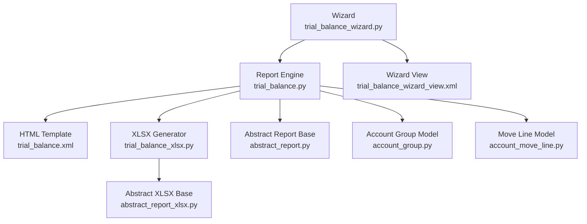
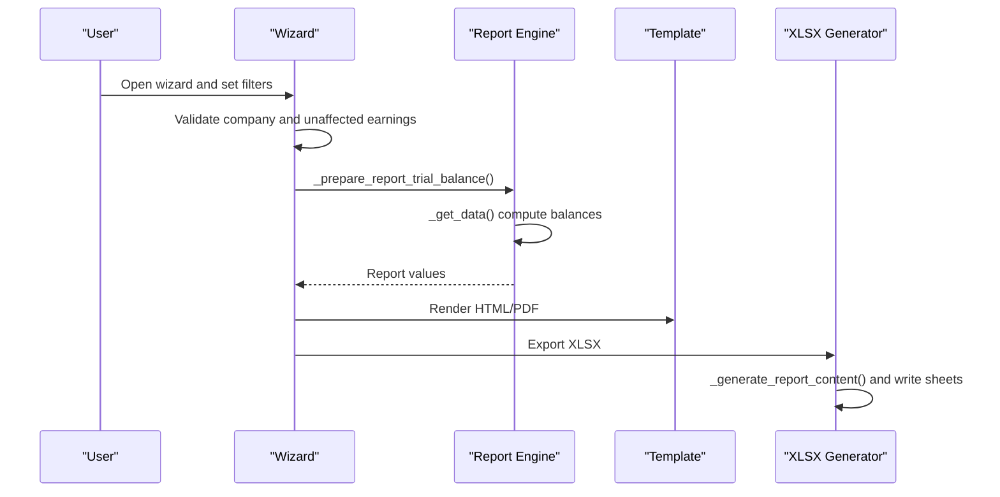
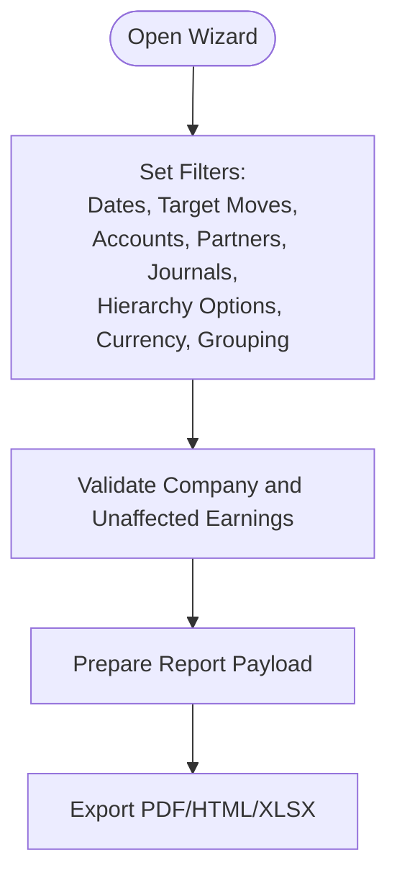
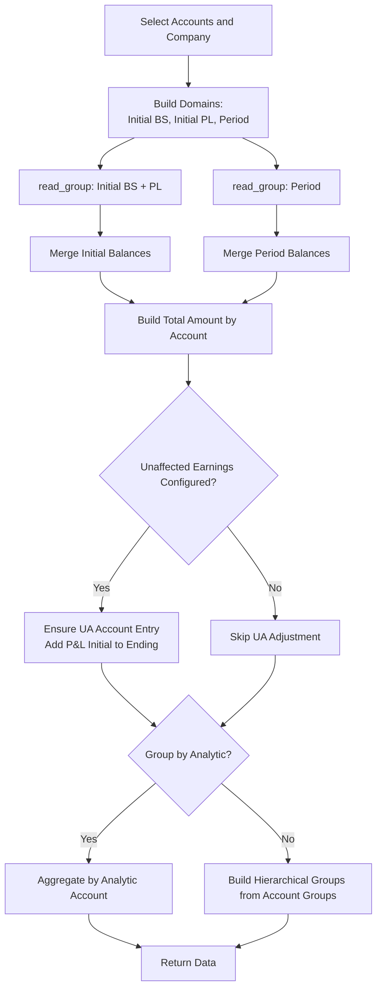
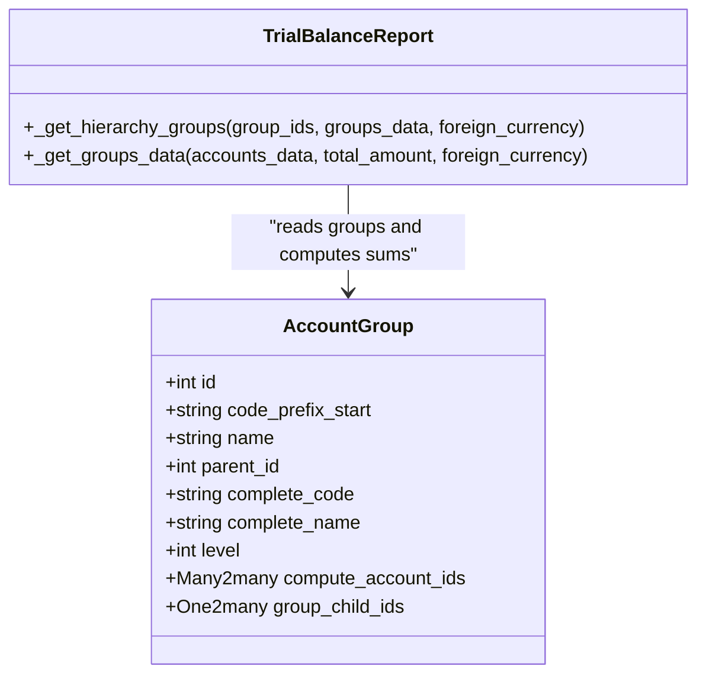
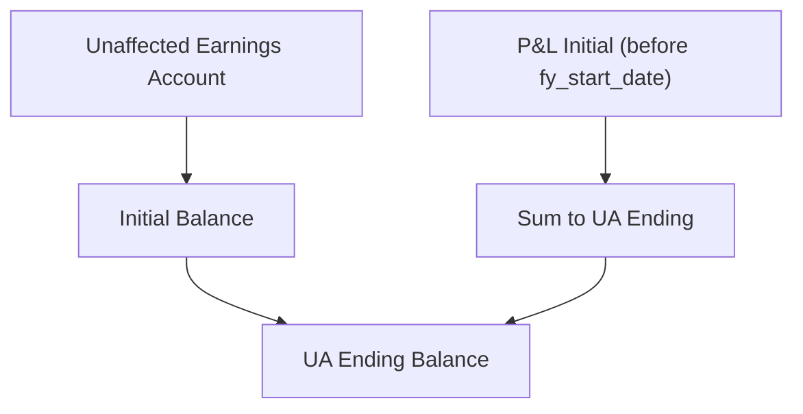
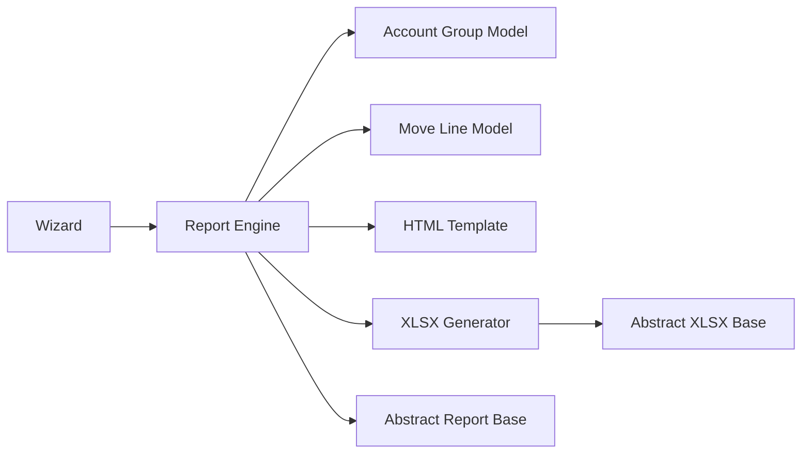

# Trial Balance Report

<cite>
**Referenced Files in This Document**
- [trial_balance.py](file://report/trial_balance.py)
- [trial_balance_xlsx.py](file://report/trial_balance_xlsx.py)
- [trial_balance_wizard.py](file://wizard/trial_balance_wizard.py)
- [trial_balance_wizard_view.xml](file://wizard/trial_balance_wizard_view.xml)
- [trial_balance.xml](file://report/templates/trial_balance.xml)
- [abstract_report.py](file://report/abstract_report.py)
- [abstract_report_xlsx.py](file://report/abstract_report_xlsx.py)
- [account_group.py](file://models/account_group.py)
- [account_move_line.py](file://models/account_move_line.py)
- [test_trial_balance.py](file://tests/test_trial_balance.py)
</cite>

## Table of Contents
1. [Introduction](#introduction)
2. [Project Structure](#project-structure)
3. [Core Components](#core-components)
4. [Architecture Overview](#architecture-overview)
5. [Detailed Component Analysis](#detailed-component-analysis)
6. [Dependency Analysis](#dependency-analysis)
7. [Performance Considerations](#performance-considerations)
8. [Troubleshooting Guide](#troubleshooting-guide)
9. [Conclusion](#conclusion)
10. [Appendices](#appendices)

## Introduction
This document specifies the Trial Balance Report functionality, focusing on how the report handles account hierarchies, aggregates balances across selected periods, integrates unaffected earnings (retained earnings equivalent), and presents data with flexible grouping and formatting options. It covers filtering capabilities, output formats, currency handling, and performance considerations, and provides examples of typical scenarios.

## Project Structure
The Trial Balance Report spans several modules:
- Wizard for user input and report configuration
- Report engine for computing balances and aggregations
- Templates for HTML/PDF rendering
- XLSX generator for spreadsheet output
- Models for account groups and analytic account ids
- Tests validating behavior

**Diagram sources**
- [trial_balance_wizard.py:12-285](file://wizard/trial_balance_wizard.py#L12-L285)
- [trial_balance.py:12-981](file://report/trial_balance.py#L12-L981)
- [trial_balance.xml:1-993](file://report/templates/trial_balance.xml#L1-L993)
- [trial_balance_xlsx.py:10-324](file://report/trial_balance_xlsx.py#L10-L324)
- [abstract_report.py:125-165](file://report/abstract_report.py#L125-L165)
- [abstract_report_xlsx.py:8-698](file://report/abstract_report_xlsx.py#L8-L698)
- [account_group.py:8-109](file://models/account_group.py#L8-L109)
- [account_move_line.py:9-71](file://models/account_move_line.py#L9-L71)
- [trial_balance_wizard_view.xml:1-159](file://wizard/trial_balance_wizard_view.xml#L1-L159)

**Section sources**
- [trial_balance_wizard.py:12-285](file://wizard/trial_balance_wizard.py#L12-L285)
- [trial_balance.py:12-981](file://report/trial_balance.py#L12-L981)
- [trial_balance.xml:1-993](file://report/templates/trial_balance.xml#L1-L993)
- [trial_balance_xlsx.py:10-324](file://report/trial_balance_xlsx.py#L10-L324)
- [abstract_report.py:125-165](file://report/abstract_report.py#L125-L165)
- [abstract_report_xlsx.py:8-698](file://report/abstract_report_xlsx.py#L8-L698)
- [account_group.py:8-109](file://models/account_group.py#L8-L109)
- [account_move_line.py:9-71](file://models/account_move_line.py#L9-L71)
- [trial_balance_wizard_view.xml:1-159](file://wizard/trial_balance_wizard_view.xml#L1-L159)

## Core Components
- Wizard: Collects filters (date range, target moves, accounts, partners, journals, hierarchy options, foreign currency, grouping), computes unaffected earnings account availability, and prepares report data.
- Report Engine: Computes initial and period balances, aggregates by account and optionally by partner, applies grouping by account groups or analytic accounts, and integrates unaffected earnings.
- Templates: Render HTML/PDF with filters, headers, rows, and footers; support hierarchical display and grouping.
- XLSX Generator: Produces Excel output with columns for account/partner, initial/period/ending balances, and optional foreign currency columns.
- Abstract Base Classes: Provide shared report utilities and XLSX formatting helpers.
- Models: Account groups and analytic account ids support hierarchical grouping and performance indexing.

**Section sources**
- [trial_balance_wizard.py:12-285](file://wizard/trial_balance_wizard.py#L12-L285)
- [trial_balance.py:12-981](file://report/trial_balance.py#L12-L981)
- [trial_balance.xml:1-993](file://report/templates/trial_balance.xml#L1-L993)
- [trial_balance_xlsx.py:10-324](file://report/trial_balance_xlsx.py#L10-L324)
- [abstract_report.py:125-165](file://report/abstract_report.py#L125-L165)
- [abstract_report_xlsx.py:8-698](file://report/abstract_report_xlsx.py#L8-L698)
- [account_group.py:8-109](file://models/account_group.py#L8-L109)
- [account_move_line.py:9-71](file://models/account_move_line.py#L9-L71)

## Architecture Overview
The report pipeline:
- Wizard validates company context and unaffected earnings account presence, builds a data payload.
- Report engine executes domain-based read_group queries to compute initial and period balances, merges account-level and partner-level data, and optionally groups by analytic accounts.
- Templates render HTML/PDF; XLSX generator writes structured spreadsheets with currency-aware formatting.

**Diagram sources**
- [trial_balance_wizard.py:242-285](file://wizard/trial_balance_wizard.py#L242-L285)
- [trial_balance.py:406-622](file://report/trial_balance.py#L406-L622)
- [trial_balance.xml:1-993](file://report/templates/trial_balance.xml#L1-L993)
- [trial_balance_xlsx.py:164-267](file://report/trial_balance_xlsx.py#L164-L267)

## Detailed Component Analysis

### Wizard and Filters
Key wizard fields and behaviors:
- Date range and fiscal year start date derived from date_from and company’s fiscal year settings.
- Target moves: posted vs all entries.
- Hierarchy display: show hierarchy, limit levels, hide parent levels.
- Accounts: explicit selection, receivable/payable-only filters, code-range selection.
- Partners, journals, hide accounts at 0, foreign currency, grouping by analytic account.
- Unaffected earnings account: auto-computed if exactly one exists for the company.

**Diagram sources**
- [trial_balance_wizard.py:19-74](file://wizard/trial_balance_wizard.py#L19-L74)
- [trial_balance_wizard.py:122-129](file://wizard/trial_balance_wizard.py#L122-L129)
- [trial_balance_wizard.py:258-280](file://wizard/trial_balance_wizard.py#L258-L280)

**Section sources**
- [trial_balance_wizard.py:19-74](file://wizard/trial_balance_wizard.py#L19-L74)
- [trial_balance_wizard.py:122-129](file://wizard/trial_balance_wizard.py#L122-L129)
- [trial_balance_wizard.py:258-280](file://wizard/trial_balance_wizard.py#L258-L280)
- [trial_balance_wizard_view.xml:1-159](file://wizard/trial_balance_wizard_view.xml#L1-L159)

### Report Engine: Balances and Aggregation
Core computation steps:
- Build domains for initial balances (before date_from), including profit-and-loss (P&L) initial balances between fy_start_date and date_from, and period balances within date_from..date_to.
- Use read_group to aggregate by account_id, currency_id, and optionally analytic_account_ids.
- Merge initial and period balances into a unified total_amount structure keyed by account id.
- Optionally compute partner-level balances keyed by account_id -> partner_id.
- Integrate unaffected earnings: if configured, ensure the unaffected earnings account appears in results and add P&L initial balance to its ending balance.
- Group by analytic accounts when requested; otherwise, build hierarchical groups from account groups.

**Diagram sources**
- [trial_balance.py:17-172](file://report/trial_balance.py#L17-L172)
- [trial_balance.py:406-622](file://report/trial_balance.py#L406-L622)
- [trial_balance.py:624-688](file://report/trial_balance.py#L624-L688)
- [trial_balance.py:690-745](file://report/trial_balance.py#L690-L745)

**Section sources**
- [trial_balance.py:17-172](file://report/trial_balance.py#L17-L172)
- [trial_balance.py:406-622](file://report/trial_balance.py#L406-L622)
- [trial_balance.py:624-688](file://report/trial_balance.py#L624-L688)
- [trial_balance.py:690-745](file://report/trial_balance.py#L690-L745)

### Account Hierarchy Handling
- Hierarchical groups: The report builds a hierarchy from account groups, summing child accounts into parent groups, and supports limiting displayed levels and hiding parent levels.
- Complete code and name are computed recursively to reflect full hierarchy paths.
- When hierarchy is enabled, the template renders group rows distinctly and applies level-based visibility controls.

**Diagram sources**
- [account_group.py:8-109](file://models/account_group.py#L8-L109)
- [trial_balance.py:690-745](file://report/trial_balance.py#L690-L745)

**Section sources**
- [account_group.py:8-109](file://models/account_group.py#L8-L109)
- [trial_balance.py:690-745](file://report/trial_balance.py#L690-L745)
- [trial_balance.xml:100-122](file://report/templates/trial_balance.xml#L100-L122)

### Unaffected Earnings Integration (Retained Earnings Equivalent)
- The report ensures the unaffected earnings account is included in the output when configured.
- P&L balances from the prior fiscal year (before fy_start_date) are added to the unaffected earnings account’s ending balance.
- If the user selects specific accounts, the unaffected earnings integration is disabled to avoid duplication.

**Diagram sources**
- [trial_balance.py:557-622](file://report/trial_balance.py#L557-L622)
- [trial_balance_wizard.py:53-56](file://wizard/trial_balance_wizard.py#L53-L56)

**Section sources**
- [trial_balance.py:557-622](file://report/trial_balance.py#L557-L622)
- [trial_balance_wizard.py:53-56](file://wizard/trial_balance_wizard.py#L53-L56)
- [test_trial_balance.py:510-673](file://tests/test_trial_balance.py#L510-L673)

### Filtering Capabilities
- Date range: date_from, date_to, and fy_start_date.
- Target moves: posted vs all entries.
- Accounts: explicit ids, receivable/payable-only, code-range selection.
- Partners and journals: multi-select filters.
- Hierarchy: show hierarchy, limit levels, hide parent levels.
- Foreign currency: display foreign currency columns when enabled.
- Grouping: analytic account grouping (mutually exclusive with hierarchy and partner details).

**Section sources**
- [trial_balance_wizard.py:19-74](file://wizard/trial_balance_wizard.py#L19-L74)
- [trial_balance_wizard.py:75-80](file://wizard/trial_balance_wizard.py#L75-L80)
- [trial_balance_wizard.py:81-98](file://wizard/trial_balance_wizard.py#L81-L98)
- [trial_balance_wizard.py:131-177](file://wizard/trial_balance_wizard.py#L131-L177)
- [trial_balance_wizard.py:179-198](file://wizard/trial_balance_wizard.py#L179-L198)
- [trial_balance_wizard.py:217-225](file://wizard/trial_balance_wizard.py#L217-L225)
- [trial_balance_wizard.py:226-240](file://wizard/trial_balance_wizard.py#L226-L240)

### Output Formats and Formatting
- HTML/PDF: Template-driven rendering with columns for account/partner, initial/period/ending balances, and optional foreign currency columns.
- XLSX: Structured columns with currency-aware number formatting; supports grouped-by-analytic-account mode with per-group totals and a final total row.

**Section sources**
- [trial_balance.xml:213-249](file://report/templates/trial_balance.xml#L213-L249)
- [trial_balance.xml:250-753](file://report/templates/trial_balance.xml#L250-L753)
- [trial_balance.xml:881-991](file://report/templates/trial_balance.xml#L881-L991)
- [trial_balance_xlsx.py:24-127](file://report/trial_balance_xlsx.py#L24-L127)
- [trial_balance_xlsx.py:164-267](file://report/trial_balance_xlsx.py#L164-L267)
- [abstract_report_xlsx.py:526-603](file://report/abstract_report_xlsx.py#L526-L603)

### Data Fields and Structure
- Account-level fields: code, name, initial_balance, debit, credit, balance, ending_balance, and optional foreign currency equivalents.
- Partner-level fields: partner_name, plus the same amount fields aggregated per partner.
- Group-level fields: group_type entries with aggregated totals and parent-child relationships.
- Analytic grouping fields: grouped_by and group_by_data keyed by analytic account id.

**Section sources**
- [trial_balance.py:290-301](file://report/trial_balance.py#L290-L301)
- [trial_balance.py:406-622](file://report/trial_balance.py#L406-L622)
- [trial_balance.py:624-688](file://report/trial_balance.py#L624-L688)
- [trial_balance_xlsx.py:24-127](file://report/trial_balance_xlsx.py#L24-L127)

### Typical Scenarios and Examples
- Hierarchy with initial balances: Demonstrates that accounts under groups appear with initial balances and that group totals reflect children.
- Partner details: Shows per-partner lines for receivable/payable accounts.
- Unaffected earnings integration: Demonstrates adding prior-year P&L balances to the unaffected earnings account and verifying trial balance totals.

**Section sources**
- [test_trial_balance.py:260-414](file://tests/test_trial_balance.py#L260-L414)
- [test_trial_balance.py:416-509](file://tests/test_trial_balance.py#L416-L509)
- [test_trial_balance.py:510-673](file://tests/test_trial_balance.py#L510-L673)

## Dependency Analysis
- Wizard depends on company, date range, and unaffected earnings account existence.
- Report engine depends on account groups, analytic account ids, and move line read_group queries.
- Templates depend on report data structure and currency context.
- XLSX generator depends on abstract XLSX base and report data.

**Diagram sources**
- [trial_balance_wizard.py:12-285](file://wizard/trial_balance_wizard.py#L12-L285)
- [trial_balance.py:12-981](file://report/trial_balance.py#L12-L981)
- [account_group.py:8-109](file://models/account_group.py#L8-L109)
- [account_move_line.py:9-71](file://models/account_move_line.py#L9-L71)
- [trial_balance.xml:1-993](file://report/templates/trial_balance.xml#L1-L993)
- [trial_balance_xlsx.py:10-324](file://report/trial_balance_xlsx.py#L10-L324)
- [abstract_report_xlsx.py:8-698](file://report/abstract_report_xlsx.py#L8-L698)
- [abstract_report.py:125-165](file://report/abstract_report.py#L125-L165)

**Section sources**
- [trial_balance_wizard.py:12-285](file://wizard/trial_balance_wizard.py#L12-L285)
- [trial_balance.py:12-981](file://report/trial_balance.py#L12-L981)
- [account_group.py:8-109](file://models/account_group.py#L8-L109)
- [account_move_line.py:9-71](file://models/account_move_line.py#L9-L71)
- [trial_balance.xml:1-993](file://report/templates/trial_balance.xml#L1-L993)
- [trial_balance_xlsx.py:10-324](file://report/trial_balance_xlsx.py#L10-L324)
- [abstract_report_xlsx.py:8-698](file://report/abstract_report_xlsx.py#L8-L698)
- [abstract_report.py:125-165](file://report/abstract_report.py#L125-L165)

## Performance Considerations
- Indexing: A dedicated index on account_move_line for account_id and partner_id improves performance for initial balance joins.
- read_group usage: Efficient aggregation by account_id, currency_id, and analytic_account_ids reduces memory overhead.
- Domain scoping: Narrow domains by company, accounts, journals, and partners minimizes dataset size.
- Hiding accounts at 0: Reduces report size and rendering cost.
- Analytic grouping: When enabled, grouping by analytic accounts can increase computation; use judiciously.

**Section sources**
- [account_move_line.py:53-62](file://models/account_move_line.py#L53-L62)
- [trial_balance.py:406-622](file://report/trial_balance.py#L406-L622)

## Troubleshooting Guide
- Hierarchy structure errors: The report raises an error if account group hierarchy is inconsistent during aggregation.
- Company/date range mismatch: Validation prevents mismatch between wizard company and selected date range company.
- Unaffected earnings availability: If multiple unaffected earnings accounts exist, the wizard disables export buttons until corrected.
- Partner details vs grouping: Enabling partner details disables analytic grouping and hierarchy options.

**Section sources**
- [trial_balance.py:701-708](file://report/trial_balance.py#L701-L708)
- [trial_balance_wizard.py:185-198](file://wizard/trial_balance_wizard.py#L185-L198)
- [trial_balance_wizard.py:122-129](file://wizard/trial_balance_wizard.py#L122-L129)
- [trial_balance_wizard.py:75-80](file://wizard/trial_balance_wizard.py#L75-L80)
- [trial_balance_wizard.py:217-225](file://wizard/trial_balance_wizard.py#L217-L225)

## Conclusion
The Trial Balance Report provides robust financial reporting with hierarchical grouping, partner-level detail, and unaffected earnings integration. Its modular architecture separates user configuration (wizard), computation (engine), presentation (templates), and export (XLSX), enabling flexible filtering, currency handling, and scalable performance through efficient aggregation and indexing.

## Appendices

### Technical Specifications: Balance Calculation Algorithms
- Initial balances:
  - Balance before date_from for balance sheet accounts.
  - Balance between fy_start_date and date_from for profit-and-loss accounts.
- Period balances:
  - Sum of debit, credit, and balance within date_from..date_to.
- Merging:
  - Combine initial and period balances per account; merge partner-level data if enabled.
- Grouping:
  - Hierarchical groups: sum child accounts into parents; limit levels if requested.
  - Analytic grouping: aggregate by analytic account ids with per-group and total rows.

**Section sources**
- [trial_balance.py:17-172](file://report/trial_balance.py#L17-L172)
- [trial_balance.py:406-622](file://report/trial_balance.py#L406-L622)
- [trial_balance.py:624-688](file://report/trial_balance.py#L624-L688)
- [trial_balance.py:690-745](file://report/trial_balance.py#L690-L745)

### Currency Handling
- When foreign_currency is enabled, the report adds columns for initial_currency_balance and ending_currency_balance and formats currency values per currency context in both HTML and XLSX outputs.

**Section sources**
- [trial_balance_xlsx.py:60-76](file://report/trial_balance_xlsx.py#L60-L76)
- [trial_balance_xlsx.py:111-127](file://report/trial_balance_xlsx.py#L111-L127)
- [abstract_report_xlsx.py:526-603](file://report/abstract_report_xlsx.py#L526-L603)
- [trial_balance.xml:607-751](file://report/templates/trial_balance.xml#L607-L751)

### Configuration Options Summary
- Filters: date_from, date_to, target_move, hide_account_at_0, foreign_currency, grouped_by, show_partner_details, show_hierarchy, limit_hierarchy_level, show_hierarchy_level, hide_parent_hierarchy_level.
- Accounts: account_ids, receivable_accounts_only, payable_accounts_only, account_code_from, account_code_to.
- Context: company_id, unaffected_earnings_account.

**Section sources**
- [trial_balance_wizard.py:19-74](file://wizard/trial_balance_wizard.py#L19-L74)
- [trial_balance_wizard.py:258-280](file://wizard/trial_balance_wizard.py#L258-L280)