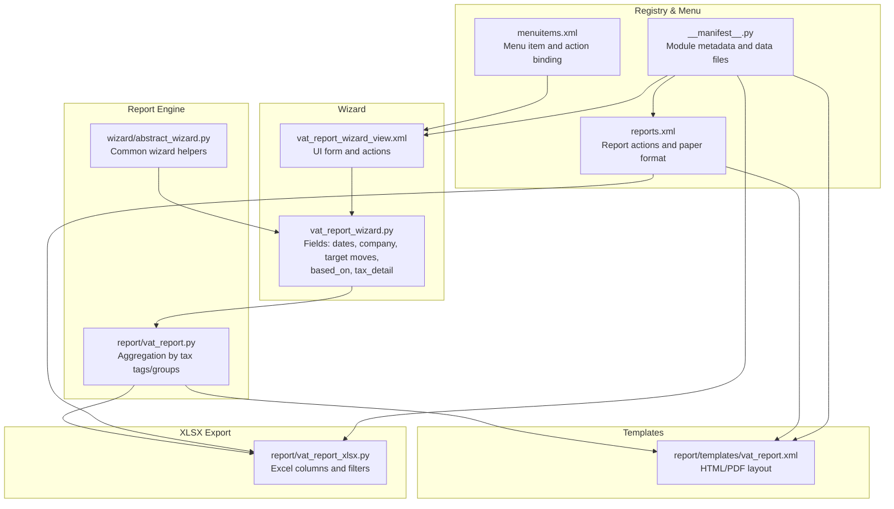
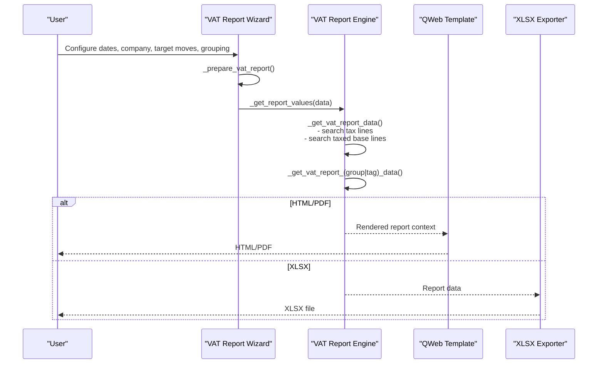
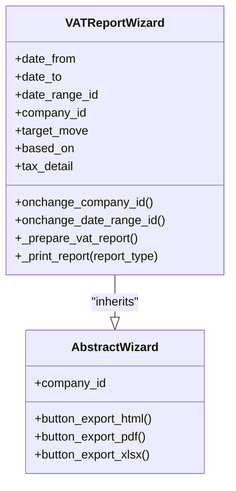
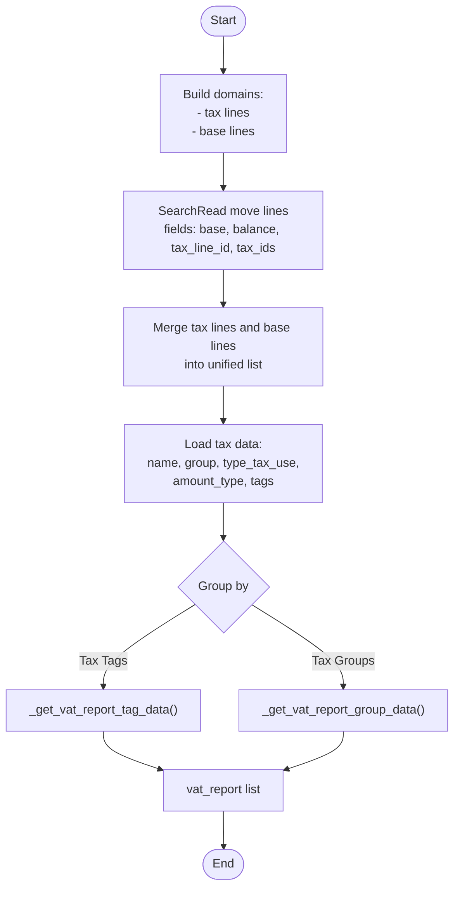
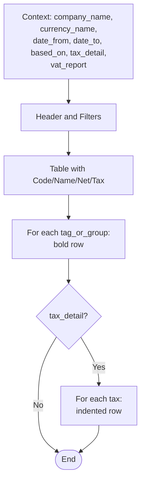
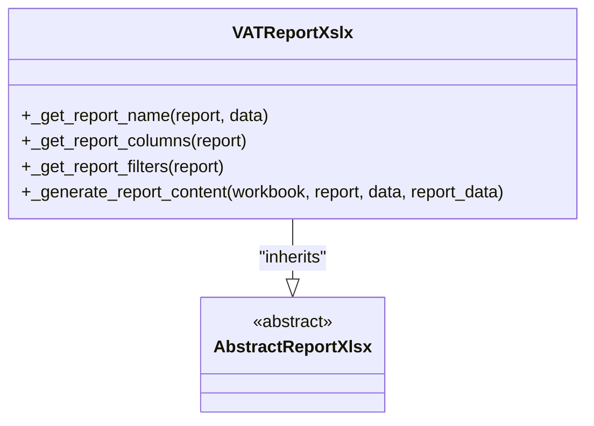
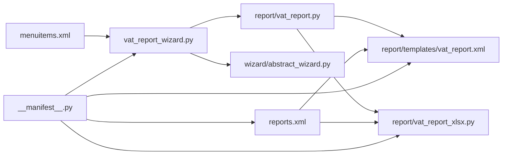

# VAT Report

<cite>
**Referenced Files in This Document**
- [vat_report.py](file://report/vat_report.py)
- [vat_report_xlsx.py](file://report/vat_report_xlsx.py)
- [vat_report.xml](file://report/templates/vat_report.xml)
- [vat_report_wizard.py](file://wizard/vat_report_wizard.py)
- [vat_report_wizard_view.xml](file://wizard/vat_report_wizard_view.xml)
- [abstract_wizard.py](file://wizard/abstract_wizard.py)
- [reports.xml](file://reports.xml)
- [menuitems.xml](file://menuitems.xml)
- [test_vat_report.py](file://tests/test_vat_report.py)
- [README.rst](file://README.rst)
- [__manifest__.py](file://__manifest__.py)
</cite>

## Table of Contents
1. [Introduction](#introduction)
2. [Project Structure](#project-structure)
3. [Core Components](#core-components)
4. [Architecture Overview](#architecture-overview)
5. [Detailed Component Analysis](#detailed-component-analysis)
6. [Dependency Analysis](#dependency-analysis)
7. [Performance Considerations](#performance-considerations)
8. [Troubleshooting Guide](#troubleshooting-guide)
9. [Conclusion](#conclusion)
10. [Appendices](#appendices)

## Introduction
This document describes the VAT Report specification and implementation within the Account Financial Reports module. It explains how VAT-related transactions are extracted from journal entries, grouped by tax tags or tax groups, and aggregated into a standardized format suitable for tax authority submissions. It covers the wizard configuration, filtering capabilities, output formats (HTML/PDF/XLSX), and compliance formatting requirements. It also documents the underlying tax calculation engine, currency handling, and integration with Odoo’s tax system.

## Project Structure
The VAT Report spans several modules:
- Wizard: user-facing configuration and report launch
- Report engine: data extraction and aggregation
- Templates: HTML/PDF rendering
- XLSX exporter: Excel output generation
- Tests: scenario-driven verification of calculations and grouping

**Diagram sources**
- [vat_report_wizard.py:1-101](file://wizard/vat_report_wizard.py#L1-L101)
- [vat_report_wizard_view.xml:1-61](file://wizard/vat_report_wizard_view.xml#L1-L61)
- [vat_report.py:1-244](file://report/vat_report.py#L1-L244)
- [abstract_wizard.py:1-52](file://wizard/abstract_wizard.py#L1-L52)
- [vat_report.xml:1-168](file://report/templates/vat_report.xml#L1-L168)
- [vat_report_xlsx.py:1-62](file://report/vat_report_xlsx.py#L1-L62)
- [reports.xml:1-174](file://reports.xml#L1-L174)
- [menuitems.xml:1-46](file://menuitems.xml#L1-L46)
- [__manifest__.py:1-58](file://__manifest__.py#L1-L58)

**Section sources**
- [vat_report_wizard.py:1-101](file://wizard/vat_report_wizard.py#L1-L101)
- [vat_report.py:1-244](file://report/vat_report.py#L1-L244)
- [vat_report.xml:1-168](file://report/templates/vat_report.xml#L1-L168)
- [vat_report_xlsx.py:1-62](file://report/vat_report_xlsx.py#L1-L62)
- [reports.xml:1-174](file://reports.xml#L1-L174)
- [menuitems.xml:1-46](file://menuitems.xml#L1-L46)
- [__manifest__.py:1-58](file://__manifest__.py#L1-L58)

## Core Components
- VAT Report Wizard: collects period, company, target moves, grouping basis (tax tags vs tax groups), and detail level.
- Report Engine: extracts move lines with tax lines and base amounts, aggregates by tax tags or tax groups, and enriches with tax metadata.
- Templates: render HTML/PDF with filters, headers, and totals.
- XLSX Exporter: defines columns, filters, and writes arrays for Excel output.
- Registry and Menu: register report actions and expose the wizard in the menu.

Key data fields:
- Tax codes: derived from tax group sequence or tag name
- Tax rates: stored on tax records (e.g., percent)
- Taxable amounts (net): base amounts per tax line
- Tax amounts: tax line balance per tax
- Reporting periods: start/end dates and optionally date ranges
- Company context: company_id drives currency and tax scope

Grouping modes:
- Based on Tax Tags: aggregates by account tags linked to tax repartition lines
- Based on Tax Groups: aggregates by tax group (e.g., “10%”, “20%”)

Filters:
- Date range or explicit dates
- Target moves: posted vs all entries
- Company context
- Detail toggles for per-tax breakdown

Output formats:
- HTML/PDF via QWeb templates
- XLSX via report_xlsx

**Section sources**
- [vat_report_wizard.py:13-27](file://wizard/vat_report_wizard.py#L13-L27)
- [vat_report.py:14-97](file://report/vat_report.py#L14-L97)
- [vat_report.py:116-153](file://report/vat_report.py#L116-L153)
- [vat_report.py:164-201](file://report/vat_report.py#L164-L201)
- [vat_report.xml:20-166](file://report/templates/vat_report.xml#L20-L166)
- [vat_report_xlsx.py:22-62](file://report/vat_report_xlsx.py#L22-L62)
- [reports.xml:107-172](file://reports.xml#L107-L172)

## Architecture Overview
The VAT Report follows a standard Odoo reporting pipeline:
- Wizard collects parameters and prepares a data payload
- Report engine fetches eligible move lines, builds tax and tag/group aggregations
- Templates render HTML/PDF
- XLSX exporter renders Excel with predefined columns and filters

**Diagram sources**
- [vat_report_wizard.py:69-96](file://wizard/vat_report_wizard.py#L69-L96)
- [vat_report.py:203-234](file://report/vat_report.py#L203-L234)
- [vat_report.xml:3-11](file://report/templates/vat_report.xml#L3-L11)
- [vat_report_xlsx.py:46-62](file://report/vat_report_xlsx.py#L46-L62)

## Detailed Component Analysis

### VAT Report Wizard
Responsibilities:
- Collects company, date range or explicit dates, target moves, grouping mode, and detail toggle
- Validates company/date range alignment
- Prepares report payload passed to the report engine
- Exposes buttons to export HTML, PDF, and XLSX

Key fields and behaviors:
- Date range integration: onchange updates date_from/date_to
- Company/domain constraints for date range
- Target moves: posted vs all entries
- Grouping: tax tags vs tax groups
- Detail: per-tax breakdown included when enabled

**Diagram sources**
- [vat_report_wizard.py:8-101](file://wizard/vat_report_wizard.py#L8-L101)
- [abstract_wizard.py:7-52](file://wizard/abstract_wizard.py#L7-L52)

**Section sources**
- [vat_report_wizard.py:13-27](file://wizard/vat_report_wizard.py#L13-L27)
- [vat_report_wizard.py:29-67](file://wizard/vat_report_wizard.py#L29-L67)
- [vat_report_wizard.py:85-96](file://wizard/vat_report_wizard.py#L85-L96)
- [abstract_wizard.py:31-52](file://wizard/abstract_wizard.py#L31-L52)

### Report Engine (Aggregation and Calculation)
Core logic:
- Builds domains using Odoo’s exigibility helper to include only tax-relevant lines
- Fetches move lines with tax_line_id (tax amounts) and lines with tax_ids (taxable bases)
- Aggregates into a unified structure with net and tax fields per tax_line_id
- Enriches with tax metadata (name, group, type_tax_use, amount_type, tags)
- Groups by tax tags or tax groups, optionally including per-tax detail

Tax calculation approach:
- Net (taxable) amounts are taken from base lines (tax_ids present)
- Tax amounts are taken from tax lines (tax_line_id present)
- Amounts are summed per tax group/tag and per tax when detail is enabled
- Grouping excludes “group” amount_type taxes from direct aggregation to avoid double counting

**Diagram sources**
- [vat_report.py:32-57](file://report/vat_report.py#L32-L57)
- [vat_report.py:59-97](file://report/vat_report.py#L59-L97)
- [vat_report.py:116-153](file://report/vat_report.py#L116-L153)
- [vat_report.py:164-201](file://report/vat_report.py#L164-L201)

**Section sources**
- [vat_report.py:14-30](file://report/vat_report.py#L14-L30)
- [vat_report.py:32-57](file://report/vat_report.py#L32-L57)
- [vat_report.py:59-97](file://report/vat_report.py#L59-L97)
- [vat_report.py:99-114](file://report/vat_report.py#L99-L114)
- [vat_report.py:116-153](file://report/vat_report.py#L116-L153)
- [vat_report.py:155-201](file://report/vat_report.py#L155-L201)

### Templates (HTML/PDF)
Rendering highlights:
- Filters section displays Date From/To and Based On
- Table headers: Code, Name, Net, Tax
- Bold row per tag/group, followed by optional detail rows per tax
- Monetary formatting uses company currency widget
- Clickable cells can open related move lines filtered by date and tax criteria

**Diagram sources**
- [vat_report.xml:12-166](file://report/templates/vat_report.xml#L12-L166)

**Section sources**
- [vat_report.xml:12-166](file://report/templates/vat_report.xml#L12-L166)

### XLSX Exporter
Columns and filters:
- Columns: Code, Name, Net, Tax
- Filters: Date From/To, Based On
- Iterates over aggregated report lines and optionally per-tax detail lines

**Diagram sources**
- [vat_report_xlsx.py:8-62](file://report/vat_report_xlsx.py#L8-L62)

**Section sources**
- [vat_report_xlsx.py:13-62](file://report/vat_report_xlsx.py#L13-L62)

### Tests and Scenarios
The test suite validates:
- Aggregation by tax tags and tax groups
- Correct net/tax sums per tag and per tax
- Switching grouping modes and enabling detail
- Date range handling and export actions

Typical scenarios:
- Sales invoices with distinct tax tags and groups
- Mixed tax rates across invoices
- Verifying per-tag totals and per-tax detail when enabled

**Section sources**
- [test_vat_report.py:14-397](file://tests/test_vat_report.py#L14-L397)

## Dependency Analysis
- Wizard depends on abstract wizard for common actions and company defaults
- Report engine depends on Odoo’s move line domain helper for tax exigibility
- Templates depend on report context fields and monetary widget
- XLSX exporter depends on abstract xlsx report base
- Registry binds report actions to QWeb and XLSX reports
- Menu exposes the wizard action

**Diagram sources**
- [vat_report_wizard.py:1-101](file://wizard/vat_report_wizard.py#L1-L101)
- [abstract_wizard.py:1-52](file://wizard/abstract_wizard.py#L1-L52)
- [vat_report.py:1-244](file://report/vat_report.py#L1-L244)
- [vat_report.xml:1-168](file://report/templates/vat_report.xml#L1-L168)
- [vat_report_xlsx.py:1-62](file://report/vat_report_xlsx.py#L1-L62)
- [reports.xml:1-174](file://reports.xml#L1-L174)
- [menuitems.xml:1-46](file://menuitems.xml#L1-L46)
- [__manifest__.py:1-58](file://__manifest__.py#L1-L58)

**Section sources**
- [reports.xml:107-172](file://reports.xml#L107-L172)
- [menuitems.xml:39-44](file://menuitems.xml#L39-L44)
- [__manifest__.py:19-46](file://__manifest__.py#L19-L46)

## Performance Considerations
- Domain filtering leverages Odoo’s exigibility helper to minimize irrelevant records
- Two targeted search_read calls separate tax lines from base lines
- Aggregation occurs in Python lists/dicts; ensure date ranges are narrow to reduce dataset size
- XLSX export writes arrays directly, avoiding extra ORM calls

[No sources needed since this section provides general guidance]

## Troubleshooting Guide
Common issues and resolutions:
- Company mismatch with date range: wizard enforces alignment and clears invalid selections
- Target moves selection: choose “All Posted Entries” for compliance-ready data or “All Entries” for analysis
- Grouping mode: ensure tax tags are properly assigned to tax repartition lines; the report relies on tags for tag-based grouping
- Foreign currencies: while other reports handle currency balances, VAT Report focuses on amounts per tax grouping; verify currency settings if discrepancies arise

Operational checks:
- Confirm report actions are registered in the registry
- Verify menu item action is bound to the wizard
- Validate that the paper format is configured for PDF output

**Section sources**
- [vat_report_wizard.py:29-67](file://wizard/vat_report_wizard.py#L29-L67)
- [reports.xml:107-172](file://reports.xml#L107-L172)
- [menuitems.xml:39-44](file://menuitems.xml#L39-L44)
- [README.rst:94-103](file://README.rst#L94-L103)

## Conclusion
The VAT Report provides a robust, Odoo-native mechanism to extract, aggregate, and present VAT-related data for compliance. It supports flexible grouping by tax tags or tax groups, configurable filtering by period and move state, and multiple output formats. Its design aligns with Odoo’s tax exigibility rules and leverages standard reporting infrastructure for reliable, auditable submissions.

[No sources needed since this section summarizes without analyzing specific files]

## Appendices

### Data Fields and Definitions
- Tax codes: tax group sequence or tag name
- Tax rates: stored on tax records (e.g., percent)
- Taxable amounts (net): base amounts per tax line
- Tax amounts: tax line balance per tax
- Reporting periods: start/end dates and optional date ranges
- Company context: determines currency and tax scope

**Section sources**
- [vat_report.py:14-30](file://report/vat_report.py#L14-L30)
- [vat_report.py:99-114](file://report/vat_report.py#L99-L114)
- [vat_report.xml:20-166](file://report/templates/vat_report.xml#L20-L166)
- [vat_report_xlsx.py:22-28](file://report/vat_report_xlsx.py#L22-L28)

### Filtering Capabilities
- Period: date_from/date_to or date_range_id
- Company: company_id domain applied to date_range_id
- Target moves: posted vs all entries
- Grouping: tax tags vs tax groups
- Detail: per-tax breakdown toggle

**Section sources**
- [vat_report_wizard.py:13-27](file://wizard/vat_report_wizard.py#L13-L27)
- [vat_report_wizard.py:29-67](file://wizard/vat_report_wizard.py#L29-L67)
- [vat_report.py:32-57](file://report/vat_report.py#L32-L57)

### Output Formats and Compliance Formatting
- HTML/PDF: QWeb templates with monetary formatting and clickable filters
- XLSX: structured columns and filters for spreadsheet consumption
- Paper format: configured for PDF output

**Section sources**
- [vat_report.xml:12-166](file://report/templates/vat_report.xml#L12-L166)
- [vat_report_xlsx.py:13-62](file://report/vat_report_xlsx.py#L13-L62)
- [reports.xml:3-18](file://reports.xml#L3-L18)
- [reports.xml:107-172](file://reports.xml#L107-L172)

### Integration with Odoo’s Tax System
- Uses Odoo’s exigibility helper to include only tax-relevant move lines
- Reads tax_line_id for tax amounts and tax_ids for base amounts
- Enriches with tax metadata (name, group, tags) and respects amount_type

**Section sources**
- [vat_report.py:32-57](file://report/vat_report.py#L32-L57)
- [vat_report.py:59-97](file://report/vat_report.py#L59-L97)
- [vat_report.py:14-30](file://report/vat_report.py#L14-L30)

### Typical VAT Reporting Scenarios
- Monthly VAT reconciliation: select posted entries, group by tax tags, enable detail for per-tax review
- Quarterly summary: widen date range, group by tax groups, export XLSX for filing
- Audit trail: include all entries (not just posted), review clickable totals mapped to move lines

**Section sources**
- [test_vat_report.py:207-342](file://tests/test_vat_report.py#L207-L342)
- [README.rst:97-99](file://README.rst#L97-L99)