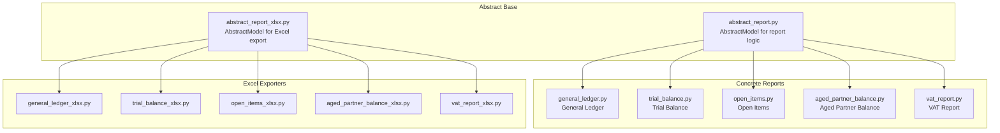
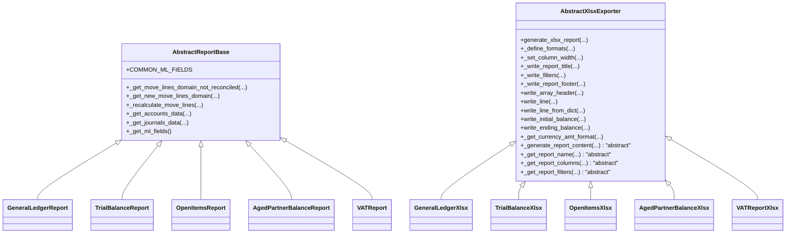
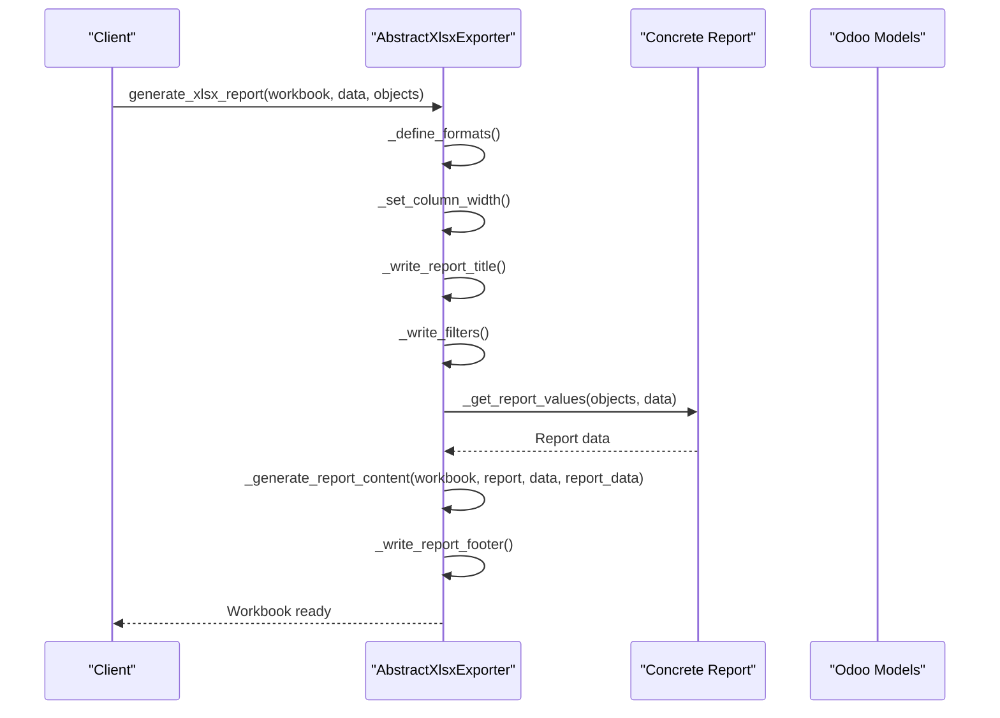
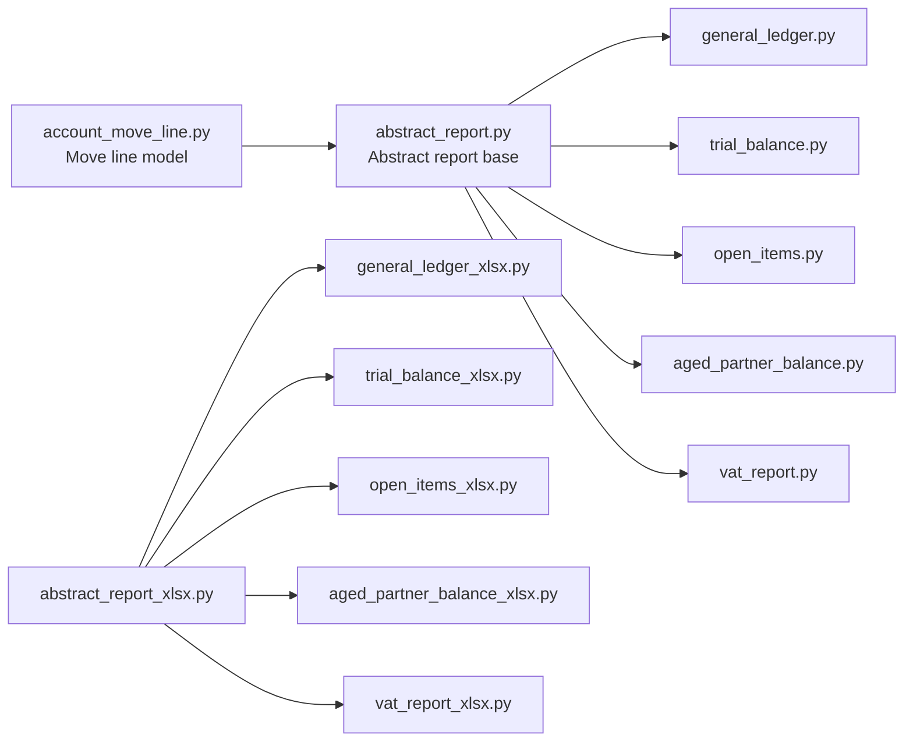

# Abstract Report Framework

<cite>
**Referenced Files in This Document**
- [abstract_report.py](file://report/abstract_report.py)
- [abstract_report_xlsx.py](file://report/abstract_report_xlsx.py)
- [general_ledger.py](file://report/general_ledger.py)
- [trial_balance.py](file://report/trial_balance.py)
- [open_items.py](file://report/open_items.py)
- [aged_partner_balance.py](file://report/aged_partner_balance.py)
- [vat_report.py](file://report/vat_report.py)
- [general_ledger_xlsx.py](file://report/general_ledger_xlsx.py)
- [trial_balance_xlsx.py](file://report/trial_balance_xlsx.py)
- [open_items_xlsx.py](file://report/open_items_xlsx.py)
- [aged_partner_balance_xlsx.py](file://report/aged_partner_balance_xlsx.py)
- [vat_report_xlsx.py](file://report/vat_report_xlsx.py)
- [account_move_line.py](file://models/account_move_line.py)
- [__manifest__.py](file://__manifest__.py)
</cite>

## Table of Contents
1. [Introduction](#introduction)
2. [Project Structure](#project-structure)
3. [Core Components](#core-components)
4. [Architecture Overview](#architecture-overview)
5. [Detailed Component Analysis](#detailed-component-analysis)
6. [Dependency Analysis](#dependency-analysis)
7. [Performance Considerations](#performance-considerations)
8. [Troubleshooting Guide](#troubleshooting-guide)
9. [Conclusion](#conclusion)

## Introduction
This document explains the abstract report framework that underpins all financial reports in the module. It focuses on the AbstractModel inheritance pattern that standardizes common functionality across report types, including data filtering, reconciliation calculations, standardized field access, master data retrieval, and Excel export capabilities. Practical examples demonstrate how concrete reports inherit from the abstract base and override specific methods to tailor behavior.

## Project Structure
The report framework is organized around a small set of abstract base classes and concrete report implementations:
- Abstract base for report logic: report/abstract_report.py
- Abstract base for Excel export: report/abstract_report_xlsx.py
- Concrete financial reports: general ledger, trial balance, open items, aged partner balance, VAT report
- XLSX exporters for each report: general ledger, trial balance, open items, aged partner balance, VAT

**Diagram sources**
- [abstract_report.py:7-165](file://report/abstract_report.py#L7-L165)
- [abstract_report_xlsx.py:8-698](file://report/abstract_report_xlsx.py#L8-L698)
- [general_ledger.py:14-800](file://report/general_ledger.py#L14-L800)
- [trial_balance.py:12-981](file://report/trial_balance.py#L12-L981)
- [open_items.py:13-310](file://report/open_items.py#L13-L310)
- [aged_partner_balance.py:12-473](file://report/aged_partner_balance.py#L12-L473)
- [vat_report.py:10-244](file://report/vat_report.py#L10-L244)
- [general_ledger_xlsx.py:11-400](file://report/general_ledger_xlsx.py#L11-L400)
- [trial_balance_xlsx.py:10-324](file://report/trial_balance_xlsx.py#L10-L324)
- [open_items_xlsx.py:9-350](file://report/open_items_xlsx.py#L9-L350)
- [aged_partner_balance_xlsx.py:9-368](file://report/aged_partner_balance_xlsx.py#L9-L368)
- [vat_report_xlsx.py:8-62](file://report/vat_report_xlsx.py#L8-L62)

**Section sources**
- [__manifest__.py:18-31](file://__manifest__.py#L18-L31)

## Core Components
This section documents the abstract base classes and their core methods that provide shared functionality across all report types.

- Abstract report base (report/abstract_report.py)
  - COMMON_ML_FIELDS: Standardized list of move line fields used across reports
  - Domain builders:
    - _get_move_lines_domain_not_reconciled: Builds domain for unreconciled lines filtered by company, accounts, partners, posting state, and date
    - _get_new_move_lines_domain: Builds domain for newly reconciled lines based on IDs
  - Reconciliation recalculations:
    - _recalculate_move_lines: Computes updated residual amounts after reconciliations and adjusts currency fields
  - Master data retrieval:
    - _get_accounts_data: Loads account metadata (code, name, currency, centralized flag)
    - _get_journals_data: Loads journal codes
  - Field selection:
    - _get_ml_fields: Returns the union of COMMON_ML_FIELDS plus report-specific fields

- Abstract XLSX exporter (report/abstract_report_xlsx.py)
  - Workbook lifecycle:
    - generate_xlsx_report: Orchestrates workbook creation, formatting, column widths, title, filters, content generation, and footer
  - Formatting and layout:
    - _define_formats: Creates reusable cell formats and applies currency decimal precision
    - _set_column_width: Applies column widths defined by concrete reports
    - _write_report_title/_write_filters/_write_report_footer: Writes static report elements
  - Data rendering:
    - write_array_header/write_line/write_line_from_dict: Renders structured rows
    - write_initial_balance/write_initial_balance_from_dict: Writes initial balances
    - write_ending_balance/write_ending_balance_from_dict: Writes ending balances
  - Currency-specific formatting:
    - _get_currency_amt_format/_get_currency_amt_format_dict/_get_currency_amt_header_format: Per-currency number formats
  - Extension contract:
    - _generate_report_content, _get_report_name, _get_report_columns, _get_report_filters, and related helpers are abstract and implemented by concrete exporters

**Section sources**
- [abstract_report.py:10-165](file://report/abstract_report.py#L10-L165)
- [abstract_report_xlsx.py:18-698](file://report/abstract_report_xlsx.py#L18-L698)

## Architecture Overview
The framework follows a layered inheritance model:
- Concrete reports inherit from the abstract report base and implement report-specific logic
- Concrete XLSX exporters inherit from the abstract XLSX base and implement Excel-specific rendering
- Both rely on Odoo’s AbstractModel infrastructure and share standardized field access via COMMON_ML_FIELDS

**Diagram sources**
- [abstract_report.py:7-165](file://report/abstract_report.py#L7-L165)
- [abstract_report_xlsx.py:8-698](file://report/abstract_report_xlsx.py#L8-L698)
- [general_ledger.py:14-17](file://report/general_ledger.py#L14-L17)
- [trial_balance.py:12-15](file://report/trial_balance.py#L12-L15)
- [open_items.py:13-16](file://report/open_items.py#L13-L16)
- [aged_partner_balance.py:12-15](file://report/aged_partner_balance.py#L12-L15)
- [vat_report.py:10-13](file://report/vat_report.py#L10-L13)
- [general_ledger_xlsx.py:11-14](file://report/general_ledger_xlsx.py#L11-L14)
- [trial_balance_xlsx.py:10-13](file://report/trial_balance_xlsx.py#L10-L13)
- [open_items_xlsx.py:9-12](file://report/open_items_xlsx.py#L9-L12)
- [aged_partner_balance_xlsx.py:9-12](file://report/aged_partner_balance_xlsx.py#L9-L12)
- [vat_report_xlsx.py:8-11](file://report/vat_report_xlsx.py#L8-L11)

## Detailed Component Analysis

### Abstract Report Base Methods
- COMMON_ML_FIELDS
  - Purpose: Centralized list of move line fields used across reports to ensure consistent field access and reduce duplication
  - Usage: Extended by concrete reports to include report-specific fields via _get_ml_fields
  - Example references:
    - [abstract_report.py:10-19](file://report/abstract_report.py#L10-L19)
    - [open_items.py:299-309](file://report/open_items.py#L299-L309)
    - [aged_partner_balance.py:467-472](file://report/aged_partner_balance.py#L467-L472)

- _get_move_lines_domain_not_reconciled
  - Purpose: Build a domain for unreconciled move lines constrained by company, accounts, optional partners, posting state, and date threshold
  - Inputs: company_id, account_ids, partner_ids, only_posted_moves, date_from
  - Behavior: Adds conditions for reconciled=False, optional partner filtering, and state filtering based on only_posted_moves
  - Example references:
    - [abstract_report.py:21-38](file://report/abstract_report.py#L21-L38)
    - [open_items.py:72-74](file://report/open_items.py#L72-L74)
    - [aged_partner_balance.py:153-155](file://report/aged_partner_balance.py#L153-L155)

- _get_new_move_lines_domain
  - Purpose: Build a domain for newly reconciled move lines identified by IDs
  - Inputs: new_ml_ids, account_ids, company_id, partner_ids, only_posted_moves
  - Behavior: Filters by account, company, and inclusion of specific IDs; respects posting state
  - Example references:
    - [abstract_report.py:40-55](file://report/abstract_report.py#L40-L55)
    - [open_items.py:98-111](file://report/open_items.py#L98-L111)
    - [aged_partner_balance.py:179-192](file://report/aged_partner_balance.py#L179-L192)

- _recalculate_move_lines
  - Purpose: Recompute residual amounts after reconciliations and adjust currency fields
  - Inputs: move_lines, debit_ids, credit_ids, debit_amount, credit_amount, ml_ids, account_ids, company_id, partner_ids, only_posted_moves, debit_amount_currency, credit_amount_currency
  - Behavior:
    - Identifies newly reconciled IDs and fetches corresponding move lines
    - Updates amount_residual and amount_residual_currency for debits and credits
    - Forces amount_currency to zero when currency equals company currency
  - Example references:
    - [abstract_report.py:57-123](file://report/abstract_report.py#L57-L123)
    - [open_items.py:98-111](file://report/open_items.py#L98-L111)
    - [aged_partner_balance.py:179-192](file://report/aged_partner_balance.py#L179-L192)

- _get_accounts_data
  - Purpose: Retrieve account metadata for rendering and grouping
  - Outputs: Dictionary keyed by account ID with code, name, currency, centralized flag, and group info
  - Example references:
    - [abstract_report.py:125-143](file://report/abstract_report.py#L125-L143)
    - [general_ledger.py:543-546](file://report/general_ledger.py#L543-L546)
    - [trial_balance.py:584-584](file://report/trial_balance.py#L584-L584)

- _get_journals_data
  - Purpose: Retrieve journal codes for display
  - Outputs: Dictionary keyed by journal ID with code
  - Example references:
    - [abstract_report.py:145-152](file://report/abstract_report.py#L145-L152)
    - [general_ledger.py:543-546](file://report/general_ledger.py#L543-L546)
    - [trial_balance.py:584-584](file://report/trial_balance.py#L584-L584)

- _get_ml_fields
  - Purpose: Return the complete list of move line fields to fetch for a given report
  - Behavior: Starts with COMMON_ML_FIELDS and adds report-specific fields
  - Example references:
    - [abstract_report.py:154-164](file://report/abstract_report.py#L154-L164)
    - [general_ledger.py:471-474](file://report/general_ledger.py#L471-L474)
    - [open_items.py:299-309](file://report/open_items.py#L299-L309)
    - [aged_partner_balance.py:467-472](file://report/aged_partner_balance.py#L467-L472)

**Section sources**
- [abstract_report.py:10-165](file://report/abstract_report.py#L10-L165)
- [open_items.py:72-111](file://report/open_items.py#L72-L111)
- [aged_partner_balance.py:153-192](file://report/aged_partner_balance.py#L153-L192)
- [general_ledger.py:471-546](file://report/general_ledger.py#L471-L546)

### Excel Export Functionality
The abstract XLSX exporter defines a reusable pipeline for generating Excel workbooks:
- Workbook lifecycle:
  - generate_xlsx_report orchestrates initialization, formatting, column sizing, title, filters, content generation, and footer
- Formatting:
  - _define_formats creates bold, right-aligned, header, amount, percent, and currency-specific formats
  - Currency formats are computed from company currency decimals
- Rendering:
  - write_array_header writes column headers
  - write_line and write_line_from_dict render rows with support for many2one, string, amount, amount_currency, and currency_name types
  - write_initial_balance and write_ending_balance write summary rows with appropriate formatting
- Currency formatting:
  - _get_currency_amt_format and related helpers compute per-currency formats and apply them consistently
- Extension contract:
  - Concrete exporters implement _generate_report_content, _get_report_name, _get_report_columns, _get_report_filters, and supporting helpers

**Diagram sources**
- [abstract_report_xlsx.py:18-61](file://report/abstract_report_xlsx.py#L18-L61)
- [general_ledger_xlsx.py:134-137](file://report/general_ledger_xlsx.py#L134-L137)
- [trial_balance_xlsx.py:164-167](file://report/trial_balance_xlsx.py#L164-L167)
- [open_items_xlsx.py:310-313](file://report/open_items_xlsx.py#L310-L313)
- [aged_partner_balance_xlsx.py:221-224](file://report/aged_partner_balance_xlsx.py#L221-L224)
- [vat_report_xlsx.py:46-49](file://report/vat_report_xlsx.py#L46-L49)

**Section sources**
- [abstract_report_xlsx.py:13-698](file://report/abstract_report_xlsx.py#L13-L698)
- [general_ledger_xlsx.py:134-373](file://report/general_ledger_xlsx.py#L134-L373)
- [trial_balance_xlsx.py:164-324](file://report/trial_balance_xlsx.py#L164-L324)
- [open_items_xlsx.py:310-350](file://report/open_items_xlsx.py#L310-L350)
- [aged_partner_balance_xlsx.py:221-368](file://report/aged_partner_balance_xlsx.py#L221-L368)
- [vat_report_xlsx.py:46-62](file://report/vat_report_xlsx.py#L46-L62)

### Practical Examples: Inheritance and Overrides

#### General Ledger Report
- Inherits from abstract report base and implements:
  - Domain builders for initial and period balances
  - Data preparation for accounts, partners, taxes, and analytics
  - Reconciliation handling and cumulative balance calculation
  - Centralization logic for journals
- Key overrides and usages:
  - _get_ml_fields: Extends COMMON_ML_FIELDS with additional fields for GL
  - _get_period_domain: Builds period domain with cost center filtering
  - _recalculate_cumul_balance: Adjusts cumulative balances considering future reconciliations
  - _get_centralized_ml: Aggregates entries by journal and month
- References:
  - [general_ledger.py:14-17](file://report/general_ledger.py#L14-L17)
  - [general_ledger.py:471-474](file://report/general_ledger.py#L471-L474)
  - [general_ledger.py:363-391](file://report/general_ledger.py#L363-L391)
  - [general_ledger.py:561-569](file://report/general_ledger.py#L561-L569)
  - [general_ledger.py:738-760](file://report/general_ledger.py#L738-L760)

#### Trial Balance Report
- Inherits from abstract report base and implements:
  - Separate domains for balance sheet and profit & loss accounts
  - Grouping by partner or analytical accounts
  - Hierarchical grouping and totals computation
- Key overrides and usages:
  - _get_initial_balances_bs_ml_domain and related methods: Build domains for initial balances
  - _get_period_ml_domain: Build period domain with partner and journal filters
  - _compute_account_amount and related: Aggregate balances and optionally by analytical accounts
- References:
  - [trial_balance.py:12-15](file://report/trial_balance.py#L12-L15)
  - [trial_balance.py:17-133](file://report/trial_balance.py#L17-L133)
  - [trial_balance.py:209-287](file://report/trial_balance.py#L209-L287)

#### Open Items Report
- Inherits from abstract report base and implements:
  - Unreconciled move lines filtering
  - Recalculation of residuals based on future partial reconciliations
  - Grouping by partner or salesperson
- Key overrides and usages:
  - _get_move_lines_domain_not_reconciled: Filters unreconciled lines
  - _recalculate_move_lines: Updates residual amounts for reconciled lines
  - _get_ml_fields: Extends COMMON_ML_FIELDS with fields required for open items
- References:
  - [open_items.py:13-16](file://report/open_items.py#L13-L16)
  - [open_items.py:72-111](file://report/open_items.py#L72-L111)
  - [open_items.py:299-309](file://report/open_items.py#L299-L309)

#### Aged Partner Balance Report
- Inherits from abstract report base and implements:
  - Aging intervals based on maturity dates
  - Recalculation of residuals considering future partial reconciliations
  - Optional move line details per partner
- Key overrides and usages:
  - _get_move_lines_domain_not_reconciled: Filters unreconciled lines
  - _recalculate_move_lines: Updates residual amounts for reconciled lines
  - _get_ml_fields: Extends COMMON_ML_FIELDS with maturity and residual fields
- References:
  - [aged_partner_balance.py:12-15](file://report/aged_partner_balance.py#L12-L15)
  - [aged_partner_balance.py:153-192](file://report/aged_partner_balance.py#L153-L192)
  - [aged_partner_balance.py:467-472](file://report/aged_partner_balance.py#L467-L472)

#### VAT Report
- Implements its own report logic without inheriting from the abstract report base
  - Uses _get_tax_report_domain and _get_net_report_domain to build domains
  - Aggregates tax and net amounts by tax groups or tags
- References:
  - [vat_report.py:10-13](file://report/vat_report.py#L10-L13)
  - [vat_report.py:32-57](file://report/vat_report.py#L32-L57)
  - [vat_report.py:236-244](file://report/vat_report.py#L236-L244)

**Section sources**
- [general_ledger.py:14-17](file://report/general_ledger.py#L14-L17)
- [general_ledger.py:471-569](file://report/general_ledger.py#L471-L569)
- [general_ledger.py:738-760](file://report/general_ledger.py#L738-L760)
- [trial_balance.py:12-15](file://report/trial_balance.py#L12-L15)
- [trial_balance.py:17-133](file://report/trial_balance.py#L17-L133)
- [trial_balance.py:209-287](file://report/trial_balance.py#L209-L287)
- [open_items.py:13-16](file://report/open_items.py#L13-L16)
- [open_items.py:72-111](file://report/open_items.py#L72-L111)
- [open_items.py:299-309](file://report/open_items.py#L299-L309)
- [aged_partner_balance.py:12-15](file://report/aged_partner_balance.py#L12-L15)
- [aged_partner_balance.py:153-192](file://report/aged_partner_balance.py#L153-L192)
- [aged_partner_balance.py:467-472](file://report/aged_partner_balance.py#L467-L472)
- [vat_report.py:10-13](file://report/vat_report.py#L10-L13)
- [vat_report.py:32-57](file://report/vat_report.py#L32-L57)
- [vat_report.py:236-244](file://report/vat_report.py#L236-L244)

## Dependency Analysis
The framework exhibits clear separation of concerns:
- Concrete reports depend on the abstract report base for domain building, reconciliation recalculations, and master data retrieval
- XLSX exporters depend on the abstract XLSX base for workbook lifecycle, formatting, and rendering
- The account.move.line model contributes specialized fields and indexing for performance

**Diagram sources**
- [account_move_line.py:9-71](file://models/account_move_line.py#L9-L71)
- [abstract_report.py:7-165](file://report/abstract_report.py#L7-L165)
- [general_ledger.py:14-800](file://report/general_ledger.py#L14-L800)
- [trial_balance.py:12-981](file://report/trial_balance.py#L12-L981)
- [open_items.py:13-310](file://report/open_items.py#L13-L310)
- [aged_partner_balance.py:12-473](file://report/aged_partner_balance.py#L12-L473)
- [vat_report.py:10-244](file://report/vat_report.py#L10-L244)
- [abstract_report_xlsx.py:8-698](file://report/abstract_report_xlsx.py#L8-L698)
- [general_ledger_xlsx.py:11-400](file://report/general_ledger_xlsx.py#L11-L400)
- [trial_balance_xlsx.py:10-324](file://report/trial_balance_xlsx.py#L10-L324)
- [open_items_xlsx.py:9-350](file://report/open_items_xlsx.py#L9-L350)
- [aged_partner_balance_xlsx.py:9-368](file://report/aged_partner_balance_xlsx.py#L9-L368)
- [vat_report_xlsx.py:8-62](file://report/vat_report_xlsx.py#L8-L62)

**Section sources**
- [account_move_line.py:9-71](file://models/account_move_line.py#L9-L71)
- [abstract_report.py:7-165](file://report/abstract_report.py#L7-L165)
- [abstract_report_xlsx.py:8-698](file://report/abstract_report_xlsx.py#L8-L698)

## Performance Considerations
- Indexing on account.move.line:
  - An index on (account_id, partner_id) is created to improve performance for queries joining account_move_line with account_partners subqueries
- Search count optimization:
  - A skip context avoids expensive search_count computations during wizard interactions
- Currency handling:
  - amount_currency is forced to zero when currency equals company currency to maintain backward compatibility and simplify rendering

**Section sources**
- [account_move_line.py:39-62](file://models/account_move_line.py#L39-L62)
- [account_move_line.py:64-71](file://models/account_move_line.py#L64-L71)
- [abstract_report.py:115-123](file://report/abstract_report.py#L115-L123)

## Troubleshooting Guide
- Reconciliation discrepancies:
  - Verify that _recalculate_move_lines is invoked with correct debit_ids, credit_ids, and amount dictionaries
  - Confirm that only_posted_moves and date thresholds are set appropriately
- Missing or incorrect residual amounts:
  - Ensure _get_ml_fields includes amount_residual and related currency fields
  - Check that company currency logic is applied when amount_currency equals company currency
- Excel formatting issues:
  - Confirm that _define_formats is called before rendering and that currency formats match company settings
  - Verify that _get_currency_amt_format is used for per-currency cells

**Section sources**
- [abstract_report.py:57-123](file://report/abstract_report.py#L57-L123)
- [abstract_report_xlsx.py:43-89](file://report/abstract_report_xlsx.py#L43-L89)

## Conclusion
The abstract report framework provides a robust, reusable foundation for financial reporting. Through standardized field access, domain building, reconciliation recalculations, and Excel export capabilities, it ensures consistency across reports while allowing concrete implementations to specialize behavior. The clear separation of concerns and documented extension points enable maintainability and extensibility for future report types.