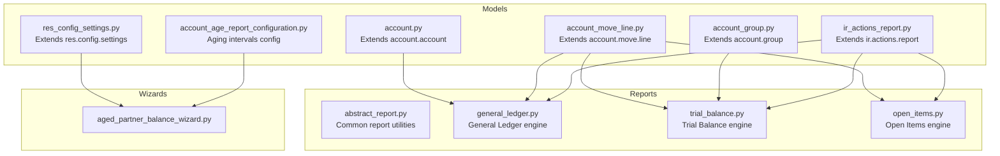
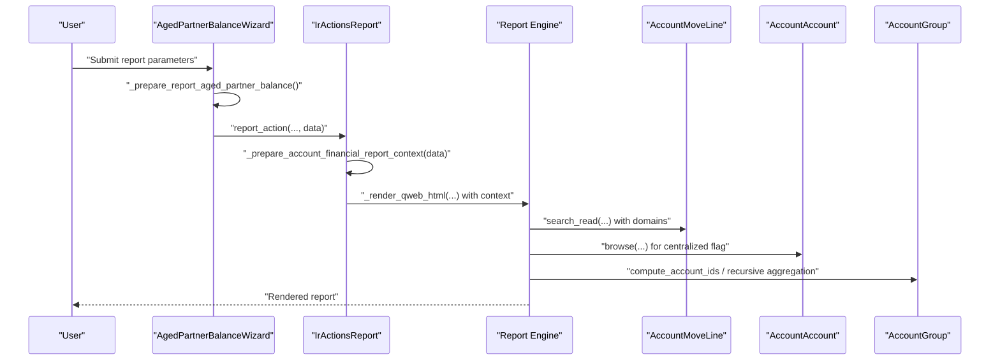
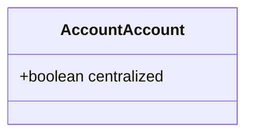
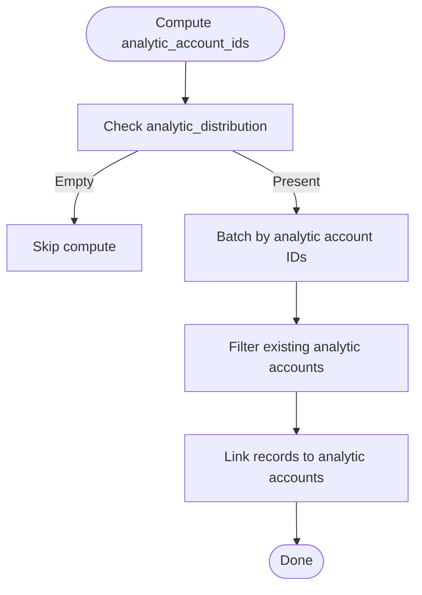
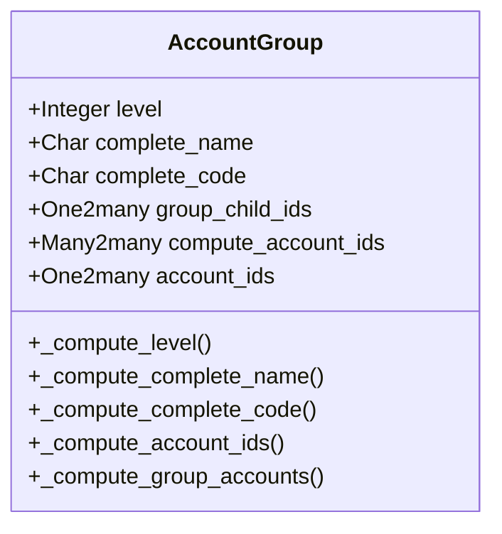
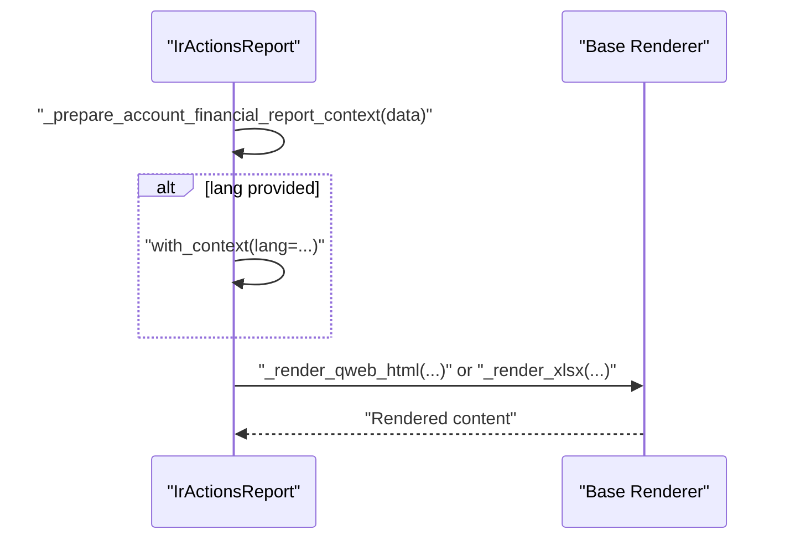
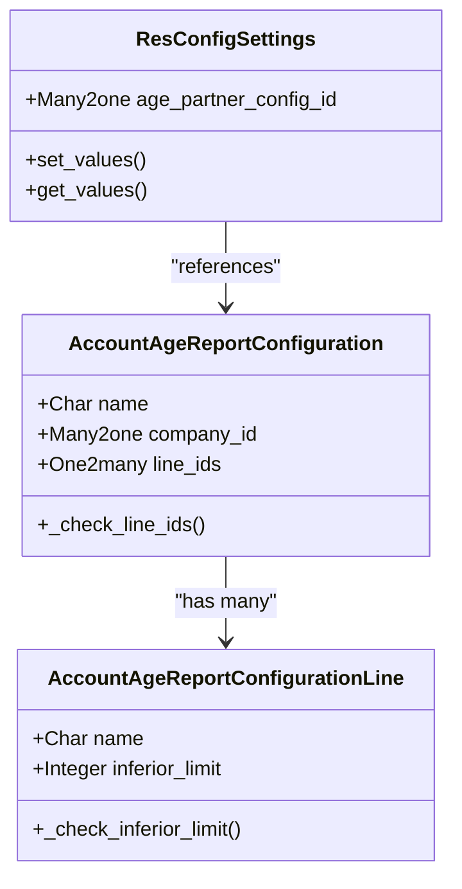
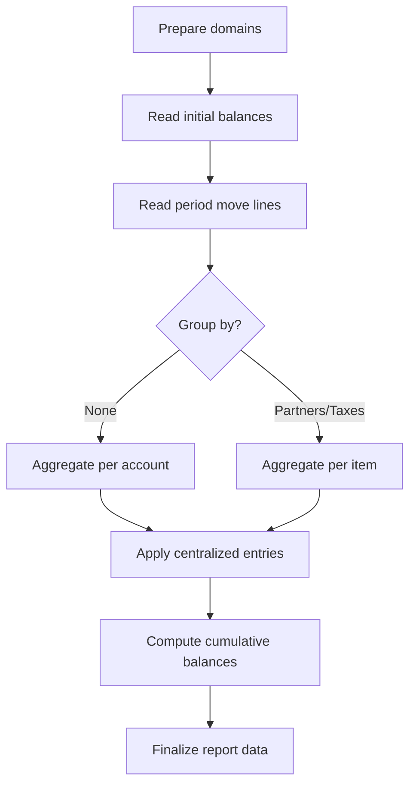
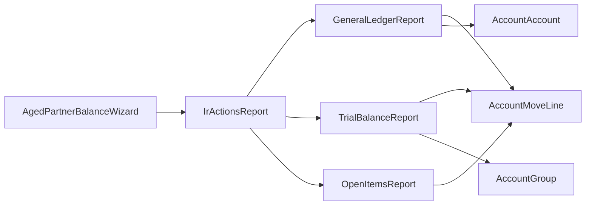

# Data Models and Business Logic

<cite>
**Referenced Files in This Document**
- [models/account.py](file://models/account.py)
- [models/account_move_line.py](file://models/account_move_line.py)
- [models/account_group.py](file://models/account_group.py)
- [models/ir_actions_report.py](file://models/ir_actions_report.py)
- [models/res_config_settings.py](file://models/res_config_settings.py)
- [models/account_age_report_configuration.py](file://models/account_age_report_configuration.py)
- [report/abstract_report.py](file://report/abstract_report.py)
- [report/general_ledger.py](file://report/general_ledger.py)
- [report/trial_balance.py](file://report/trial_balance.py)
- [report/open_items.py](file://report/open_items.py)
- [wizard/aged_partner_balance_wizard.py](file://wizard/aged_partner_balance_wizard.py)
- [__manifest__.py](file://__manifest__.py)
- [readme/DESCRIPTION.md](file://readme/DESCRIPTION.md)
</cite>

## Table of Contents
1. [Introduction](#introduction)
2. [Project Structure](#project-structure)
3. [Core Components](#core-components)
4. [Architecture Overview](#architecture-overview)
5. [Detailed Component Analysis](#detailed-component-analysis)
6. [Dependency Analysis](#dependency-analysis)
7. [Performance Considerations](#performance-considerations)
8. [Troubleshooting Guide](#troubleshooting-guide)
9. [Conclusion](#conclusion)
10. [Appendices](#appendices)

## Introduction
This document explains the data models and business logic that power the financial reporting functionality. It focuses on:
- Account model extensions enabling centralized reporting behavior
- Enhanced move line model with computed analytic relations and performance optimizations
- Hierarchical account grouping for aggregated reporting
- Report action integration for dynamic language context
- Module configuration via settings for aging report intervals
- Core report engines and their data processing rules
- Examples of model interactions during report processing, validation rules, and performance strategies

## Project Structure
The module extends Odoo’s accounting core with new models and report engines, organized by domain:
- models: Model extensions and configuration
- report: Abstract report base and concrete report engines
- wizard: Report wizards that prepare and trigger report actions
- view and report templates: UI and QWeb templates for reports
- static assets: JS and CSS for interactive report views

**Diagram sources**
- [models/account.py:6-14](file://models/account.py#L6-L14)
- [models/account_move_line.py:9-71](file://models/account_move_line.py#L9-L71)
- [models/account_group.py:8-109](file://models/account_group.py#L8-L109)
- [models/ir_actions_report.py:7-28](file://models/ir_actions_report.py#L7-L28)
- [models/res_config_settings.py:7-37](file://models/res_config_settings.py#L7-L37)
- [models/account_age_report_configuration.py:8-50](file://models/account_age_report_configuration.py#L8-L50)
- [report/abstract_report.py:7-165](file://report/abstract_report.py#L7-L165)
- [report/general_ledger.py:14-931](file://report/general_ledger.py#L14-L931)
- [report/trial_balance.py:12-981](file://report/trial_balance.py#L12-L981)
- [report/open_items.py:13-310](file://report/open_items.py#L13-L310)
- [wizard/aged_partner_balance_wizard.py:9-154](file://wizard/aged_partner_balance_wizard.py#L9-L154)

**Section sources**
- [__manifest__.py:19-46](file://__manifest__.py#L19-L46)
- [readme/DESCRIPTION.md:1-22](file://readme/DESCRIPTION.md#L1-L22)

## Core Components
This section documents the extended models and their roles in financial reporting.

- AccountAccount extension
  - Adds a centralized flag to suppress detailed lines in General Ledger reports, aggregating per-period totals instead.
  - Field: centralized (Boolean)

- AccountMoveLine enhancements
  - Computes analytic_account_ids from analytic_distribution JSON to support filtering and grouping by analytic accounts.
  - Includes a database index creation routine to optimize joins on account_id and partner_id.
  - Provides a search_count override to skip expensive counts when a context flag is present.

- AccountGroup hierarchy
  - Adds recursive fields for level, complete_name, and complete_code.
  - Provides computed account sets (direct and recursive) to enable hierarchical aggregation.
  - Uses raw SQL to match accounts to groups by code prefixes efficiently.

- IrActionsReport integration
  - Adds a method to build a report context with a language parameter extracted from the report data.
  - Overrides HTML and XLSX render methods to apply the language context before delegating to the base renderer.

- ResConfigSettings configuration
  - Exposes a Many2one to the aging report configuration.
  - Persists and retrieves the default aging configuration for the wizard using ir.default.

- Aging report configuration
  - Defines a configuration header and lines with constraints ensuring non-empty lines and positive lower limits.
  - Enforces uniqueness of interval names per configuration.

**Section sources**
- [models/account.py:6-14](file://models/account.py#L6-L14)
- [models/account_move_line.py:9-71](file://models/account_move_line.py#L9-L71)
- [models/account_group.py:8-109](file://models/account_group.py#L8-L109)
- [models/ir_actions_report.py:7-28](file://models/ir_actions_report.py#L7-L28)
- [models/res_config_settings.py:7-37](file://models/res_config_settings.py#L7-L37)
- [models/account_age_report_configuration.py:8-50](file://models/account_age_report_configuration.py#L8-L50)

## Architecture Overview
The reporting pipeline integrates wizards, report engines, and model extensions to produce financial statements.

**Diagram sources**
- [wizard/aged_partner_balance_wizard.py:120-149](file://wizard/aged_partner_balance_wizard.py#L120-L149)
- [models/ir_actions_report.py:10-27](file://models/ir_actions_report.py#L10-L27)
- [report/open_items.py:245-297](file://report/open_items.py#L245-L297)
- [models/account_move_line.py:9-71](file://models/account_move_line.py#L9-L71)
- [models/account.py:6-14](file://models/account.py#L6-L14)
- [models/account_group.py:8-109](file://models/account_group.py#L8-L109)

## Detailed Component Analysis

### AccountAccount Extension
- Purpose: Enable centralized reporting for General Ledger by suppressing detailed lines when centralized is true.
- Impact: Reduces report size and complexity for summary-only views.

**Diagram sources**
- [models/account.py:6-14](file://models/account.py#L6-L14)

**Section sources**
- [models/account.py:6-14](file://models/account.py#L6-L14)

### AccountMoveLine Enhancements
- Analytic account computation
  - Reads analytic_distribution JSON and links move lines to analytic accounts for filtering and grouping.
  - Uses batch processing to minimize ORM overhead.
- Performance index
  - Creates a composite index on account_id and partner_id to accelerate joins in large datasets.
- Search count optimization
  - Skips expensive counts when a context flag is set.

**Diagram sources**
- [models/account_move_line.py:16-38](file://models/account_move_line.py#L16-L38)

**Section sources**
- [models/account_move_line.py:9-71](file://models/account_move_line.py#L9-L71)

### AccountGroup Hierarchical Organization
- Recursive fields
  - level, complete_name, complete_code computed recursively.
- Computed account sets
  - account_ids: direct accounts matching code prefixes.
  - compute_account_ids: union of direct and child group accounts.
- SQL-based matching
  - Efficiently matches accounts to groups using code_store and prefix comparisons.

**Diagram sources**
- [models/account_group.py:8-109](file://models/account_group.py#L8-L109)

**Section sources**
- [models/account_group.py:8-109](file://models/account_group.py#L8-L109)

### IrActionsReport Integration
- Context-aware rendering
  - Builds a context with a language parameter extracted from report data.
  - Applies context before delegating to base QWeb HTML and XLSX renderers.

**Diagram sources**
- [models/ir_actions_report.py:10-27](file://models/ir_actions_report.py#L10-L27)

**Section sources**
- [models/ir_actions_report.py:7-28](file://models/ir_actions_report.py#L7-L28)

### ResConfigSettings and Aging Configuration
- Aging configuration persistence
  - Stores default aging configuration for the wizard using ir.default.
- Aging configuration model
  - Ensures at least one interval line and positive lower limits.
  - Enforces unique interval names per configuration.

**Diagram sources**
- [models/res_config_settings.py:7-37](file://models/res_config_settings.py#L7-L37)
- [models/account_age_report_configuration.py:8-50](file://models/account_age_report_configuration.py#L8-L50)

**Section sources**
- [models/res_config_settings.py:7-37](file://models/res_config_settings.py#L7-L37)
- [models/account_age_report_configuration.py:8-50](file://models/account_age_report_configuration.py#L8-L50)

### Report Engines and Business Rules
- Abstract report utilities
  - Common move line fields, reconciliation recalculations, and data preparation helpers shared across reports.
- General Ledger
  - Builds initial and period domains, aggregates balances by account and optional grouping (partners/taxes), supports centralized entries, and computes cumulative balances.
  - Handles foreign currency and partial reconciliations after the reporting period.
- Trial Balance
  - Aggregates balances by account and optionally by analytic accounts; supports grouping and hierarchy roll-up.
  - Computes profit-and-loss adjustments for retained earnings.
- Open Items
  - Filters unreconciled move lines, recalculates residual amounts considering future reconciliations, and groups by partner or salesperson.

**Diagram sources**
- [report/abstract_report.py:21-165](file://report/abstract_report.py#L21-L165)
- [report/general_ledger.py:763-800](file://report/general_ledger.py#L763-L800)
- [report/trial_balance.py:406-622](file://report/trial_balance.py#L406-L622)
- [report/open_items.py:62-189](file://report/open_items.py#L62-L189)

**Section sources**
- [report/abstract_report.py:7-165](file://report/abstract_report.py#L7-L165)
- [report/general_ledger.py:14-931](file://report/general_ledger.py#L14-L931)
- [report/trial_balance.py:12-981](file://report/trial_balance.py#L12-L981)
- [report/open_items.py:13-310](file://report/open_items.py#L13-L310)

## Dependency Analysis
- Internal dependencies
  - Report engines depend on abstract utilities and core models (move lines, accounts, groups).
  - Wizards prepare report data and trigger actions via ir.actions.report.
- External dependencies
  - Depends on Odoo’s account, date_range, and report_xlsx modules as declared in manifest.

**Diagram sources**
- [wizard/aged_partner_balance_wizard.py:120-149](file://wizard/aged_partner_balance_wizard.py#L120-L149)
- [models/ir_actions_report.py:10-27](file://models/ir_actions_report.py#L10-L27)
- [report/general_ledger.py:14-931](file://report/general_ledger.py#L14-L931)
- [report/trial_balance.py:12-981](file://report/trial_balance.py#L12-L981)
- [report/open_items.py:13-310](file://report/open_items.py#L13-L310)
- [models/account_move_line.py:9-71](file://models/account_move_line.py#L9-L71)
- [models/account.py:6-14](file://models/account.py#L6-L14)
- [models/account_group.py:8-109](file://models/account_group.py#L8-L109)

**Section sources**
- [__manifest__.py:18-18](file://__manifest__.py#L18-L18)

## Performance Considerations
- Analytic account computation
  - Batch processing and pre-fetching reduce ORM calls when computing analytic_account_ids from analytic_distribution.
- Database indexing
  - Creation of a composite index on account_id and partner_id significantly improves join performance for large datasets.
- Search count optimization
  - Context-based skipping of search_count avoids heavy queries during domain widget updates.
- Aggregation strategies
  - Reports use read_group and targeted search_read with minimal fields to reduce memory footprint.
- Centralization and grouping
  - Centralized entries and grouping by analytic accounts or partners reduce row counts and improve readability.

**Section sources**
- [models/account_move_line.py:16-38](file://models/account_move_line.py#L16-L38)
- [models/account_move_line.py:39-71](file://models/account_move_line.py#L39-L71)
- [report/general_ledger.py:446-558](file://report/general_ledger.py#L446-L558)
- [report/trial_balance.py:498-512](file://report/trial_balance.py#L498-L512)

## Troubleshooting Guide
- Aging report configuration errors
  - Validation ensures at least one interval line and positive lower limits; incorrect configurations raise validation errors.
- Group hierarchy issues
  - Trial balance hierarchy computation validates group structure and raises user errors if inconsistencies are detected.
- Foreign currency handling
  - Reports conditionally include currency fields and round balances; absence of secondary currencies disables currency-specific columns.
- Language context in reports
  - If a language is passed via report data, the context is applied; otherwise, defaults are used.

**Section sources**
- [models/account_age_report_configuration.py:20-41](file://models/account_age_report_configuration.py#L20-L41)
- [report/trial_balance.py:690-745](file://report/trial_balance.py#L690-L745)
- [readme/DESCRIPTION.md:11-17](file://readme/DESCRIPTION.md#L11-L17)
- [models/ir_actions_report.py:10-13](file://models/ir_actions_report.py#L10-L13)

## Conclusion
The module extends Odoo’s accounting core with robust financial reporting capabilities:
- Centralized reporting flags streamline summary views.
- Enhanced move lines enable efficient analytic filtering and grouping.
- Hierarchical account groups support aggregated reporting across organizational structures.
- Report actions integrate language-aware rendering for international deployments.
- Configuration models and wizards provide flexible, validated report generation.

These components work together to deliver accurate, performant financial reports tailored to diverse organizational needs.

## Appendices
- Compatibility note: General ledger, trial balance, and open items reports support foreign currencies and display balances accordingly when configured.

**Section sources**
- [readme/DESCRIPTION.md:11-17](file://readme/DESCRIPTION.md#L11-L17)