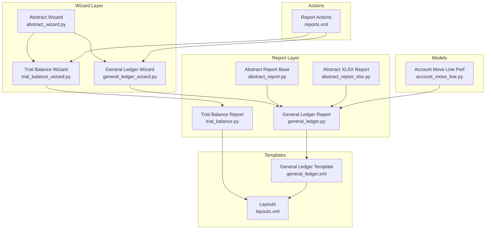
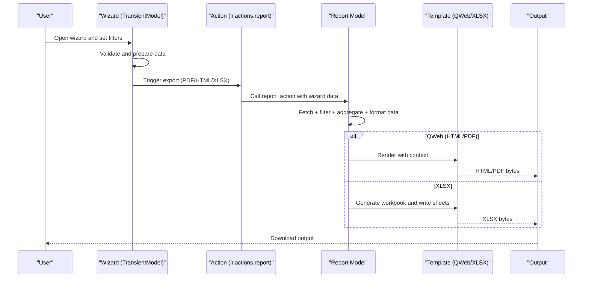
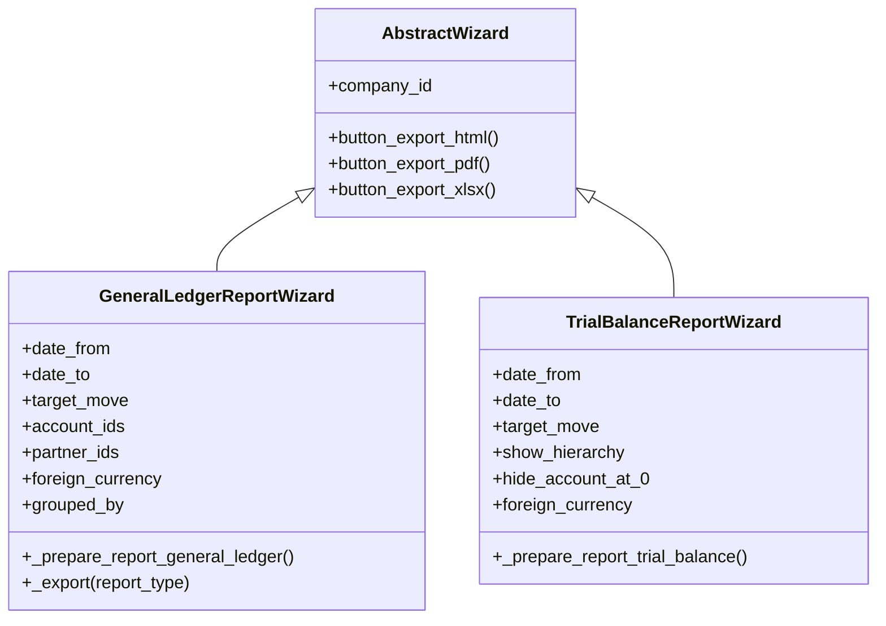
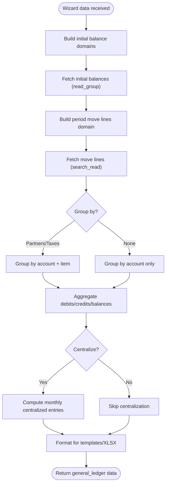
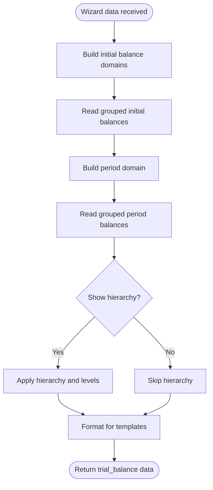
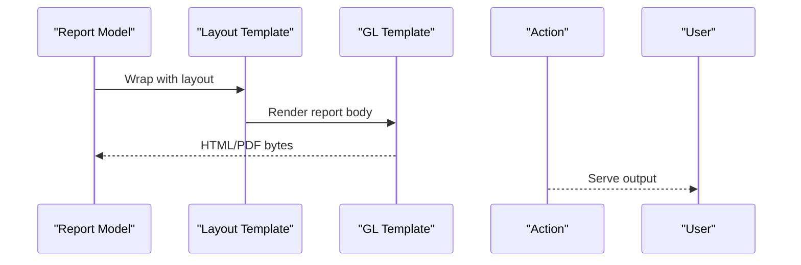
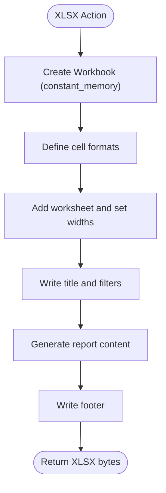
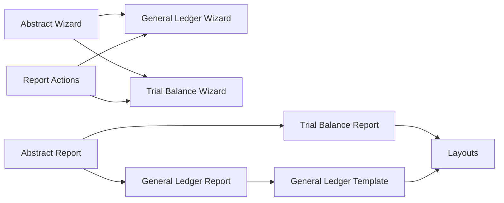

# Report Generation Pipeline

<cite>
**Referenced Files in This Document**
- [abstract_wizard.py](file://wizard/abstract_wizard.py)
- [general_ledger_wizard.py](file://wizard/general_ledger_wizard.py)
- [trial_balance_wizard.py](file://wizard/trial_balance_wizard.py)
- [abstract_report.py](file://report/abstract_report.py)
- [abstract_report_xlsx.py](file://report/abstract_report_xlsx.py)
- [general_ledger.py](file://report/general_ledger.py)
- [trial_balance.py](file://report/trial_balance.py)
- [general_ledger.xml](file://report/templates/general_ledger.xml)
- [layouts.xml](file://report/templates/layouts.xml)
- [reports.xml](file://reports.xml)
- [__manifest__.py](file://__manifest__.py)
- [account_move_line.py](file://models/account_move_line.py)
- [test_general_ledger.py](file://tests/test_general_ledger.py)
</cite>

## Table of Contents
1. [Introduction](#introduction)
2. [Project Structure](#project-structure)
3. [Core Components](#core-components)
4. [Architecture Overview](#architecture-overview)
5. [Detailed Component Analysis](#detailed-component-analysis)
6. [Dependency Analysis](#dependency-analysis)
7. [Performance Considerations](#performance-considerations)
8. [Troubleshooting Guide](#troubleshooting-guide)
9. [Conclusion](#conclusion)

## Introduction
This document explains the complete report generation pipeline from user input to final output. It covers the data flow from wizard configuration through report preparation to template rendering and output generation. It documents how the abstract wizard interacts with individual report implementations, how configuration options are processed and validated, and details the report execution lifecycle including data fetching, filtering, aggregation, and formatting. It also explains caching mechanisms, performance optimizations, and memory management strategies used during large report generation, and provides examples of the complete workflow for each report type, error handling procedures, and debugging techniques.

## Project Structure
The report generation system is organized around Odoo’s reporting framework:
- Wizard layer: user-facing forms that collect parameters and validate selections.
- Report layer: backend models that prepare data and render outputs via QWeb templates or XLSX.
- Templates: QWeb XML templates for HTML/PDF rendering and layout wrappers.
- Actions: server-side actions that bind wizards to report names and output formats.
- Models: database models extended for performance and analytics.

**Diagram sources**
- [abstract_wizard.py:1-52](file://wizard/abstract_wizard.py#L1-L52)
- [general_ledger_wizard.py:18-322](file://wizard/general_ledger_wizard.py#L18-L322)
- [trial_balance_wizard.py:12-200](file://wizard/trial_balance_wizard.py#L12-L200)
- [abstract_report.py:7-165](file://report/abstract_report.py#L7-L165)
- [general_ledger.py:14-931](file://report/general_ledger.py#L14-L931)
- [trial_balance.py:12-981](file://report/trial_balance.py#L12-L981)
- [abstract_report_xlsx.py:8-698](file://report/abstract_report_xlsx.py#L8-L698)
- [layouts.xml:1-44](file://report/templates/layouts.xml#L1-L44)
- [general_ledger.xml:1-789](file://report/templates/general_ledger.xml#L1-L789)
- [reports.xml:1-174](file://reports.xml#L1-L174)
- [account_move_line.py:39-71](file://models/account_move_line.py#L39-L71)

**Section sources**
- [__manifest__.py:19-46](file://__manifest__.py#L19-L46)
- [reports.xml:20-172](file://reports.xml#L20-L172)

## Core Components
- Abstract Wizard: Provides shared fields and export buttons for all report wizards.
- Report Abstract Base: Supplies common helpers for domains, move lines, and account/journal data retrieval.
- Report Implementations: Specialize data fetching, grouping, and aggregation for each report type.
- Abstract XLSX Report: Provides workbook creation, formatting, and column rendering for Excel exports.
- Templates: Define HTML/PDF rendering and layout wrappers for report presentation.
- Actions: Bind wizard models to report names and output formats (PDF, HTML, XLSX).

Key responsibilities:
- Wizard collects parameters and prepares a data payload passed to the report.
- Report computes balances, aggregates by grouping criteria, and structures data for templates.
- Templates render QWeb HTML/PDF; XLSX templates render spreadsheets with formatted cells.
- Actions route requests to the appropriate report renderer.

**Section sources**
- [abstract_wizard.py:7-52](file://wizard/abstract_wizard.py#L7-L52)
- [abstract_report.py:10-165](file://report/abstract_report.py#L10-L165)
- [abstract_report_xlsx.py:8-698](file://report/abstract_report_xlsx.py#L8-L698)
- [general_ledger.xml:1-789](file://report/templates/general_ledger.xml#L1-L789)
- [layouts.xml:1-44](file://report/templates/layouts.xml#L1-L44)
- [reports.xml:20-172](file://reports.xml#L20-L172)

## Architecture Overview
The pipeline follows a consistent flow:
1. User opens a wizard, selects filters, and triggers an export action.
2. Wizard validates inputs and builds a data dictionary.
3. Report model executes data fetching, filtering, aggregation, and formatting.
4. Output is generated via QWeb templates (HTML/PDF) or XLSX workbook.

**Diagram sources**
- [general_ledger_wizard.py:274-316](file://wizard/general_ledger_wizard.py#L274-L316)
- [reports.xml:22-36](file://reports.xml#L22-L36)
- [general_ledger.py:763-800](file://report/general_ledger.py#L763-L800)
- [general_ledger.xml:1-789](file://report/templates/general_ledger.xml#L1-L789)
- [abstract_report_xlsx.py:18-42](file://report/abstract_report_xlsx.py#L18-L42)

## Detailed Component Analysis

### Wizard Interaction and Configuration Processing
- Abstract Wizard defines shared fields and export handlers for HTML, PDF, and XLSX.
- Individual wizards inherit these capabilities and add report-specific fields and validations.
- Wizards build a data dictionary passed to the report’s _get_report_values method.

**Diagram sources**
- [abstract_wizard.py:7-52](file://wizard/abstract_wizard.py#L7-L52)
- [general_ledger_wizard.py:18-322](file://wizard/general_ledger_wizard.py#L18-L322)
- [trial_balance_wizard.py:12-200](file://wizard/trial_balance_wizard.py#L12-L200)

**Section sources**
- [abstract_wizard.py:11-52](file://wizard/abstract_wizard.py#L11-L52)
- [general_ledger_wizard.py:290-316](file://wizard/general_ledger_wizard.py#L290-L316)
- [trial_balance_wizard.py:131-177](file://wizard/trial_balance_wizard.py#L131-L177)

### Report Execution Lifecycle: General Ledger
The General Ledger pipeline includes:
- Initial balances: separate domains for balance sheet and profit & loss accounts.
- Period move lines: fetch and group by account/partner/tax as configured.
- Aggregation: compute cumulative balances and optional centralization.
- Formatting: prepare data structures for templates and XLSX.

**Diagram sources**
- [general_ledger.py:779-800](file://report/general_ledger.py#L779-L800)
- [general_ledger.py:446-558](file://report/general_ledger.py#L446-L558)
- [general_ledger.py:641-695](file://report/general_ledger.py#L641-L695)
- [general_ledger.py:737-760](file://report/general_ledger.py#L737-L760)

**Section sources**
- [general_ledger.py:108-177](file://report/general_ledger.py#L108-L177)
- [general_ledger.py:258-316](file://report/general_ledger.py#L258-L316)
- [general_ledger.py:446-558](file://report/general_ledger.py#L446-L558)
- [general_ledger.py:641-695](file://report/general_ledger.py#L641-L695)
- [general_ledger.py:737-760](file://report/general_ledger.py#L737-L760)

### Report Execution Lifecycle: Trial Balance
The Trial Balance pipeline:
- Builds domains for initial and period balances with optional partner details.
- Reads grouped balances by account and currency.
- Applies hierarchy and level limits when enabled.
- Formats final data structures for templates.

**Diagram sources**
- [trial_balance.py:17-94](file://report/trial_balance.py#L17-L94)
- [trial_balance.py:96-133](file://report/trial_balance.py#L96-L133)
- [trial_balance.py:174-200](file://report/trial_balance.py#L174-L200)

**Section sources**
- [trial_balance.py:17-94](file://report/trial_balance.py#L17-L94)
- [trial_balance.py:96-133](file://report/trial_balance.py#L96-L133)
- [trial_balance.py:174-200](file://report/trial_balance.py#L174-L200)

### Template Rendering and Output Generation
- Layouts: provide container and page layout for HTML/PDF.
- General Ledger template: renders filters, account headers, move lines, and ending balances.
- Actions: bind wizard models to report names and output types.

**Diagram sources**
- [layouts.xml:3-42](file://report/templates/layouts.xml#L3-L42)
- [general_ledger.xml:3-104](file://report/templates/general_ledger.xml#L3-L104)
- [reports.xml:22-36](file://reports.xml#L22-L36)

**Section sources**
- [layouts.xml:1-44](file://report/templates/layouts.xml#L1-L44)
- [general_ledger.xml:1-789](file://report/templates/general_ledger.xml#L1-L789)
- [reports.xml:20-172](file://reports.xml#L20-L172)

### XLSX Generation and Formatting
- Abstract XLSX Report sets constant_memory workbook option and orchestrates sheet creation.
- Column definitions, filters, titles, and data rows are written using reusable helpers.
- Currency-specific formats are computed dynamically per report and currency.

**Diagram sources**
- [abstract_report_xlsx.py:13-42](file://report/abstract_report_xlsx.py#L13-L42)
- [abstract_report_xlsx.py:634-661](file://report/abstract_report_xlsx.py#L634-L661)

**Section sources**
- [abstract_report_xlsx.py:13-93](file://report/abstract_report_xlsx.py#L13-L93)
- [abstract_report_xlsx.py:605-698](file://report/abstract_report_xlsx.py#L605-L698)

## Dependency Analysis
- Wizard depends on Abstract Wizard for shared fields and export routing.
- Report models depend on Abstract Report for common helpers and data retrieval.
- Templates depend on layout wrappers and report context variables.
- Actions bind wizard models to report names and output formats.

**Diagram sources**
- [abstract_wizard.py:7-52](file://wizard/abstract_wizard.py#L7-L52)
- [general_ledger_wizard.py:18-322](file://wizard/general_ledger_wizard.py#L18-L322)
- [trial_balance_wizard.py:12-200](file://wizard/trial_balance_wizard.py#L12-L200)
- [abstract_report.py:7-165](file://report/abstract_report.py#L7-L165)
- [general_ledger.py:14-931](file://report/general_ledger.py#L14-L931)
- [trial_balance.py:12-981](file://report/trial_balance.py#L12-L981)
- [general_ledger.xml:1-789](file://report/templates/general_ledger.xml#L1-L789)
- [layouts.xml:1-44](file://report/templates/layouts.xml#L1-L44)
- [reports.xml:20-172](file://reports.xml#L20-L172)

**Section sources**
- [reports.xml:20-172](file://reports.xml#L20-L172)

## Performance Considerations
- Constant-memory workbooks: XLSX reports enable constant_memory to reduce RAM usage during large exports.
- Database indexing: a composite index on account_move_line (account_id, partner_id) significantly improves join performance for initial balances.
- Efficient reads: read_group is used to aggregate balances in a single query rather than iterating records.
- Lazy evaluation: read_group is called with lazy=False to materialize grouped results for further processing.
- Domain composition: wizard-provided domains are combined to minimize dataset size early.

Practical implications:
- Large datasets benefit from read_group aggregations and reduced Python-side loops.
- XLSX constant_memory prevents out-of-memory errors on huge reports.
- Proper indexing reduces query times for complex joins.

**Section sources**
- [abstract_report_xlsx.py:13-16](file://report/abstract_report_xlsx.py#L13-L16)
- [account_move_line.py:53-62](file://models/account_move_line.py#L53-L62)
- [general_ledger.py:109-120](file://report/general_ledger.py#L109-L120)
- [general_ledger.py:201-213](file://report/general_ledger.py#L201-L213)

## Troubleshooting Guide
Common issues and resolutions:
- Wrong company/date range mismatch: wizards validate company and date range alignment and raise validation errors.
- Missing or invalid filters: ensure account ranges and partner filters are set correctly; wizard recomputes domains based on company.
- Unexpected zero balances: use “hide at 0” toggles to filter out zero-ending accounts; verify grouping settings.
- Foreign currency discrepancies: confirm multi-currency group membership and currency setup in chart of accounts.
- XLSX generation failures: verify report_name and report_type bindings in actions; ensure report_xlsx module availability.

Debugging techniques:
- Inspect the data dictionary passed from wizard to report using logs or debugger.
- Validate domains step-by-step: print or log initial and period domains before queries.
- Use read_group results to confirm aggregation correctness.
- For XLSX, verify column definitions and formats; ensure workbook options are applied.

**Section sources**
- [general_ledger_wizard.py:218-231](file://wizard/general_ledger_wizard.py#L218-L231)
- [general_ledger_wizard.py:131-142](file://wizard/general_ledger_wizard.py#L131-L142)
- [trial_balance_wizard.py:185-198](file://wizard/trial_balance_wizard.py#L185-L198)
- [test_general_ledger.py:104-125](file://tests/test_general_ledger.py#L104-L125)

## Conclusion
The report generation pipeline integrates wizard-driven configuration, robust report computation, and flexible output rendering. Abstract bases standardize data retrieval and formatting, while templates and actions ensure consistent presentation across HTML, PDF, and XLSX. Performance is optimized through efficient queries, indexing, and memory-conscious XLSX generation. Adhering to the documented workflows and troubleshooting steps ensures reliable operation across diverse datasets and configurations.