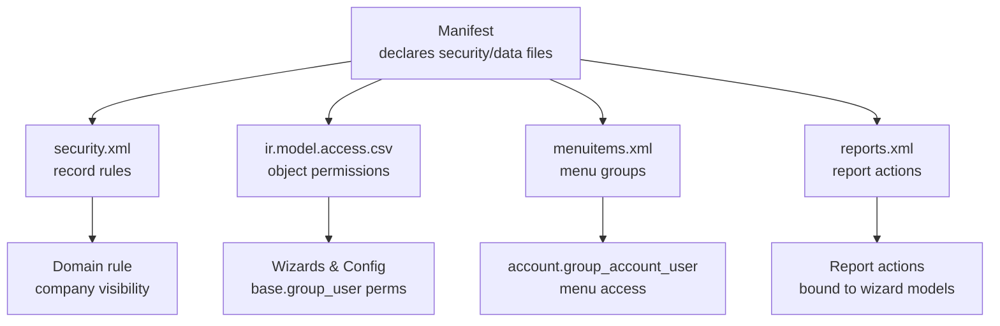
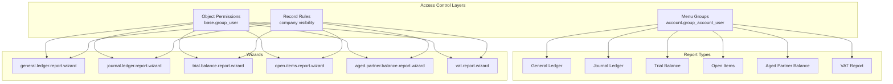
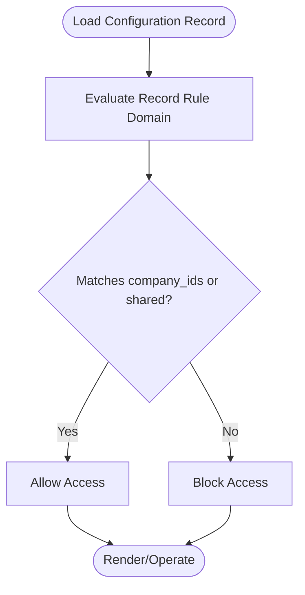
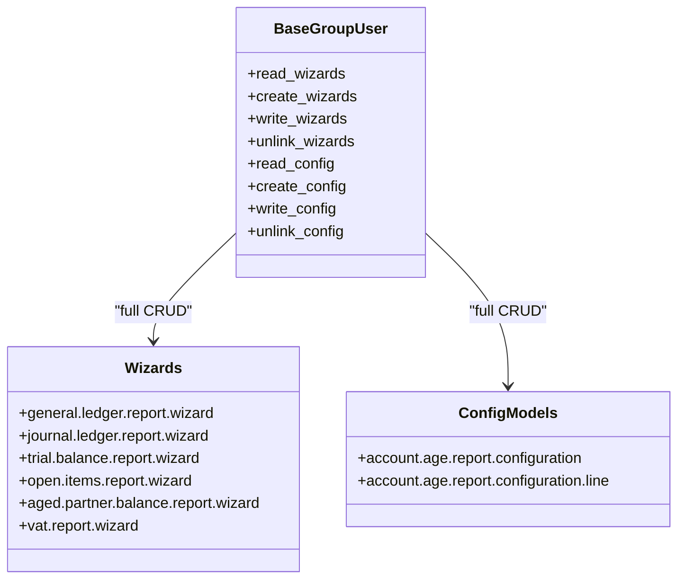
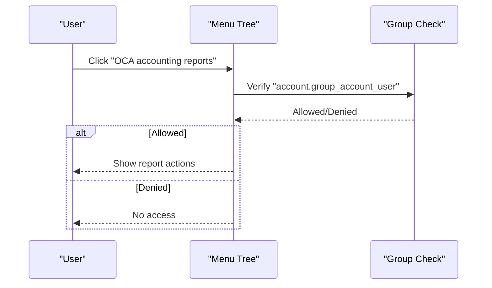
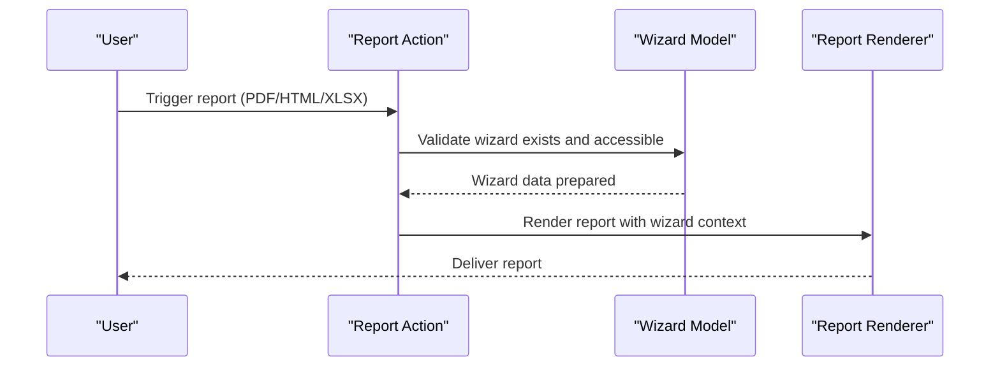
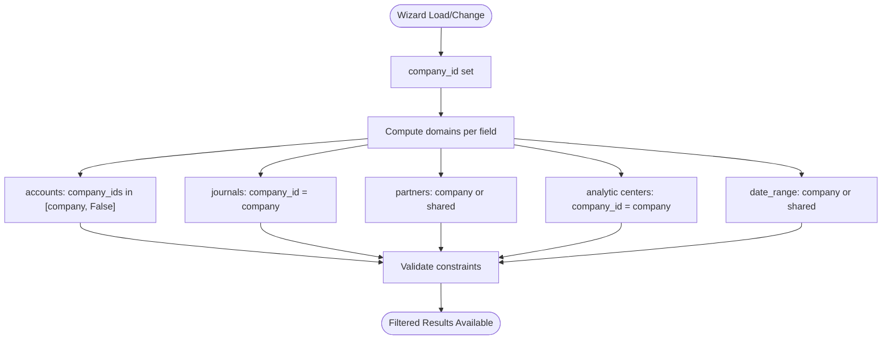
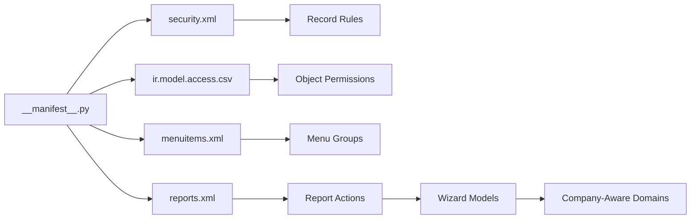

# Security and Access Control

<cite>
**Referenced Files in This Document**
- [security.xml](file://security/security.xml)
- [ir.model.access.csv](file://security/ir.model.access.csv)
- [__manifest__.py](file://__manifest__.py)
- [menuitems.xml](file://menuitems.xml)
- [reports.xml](file://reports.xml)
- [abstract_wizard.py](file://wizard/abstract_wizard.py)
- [general_ledger_wizard.py](file://wizard/general_ledger_wizard.py)
- [journal_ledger_wizard.py](file://wizard/journal_ledger_wizard.py)
- [trial_balance_wizard.py](file://wizard/trial_balance_wizard.py)
- [open_items_wizard.py](file://wizard/open_items_wizard.py)
- [aged_partner_balance_wizard.py](file://wizard/aged_partner_balance_wizard.py)
- [vat_report_wizard.py](file://wizard/vat_report_wizard.py)
</cite>

## Table of Contents
1. [Introduction](#introduction)
2. [Project Structure](#project-structure)
3. [Core Components](#core-components)
4. [Architecture Overview](#architecture-overview)
5. [Detailed Component Analysis](#detailed-component-analysis)
6. [Dependency Analysis](#dependency-analysis)
7. [Performance Considerations](#performance-considerations)
8. [Troubleshooting Guide](#troubleshooting-guide)
9. [Conclusion](#conclusion)

## Introduction
This document explains the security model and access control mechanisms in the Account Financial Reports module. It focuses on:
- How report access is controlled via XML configuration and object-level permissions
- Which user roles and groups can access each report type
- The permission hierarchy enforced at menu and report action levels
- Data visibility rules ensuring users only see relevant financial information based on company and access rights
- Practical guidance for configuring custom security policies, troubleshooting access issues, and maintaining secure financial reporting environments

## Project Structure
Security-related resources are organized under the security folder and integrated through the module manifest. The key files are:
- security/security.xml: Defines record rules for data visibility
- security/ir.model.access.csv: Grants object-level permissions to wizards and configuration records
- __manifest__.py: Declares security data files and exposes report actions and menus
- menuitems.xml: Restricts report menus to specific groups
- reports.xml: Declares report actions (PDF/HTML/XLSX) bound to wizard models
- Wizard modules: Implement report logic and enforce company-aware filtering

**Diagram sources**
- [__manifest__.py:19-46](file://__manifest__.py#L19-L46)
- [security.xml:1-9](file://security/security.xml#L1-L9)
- [ir.model.access.csv:1-10](file://security/ir.model.access.csv#L1-L10)
- [menuitems.xml:3-44](file://menuitems.xml#L3-L44)
- [reports.xml:22-172](file://reports.xml#L22-L172)

**Section sources**
- [__manifest__.py:19-46](file://__manifest__.py#L19-L46)

## Core Components
- Record rules (security.xml): Enforce domain-based visibility for configuration records, restricting access to records linked to the user’s companies or shared records.
- Object-level permissions (ir.model.access.csv): Grant base.group_user read/write/create/unlink permissions on all report wizard models and related configuration records.
- Menu access control (menuitems.xml): Restrict the OCA accounting reports menu and its children to account.group_account_user.
- Report actions (reports.xml): Define report actions for each report type (PDF/HTML/XLSX) bound to wizard models.
- Wizard logic: Each wizard enforces company-aware filtering and domain constraints to ensure users only operate on relevant data.

Key security artifacts:
- security/security.xml: Defines a record rule for configuration models with a domain that includes the current user’s companies and shared records.
- security/ir.model.access.csv: Grants base.group_user full CRUD permissions on all report wizards and configuration records.
- menuitems.xml: Uses groups="account.group_account_user" on the top-level menu and child menu items.
- reports.xml: Declares report actions for each report type and binds them to wizard models.

**Section sources**
- [security.xml:3-7](file://security/security.xml#L3-L7)
- [ir.model.access.csv:2-9](file://security/ir.model.access.csv#L2-L9)
- [menuitems.xml:7](file://menuitems.xml#L7)
- [reports.xml:22-172](file://reports.xml#L22-L172)

## Architecture Overview
The security model combines three layers:
- Menu-level access: Controls whether users can reach report menus
- Object-level permissions: Controls create/read/write/unlink on wizard and configuration records
- Data visibility rules: Enforce domain filters so users only see relevant records

**Diagram sources**
- [menuitems.xml:3-44](file://menuitems.xml#L3-L44)
- [ir.model.access.csv:2-9](file://security/ir.model.access.csv#L2-L9)
- [security.xml:3-7](file://security/security.xml#L3-L7)
- [reports.xml:22-172](file://reports.xml#L22-L172)

## Detailed Component Analysis

### Security Model: Record Rules
- Purpose: Limit visibility of configuration records to the user’s companies and shared records.
- Mechanism: A record rule targets the configuration model and applies a domain that includes company_ids plus False (shared records).
- Impact: Users can only see configuration records matching their allowed companies.

**Diagram sources**
- [security.xml:3-7](file://security/security.xml#L3-L7)

**Section sources**
- [security.xml:3-7](file://security/security.xml#L3-L7)

### Object-Level Permissions: ir.model.access.csv
- Scope: Grants base.group_user full CRUD permissions on:
  - All report wizard models
  - Configuration and configuration-line models
- Implication: Any user in base.group_user can create, read, write, and delete wizard records and configuration data.

**Diagram sources**
- [ir.model.access.csv:2-9](file://security/ir.model.access.csv#L2-L9)

**Section sources**
- [ir.model.access.csv:2-9](file://security/ir.model.access.csv#L2-L9)

### Menu Access Control
- Top-level menu “OCA accounting reports” requires account.group_account_user.
- Child menu items inherit the same group restriction.
- Effect: Only users with the required group can navigate to report actions.

**Diagram sources**
- [menuitems.xml:7](file://menuitems.xml#L7)

**Section sources**
- [menuitems.xml:3-44](file://menuitems.xml#L3-L44)

### Report Actions Binding
- Each report type has:
  - QWeb PDF/HTML actions
  - QWeb HTML action
  - XLSX action
- Actions are bound to wizard models, ensuring that only authorized users can trigger reports after passing menu and object-level checks.

**Diagram sources**
- [reports.xml:22-172](file://reports.xml#L22-L172)

**Section sources**
- [reports.xml:22-172](file://reports.xml#L22-L172)

### Data Visibility Rules in Wizards
Wizards implement company-aware filtering and domain constraints to ensure users only operate on relevant data:
- Company-aware domains: Filters for accounts, journals, partners, analytic accounts, and date ranges are restricted to the selected company or shared records.
- Partner filtering: Uses a domain that includes company-specific or shared partners.
- Multi-company safety: Wizard methods ensure that changing company updates related domains and validates consistency with date ranges.

**Diagram sources**
- [abstract_wizard.py:11-20](file://wizard/abstract_wizard.py#L11-L20)
- [general_ledger_wizard.py:196](file://wizard/general_ledger_wizard.py#L196)
- [journal_ledger_wizard.py:77](file://wizard/journal_ledger_wizard.py#L77)
- [trial_balance_wizard.py:169](file://wizard/trial_balance_wizard.py#L169)
- [open_items_wizard.py:116](file://wizard/open_items_wizard.py#L116)
- [aged_partner_balance_wizard.py:93](file://wizard/aged_partner_balance_wizard.py#L93)
- [vat_report_wizard.py:41](file://wizard/vat_report_wizard.py#L41)

**Section sources**
- [abstract_wizard.py:11-20](file://wizard/abstract_wizard.py#L11-L20)
- [general_ledger_wizard.py:196](file://wizard/general_ledger_wizard.py#L196)
- [journal_ledger_wizard.py:77](file://wizard/journal_ledger_wizard.py#L77)
- [trial_balance_wizard.py:169](file://wizard/trial_balance_wizard.py#L169)
- [open_items_wizard.py:116](file://wizard/open_items_wizard.py#L116)
- [aged_partner_balance_wizard.py:93](file://wizard/aged_partner_balance_wizard.py#L93)
- [vat_report_wizard.py:41](file://wizard/vat_report_wizard.py#L41)

## Dependency Analysis
- Manifest dependency on security files ensures installation order and activation of rules and permissions.
- Menu groups depend on Odoo standard groups (account.group_account_user).
- Report actions depend on wizard models; wizards depend on company-aware domain logic.
- Record rules depend on company fields present on configuration models.

**Diagram sources**
- [__manifest__.py:19-46](file://__manifest__.py#L19-L46)
- [security.xml:3-7](file://security/security.xml#L3-L7)
- [ir.model.access.csv:2-9](file://security/ir.model.access.csv#L2-L9)
- [menuitems.xml:3-44](file://menuitems.xml#L3-L44)
- [reports.xml:22-172](file://reports.xml#L22-L172)

**Section sources**
- [__manifest__.py:19-46](file://__manifest__.py#L19-L46)

## Performance Considerations
- Domain filtering in wizards reduces dataset sizes early, minimizing rendering overhead.
- Using shared records (company=False) in domains allows broader visibility while preserving explicit company-scoped records.
- Keeping permissions minimal at the object level avoids unnecessary write/delete operations that could trigger extra validation or logging.

## Troubleshooting Guide
Common access issues and resolutions:
- Symptom: User cannot see report menu
  - Check menu groups and ensure the user belongs to account.group_account_user.
  - Confirm menuitems.xml groups assignment.
  - Section sources
    - [menuitems.xml:7](file://menuitems.xml#L7)

- Symptom: User can see menu but cannot run a report
  - Verify base.group_user has full permissions on wizard models via ir.model.access.csv.
  - Confirm reports.xml actions bind to correct wizard models.
  - Section sources
    - [ir.model.access.csv:2-9](file://security/ir.model.access.csv#L2-L9)
    - [reports.xml:22-172](file://reports.xml#L22-L172)

- Symptom: Wizard returns empty results despite valid filters
  - Review company-aware domains computed in wizard methods.
  - Ensure company_id is set and consistent with date ranges and related entities.
  - Section sources
    - [general_ledger_wizard.py:196](file://wizard/general_ledger_wizard.py#L196)
    - [journal_ledger_wizard.py:77](file://wizard/journal_ledger_wizard.py#L77)
    - [trial_balance_wizard.py:169](file://wizard/trial_balance_wizard.py#L169)
    - [open_items_wizard.py:116](file://wizard/open_items_wizard.py#L116)
    - [aged_partner_balance_wizard.py:93](file://wizard/aged_partner_balance_wizard.py#L93)
    - [vat_report_wizard.py:41](file://wizard/vat_report_wizard.py#L41)

- Symptom: User sees records outside their company scope
  - Confirm record rule domain includes company_ids and False for shared records.
  - Section sources
    - [security.xml:6](file://security/security.xml#L6)

Best practices:
- Keep permissions at the minimum required level (base.group_user for wizards and config).
- Use record rules to enforce company scoping for sensitive configuration records.
- Avoid broad write permissions unless necessary; restrict to trusted roles.
- Regularly audit menu groups and report actions to align with organizational roles.

## Conclusion
The Account Financial Reports module enforces a layered security model:
- Menu access is restricted to account.group_account_user
- Object-level permissions grant base.group_user full access to report wizards and configuration records
- Record rules ensure configuration records are visible only within appropriate company contexts
- Wizard logic enforces company-aware filtering and domain constraints to guarantee users operate on relevant data

By combining these controls, the module maintains secure and compliant financial reporting environments while keeping user workflows straightforward.