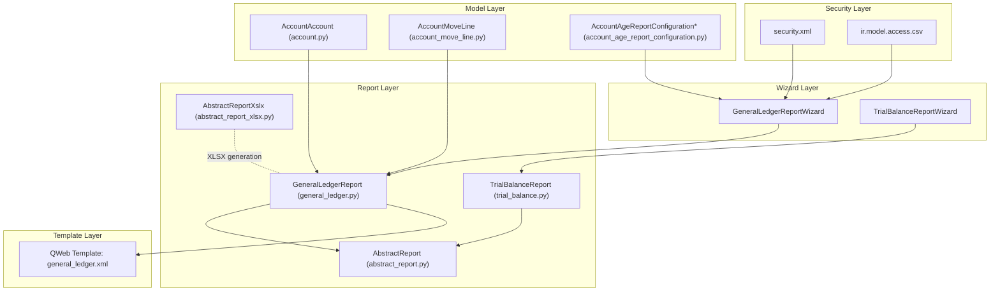
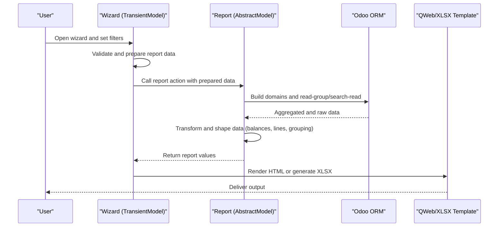
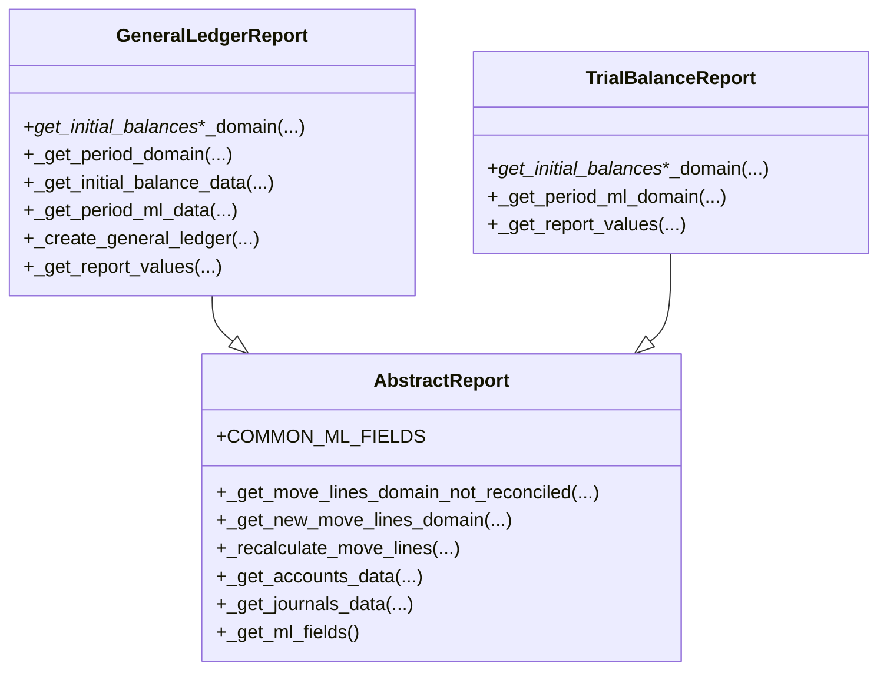
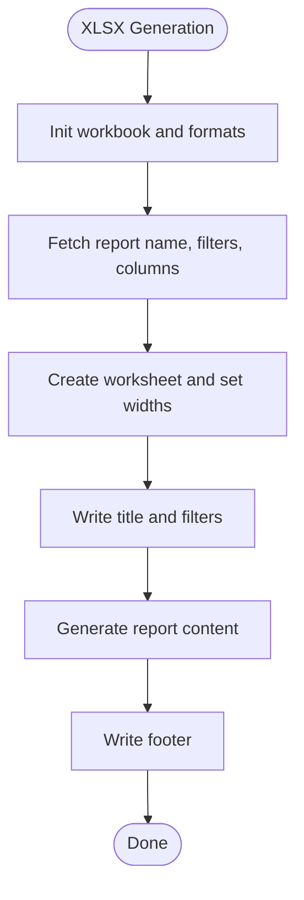
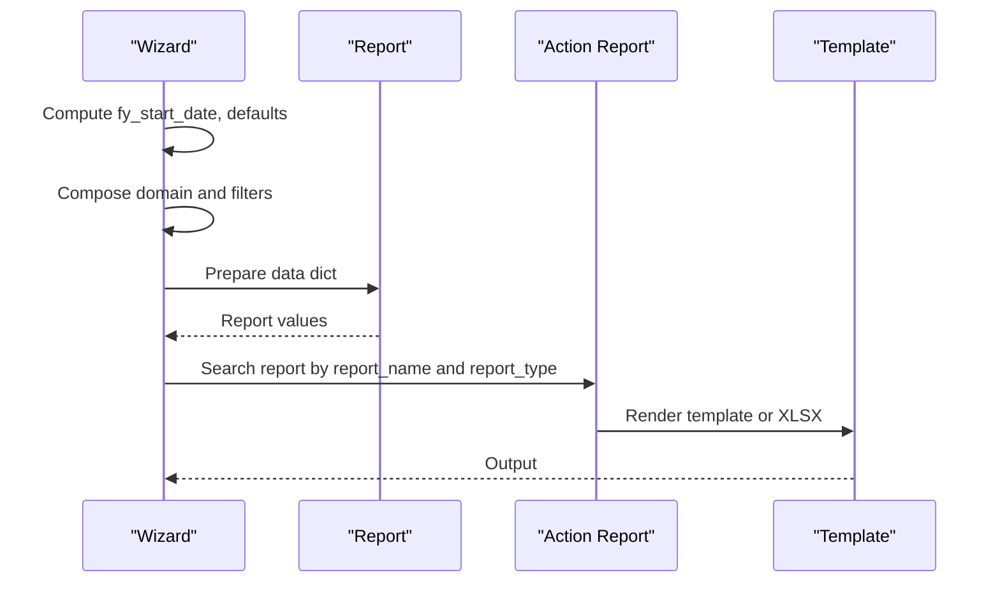
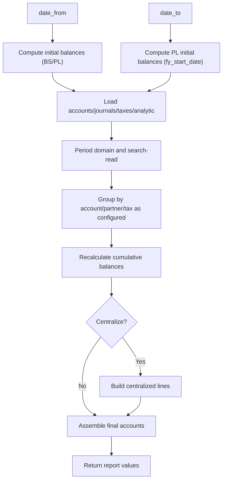
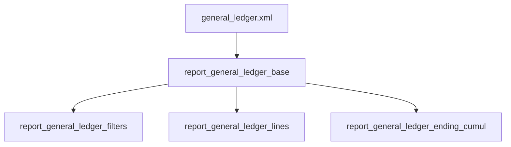
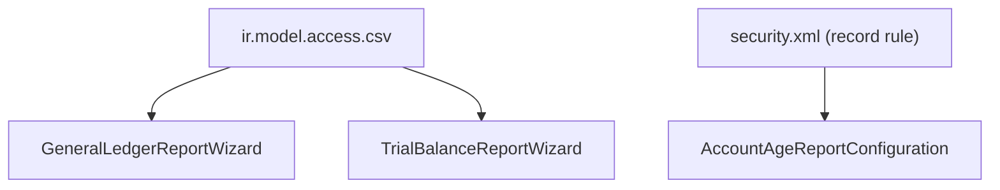
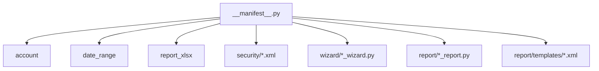

# Technical Architecture

<cite>
**Referenced Files in This Document**
- [__manifest__.py](file://__manifest__.py)
- [abstract_report.py](file://report/abstract_report.py)
- [abstract_report_xlsx.py](file://report/abstract_report_xlsx.py)
- [abstract_wizard.py](file://wizard/abstract_wizard.py)
- [general_ledger.py](file://report/general_ledger.py)
- [general_ledger_wizard.py](file://wizard/general_ledger_wizard.py)
- [trial_balance.py](file://report/trial_balance.py)
- [trial_balance_wizard.py](file://wizard/trial_balance_wizard.py)
- [general_ledger.xml](file://report/templates/general_ledger.xml)
- [security.xml](file://security/security.xml)
- [ir.model.access.csv](file://security/ir.model.access.csv)
- [account.py](file://models/account.py)
- [account_move_line.py](file://models/account_move_line.py)
- [account_age_report_configuration.py](file://models/account_age_report_configuration.py)
- [res_config_settings.py](file://models/res_config_settings.py)
</cite>

## Table of Contents
1. [Introduction](#introduction)
2. [Project Structure](#project-structure)
3. [Core Components](#core-components)
4. [Architecture Overview](#architecture-overview)
5. [Detailed Component Analysis](#detailed-component-analysis)
6. [Dependency Analysis](#dependency-analysis)
7. [Performance Considerations](#performance-considerations)
8. [Troubleshooting Guide](#troubleshooting-guide)
9. [Conclusion](#conclusion)

## Introduction
This document describes the technical architecture of the Account Financial Reports module. It explains the abstract report framework, the data processing pipeline, and the template rendering system. It documents the interactions among models, wizards, reports, and templates, details the inheritance hierarchy starting from abstract base classes, and traces the data flow from wizard configuration to final output generation. It also covers multi-currency support, date range handling, report caching mechanisms, and the security model with access controls and permissions.

## Project Structure
The module follows a layered structure:
- Wizard layer: user-configurable report parameters and actions
- Report layer: computation and aggregation logic, inheriting from abstract base classes
- Template layer: QWeb HTML templates and XLSX generation helpers
- Model layer: extensions to Odoo core accounting models and auxiliary configuration models
- Security layer: access rights and record rules

**Diagram sources**
- [__manifest__.py:19-46](file://__manifest__.py#L19-L46)
- [abstract_report.py:7-165](file://report/abstract_report.py#L7-L165)
- [abstract_report_xlsx.py:8-698](file://report/abstract_report_xlsx.py#L8-L698)
- [abstract_wizard.py:7-52](file://wizard/abstract_wizard.py#L7-L52)
- [general_ledger.py:14-931](file://report/general_ledger.py#L14-L931)
- [trial_balance.py:12-981](file://report/trial_balance.py#L12-L981)
- [general_ledger_wizard.py:18-322](file://wizard/general_ledger_wizard.py#L18-L322)
- [trial_balance_wizard.py:12-285](file://wizard/trial_balance_wizard.py#L12-L285)
- [general_ledger.xml:1-789](file://report/templates/general_ledger.xml#L1-L789)
- [account.py:6-14](file://models/account.py#L6-L14)
- [account_move_line.py:9-71](file://models/account_move_line.py#L9-L71)
- [account_age_report_configuration.py:8-50](file://models/account_age_report_configuration.py#L8-L50)
- [security.xml:1-9](file://security/security.xml#L1-L9)
- [ir.model.access.csv:1-10](file://security/ir.model.access.csv#L1-L10)

**Section sources**
- [__manifest__.py:19-46](file://__manifest__.py#L19-L46)

## Core Components
- Abstract Report Base: Provides shared domain construction, move line recalculations, and common account/journal data retrieval.
- Abstract XLSX Report Base: Provides workbook creation, formatting, column definitions, and standardized XLSX writing helpers.
- Abstract Wizard Base: Provides shared wizard fields and export actions (HTML, PDF, XLSX).
- Concrete Reports: Implement report-specific domains, aggregations, and data shaping (e.g., General Ledger, Trial Balance).
- Templates: QWeb templates render HTML output; XLSX generation is handled via the XLSX abstract base.
- Models: Extend core models and introduce auxiliary configuration models for aging report intervals.
- Security: Access rights and record rules govern visibility and permissions.

**Section sources**
- [abstract_report.py:7-165](file://report/abstract_report.py#L7-L165)
- [abstract_report_xlsx.py:8-698](file://report/abstract_report_xlsx.py#L8-L698)
- [abstract_wizard.py:7-52](file://wizard/abstract_wizard.py#L7-L52)
- [general_ledger.py:14-931](file://report/general_ledger.py#L14-L931)
- [trial_balance.py:12-981](file://report/trial_balance.py#L12-L981)
- [general_ledger.xml:1-789](file://report/templates/general_ledger.xml#L1-L789)
- [account.py:6-14](file://models/account.py#L6-L14)
- [account_move_line.py:9-71](file://models/account_move_line.py#L9-L71)
- [account_age_report_configuration.py:8-50](file://models/account_age_report_configuration.py#L8-L50)
- [security.xml:1-9](file://security/security.xml#L1-L9)
- [ir.model.access.csv:1-10](file://security/ir.model.access.csv#L1-L10)

## Architecture Overview
The system is event-driven and data-centric:
- Wizard collects parameters and prepares a data payload.
- Report computes initial balances, aggregates move lines, and builds structured data.
- Templates render the final output (HTML or XLSX via report_xlsx).
- Security enforces access and visibility constraints.

**Diagram sources**
- [general_ledger_wizard.py:274-322](file://wizard/general_ledger_wizard.py#L274-L322)
- [general_ledger.py:763-931](file://report/general_ledger.py#L763-L931)
- [abstract_report.py:21-165](file://report/abstract_report.py#L21-L165)
- [abstract_report_xlsx.py:18-698](file://report/abstract_report_xlsx.py#L18-L698)
- [general_ledger.xml:1-789](file://report/templates/general_ledger.xml#L1-L789)

## Detailed Component Analysis

### Abstract Report Framework
The abstract report base encapsulates common logic:
- Move line domain building for initial/fiscal/year domains
- Recalculation of residual amounts and currencies after reconciliations
- Retrieval of account and journal metadata
- Field sets for efficient read operations

**Diagram sources**
- [abstract_report.py:7-165](file://report/abstract_report.py#L7-L165)
- [general_ledger.py:14-931](file://report/general_ledger.py#L14-L931)
- [trial_balance.py:12-981](file://report/trial_balance.py#L12-L981)

**Section sources**
- [abstract_report.py:7-165](file://report/abstract_report.py#L7-L165)

### Abstract XLSX Report Framework
The XLSX base provides:
- Workbook initialization and constant memory mode
- Standardized report scaffolding: title, filters, columns, content generation
- Formatting helpers for amounts, headers, and currencies
- Writing helpers for lines, initial/ending balances, and arrays

**Diagram sources**
- [abstract_report_xlsx.py:18-130](file://report/abstract_report_xlsx.py#L18-L130)
- [abstract_report_xlsx.py:605-698](file://report/abstract_report_xlsx.py#L605-L698)

**Section sources**
- [abstract_report_xlsx.py:8-698](file://report/abstract_report_xlsx.py#L8-L698)

### Wizard Layer and Data Preparation
Wizards collect parameters and prepare the data payload passed to reports:
- Date range handling and fiscal year start computation
- Domain composition and filtering by accounts, journals, partners, analytic accounts
- Export routing to HTML/PDF/XLSX via report actions

**Diagram sources**
- [general_ledger_wizard.py:274-322](file://wizard/general_ledger_wizard.py#L274-L322)
- [trial_balance_wizard.py:12-285](file://wizard/trial_balance_wizard.py#L12-L285)

**Section sources**
- [general_ledger_wizard.py:18-322](file://wizard/general_ledger_wizard.py#L18-L322)
- [trial_balance_wizard.py:12-285](file://wizard/trial_balance_wizard.py#L12-L285)
- [abstract_wizard.py:7-52](file://wizard/abstract_wizard.py#L7-L52)

### Report Data Processing Pipeline (General Ledger)
The General Ledger report orchestrates:
- Initial balances computation across BS and PL accounts
- Period move lines aggregation with optional grouping by partners/taxes
- Cumulative balance calculation and reconciliation adjustments
- Centralized entries generation and final account assembly

**Diagram sources**
- [general_ledger.py:258-800](file://report/general_ledger.py#L258-L800)
- [abstract_report.py:21-165](file://report/abstract_report.py#L21-L165)

**Section sources**
- [general_ledger.py:14-931](file://report/general_ledger.py#L14-L931)

### Template Rendering System (QWeb)
Templates define the HTML output structure:
- Filters display, account headers, move lines table, and ending balances
- Conditional rendering for foreign currency and analytic distributions
- Clickable links to underlying records via res-model attributes

**Diagram sources**
- [general_ledger.xml:1-789](file://report/templates/general_ledger.xml#L1-L789)

**Section sources**
- [general_ledger.xml:1-789](file://report/templates/general_ledger.xml#L1-L789)

### Multi-Currency Support
- Currency-aware fields are included in move line reads and rendered conditionally in templates.
- Amounts and cumulative balances can be shown in account currency when applicable.
- XLSX formatting supports per-currency number formats derived from currency decimals.

Key behaviors:
- Fields retrieved include residual and currency amounts.
- Templates check currency presence and adjust display accordingly.
- XLSX formats adapt to currency decimal places.

**Section sources**
- [abstract_report.py:154-165](file://report/abstract_report.py#L154-L165)
- [general_ledger.py:318-361](file://report/general_ledger.py#L318-L361)
- [general_ledger.xml:179-189](file://report/templates/general_ledger.xml#L179-L189)
- [general_ledger.xml:601-641](file://report/templates/general_ledger.xml#L601-L641)
- [abstract_report_xlsx.py:57-92](file://report/abstract_report_xlsx.py#L57-L92)
- [abstract_report_xlsx.py:526-568](file://report/abstract_report_xlsx.py#L526-L568)

### Date Range Handling
- Wizards compute fiscal year start date based on company settings.
- Domains restrict move lines to the selected date range and target moves (posted/all).
- Special handling for reclassified periods and reconciliations after the reporting period.

**Section sources**
- [general_ledger_wizard.py:131-142](file://wizard/general_ledger_wizard.py#L131-L142)
- [general_ledger.py:362-391](file://report/general_ledger.py#L362-L391)
- [general_ledger.py:403-417](file://report/general_ledger.py#L403-L417)

### Report Caching Mechanisms
- No explicit caching is implemented in the reviewed files. The system relies on efficient read-group and search-read operations with precomputed domains and indices.
- Index creation for move lines improves performance for large datasets.

**Section sources**
- [account_move_line.py:39-62](file://models/account_move_line.py#L39-L62)

### Security Model, Access Controls, and Permissions
- Access rights: CSV grants read/write/create/unlink permissions for wizard models to base.group_user.
- Record rules: Domain forces company scoping for configuration records.
- Module dependencies: Includes security-related modules via manifest.

**Diagram sources**
- [ir.model.access.csv:1-10](file://security/ir.model.access.csv#L1-L10)
- [security.xml:1-9](file://security/security.xml#L1-L9)
- [general_ledger_wizard.py:18-322](file://wizard/general_ledger_wizard.py#L18-L322)
- [trial_balance_wizard.py:12-285](file://wizard/trial_balance_wizard.py#L12-L285)
- [account_age_report_configuration.py:8-50](file://models/account_age_report_configuration.py#L8-L50)

**Section sources**
- [ir.model.access.csv:1-10](file://security/ir.model.access.csv#L1-L10)
- [security.xml:1-9](file://security/security.xml#L1-L9)
- [__manifest__.py:18-21](file://__manifest__.py#L18-L21)

### Auxiliary Models and Configuration
- Account extension adds centralized flag for General Ledger grouping.
- Aging report configuration models manage interval definitions and defaults via settings.

**Section sources**
- [account.py:6-14](file://models/account.py#L6-L14)
- [account_age_report_configuration.py:8-50](file://models/account_age_report_configuration.py#L8-L50)
- [res_config_settings.py:15-37](file://models/res_config_settings.py#L15-L37)

## Dependency Analysis
The module depends on core accounting and reporting modules, and integrates with XLSX generation and date ranges.

**Diagram sources**
- [__manifest__.py:18-46](file://__manifest__.py#L18-L46)

**Section sources**
- [__manifest__.py:18-46](file://__manifest__.py#L18-L46)

## Performance Considerations
- Efficient domain building reduces database load.
- Indices on move lines improve join performance for large datasets.
- Constant memory mode in XLSX workbook reduces memory footprint during generation.
- read_group and targeted field selection minimize data transfer.

[No sources needed since this section provides general guidance]

## Troubleshooting Guide
Common issues and checks:
- Date range mismatch: Ensure wizard date range matches company fiscal year settings.
- Currency display: Verify multi-currency group membership and account currency setup.
- Reconciliation after reporting period: Adjustments mark reconciliations occurring after the reporting period.
- Analytic distribution: Confirm analytic account ids are populated and filtered correctly.

**Section sources**
- [general_ledger_wizard.py:218-232](file://wizard/general_ledger_wizard.py#L218-L232)
- [general_ledger.py:561-569](file://report/general_ledger.py#L561-L569)
- [account_move_line.py:16-38](file://models/account_move_line.py#L16-L38)

## Conclusion
The Account Financial Reports module implements a robust, extensible architecture centered on abstract report and wizard bases. It cleanly separates concerns across layers, leverages Odoo ORM efficiently, and provides flexible output formats (HTML and XLSX). Security is enforced through access rights and record rules. The design supports multi-currency, precise date range handling, and performance-conscious operations, enabling reliable financial reporting at scale.