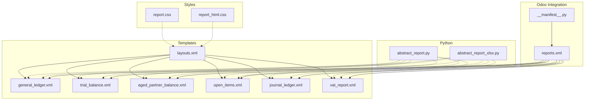
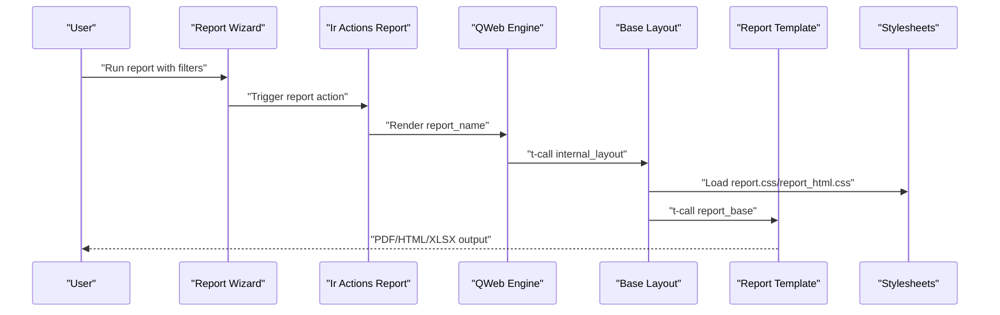
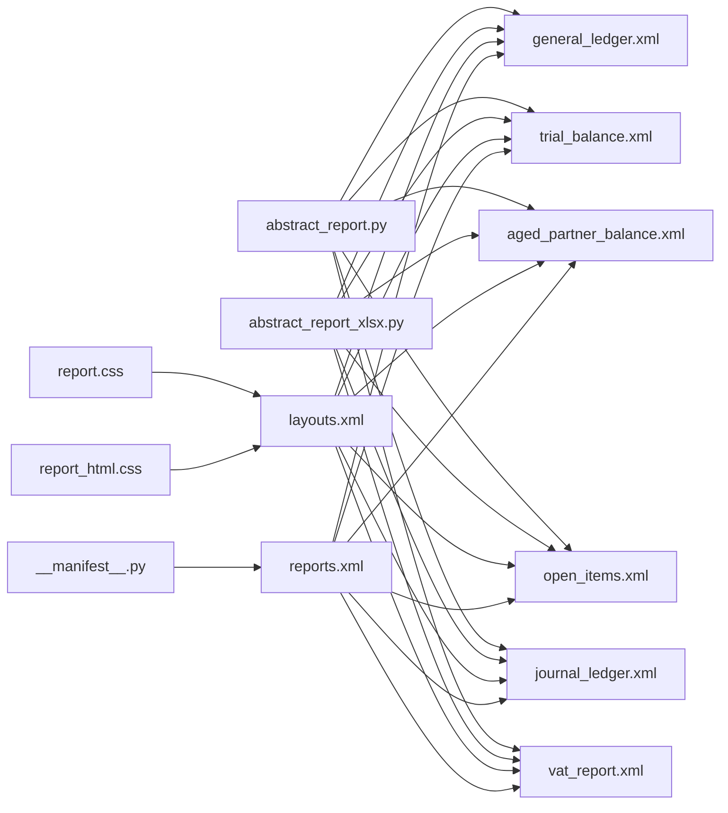

# Template System

<cite>
**Referenced Files in This Document**
- [layouts.xml](file://report/templates/layouts.xml)
- [general_ledger.xml](file://report/templates/general_ledger.xml)
- [trial_balance.xml](file://report/templates/trial_balance.xml)
- [aged_partner_balance.xml](file://report/templates/aged_partner_balance.xml)
- [open_items.xml](file://report/templates/open_items.xml)
- [journal_ledger.xml](file://report/templates/journal_ledger.xml)
- [vat_report.xml](file://report/templates/vat_report.xml)
- [report.css](file://static/src/css/report.css)
- [report_html.css](file://static/src/css/report_html.css)
- [abstract_report.py](file://report/abstract_report.py)
- [abstract_report_xlsx.py](file://report/abstract_report_xlsx.py)
- [__manifest__.py](file://__manifest__.py)
- [reports.xml](file://reports.xml)
</cite>

## Table of Contents
1. [Introduction](#introduction)
2. [Project Structure](#project-structure)
3. [Core Components](#core-components)
4. [Architecture Overview](#architecture-overview)
5. [Detailed Component Analysis](#detailed-component-analysis)
6. [Dependency Analysis](#dependency-analysis)
7. [Performance Considerations](#performance-considerations)
8. [Troubleshooting Guide](#troubleshooting-guide)
9. [Conclusion](#conclusion)

## Introduction
This document explains the template system used by the financial reporting module to render standardized reports across PDF, HTML, and XLSX formats. It covers the QWeb templating engine integration, base layout templates, report-specific templates, CSS styling, template variables, conditional rendering, and dynamic content generation. It also provides guidance for customizing templates, adding new formatting options, and troubleshooting rendering issues.

## Project Structure
The template system is organized around:
- Base QWeb templates for layouts and shared components
- Individual report templates for each financial statement
- Shared CSS stylesheets for consistent visual presentation
- Abstract Python classes that supply data and formatting logic
- Odoo action records that bind templates to report actions

**Diagram sources**
- [layouts.xml:1-44](file://report/templates/layouts.xml#L1-L44)
- [general_ledger.xml:1-120](file://report/templates/general_ledger.xml#L1-L120)
- [trial_balance.xml:1-120](file://report/templates/trial_balance.xml#L1-L120)
- [aged_partner_balance.xml:1-120](file://report/templates/aged_partner_balance.xml#L1-L120)
- [open_items.xml:1-120](file://report/templates/open_items.xml#L1-L120)
- [journal_ledger.xml:1-120](file://report/templates/journal_ledger.xml#L1-L120)
- [vat_report.xml:1-168](file://report/templates/vat_report.xml#L1-L168)
- [report.css:1-149](file://static/src/css/report.css#L1-L149)
- [report_html.css:1-11](file://static/src/css/report_html.css#L1-L11)
- [abstract_report.py:1-165](file://report/abstract_report.py#L1-L165)
- [abstract_report_xlsx.py:1-120](file://report/abstract_report_xlsx.py#L1-L120)
- [__manifest__.py:1-58](file://__manifest__.py#L1-L58)
- [reports.xml:1-174](file://reports.xml#L1-L174)

**Section sources**
- [__manifest__.py:19-46](file://__manifest__.py#L19-L46)
- [reports.xml:1-174](file://reports.xml#L1-L174)

## Core Components
- Base Layout Templates
  - Internal layout defines the page container, footer, and includes report.css for PDF/HTML rendering.
  - HTML container adds web backend assets and report_html.css for HTML views.
- Report Templates
  - Each report defines a top-level template that composes the internal layout and a base template for the report content.
  - Content templates use variables and conditional blocks to render dynamic data.
- CSS Styling
  - report.css provides table-like layout classes and print-friendly styles.
  - report_html.css adjusts typography for HTML preview.
- Data Providers
  - Abstract classes prepare data structures and compute domains for monetary and currency fields.
- XLSX Rendering
  - Abstract XLSX class defines workbook formats, column widths, and write helpers for Excel exports.

**Section sources**
- [layouts.xml:1-44](file://report/templates/layouts.xml#L1-L44)
- [report.css:1-149](file://static/src/css/report.css#L1-L149)
- [report_html.css:1-11](file://static/src/css/report_html.css#L1-L11)
- [abstract_report.py:1-165](file://report/abstract_report.py#L1-L165)
- [abstract_report_xlsx.py:1-120](file://report/abstract_report_xlsx.py#L1-L120)

## Architecture Overview
The system integrates Odoo’s QWeb engine with custom templates and styles to produce consistent financial reports. The flow is:
- Odoo actions (PDF/HTML/XLSX) reference report names mapped to QWeb templates.
- QWeb renders templates using variables supplied by report wizards/models.
- Base layouts inject assets and apply consistent styling.
- XLSX actions use an abstract class to build workbooks programmatically.

**Diagram sources**
- [reports.xml:20-122](file://reports.xml#L20-L122)
- [layouts.xml:3-21](file://report/templates/layouts.xml#L3-L21)
- [general_ledger.xml:3-11](file://report/templates/general_ledger.xml#L3-L11)
- [report.css:1-149](file://static/src/css/report.css#L1-L149)
- [report_html.css:1-11](file://static/src/css/report_html.css#L1-L11)

## Detailed Component Analysis

### Base Layout Templates
- Internal Layout
  - Wraps content in a page container and footer with page numbers.
  - Includes report.css for consistent print layout.
- HTML Container
  - Adds web backend assets and applies report_html.css for HTML previews.

Key behaviors:
- Asset injection via t-call-assets and link tags.
- Footer displays current timestamp and pagination placeholders.
- Page container sets margins and typography.

**Section sources**
- [layouts.xml:3-42](file://report/templates/layouts.xml#L3-L42)
- [report.css:135-149](file://static/src/css/report.css#L135-L149)
- [report_html.css:1-11](file://static/src/css/report_html.css#L1-L11)

### General Ledger Template
- Top-level template composes internal layout and base template.
- Base template sets title and filters, then iterates over accounts.
- Conditional rendering supports grouped accounts and partners.
- Lines template builds headers and rows with monetary widgets and optional foreign currency columns.
- Ending cumulative template computes and displays balances.

Dynamic features:
- Variables like foreign_currency, filter_partner_ids influence column visibility.
- Domain expressions on spans enable drill-down to move lines.
- Monetary widgets format amounts according to currency contexts.

**Section sources**
- [general_ledger.xml:3-11](file://report/templates/general_ledger.xml#L3-L11)
- [general_ledger.xml:12-104](file://report/templates/general_ledger.xml#L12-L104)
- [general_ledger.xml:105-134](file://report/templates/general_ledger.xml#L105-L134)
- [general_ledger.xml:135-645](file://report/templates/general_ledger.xml#L135-L645)
- [general_ledger.xml:646-787](file://report/templates/general_ledger.xml#L646-L787)

### Trial Balance Template
- Top-level template composes internal layout and base template.
- Base template controls grouping, hierarchy level limits, and partner details.
- Lines header and line templates render account/partner rows with monetary totals.
- Foreign currency columns conditionally appear based on configuration.

Conditional logic:
- show_partner_details toggles partner-level detail vs aggregated accounts.
- show_hierarchy and limit_hierarchy_level control hierarchical display.
- Foreign currency columns depend on account currency presence.

**Section sources**
- [trial_balance.xml:3-11](file://report/templates/trial_balance.xml#L3-L11)
- [trial_balance.xml:12-179](file://report/templates/trial_balance.xml#L12-L179)
- [trial_balance.xml:180-212](file://report/templates/trial_balance.xml#L180-L212)
- [trial_balance.xml:213-249](file://report/templates/trial_balance.xml#L213-L249)
- [trial_balance.xml:250-753](file://report/templates/trial_balance.xml#L250-L753)

### Aged Partner Balance Template
- Top-level template composes internal layout and base template.
- Base template supports two modes: summarized partner balances or detailed move lines.
- Filters template displays aging configuration and target moves.
- Lines and move lines templates render aging buckets and optional dynamic columns.

Dynamic features:
- Aging buckets can be configured via age_partner_config.
- Move line details include due dates and residual amounts.
- Ending cumulative templates compute totals and percentages.

**Section sources**
- [aged_partner_balance.xml:3-13](file://report/templates/aged_partner_balance.xml#L3-L13)
- [aged_partner_balance.xml:14-91](file://report/templates/aged_partner_balance.xml#L14-L91)
- [aged_partner_balance.xml:92-108](file://report/templates/aged_partner_balance.xml#L92-L108)
- [aged_partner_balance.xml:109-139](file://report/templates/aged_partner_balance.xml#L109-L139)
- [aged_partner_balance.xml:140-207](file://report/templates/aged_partner_balance.xml#L140-L207)
- [aged_partner_balance.xml:208-508](file://report/templates/aged_partner_balance.xml#L208-L508)
- [aged_partner_balance.xml:509-581](file://report/templates/aged_partner_balance.xml#L509-L581)
- [aged_partner_balance.xml:582-760](file://report/templates/aged_partner_balance.xml#L582-L760)

### Open Items Template
- Top-level template composes internal layout and base template.
- Supports grouped-by-salesperson mode and partner-level detail.
- Filters template displays date-at, target moves, and zero-balance options.
- Lines and ending cumulative templates render move lines and totals.

Conditional logic:
- grouped_by and show_partner_details control grouping and detail depth.
- Currency columns appear conditionally based on line currency presence.

**Section sources**
- [open_items.xml:3-11](file://report/templates/open_items.xml#L3-L11)
- [open_items.xml:13-211](file://report/templates/open_items.xml#L13-L211)
- [open_items.xml:213-234](file://report/templates/open_items.xml#L213-L234)
- [open_items.xml:235-277](file://report/templates/open_items.xml#L235-L277)
- [open_items.xml:278-380](file://report/templates/open_items.xml#L278-L380)
- [open_items.xml:381-453](file://report/templates/open_items.xml#L381-L453)

### Journal Ledger Template
- Top-level template composes internal layout and base template.
- Supports “all” and “by journal” grouping modes.
- Journal table header adapts widths for auto-sequence, account name, and label columns.
- Move line template renders entries with taxes, debits, credits, and optional currency columns.

Dynamic features:
- with_auto_sequence toggles sequence column.
- display_account_name toggles account code and name.
- Taxes summary table aggregates base and tax amounts.

**Section sources**
- [journal_ledger.xml:5-13](file://report/templates/journal_ledger.xml#L5-L13)
- [journal_ledger.xml:14-55](file://report/templates/journal_ledger.xml#L14-L55)
- [journal_ledger.xml:56-66](file://report/templates/journal_ledger.xml#L56-L66)
- [journal_ledger.xml:67-92](file://report/templates/journal_ledger.xml#L67-L92)
- [journal_ledger.xml:93-172](file://report/templates/journal_ledger.xml#L93-L172)
- [journal_ledger.xml:173-206](file://report/templates/journal_ledger.xml#L173-L206)
- [journal_ledger.xml:207-315](file://report/templates/journal_ledger.xml#L207-L315)
- [journal_ledger.xml:316-414](file://report/templates/journal_ledger.xml#L316-L414)
- [journal_ledger.xml:415-510](file://report/templates/journal_ledger.xml#L415-L510)

### VAT Report Template
- Top-level template composes internal layout and base template.
- Filters template displays date range and basis selection.
- Main table renders codes, names, net, and tax amounts, with optional tax detail lines.

Dynamic features:
- tax_detail toggles inclusion of tax breakdown lines.
- Monetary widgets format amounts according to company currency.

**Section sources**
- [vat_report.xml:3-11](file://report/templates/vat_report.xml#L3-L11)
- [vat_report.xml:12-146](file://report/templates/vat_report.xml#L12-L146)
- [vat_report.xml:147-167](file://report/templates/vat_report.xml#L147-L167)

### CSS Styling System
- report.css
  - Provides act_as_* classes to emulate HTML table layout in QWeb.
  - Defines borders, alignment, and typography for lists, data tables, and totals.
  - Includes page break and footer styles.
- report_html.css
  - Adjusts font sizes for HTML preview to improve readability.

Integration:
- Internal layout links report.css for PDF/HTML.
- HTML container links report_html.css for HTML previews.

**Section sources**
- [report.css:1-149](file://static/src/css/report.css#L1-L149)
- [report_html.css:1-11](file://static/src/css/report_html.css#L1-L11)
- [layouts.xml:14-21](file://report/templates/layouts.xml#L14-L21)

### Data Providers and Dynamic Content Generation
- Abstract Report (Python)
  - Prepares account, journal, and move-line data structures.
  - Builds domains for monetary fields and reconciled/unreconciled lines.
  - Supplies common move-line fields and computed balances.
- Abstract Report XLSX (Python)
  - Defines workbook formats, column widths, and write helpers.
  - Formats amounts and currencies consistently across sheets.
  - Provides methods to write titles, filters, arrays, and balances.

Relationship to templates:
- Templates rely on variables set by report wizards/models and consumed by Python providers.
- Monetary widgets and domain attributes enable interactive drill-through to source documents.

**Section sources**
- [abstract_report.py:1-165](file://report/abstract_report.py#L1-L165)
- [abstract_report_xlsx.py:1-120](file://report/abstract_report_xlsx.py#L1-L120)
- [abstract_report_xlsx.py:18-42](file://report/abstract_report_xlsx.py#L18-L42)

### Template Variables and Conditional Rendering
Common variables across templates:
- Flags: foreign_currency, show_partner_details, with_auto_sequence, display_currency, display_account_name, show_hierarchy, limit_hierarchy_level, tax_detail.
- Titles and metadata: company_name, currency_name, date_from, date_to, date_at, only_posted_moves, hide_account_at_0.
- Data containers: general_ledger, trial_balance, aged_partner_balance, Open_Items, Journal_Ledgers, vat_report.

Conditional rendering patterns:
- t-if and t-elif blocks control visibility of columns and sections.
- t-foreach iterates over collections (accounts, partners, move lines).
- t-att-* and t-out/t-esc insert dynamic content safely.

Monetary and currency formatting:
- t-options with widget "monetary" and display_currency ensures consistent formatting.
- Domain attributes on spans enable clickable drill-through to source records.

**Section sources**
- [general_ledger.xml:14-16](file://report/templates/general_ledger.xml#L14-L16)
- [trial_balance.xml:14-17](file://report/templates/trial_balance.xml#L14-L17)
- [aged_partner_balance.xml:16-16](file://report/templates/aged_partner_balance.xml#L16-L16)
- [open_items.xml:15-15](file://report/templates/open_items.xml#L15-L15)
- [journal_ledger.xml:15-17](file://report/templates/journal_ledger.xml#L15-L17)
- [vat_report.xml:13-18](file://report/templates/vat_report.xml#L13-L18)

### Rendering Pipeline and Output Formats
- PDF/HTML
  - Defined via Odoo actions with report_type qweb-pdf/qweb-html.
  - Linked to report_name keys that resolve to QWeb templates.
  - Paper format configured for PDF output.
- XLSX
  - Defined via Odoo actions with report_type xlsx.
  - Uses Abstract Report XLSX to generate workbooks programmatically.

**Section sources**
- [reports.xml:20-122](file://reports.xml#L20-L122)
- [reports.xml:124-172](file://reports.xml#L124-L172)
- [__manifest__.py:18-52](file://__manifest__.py#L18-L52)

## Dependency Analysis
The template system exhibits clear separation of concerns:
- Templates depend on base layouts and stylesheets.
- Python providers supply data and formatting logic.
- Odoo actions bind templates to report actions.

**Diagram sources**
- [abstract_report.py:1-165](file://report/abstract_report.py#L1-L165)
- [abstract_report_xlsx.py:1-120](file://report/abstract_report_xlsx.py#L1-L120)
- [layouts.xml:1-44](file://report/templates/layouts.xml#L1-L44)
- [report.css:1-149](file://static/src/css/report.css#L1-L149)
- [report_html.css:1-11](file://static/src/css/report_html.css#L1-L11)
- [__manifest__.py:19-46](file://__manifest__.py#L19-L46)
- [reports.xml:1-174](file://reports.xml#L1-L174)

**Section sources**
- [abstract_report.py:1-165](file://report/abstract_report.py#L1-L165)
- [abstract_report_xlsx.py:1-120](file://report/abstract_report_xlsx.py#L1-L120)
- [layouts.xml:1-44](file://report/templates/layouts.xml#L1-L44)
- [reports.xml:1-174](file://reports.xml#L1-L174)

## Performance Considerations
- Use t-foreach judiciously; large datasets can increase rendering time.
- Prefer domain attributes on spans to enable server-side filtering rather than client-side post-processing.
- Minimize repeated lookups by precomputing dictionaries (accounts_data, journals_data) in Python providers.
- For XLSX, leverage the predefined formats and column widths to reduce workbook overhead.

## Troubleshooting Guide
Common issues and resolutions:
- Missing styles in PDF/HTML
  - Verify internal layout includes report.css and report_html.css.
  - Confirm asset loading via t-call-assets and link tags.
- Incorrect monetary formatting
  - Ensure t-options include widget "monetary" and proper display_currency.
  - Check currency contexts and company currency settings.
- Drill-through links not clickable
  - Confirm t-att-res-id and res-model attributes are present on spans.
  - Ensure domain attributes are correctly formed for monetary widgets.
- Excessive whitespace or misaligned columns
  - Review act_as_* classes and inline widths in templates.
  - Adjust CSS classes in report.css for table layout consistency.
- XLSX formatting inconsistencies
  - Use Abstract Report XLSX write helpers to apply consistent formats.
  - Define currency-specific formats via _get_currency_amt_format methods.

**Section sources**
- [layouts.xml:14-21](file://report/templates/layouts.xml#L14-L21)
- [report.css:5-96](file://static/src/css/report.css#L5-L96)
- [abstract_report_xlsx.py:43-93](file://report/abstract_report_xlsx.py#L43-L93)

## Conclusion
The template system combines Odoo’s QWeb engine with reusable base layouts, consistent CSS, and robust Python providers to deliver uniform financial reports across PDF, HTML, and XLSX. By leveraging template variables, conditional rendering, and domain-driven data binding, it enables flexible customization while maintaining visual consistency. Following the guidelines in this document will help extend and troubleshoot the system effectively.