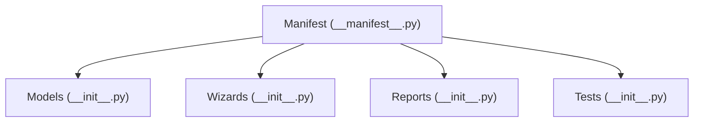
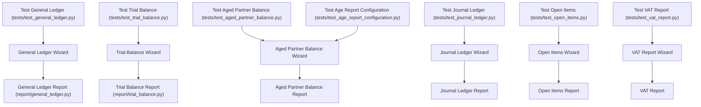
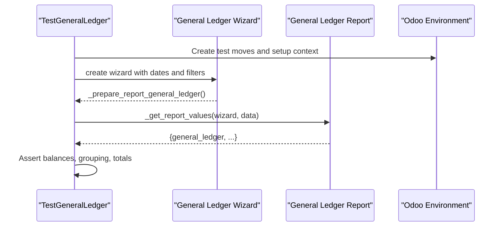
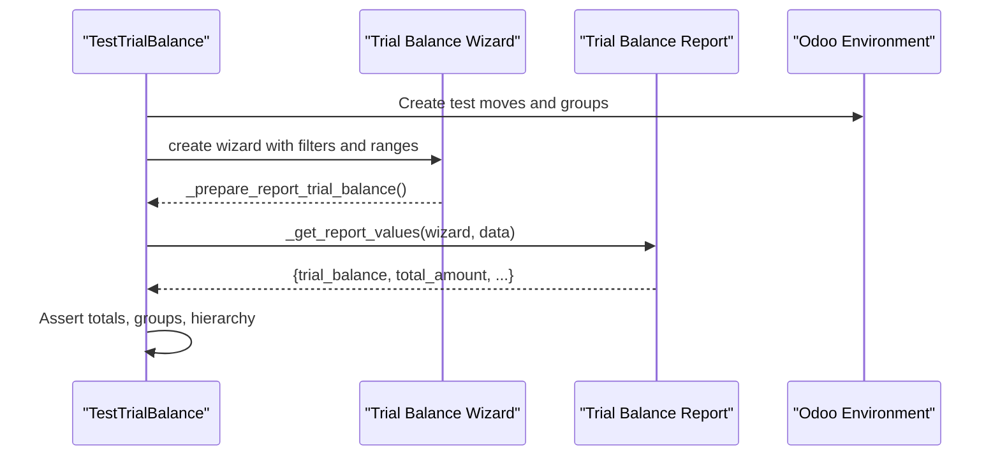
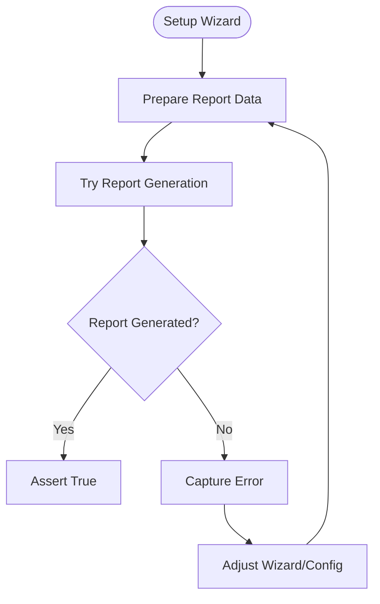
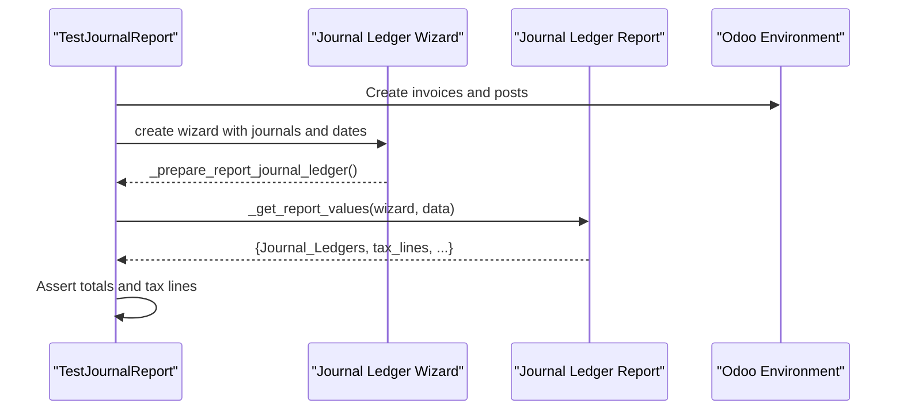
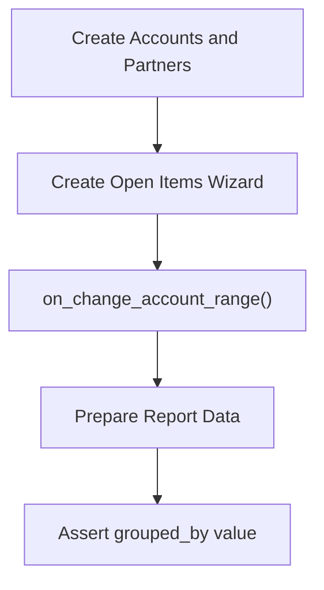
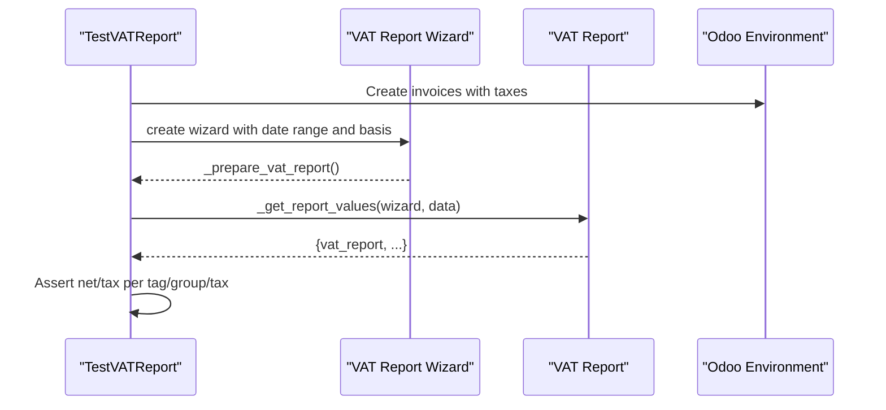
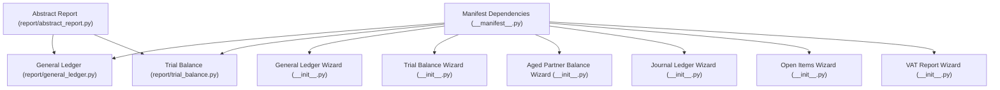

# Testing and Debugging

<cite>
**Referenced Files in This Document**
- [__manifest__.py](file://__manifest__.py)
- [report/__init__.py](file://report/__init__.py)
- [models/__init__.py](file://models/__init__.py)
- [wizard/__init__.py](file://wizard/__init__.py)
- [tests/__init__.py](file://tests/__init__.py)
- [report/abstract_report.py](file://report/abstract_report.py)
- [report/general_ledger.py](file://report/general_ledger.py)
- [report/trial_balance.py](file://report/trial_balance.py)
- [tests/test_general_ledger.py](file://tests/test_general_ledger.py)
- [tests/test_trial_balance.py](file://tests/test_trial_balance.py)
- [tests/test_aged_partner_balance.py](file://tests/test_aged_partner_balance.py)
- [tests/test_journal_ledger.py](file://tests/test_journal_ledger.py)
- [tests/test_open_items.py](file://tests/test_open_items.py)
- [tests/test_vat_report.py](file://tests/test_vat_report.py)
- [tests/test_age_report_configuration.py](file://tests/test_age_report_configuration.py)
</cite>

## Table of Contents
1. [Introduction](#introduction)
2. [Project Structure](#project-structure)
3. [Core Components](#core-components)
4. [Architecture Overview](#architecture-overview)
5. [Detailed Component Analysis](#detailed-component-analysis)
6. [Dependency Analysis](#dependency-analysis)
7. [Performance Considerations](#performance-considerations)
8. [Troubleshooting Guide](#troubleshooting-guide)
9. [Conclusion](#conclusion)
10. [Appendices](#appendices)

## Introduction
This document provides comprehensive testing and debugging guidance for the Account Financial Reports module. It covers:
- Testing strategy: unit tests per report component, integration tests for report generation workflows, and validation tests for report accuracy.
- Test execution process, test data setup, and expected result verification.
- Debugging techniques for common issues: report generation failures, data filtering problems, and output formatting errors.
- Troubleshooting guides for performance issues, memory usage optimization, and large dataset handling.
- Guidance for writing custom tests and validating report accuracy against accounting standards.

## Project Structure
The module follows a layered structure:
- Manifest defines dependencies and data views.
- Models define core entities and relationships.
- Wizards encapsulate user input and report preparation.
- Reports implement the computation logic and output rendering.
- Tests validate report correctness and workflows.

**Diagram sources**
- [__manifest__.py:18-46](file://__manifest__.py#L18-L46)
- [models/__init__.py:1-7](file://models/__init__.py#L1-L7)
- [wizard/__init__.py:1-8](file://wizard/__init__.py#L1-L8)
- [report/__init__.py:1-20](file://report/__init__.py#L1-L20)
- [tests/__init__.py:1-11](file://tests/__init__.py#L1-L11)

**Section sources**
- [__manifest__.py:18-46](file://__manifest__.py#L18-L46)
- [models/__init__.py:1-7](file://models/__init__.py#L1-L7)
- [wizard/__init__.py:1-8](file://wizard/__init__.py#L1-L8)
- [report/__init__.py:1-20](file://report/__init__.py#L1-L20)
- [tests/__init__.py:1-11](file://tests/__init__.py#L1-L11)

## Core Components
- Abstract report base: shared helpers for move lines, accounts, journals, and currency handling.
- Report implementations:
  - General Ledger: initial balances, period entries, grouping by partners/taxes, centralized entries, cumulative balances.
  - Trial Balance: initial and period balances, optional partner details, grouping by analytic accounts, account groups hierarchy.
  - Other reports: Aged Partner Balance, Journal Ledger, Open Items, VAT Report.
- Test suite: focused unit/integration tests per report, validating data filtering, totals, and wizard interactions.

Key implementation references:
- Abstract base: [report/abstract_report.py:7-165](file://report/abstract_report.py#L7-L165)
- General Ledger: [report/general_ledger.py:14-931](file://report/general_ledger.py#L14-L931)
- Trial Balance: [report/trial_balance.py:12-981](file://report/trial_balance.py#L12-L981)
- Tests: [tests/test_general_ledger.py:1-734](file://tests/test_general_ledger.py#L1-L734), [tests/test_trial_balance.py:1-718](file://tests/test_trial_balance.py#L1-L718), [tests/test_aged_partner_balance.py:1-125](file://tests/test_aged_partner_balance.py#L1-L125), [tests/test_journal_ledger.py:1-283](file://tests/test_journal_ledger.py#L1-L283), [tests/test_open_items.py:1-72](file://tests/test_open_items.py#L1-L72), [tests/test_vat_report.py:1-397](file://tests/test_vat_report.py#L1-L397), [tests/test_age_report_configuration.py:1-43](file://tests/test_age_report_configuration.py#L1-L43)

**Section sources**
- [report/abstract_report.py:7-165](file://report/abstract_report.py#L7-L165)
- [report/general_ledger.py:14-931](file://report/general_ledger.py#L14-L931)
- [report/trial_balance.py:12-981](file://report/trial_balance.py#L12-L981)
- [tests/test_general_ledger.py:1-734](file://tests/test_general_ledger.py#L1-L734)
- [tests/test_trial_balance.py:1-718](file://tests/test_trial_balance.py#L1-L718)
- [tests/test_aged_partner_balance.py:1-125](file://tests/test_aged_partner_balance.py#L1-L125)
- [tests/test_journal_ledger.py:1-283](file://tests/test_journal_ledger.py#L1-L283)
- [tests/test_open_items.py:1-72](file://tests/test_open_items.py#L1-L72)
- [tests/test_vat_report.py:1-397](file://tests/test_vat_report.py#L1-L397)
- [tests/test_age_report_configuration.py:1-43](file://tests/test_age_report_configuration.py#L1-L43)

## Architecture Overview
The testing architecture integrates Odoo’s common test infrastructure with report-specific validations:
- Test classes inherit from Odoo’s invoicing/common test base to bootstrap companies, journals, accounts, and currencies.
- Each report test class prepares a wizard, invokes preparation methods, and calls the report’s _get_report_values to obtain structured data.
- Assertions validate computed totals, grouping behavior, and filtering conditions.

**Diagram sources**
- [tests/test_general_ledger.py:15-734](file://tests/test_general_ledger.py#L15-L734)
- [tests/test_trial_balance.py:13-718](file://tests/test_trial_balance.py#L13-L718)
- [tests/test_aged_partner_balance.py:8-125](file://tests/test_aged_partner_balance.py#L8-L125)
- [tests/test_journal_ledger.py:15-283](file://tests/test_journal_ledger.py#L15-L283)
- [tests/test_open_items.py:12-72](file://tests/test_open_items.py#L12-L72)
- [tests/test_vat_report.py:14-397](file://tests/test_vat_report.py#L14-L397)
- [tests/test_age_report_configuration.py:8-43](file://tests/test_age_report_configuration.py#L8-L43)
- [report/general_ledger.py:763-931](file://report/general_ledger.py#L763-L931)
- [report/trial_balance.py:406-981](file://report/trial_balance.py#L406-L981)

## Detailed Component Analysis

### General Ledger Report Testing Strategy
- Unit tests validate:
  - Initial and final balances for accounts and partners.
  - Unaffected earnings account behavior across fiscal years.
  - Partner filters and date range handling via wizard.
- Integration tests:
  - Construct moves across fiscal periods.
  - Verify report totals and grouping by partners/taxes.
  - Validate wizard defaults and onchange behaviors.

**Diagram sources**
- [tests/test_general_ledger.py:104-125](file://tests/test_general_ledger.py#L104-L125)
- [report/general_ledger.py:763-931](file://report/general_ledger.py#L763-L931)

**Section sources**
- [tests/test_general_ledger.py:182-587](file://tests/test_general_ledger.py#L182-L587)
- [report/general_ledger.py:14-931](file://report/general_ledger.py#L14-L931)

### Trial Balance Report Testing Strategy
- Unit tests validate:
  - Initial and period balances, including P&L carry-forward adjustments.
  - Grouping by analytic accounts and account groups hierarchy.
  - Partner details and hide-zero logic.
- Integration tests:
  - Range selection by account codes.
  - Totals equality (debit vs credit) and hierarchy consistency.

**Diagram sources**
- [tests/test_trial_balance.py:174-195](file://tests/test_trial_balance.py#L174-L195)
- [report/trial_balance.py:406-981](file://report/trial_balance.py#L406-L981)

**Section sources**
- [tests/test_trial_balance.py:256-718](file://tests/test_trial_balance.py#L256-L718)
- [report/trial_balance.py:12-981](file://report/trial_balance.py#L12-L981)

### Aged Partner Balance and Age Configuration Testing Strategy
- Validation tests:
  - Report generation with and without line details.
  - Age configuration intervals applied to report.
- Constraints:
  - Validation errors for missing lines and invalid interval limits.

**Diagram sources**
- [tests/test_aged_partner_balance.py:55-125](file://tests/test_aged_partner_balance.py#L55-L125)
- [tests/test_age_report_configuration.py:31-43](file://tests/test_age_report_configuration.py#L31-L43)

**Section sources**
- [tests/test_aged_partner_balance.py:1-125](file://tests/test_aged_partner_balance.py#L1-L125)
- [tests/test_age_report_configuration.py:1-43](file://tests/test_age_report_configuration.py#L1-L43)

### Journal Ledger Testing Strategy
- Validation tests:
  - Debit/credit totals across posted/draft moves.
  - Tax computations for sales/purchase invoices.
  - Date range and move target filtering.

**Diagram sources**
- [tests/test_journal_ledger.py:163-203](file://tests/test_journal_ledger.py#L163-L203)
- [tests/test_journal_ledger.py:209-283](file://tests/test_journal_ledger.py#L209-L283)

**Section sources**
- [tests/test_journal_ledger.py:1-283](file://tests/test_journal_ledger.py#L1-L283)

### Open Items Testing Strategy
- Validation tests:
  - Partner filter defaults for wizard.
  - Grouping options (e.g., salesperson) passed through to report data.

**Diagram sources**
- [tests/test_open_items.py:36-72](file://tests/test_open_items.py#L36-L72)

**Section sources**
- [tests/test_open_items.py:1-72](file://tests/test_open_items.py#L1-L72)

### VAT Report Testing Strategy
- Validation tests:
  - Report computed by tax tags and tax groups.
  - Export actions (PDF/HTML/XLSX) and date range handling.
- Data assertions:
  - Net and tax amounts per tag/group and per tax.

**Diagram sources**
- [tests/test_vat_report.py:207-225](file://tests/test_vat_report.py#L207-L225)
- [tests/test_vat_report.py:263-342](file://tests/test_vat_report.py#L263-L342)

**Section sources**
- [tests/test_vat_report.py:1-397](file://tests/test_vat_report.py#L1-L397)

## Dependency Analysis
- Module dependencies declared in manifest include core accounting, date ranges, and XLSX export.
- Report modules import abstract base and specific report implementations.
- Tests import Odoo’s common test base and invoke wizards and report values.

**Diagram sources**
- [__manifest__.py:18-46](file://__manifest__.py#L18-L46)
- [report/abstract_report.py:7-165](file://report/abstract_report.py#L7-L165)
- [report/general_ledger.py:14-931](file://report/general_ledger.py#L14-L931)
- [report/trial_balance.py:12-981](file://report/trial_balance.py#L12-L981)
- [report/__init__.py:6-20](file://report/__init__.py#L6-L20)
- [wizard/__init__.py:1-8](file://wizard/__init__.py#L1-L8)

**Section sources**
- [__manifest__.py:18-46](file://__manifest__.py#L18-L46)
- [report/__init__.py:6-20](file://report/__init__.py#L6-L20)
- [wizard/__init__.py:1-8](file://wizard/__init__.py#L1-L8)

## Performance Considerations
- Prefer read_group aggregations over manual loops for initial and period balances to minimize Python-side computation.
- Limit domain scope by narrowing account, partner, and journal filters to reduce dataset sizes.
- Use grouped_by options judiciously; deep grouping increases memory usage and processing time.
- Avoid unnecessary recomputation by caching derived data (e.g., accounts/journals/taxes) and reusing across report sections.
- For large datasets:
  - Batch creation of test moves to avoid transaction overhead.
  - Use only_posted_moves where applicable to reduce dataset size.
  - Consider disabling foreign currency calculations when not required.

[No sources needed since this section provides general guidance]

## Troubleshooting Guide

### Report Generation Failures
- Symptoms: Empty report, missing totals, or export errors.
- Checks:
  - Ensure wizard date range and filters are valid.
  - Confirm company and currency settings.
  - Validate that required fields (e.g., account age report configuration lines) are present.
- References:
  - Wizard date range handling and export actions: [tests/test_vat_report.py:344-397](file://tests/test_vat_report.py#L344-L397)
  - Age configuration constraints: [tests/test_age_report_configuration.py:31-43](file://tests/test_age_report_configuration.py#L31-L43)

**Section sources**
- [tests/test_vat_report.py:344-397](file://tests/test_vat_report.py#L344-L397)
- [tests/test_age_report_configuration.py:31-43](file://tests/test_age_report_configuration.py#L31-L43)

### Data Filtering Problems
- Symptoms: Incorrect initial/final balances, missing accounts/partners.
- Checks:
  - Verify date_from/date_to boundaries and fiscal year start date.
  - Confirm only_posted_moves setting aligns with expectations.
  - Ensure account inclusion/exclusion flags (e.g., include_initial_balance) match report logic.
- References:
  - Date boundary and fiscal year logic: [tests/test_general_ledger.py:182-587](file://tests/test_general_ledger.py#L182-L587), [tests/test_trial_balance.py:256-718](file://tests/test_trial_balance.py#L256-L718)

**Section sources**
- [tests/test_general_ledger.py:182-587](file://tests/test_general_ledger.py#L182-L587)
- [tests/test_trial_balance.py:256-718](file://tests/test_trial_balance.py#L256-L718)

### Output Formatting Errors
- Symptoms: Wrong grouping, missing partner names, incorrect centralized entries.
- Checks:
  - Validate grouped_by options and partner filters.
  - Inspect centralized entries and cumulative balances calculation.
  - Confirm journal and tax data retrieval.
- References:
  - Centralized entries and cumulative balances: [report/general_ledger.py:697-761](file://report/general_ledger.py#L697-L761)
  - Partner grouping and formatting: [report/general_ledger.py:200-228](file://report/general_ledger.py#L200-L228)

**Section sources**
- [report/general_ledger.py:697-761](file://report/general_ledger.py#L697-L761)
- [report/general_ledger.py:200-228](file://report/general_ledger.py#L200-L228)

### Performance Issues and Memory Optimization
- Symptoms: Slow test runs, timeouts, high memory usage.
- Actions:
  - Reduce test dataset size and reuse common setups.
  - Use read_group aggregations and avoid per-record Python loops.
  - Disable foreign currency and advanced grouping for baseline performance tests.
  - Split large tests into smaller focused units.
- References:
  - Aggregation-based balances: [report/general_ledger.py:108-121](file://report/general_ledger.py#L108-L121), [report/trial_balance.py:174-208](file://report/trial_balance.py#L174-L208)

**Section sources**
- [report/general_ledger.py:108-121](file://report/general_ledger.py#L108-L121)
- [report/trial_balance.py:174-208](file://report/trial_balance.py#L174-L208)

### Large Dataset Handling
- Strategies:
  - Paginate or batch process move lines when generating reports.
  - Use indexed fields in domains (date, account_id, company_id).
  - Minimize repeated reads by caching account/journal/tax metadata.
- References:
  - Domain construction and field selections: [report/general_ledger.py:363-392](file://report/general_ledger.py#L363-L392), [report/trial_balance.py:97-134](file://report/trial_balance.py#L97-L134)

**Section sources**
- [report/general_ledger.py:363-392](file://report/general_ledger.py#L363-L392)
- [report/trial_balance.py:97-134](file://report/trial_balance.py#L97-L134)

## Conclusion
The Account Financial Reports module includes a robust test suite covering unit and integration scenarios for each report type. By leveraging Odoo’s common test infrastructure, the tests validate critical accounting logic such as initial/final balances, grouping, and export workflows. For debugging, focus on wizard configurations, date ranges, and domain filters. For performance, rely on read_group aggregations, narrow scopes, and careful use of advanced grouping features.

[No sources needed since this section summarizes without analyzing specific files]

## Appendices

### Writing Custom Tests for Extended Functionality
- Follow existing patterns:
  - Inherit from the appropriate common test base.
  - Create minimal test data via wizard preparation and report value retrieval.
  - Use assertions aligned with report output structures (e.g., general_ledger, total_amount, vat_report).
- Example references:
  - General Ledger test scaffolding: [tests/test_general_ledger.py:15-125](file://tests/test_general_ledger.py#L15-L125)
  - Trial Balance test scaffolding: [tests/test_trial_balance.py:13-195](file://tests/test_trial_balance.py#L13-L195)
  - VAT Report export and assertions: [tests/test_vat_report.py:263-342](file://tests/test_vat_report.py#L263-L342)

**Section sources**
- [tests/test_general_ledger.py:15-125](file://tests/test_general_ledger.py#L15-L125)
- [tests/test_trial_balance.py:13-195](file://tests/test_trial_balance.py#L13-L195)
- [tests/test_vat_report.py:263-342](file://tests/test_vat_report.py#L263-L342)

### Validating Report Accuracy Against Accounting Standards
- Ensure:
  - Initial balances reflect prior period activity up to but not including the reporting period.
  - Period entries are filtered by posted/draft states consistently.
  - Totals balance (debit vs credit) and zero-out logic respects rounding.
  - Grouping aligns with chart of accounts and account groups hierarchy.
- References:
  - Initial and period domains: [report/general_ledger.py:74-107](file://report/general_ledger.py#L74-L107), [report/trial_balance.py:17-95](file://report/trial_balance.py#L17-L95)
  - Totals and rounding checks: [tests/test_trial_balance.py:674-683](file://tests/test_trial_balance.py#L674-L683)

**Section sources**
- [report/general_ledger.py:74-107](file://report/general_ledger.py#L74-L107)
- [report/trial_balance.py:17-95](file://report/trial_balance.py#L17-L95)
- [tests/test_trial_balance.py:674-683](file://tests/test_trial_balance.py#L674-L683)