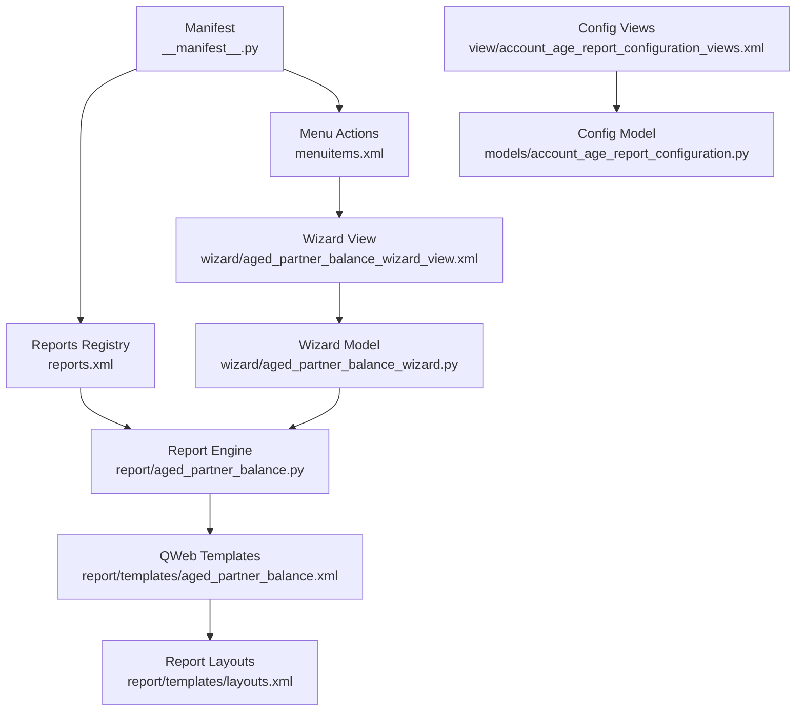
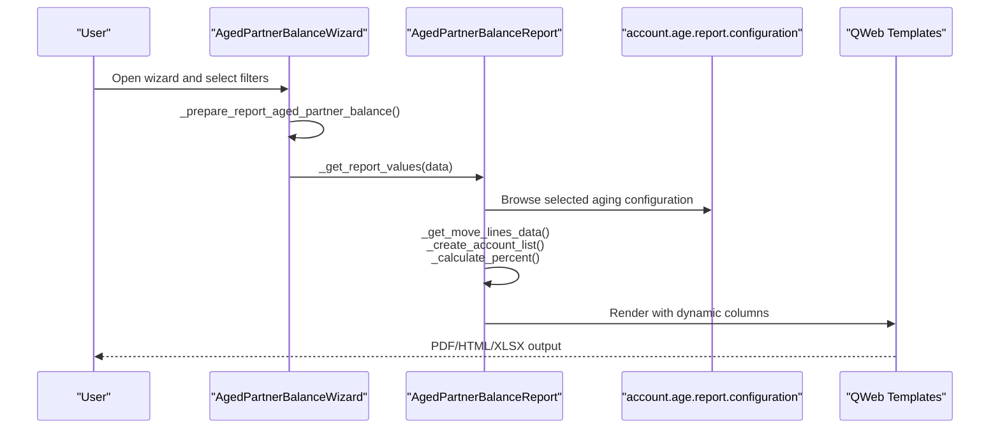
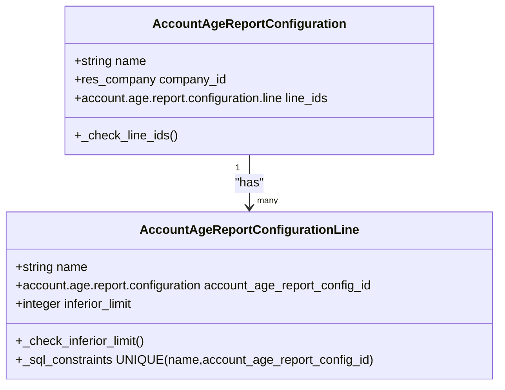
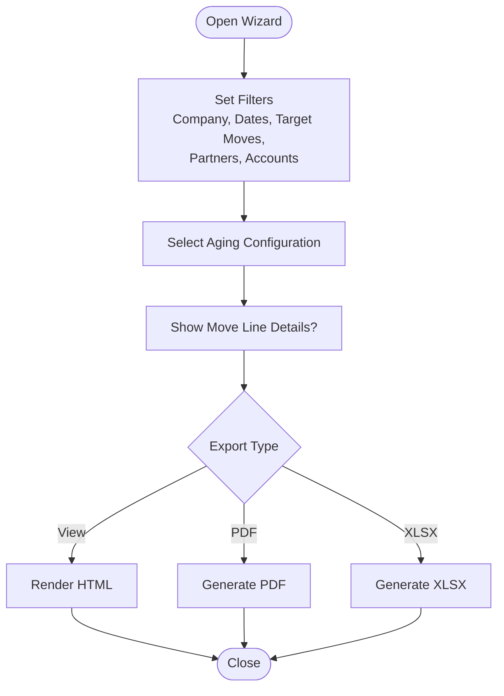
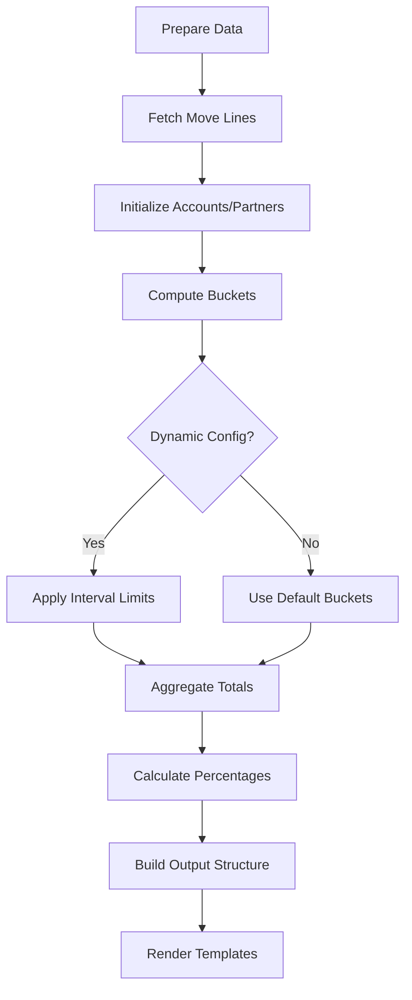
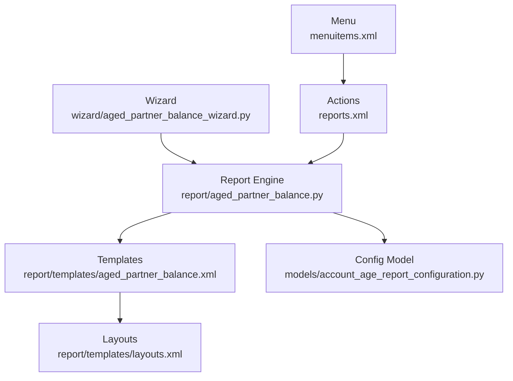

# Aged Partner Balance Report

<cite>
**Referenced Files in This Document**
- [__manifest__.py](file://__manifest__.py)
- [models/account_age_report_configuration.py](file://models/account_age_report_configuration.py)
- [wizard/aged_partner_balance_wizard.py](file://wizard/aged_partner_balance_wizard.py)
- [wizard/aged_partner_balance_wizard_view.xml](file://wizard/aged_partner_balance_wizard_view.xml)
- [view/account_age_report_configuration_views.xml](file://view/account_age_report_configuration_views.xml)
- [report/aged_partner_balance.py](file://report/aged_partner_balance.py)
- [report/templates/aged_partner_balance.xml](file://report/templates/aged_partner_balance.xml)
- [report/templates/layouts.xml](file://report/templates/layouts.xml)
- [reports.xml](file://reports.xml)
- [menuitems.xml](file://menuitems.xml)
- [tests/test_age_report_configuration.py](file://tests/test_age_report_configuration.py)
- [tests/test_aged_partner_balance.py](file://tests/test_aged_partner_balance.py)
</cite>

## Table of Contents
1. [Introduction](#introduction)
2. [Project Structure](#project-structure)
3. [Core Components](#core-components)
4. [Architecture Overview](#architecture-overview)
5. [Detailed Component Analysis](#detailed-component-analysis)
6. [Dependency Analysis](#dependency-analysis)
7. [Performance Considerations](#performance-considerations)
8. [Troubleshooting Guide](#troubleshooting-guide)
9. [Conclusion](#conclusion)
10. [Appendices](#appendices)

## Introduction
The Aged Partner Balance report provides a dynamic view of receivables and payables outstanding balances categorized by aging criteria. It supports configurable aging periods and intervals, enabling organizations to tailor reporting to their credit management and collections strategies. Users can define custom aging configurations, apply them via a wizard, and generate PDF or Excel outputs. The report dynamically adjusts column headings and calculations based on the selected aging configuration, ensuring accurate and flexible receivables analysis.

## Project Structure
The module integrates seamlessly with Odoo’s reporting framework. Key components include:
- Model for managing aging configurations
- Wizard for selecting filters and applying aging configurations
- QWeb templates for rendering HTML/PDF outputs
- Report engine that computes balances and percentages
- XML actions and menus to expose the report in the UI

**Diagram sources**
- [__manifest__.py:19-46](file://__manifest__.py#L19-L46)
- [reports.xml:85-106](file://reports.xml#L85-L106)
- [menuitems.xml:33-38](file://menuitems.xml#L33-L38)
- [wizard/aged_partner_balance_wizard_view.xml:4-87](file://wizard/aged_partner_balance_wizard_view.xml#L4-L87)
- [wizard/aged_partner_balance_wizard.py:9-154](file://wizard/aged_partner_balance_wizard.py#L9-L154)
- [report/aged_partner_balance.py:12-473](file://report/aged_partner_balance.py#L12-L473)
- [report/templates/aged_partner_balance.xml:3-13](file://report/templates/aged_partner_balance.xml#L3-L13)
- [report/templates/layouts.xml:3-42](file://report/templates/layouts.xml#L3-L42)
- [view/account_age_report_configuration_views.xml:6-41](file://view/account_age_report_configuration_views.xml#L6-L41)
- [models/account_age_report_configuration.py:8-50](file://models/account_age_report_configuration.py#L8-L50)

**Section sources**
- [__manifest__.py:19-46](file://__manifest__.py#L19-L46)
- [reports.xml:85-106](file://reports.xml#L85-L106)
- [menuitems.xml:33-38](file://menuitems.xml#L33-L38)

## Core Components
- Aging Configuration Model: Defines customizable aging intervals and validates constraints.
- Aging Configuration Views: Provides forms and lists to manage configurations.
- Aged Partner Balance Wizard: Collects filters, applies aging configuration, and triggers report generation.
- Report Engine: Computes balances by aging buckets, aggregates totals, and calculates percentages.
- QWeb Templates: Render the report layout, headers, rows, and percent columns based on configuration.

Key responsibilities:
- Configuration management: Create, edit, and maintain aging configurations per company.
- Dynamic aging: Apply configured intervals to compute bucketed amounts and column headings.
- Receivables analysis: Summarize outstanding amounts by account and partner with optional move-line details.
- Output generation: Produce PDF and Excel variants with consistent column sets.

**Section sources**
- [models/account_age_report_configuration.py:8-50](file://models/account_age_report_configuration.py#L8-L50)
- [view/account_age_report_configuration_views.xml:6-41](file://view/account_age_report_configuration_views.xml#L6-L41)
- [wizard/aged_partner_balance_wizard.py:9-154](file://wizard/aged_partner_balance_wizard.py#L9-L154)
- [report/aged_partner_balance.py:12-473](file://report/aged_partner_balance.py#L12-L473)
- [report/templates/aged_partner_balance.xml:14-812](file://report/templates/aged_partner_balance.xml#L14-L812)

## Architecture Overview
The report follows a standard Odoo pattern:
- Wizard collects inputs and prepares data dictionary.
- Report engine reads move lines, computes aging buckets, and builds aggregated data.
- Templates render the final output using dynamic columns derived from the aging configuration.

**Diagram sources**
- [wizard/aged_partner_balance_wizard.py:120-154](file://wizard/aged_partner_balance_wizard.py#L120-L154)
- [report/aged_partner_balance.py:411-465](file://report/aged_partner_balance.py#L411-L465)
- [report/templates/aged_partner_balance.xml:14-812](file://report/templates/aged_partner_balance.xml#L14-L812)

## Detailed Component Analysis

### Aging Configuration Model and Management
The configuration model defines:
- A configuration record linked to a company.
- A set of interval lines with a unique name and an integer inferior limit.
- Validation constraints to ensure non-empty lines and positive limits.

- Unique constraint ensures distinct interval names per configuration.
- Inferior limit must be greater than zero; otherwise, a validation error is raised.
- The wizard exposes a field to select a configuration; the report consumes it via context.

Practical implications:
- Each configuration is company-specific.
- Interval order determines column ordering in the report.
- Changing configuration affects both column headings and bucket assignments.

**Diagram sources**
- [models/account_age_report_configuration.py:8-50](file://models/account_age_report_configuration.py#L8-L50)

**Section sources**
- [models/account_age_report_configuration.py:8-50](file://models/account_age_report_configuration.py#L8-L50)
- [view/account_age_report_configuration_views.xml:6-41](file://view/account_age_report_configuration_views.xml#L6-L41)
- [tests/test_age_report_configuration.py:31-43](file://tests/test_age_report_configuration.py#L31-L43)

### Wizard Interface for Aging Periods
The wizard provides:
- Company selection and multi-company support.
- Date filters (Date at, Date from) and Target moves option.
- Partner filtering and account filtering (by type or code range).
- Aging configuration selection.
- Export options: View (HTML), Export PDF, Export XLSX.

- The wizard prepares a data dictionary passed to the report engine.
- Account range selection updates the account list automatically.
- Company change filters partners and accounts accordingly.

**Diagram sources**
- [wizard/aged_partner_balance_wizard_view.xml:4-87](file://wizard/aged_partner_balance_wizard_view.xml#L4-L87)
- [wizard/aged_partner_balance_wizard.py:9-154](file://wizard/aged_partner_balance_wizard.py#L9-L154)

**Section sources**
- [wizard/aged_partner_balance_wizard_view.xml:4-87](file://wizard/aged_partner_balance_wizard_view.xml#L4-L87)
- [wizard/aged_partner_balance_wizard.py:9-154](file://wizard/aged_partner_balance_wizard.py#L9-L154)

### Report Engine: Dynamic Aging and Receivables Analysis
The report engine performs:
- Fetching unreconciled move lines filtered by company, accounts, partners, and date range.
- Computing maturity-based buckets (default and dynamic) and per-interval totals.
- Aggregating by account and partner, and optionally including move-line details.
- Calculating percentage columns based on residual totals.

Key behaviors:
- Default buckets: Not due, 1–30 days, 31–60 days, 61–90 days, 91–120 days, Over 120 days.
- Dynamic buckets: Derived from the selected aging configuration lines.
- Percentages: Residual-based percentages for each bucket and dynamic column.

- The engine uses the configuration from context to compute dynamic columns.
- When move-line details are enabled, each row includes detailed entries with computed maturity buckets.

**Diagram sources**
- [report/aged_partner_balance.py:17-311](file://report/aged_partner_balance.py#L17-L311)
- [report/aged_partner_balance.py:364-409](file://report/aged_partner_balance.py#L364-L409)

**Section sources**
- [report/aged_partner_balance.py:12-473](file://report/aged_partner_balance.py#L12-L473)

### Report Templates: Dynamic Columns and Presentation
Templates render:
- Headers: Static columns plus dynamic columns named after configuration lines.
- Rows: Partner-level and account-level totals with dynamic bucket values.
- Percent rows: Percentage breakdowns for each bucket and dynamic column.
- Optional move-line details: Per-partner tables with maturity computations.

Dynamic column behavior:
- Column names come from configuration line names.
- Values are populated from computed buckets in the report engine.
- When no configuration is selected, default buckets are shown.

**Section sources**
- [report/templates/aged_partner_balance.xml:14-812](file://report/templates/aged_partner_balance.xml#L14-L812)
- [report/templates/layouts.xml:3-42](file://report/templates/layouts.xml#L3-L42)

### Integration Points and Approval Process
- Menus: The report is exposed under the OCA accounting reports menu.
- Actions: PDF and HTML actions are registered; XLSX action is provided for Excel export.
- Approval: No explicit approval workflow exists in the codebase; configurations are managed via standard Odoo record views.

Operational notes:
- Access rights are controlled via security files.
- Company scoping ensures configurations remain isolated per company.

**Section sources**
- [menuitems.xml:33-38](file://menuitems.xml#L33-L38)
- [reports.xml:85-106](file://reports.xml#L85-L106)
- [reports.xml:157-164](file://reports.xml#L157-L164)
- [__manifest__.py:19-46](file://__manifest__.py#L19-L46)

## Dependency Analysis
- Wizard depends on the configuration model to pass context to the report engine.
- Report engine depends on the configuration context and QWeb templates for rendering.
- Templates depend on the report engine’s data structure and configuration context.
- Menus and actions integrate the wizard and report into the Odoo UI.

**Diagram sources**
- [wizard/aged_partner_balance_wizard.py:120-154](file://wizard/aged_partner_balance_wizard.py#L120-L154)
- [report/aged_partner_balance.py:411-465](file://report/aged_partner_balance.py#L411-L465)
- [report/templates/aged_partner_balance.xml:14-812](file://report/templates/aged_partner_balance.xml#L14-L812)
- [models/account_age_report_configuration.py:8-50](file://models/account_age_report_configuration.py#L8-L50)
- [reports.xml:85-106](file://reports.xml#L85-L106)
- [menuitems.xml:33-38](file://menuitems.xml#L33-L38)

**Section sources**
- [wizard/aged_partner_balance_wizard.py:120-154](file://wizard/aged_partner_balance_wizard.py#L120-L154)
- [report/aged_partner_balance.py:411-465](file://report/aged_partner_balance.py#L411-L465)
- [report/templates/aged_partner_balance.xml:14-812](file://report/templates/aged_partner_balance.xml#L14-L812)
- [models/account_age_report_configuration.py:8-50](file://models/account_age_report_configuration.py#L8-L50)
- [reports.xml:85-106](file://reports.xml#L85-L106)
- [menuitems.xml:33-38](file://menuitems.xml#L33-L38)

## Performance Considerations
- Filtering: Use Date from and company filters to reduce dataset size.
- Account selection: Narrow down accounts using code ranges or receivable/payable toggles.
- Move-line details: Enable only when necessary, as it increases rendering and computation overhead.
- Configuration complexity: Fewer and well-chosen intervals improve readability and reduce column count.
- Batch processing: For large datasets, consider exporting to Excel for post-processing.

## Troubleshooting Guide
Common issues and resolutions:
- Missing configuration lines: Ensure at least one interval line exists; otherwise, a validation error is raised.
- Non-positive inferior limits: Adjust limits to be greater than zero.
- Unexpected column counts: Verify the selected configuration matches expectations; dynamic columns reflect the configuration lines.
- Empty outputs: Confirm date filters, account/partner selections, and reconciliation status align with data availability.

Validation checks:
- Configuration lines must be present.
- Inferior limits must be positive integers.
- Unique names per configuration prevent ambiguity.

**Section sources**
- [tests/test_age_report_configuration.py:31-43](file://tests/test_age_report_configuration.py#L31-L43)
- [models/account_age_report_configuration.py:20-41](file://models/account_age_report_configuration.py#L20-L41)

## Conclusion
The Aged Partner Balance report offers a flexible, configurable solution for receivables analysis. Organizations can tailor aging periods to match their credit policies, automate collections scoring, and support credit assessments through dynamic bucketing and percentage views. The wizard-driven workflow and robust configuration model ensure reliable, repeatable reporting aligned with business needs.

## Appendices

### Practical Examples

- Credit management:
  - Define intervals such as “0–15”, “16–30”, “31–60” days to align with internal credit terms.
  - Use the report to monitor delinquency trends and identify accounts requiring intervention.

- Collection strategies:
  - Segment customers by bucket thresholds to prioritize collection efforts.
  - Track percentage shifts over time to evaluate strategy effectiveness.

- Customer credit assessment:
  - Combine aging buckets with historical payment patterns to assess risk.
  - Use the report to support credit limit reviews and renewal decisions.

### Configuration Workflow Summary
- Create an aging configuration per company.
- Add interval lines with unique names and positive inferior limits.
- Select the configuration in the wizard and generate the report.
- Review dynamic columns and percentages to inform decisions.