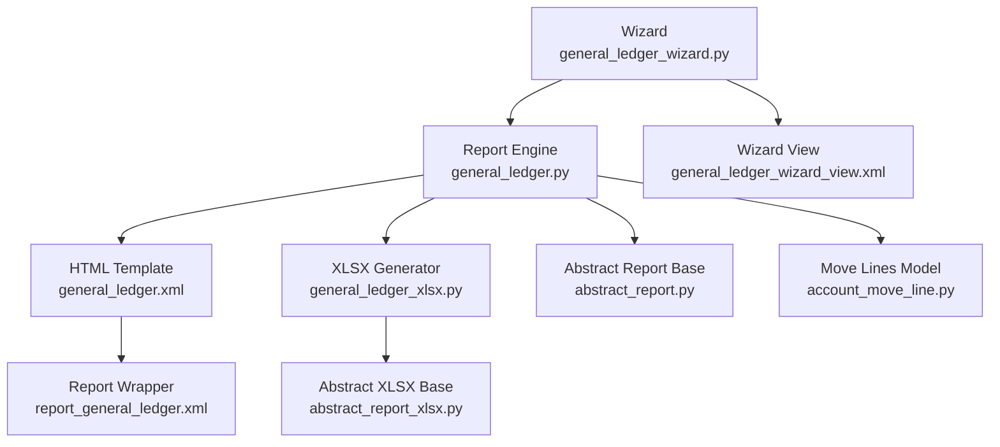
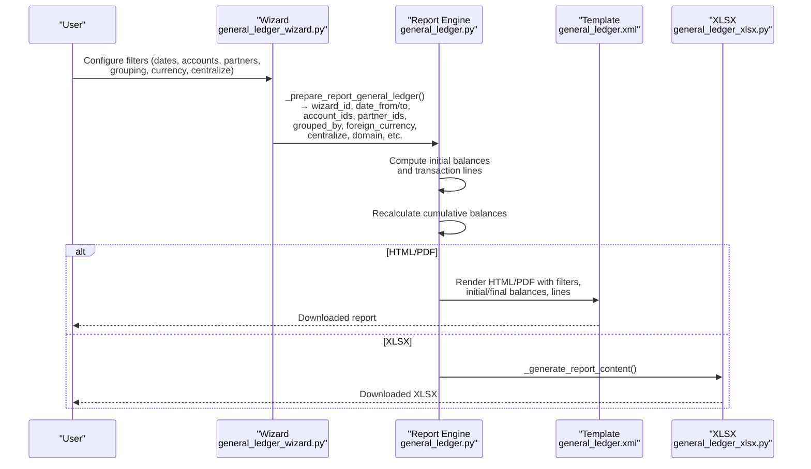
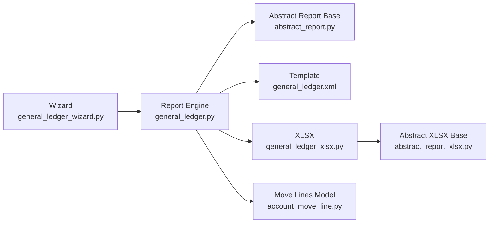

# General Ledger Report

<cite>
**Referenced Files in This Document**
- [general_ledger.py](file://report/general_ledger.py)
- [general_ledger_wizard.py](file://wizard/general_ledger_wizard.py)
- [general_ledger.xml](file://report/templates/general_ledger.xml)
- [report_general_ledger.xml](file://view/report_general_ledger.xml)
- [general_ledger_xlsx.py](file://report/general_ledger_xlsx.py)
- [abstract_report.py](file://report/abstract_report.py)
- [abstract_report_xlsx.py](file://report/abstract_report_xlsx.py)
- [account_move_line.py](file://models/account_move_line.py)
- [__manifest__.py](file://__manifest__.py)
- [DESCRIPTION.md](file://readme/DESCRIPTION.md)
- [general_ledger_wizard_view.xml](file://wizard/general_ledger_wizard_view.xml)
</cite>

## Table of Contents
1. [Introduction](#introduction)
2. [Project Structure](#project-structure)
3. [Core Components](#core-components)
4. [Architecture Overview](#architecture-overview)
5. [Detailed Component Analysis](#detailed-component-analysis)
6. [Dependency Analysis](#dependency-analysis)
7. [Performance Considerations](#performance-considerations)
8. [Troubleshooting Guide](#troubleshooting-guide)
9. [Conclusion](#conclusion)
10. [Appendices](#appendices)

## Introduction
This document explains how to configure and use the General Ledger report, focusing on transaction-level detail reporting, filtering, cumulative balances, partner grouping, foreign currency support, and output formats. It also provides practical scenarios such as monthly reconciliations, audit trails, and detailed transaction tracking.

## Project Structure
The General Ledger report spans wizard-driven configuration, backend report computation, templated rendering, and XLSX generation. Key modules:
- Wizard: collects filters and passes parameters to the report engine.
- Report engine: computes initial/final balances, transaction lines, and cumulative balances.
- Templates: render HTML/PDF views.
- XLSX generator: exports tabular data to Excel.

**Diagram sources**
- [general_ledger_wizard.py:18-322](file://wizard/general_ledger_wizard.py#L18-L322)
- [general_ledger.py:14-931](file://report/general_ledger.py#L14-L931)
- [general_ledger.xml:1-789](file://report/templates/general_ledger.xml#L1-L789)
- [report_general_ledger.xml:1-10](file://view/report_general_ledger.xml#L1-L10)
- [general_ledger_xlsx.py:11-400](file://report/general_ledger_xlsx.py#L11-L400)
- [abstract_report.py:7-165](file://report/abstract_report.py#L7-L165)
- [abstract_report_xlsx.py:8-698](file://report/abstract_report_xlsx.py#L8-L698)
- [account_move_line.py:9-71](file://models/account_move_line.py#L9-L71)
- [general_ledger_wizard_view.xml:1-164](file://wizard/general_ledger_wizard_view.xml#L1-L164)

**Section sources**
- [__manifest__.py:19-52](file://__manifest__.py#L19-L52)
- [DESCRIPTION.md:1-22](file://readme/DESCRIPTION.md#L1-L22)

## Core Components
- Wizard: Provides filters for date range, target moves, accounts/partners/analytics, grouping, centralization, currency display, and additional domain filtering. Prepares the report payload.
- Report Engine: Computes initial and final balances, fetches transaction lines, recalculates cumulative balances, supports grouping by partners or taxes, and handles centralized entries.
- Templates: Render HTML/PDF with filters, initial/final balances, and transaction lines, including optional foreign currency columns.
- XLSX Generator: Produces Excel output with aligned columns, initial/final balances, and cumulative currency totals.

Key capabilities:
- Transaction-level detail with sorting by date and entry.
- Cumulative balances computed per line and displayed in the report.
- Optional grouping by partners or taxes.
- Foreign currency support with per-line and cumulative currency totals.
- Centralized monthly entries when enabled.

**Section sources**
- [general_ledger_wizard.py:18-322](file://wizard/general_ledger_wizard.py#L18-L322)
- [general_ledger.py:14-931](file://report/general_ledger.py#L14-L931)
- [general_ledger.xml:1-789](file://report/templates/general_ledger.xml#L1-L789)
- [general_ledger_xlsx.py:11-400](file://report/general_ledger_xlsx.py#L11-L400)

## Architecture Overview
End-to-end flow from wizard to output:

**Diagram sources**
- [general_ledger_wizard.py:274-322](file://wizard/general_ledger_wizard.py#L274-L322)
- [general_ledger.py:763-931](file://report/general_ledger.py#L763-L931)
- [general_ledger.xml:1-789](file://report/templates/general_ledger.xml#L1-L789)
- [general_ledger_xlsx.py:134-400](file://report/general_ledger_xlsx.py#L134-L400)

## Detailed Component Analysis

### Wizard: Filters and Parameters
- Date range and fiscal year start date derived from the start date.
- Target moves: posted vs all (draft and posted).
- Accounts: explicit selection or range by code; receivable/payable filters.
- Partners: many2many filter; auto-applied when partners are selected.
- Journals, cost centers, and additional domain filtering on move lines.
- Grouping: none, partners, or taxes.
- Centralize: activate monthly centralized entries.
- Hide account at 0: exclude accounts with zero ending balance and no activity.
- Foreign currency: display foreign currency columns when applicable.
- Unaffected earnings account: included automatically when present and not explicitly scoped.

Practical tips:
- Use “Receivable accounts only” and “Payable accounts only” to quickly limit scope.
- Use “Filter accounts” range by code to target a contiguous chart segment.
- Use “Additional Filtering” domain to apply advanced conditions on move lines.

**Section sources**
- [general_ledger_wizard.py:18-322](file://wizard/general_ledger_wizard.py#L18-L322)
- [general_ledger_wizard_view.xml:1-164](file://wizard/general_ledger_wizard_view.xml#L1-L164)

### Report Engine: Computation and Rendering
Responsibilities:
- Build base domain from wizard filters (company, posted/draft state, partners, journals, analytics, extra domain).
- Compute initial balances for prior period and profit/loss reclassification.
- Fetch transaction lines for the period, ordered by date and entry.
- Recalculate cumulative balances per line and mark reconciliations reconciled after the reporting period.
- Group by partners or taxes when requested.
- Centralize monthly entries when enabled.
- Prepare final data structure for templates/XLSX.

Cumulative balances:
- Each line’s balance reflects the running total from initial balance plus previous lines.
- Reconciliations post-period are annotated to avoid misinterpretation.

Foreign currency:
- When enabled, displays per-line amount in account currency and cumulative currency totals.
- Ensures initial/final balances align with company currency unless the account defines a currency.

Grouping:
- Partners: creates sub-lists per partner with separate initial/final balances.
- Taxes: aggregates by tax with initial/final balances per tax.

**Section sources**
- [general_ledger.py:14-931](file://report/general_ledger.py#L14-L931)
- [abstract_report.py:7-165](file://report/abstract_report.py#L7-L165)

### Templates: HTML/PDF Rendering
- Filters section shows date range, target moves, hide-zero toggle, and centralize setting.
- For each account:
  - Initial balance row.
  - Transaction lines with date, entry, journal, account, taxes, partner, reference/label, optional analytic distribution, reconciliation number, debit, credit, cumulative balance, and optional foreign currency columns.
  - Ending balance row.
- When grouped by partners/taxes, each group gets its own header and lines, with a final ending balance per group and optionally a final account-level ending balance if not filtered by partners.

Columns and behavior:
- Optional analytic distribution display controlled by a setting.
- Foreign currency columns appear only when enabled in the wizard.
- Clickable links to underlying records (journal, account, partner, etc.) via web actions.

**Section sources**
- [general_ledger.xml:1-789](file://report/templates/general_ledger.xml#L1-L789)
- [report_general_ledger.xml:1-10](file://view/report_general_ledger.xml#L1-L10)

### XLSX Export: Tabular Output
- Columns include date, entry, journal, account, taxes, partner, reference/label, reconciliation, debit, credit, cumulative balance, and optional foreign currency columns.
- Initial and ending rows include balances for debit, credit, and cumulative balance.
- Cumulative currency column computed per line when applicable.
- Grouped-by-partner mode writes each partner in a separate block with its own initial/ending rows.

**Section sources**
- [general_ledger_xlsx.py:11-400](file://report/general_ledger_xlsx.py#L11-L400)
- [abstract_report_xlsx.py:8-698](file://report/abstract_report_xlsx.py#L8-L698)

### Partner Grouping Options
- Group by partners: enables per-partner sublists with initial/final balances and transaction lines.
- Group by taxes: aggregates by tax with initial/final balances and transaction lines.
- When grouped, the top-level account ending balance is shown only if not filtered by partners.

**Section sources**
- [general_ledger.py:200-256](file://report/general_ledger.py#L200-L256)
- [general_ledger.xml:58-100](file://report/templates/general_ledger.xml#L58-L100)

### Foreign Currency Support
- Enabled via wizard; when active, the report shows:
  - Per-line amount in account currency.
  - Cumulative currency balance per line.
- The report engine adjusts initial/final balances to ensure currency totals are consistent with company currency unless the account defines a currency.
- XLSX export mirrors the same currency columns.

Notes:
- If an account does not have a secondary currency configured, foreign currency columns are not displayed.
- When multiple currencies are present in transactions, the report consolidates totals carefully.

**Section sources**
- [general_ledger_wizard.py:63-69](file://wizard/general_ledger_wizard.py#L63-L69)
- [general_ledger.py:837-892](file://report/general_ledger.py#L837-L892)
- [general_ledger.xml:179-189](file://report/templates/general_ledger.xml#L179-L189)
- [general_ledger_xlsx.py:70-88](file://report/general_ledger_xlsx.py#L70-L88)

### Difference: Show All Accounts vs Only Those With Activity
- Show all accounts: includes accounts with zero ending balance and no transactions if not filtered otherwise.
- Hide account at 0: excludes accounts whose ending balance is zero and which have no transactions during the period.
- This filter helps focus on meaningful activity.

**Section sources**
- [general_ledger_wizard.py:39-45](file://wizard/general_ledger_wizard.py#L39-L45)
- [general_ledger.py:667-694](file://report/general_ledger.py#L667-L694)

### Practical Scenarios

- Monthly reconciliations
  - Use date range aligned to month-end.
  - Enable “Hide account at 0” to focus on active accounts.
  - Optionally enable “Centralize” to summarize monthly entries.
  - Use “Show foreign currency” if needed for multi-currency accounts.
  - Export XLSX for detailed review and matching.

- Audit trails
  - Use “Target moves: All entries” to include draft entries during review.
  - Filter by specific partners or journals to isolate transactions.
  - Export HTML/PDF for signed-off audit packages.

- Detailed transaction tracking
  - Keep grouping at “None” to see all transactions in sequence.
  - Use “Additional Filtering” domain to drill down to specific conditions.
  - Export XLSX for pivot analysis and cross-references.

[No sources needed since this subsection provides scenario guidance without quoting specific code]

## Dependency Analysis
- Wizard depends on Odoo ORM and date utilities to compute fiscal year start and derive defaults.
- Report engine inherits from an abstract base to reuse common move-line fields and helpers.
- Templates depend on the computed dataset from the report engine.
- XLSX generator depends on the abstract XLSX base and the report engine’s dataset.

**Diagram sources**
- [general_ledger_wizard.py:18-322](file://wizard/general_ledger_wizard.py#L18-L322)
- [general_ledger.py:14-931](file://report/general_ledger.py#L14-L931)
- [abstract_report.py:7-165](file://report/abstract_report.py#L7-L165)
- [general_ledger.xml:1-789](file://report/templates/general_ledger.xml#L1-L789)
- [general_ledger_xlsx.py:11-400](file://report/general_ledger_xlsx.py#L11-L400)
- [abstract_report_xlsx.py:8-698](file://report/abstract_report_xlsx.py#L8-L698)
- [account_move_line.py:9-71](file://models/account_move_line.py#L9-L71)

**Section sources**
- [__manifest__.py:18-19](file://__manifest__.py#L18-L19)

## Performance Considerations
- Indexing: The move lines model creates an index on account and partner to speed up initial balance queries joining by these fields.
- Domain filtering: Use explicit account/partner filters and “Additional Filtering” domain to reduce dataset size.
- Centralization: Enabling centralization reduces transaction rows for reporting, improving readability and performance.
- Large datasets: Prefer grouping by partners/taxes to manage volume; use “Hide account at 0” to prune inactive accounts.

**Section sources**
- [account_move_line.py:39-71](file://models/account_move_line.py#L39-L71)

## Troubleshooting Guide
- No data returned
  - Verify date range and target moves filters.
  - Confirm company filter matches the intended company.
  - Check “Hide account at 0” if expecting inactive accounts.
- Foreign currency columns missing
  - Ensure “Show foreign currency” is enabled and the account has a secondary currency configured.
- Unexpected reconciliations after reporting period
  - Post-period reconciliations are marked accordingly; verify if this affects interpretation.
- Centralized entries not visible
  - Ensure “Centralize” is enabled and the account is marked centralized.

**Section sources**
- [general_ledger.py:560-569](file://report/general_ledger.py#L560-L569)
- [general_ledger.py:821-836](file://report/general_ledger.py#L821-L836)

## Conclusion
The General Ledger report provides robust transaction-level visibility with flexible filtering, grouping, and currency support. Use the wizard to tailor the dataset, rely on cumulative balances for trend analysis, and choose the appropriate output format for your needs.

## Appendices

### Output Formats and Advantages
- HTML/PDF
  - Human-readable with clickable links to records.
  - Includes filters and initial/ending summaries.
- XLSX
  - Structured tabular export for analysis, pivot tables, and reconciliation.
  - Mirrors HTML columns including foreign currency totals.

**Section sources**
- [general_ledger.xml:1-789](file://report/templates/general_ledger.xml#L1-L789)
- [general_ledger_xlsx.py:11-400](file://report/general_ledger_xlsx.py#L11-L400)