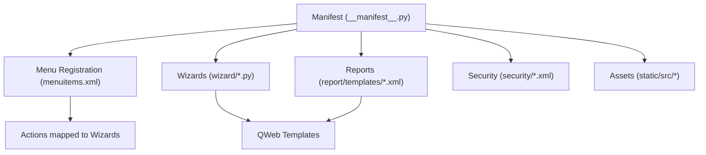
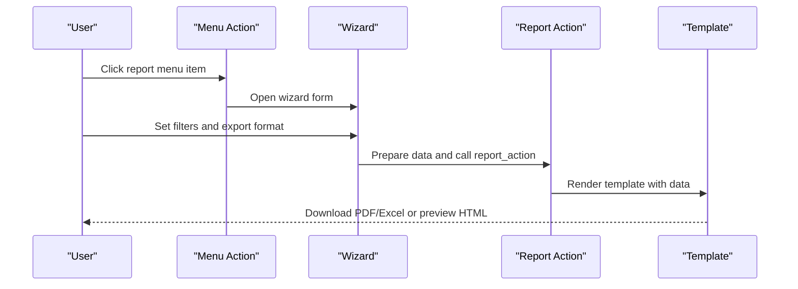
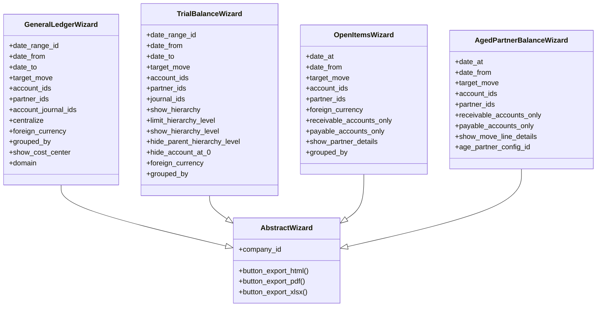
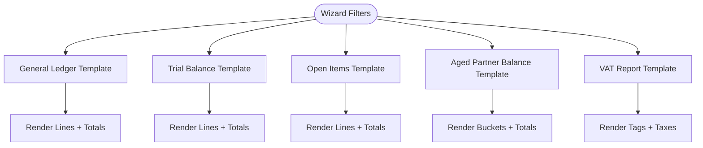
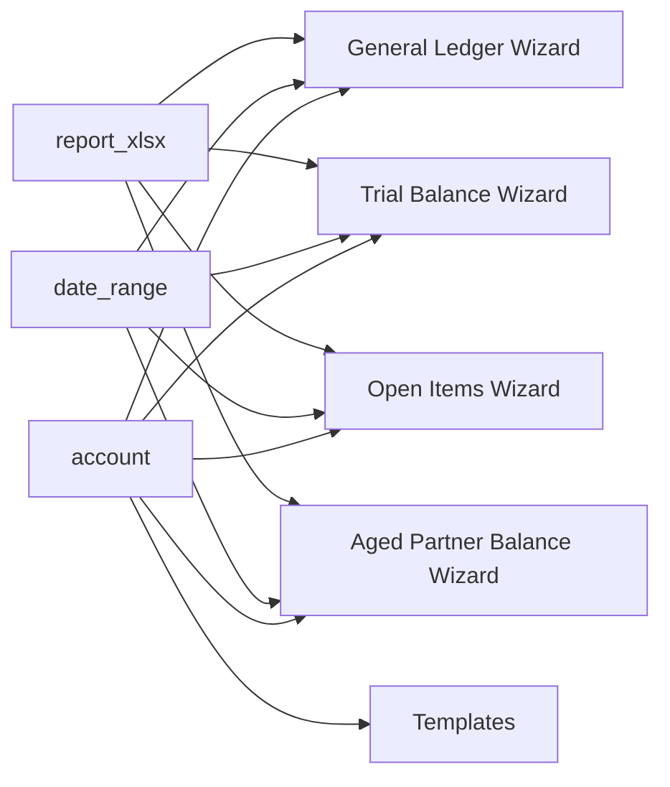

# Getting Started

<cite>
**Referenced Files in This Document**
- [__manifest__.py](file://__manifest__.py)
- [README.rst](file://README.rst)
- [readme/DESCRIPTION.md](file://readme/DESCRIPTION.md)
- [readme/CONFIGURE.md](file://readme/CONFIGURE.md)
- [menuitems.xml](file://menuitems.xml)
- [wizard/abstract_wizard.py](file://wizard/abstract_wizard.py)
- [wizard/general_ledger_wizard.py](file://wizard/general_ledger_wizard.py)
- [wizard/trial_balance_wizard.py](file://wizard/trial_balance_wizard.py)
- [wizard/open_items_wizard.py](file://wizard/open_items_wizard.py)
- [wizard/aged_partner_balance_wizard.py](file://wizard/aged_partner_balance_wizard.py)
- [report/templates/general_ledger.xml](file://report/templates/general_ledger.xml)
- [report/templates/trial_balance.xml](file://report/templates/trial_balance.xml)
- [report/templates/open_items.xml](file://report/templates/open_items.xml)
- [report/templates/aged_partner_balance.xml](file://report/templates/aged_partner_balance.xml)
- [report/templates/vat_report.xml](file://report/templates/vat_report.xml)
</cite>

## Table of Contents
1. [Introduction](#introduction)
2. [Project Structure](#project-structure)
3. [Core Components](#core-components)
4. [Architecture Overview](#architecture-overview)
5. [Detailed Component Analysis](#detailed-component-analysis)
6. [Dependency Analysis](#dependency-analysis)
7. [Performance Considerations](#performance-considerations)
8. [Troubleshooting Guide](#troubleshooting-guide)
9. [Conclusion](#conclusion)
10. [Appendices](#appendices)

## Introduction
This guide helps new users get started with the Account Financial Reports module. Beyond standard Odoo financial reports, this module provides advanced reporting capabilities across six report types:
- General Ledger
- Trial Balance
- Open Items
- Aged Partner Balance
- VAT Report
- Journal Ledger

These reports are designed to be wizard-driven, allowing flexible filtering and export to PDF or Excel. The module also supports multi-company and multi-currency scenarios and integrates directly into Odoo’s Invoicing menu.

## Project Structure
The module follows an Odoo addon structure with clear separation of concerns:
- Wizards: user-facing configuration dialogs for each report type
- Reports: QWeb templates defining the HTML/PDF/XLSX output
- Views and Menus: XML that registers menus and actions under the Invoicing section
- Security: access controls and permissions
- Assets: frontend JavaScript and XML assets for interactive behavior

**Diagram sources**
- [__manifest__.py:19-46](file://__manifest__.py#L19-L46)
- [menuitems.xml:1-46](file://menuitems.xml#L1-L46)

**Section sources**
- [__manifest__.py:19-46](file://__manifest__.py#L19-L46)
- [menuitems.xml:1-46](file://menuitems.xml#L1-L46)

## Core Components
- Module metadata and dependencies: defines the module name, version, category, author, license, and declared dependencies (account, date_range, report_xlsx).
- Menus and actions: registers the “OCA accounting reports” group and individual report actions under the Invoicing menu.
- Wizards: each report type has a wizard model that collects filters and triggers report generation.
- Templates: QWeb templates render the final report output (HTML/PDF/XLSX) with consistent filters and tables.

Key capabilities:
- Wizard-based configuration interface shared across all report types
- Export to PDF, HTML, and Excel (XLSX)
- Multi-company and multi-currency support
- Dynamic intervals for Aged Partner Balance via configuration records

**Section sources**
- [__manifest__.py:7-57](file://__manifest__.py#L7-L57)
- [menuitems.xml:1-46](file://menuitems.xml#L1-L46)
- [wizard/abstract_wizard.py:1-52](file://wizard/abstract_wizard.py#L1-L52)

## Architecture Overview
The module implements a consistent pattern:
- Menu items under Invoicing → Reporting → OCA accounting reports
- Each report opens a wizard dialog with filters
- Wizard prepares a data payload and delegates to the report action
- Report action renders the template and exports the chosen format

**Diagram sources**
- [menuitems.xml:3-44](file://menuitems.xml#L3-L44)
- [wizard/abstract_wizard.py:38-52](file://wizard/abstract_wizard.py#L38-L52)

**Section sources**
- [menuitems.xml:1-46](file://menuitems.xml#L1-L46)
- [wizard/abstract_wizard.py:1-52](file://wizard/abstract_wizard.py#L1-L52)

## Detailed Component Analysis

### Prerequisites
- Odoo version: The manifest indicates compatibility with version 18.0.
- Installed modules: account, date_range, report_xlsx.
- Basic accounting knowledge: Familiarity with accounts, journals, partners, and basic accounting periods helps interpret reports.

**Section sources**
- [__manifest__.py:8-18](file://__manifest__.py#L8-L18)

### Installation
- Install the module via Odoo’s Apps menu or by placing it in your addons path and updating the module list.
- After installation, the “OCA accounting reports” menu appears under Invoicing → Reporting.

Note: Screenshots are not included here. Refer to your Odoo instance to locate the menu and actions.

**Section sources**
- [menuitems.xml:1-8](file://menuitems.xml#L1-L8)

### Initial Configuration
- Aged Partner Balance dynamic intervals:
  - Go to Settings → Invoicing → OCA Aged Report Configuration.
  - Create configurations with interval definitions.
  - Select a default configuration per company if desired.
- After configuring intervals, run the Aged Partner Balance report and choose the desired configuration.

**Section sources**
- [readme/CONFIGURE.md:1-27](file://readme/CONFIGURE.md#L1-L27)
- [README.rst:62-93](file://README.rst#L62-L93)

### Accessing Reports from the Invoicing Menu
- Navigate to Invoicing → Reporting → OCA accounting reports.
- Choose a report:
  - General Ledger
  - Trial Balance
  - Open Items
  - Aged Partner Balance
  - VAT Report
  - Journal Ledger
- Each selection opens a wizard with filters and export options.

**Section sources**
- [README.rst:35-43](file://README.rst#L35-L43)
- [menuitems.xml:9-44](file://menuitems.xml#L9-L44)

### Wizard-Based Configuration Interface
All report wizards share a common base and similar export behavior:
- Base wizard features:
  - Company selection
  - Date range or single date filters
  - Target moves (posted/all)
  - Export buttons: HTML, PDF, XLSX
- Example wizards:
  - General Ledger: date range, target moves, accounts/partners/journals, centralize, foreign currency, grouping, analytic distribution, and domain customization.
  - Trial Balance: date range, target moves, accounts/partners/journals, hierarchy display, hide zeros, foreign currency, grouping by analytic account.
  - Open Items: date at, target moves, accounts (reconcilable only), partners, foreign currency, grouping by partners/salesperson, partner details toggle.
  - Aged Partner Balance: date at, target moves, accounts (reconcilable only), partners, intervals configuration, move line details toggle.
  - VAT Report: date range, based-on selection, tax details toggle.

**Diagram sources**
- [wizard/abstract_wizard.py:7-52](file://wizard/abstract_wizard.py#L7-L52)
- [wizard/general_ledger_wizard.py:18-322](file://wizard/general_ledger_wizard.py#L18-L322)
- [wizard/trial_balance_wizard.py:12-285](file://wizard/trial_balance_wizard.py#L12-L285)
- [wizard/open_items_wizard.py:9-190](file://wizard/open_items_wizard.py#L9-L190)
- [wizard/aged_partner_balance_wizard.py:9-154](file://wizard/aged_partner_balance_wizard.py#L9-L154)

**Section sources**
- [wizard/abstract_wizard.py:1-52](file://wizard/abstract_wizard.py#L1-L52)
- [wizard/general_ledger_wizard.py:18-322](file://wizard/general_ledger_wizard.py#L18-L322)
- [wizard/trial_balance_wizard.py:12-285](file://wizard/trial_balance_wizard.py#L12-L285)
- [wizard/open_items_wizard.py:9-190](file://wizard/open_items_wizard.py#L9-L190)
- [wizard/aged_partner_balance_wizard.py:9-154](file://wizard/aged_partner_balance_wizard.py#L9-L154)

### Report Templates Overview
Each report type uses a dedicated QWeb template that:
- Renders a consistent header with filters
- Presents tabular data aligned with the report’s purpose
- Supports optional columns for foreign currency and analytic distributions
- Provides totals and ending balances where applicable

Highlights:
- General Ledger: detailed lines with cumulative balances, optional grouping by partners/taxes, analytic tags, and foreign currency columns.
- Trial Balance: account-level or grouped-by-analytic lines with initial/period/ending balances and optional partner details.
- Open Items: outstanding amounts per account/partner with due dates and residual totals, including foreign currency columns.
- Aged Partner Balance: aging buckets (or dynamic intervals) with totals and percentages, optionally with move-line details.
- VAT Report: tag/group totals with optional tax-level breakdowns.

**Diagram sources**
- [report/templates/general_ledger.xml:12-104](file://report/templates/general_ledger.xml#L12-L104)
- [report/templates/trial_balance.xml:12-179](file://report/templates/trial_balance.xml#L12-L179)
- [report/templates/open_items.xml:13-211](file://report/templates/open_items.xml#L13-L211)
- [report/templates/aged_partner_balance.xml:14-91](file://report/templates/aged_partner_balance.xml#L14-L91)
- [report/templates/vat_report.xml:12-146](file://report/templates/vat_report.xml#L12-L146)

**Section sources**
- [report/templates/general_ledger.xml:12-789](file://report/templates/general_ledger.xml#L12-L789)
- [report/templates/trial_balance.xml:12-800](file://report/templates/trial_balance.xml#L12-L800)
- [report/templates/open_items.xml:13-455](file://report/templates/open_items.xml#L13-L455)
- [report/templates/aged_partner_balance.xml:14-812](file://report/templates/aged_partner_balance.xml#L14-L812)
- [report/templates/vat_report.xml:12-168](file://report/templates/vat_report.xml#L12-L168)

## Dependency Analysis
- Internal dependencies:
  - Wizards depend on the abstract wizard for shared export behavior.
  - Templates depend on report data prepared by wizards.
- External dependencies:
  - account: core accounting models and journals
  - date_range: optional date range selection
  - report_xlsx: enables Excel export

**Diagram sources**
- [__manifest__.py:18-18](file://__manifest__.py#L18-L18)
- [wizard/abstract_wizard.py:4-4](file://wizard/abstract_wizard.py#L4-L4)

**Section sources**
- [__manifest__.py:18-18](file://__manifest__.py#L18-L18)

## Performance Considerations
- Use appropriate filters (date ranges, accounts, partners, journals) to reduce dataset size.
- Enable “Hide account ending balance at 0” or “Hide accounts at 0” where relevant to minimize output volume.
- Limit hierarchy levels in Trial Balance when dealing with large account structures.
- Prefer exporting to PDF for large datasets to avoid browser rendering overhead; use Excel for post-processing needs.

## Troubleshooting Guide
- Aged Partner Balance intervals not appearing:
  - Ensure intervals are configured under Settings → Invoicing → OCA Aged Report Configuration and selected in the wizard.
- VAT Report discrepancies:
  - The report is valid when tax account tags meet specific conditions; review tax tags and repartition settings.
- Foreign currency not displayed:
  - Confirm multi-currency is enabled for users and that accounts have secondary currencies configured.
- Filters not applying:
  - Verify company selection matches the date range and filters domain constraints.

**Section sources**
- [readme/CONFIGURE.md:1-27](file://readme/CONFIGURE.md#L1-L27)
- [README.rst:94-103](file://README.rst#L94-L103)
- [wizard/general_ledger_wizard.py:63-69](file://wizard/general_ledger_wizard.py#L63-L69)
- [wizard/trial_balance_wizard.py:57-62](file://wizard/trial_balance_wizard.py#L57-L62)
- [wizard/open_items_wizard.py:45-51](file://wizard/open_items_wizard.py#L45-L51)

## Conclusion
The Account Financial Reports module extends Odoo’s built-in financial reporting with powerful, wizard-driven reports. By installing the module, accessing the Invoicing menu, and using the shared wizard interface, you can quickly generate detailed financial statements in PDF or Excel. Configure dynamic intervals for Aged Partner Balance and leverage multi-currency and multi-company features to tailor reports to your needs.

## Appendices
- Additional reading: module overview and configuration steps are described in the module’s documentation files.

**Section sources**
- [readme/DESCRIPTION.md:1-22](file://readme/DESCRIPTION.md#L1-L22)
- [README.rst:35-93](file://README.rst#L35-L93)