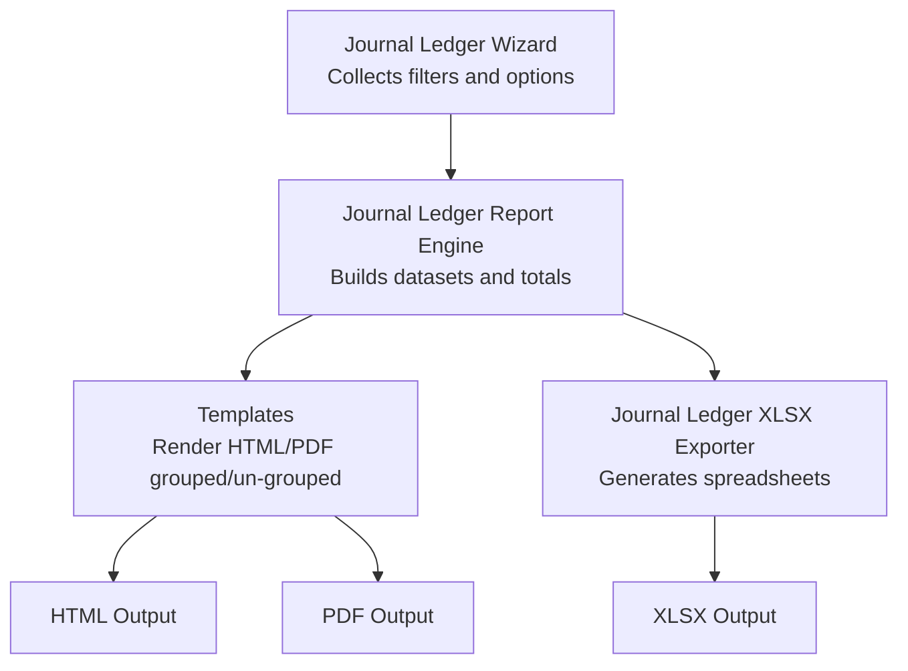
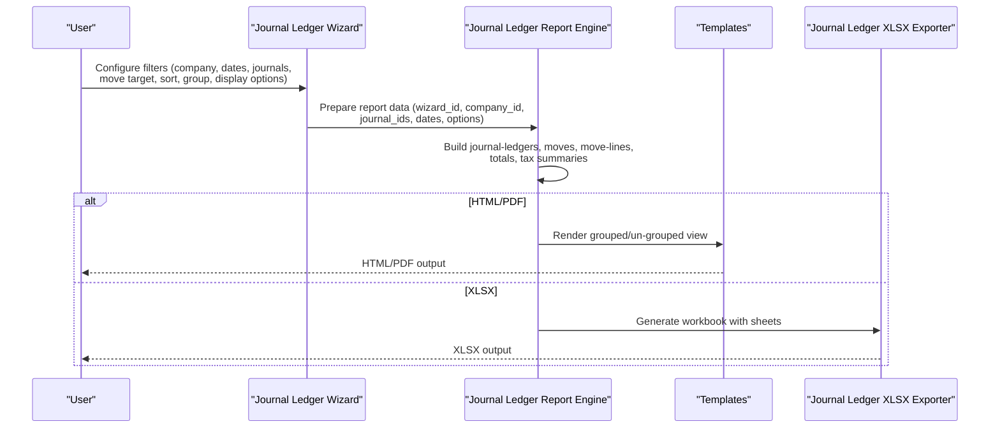
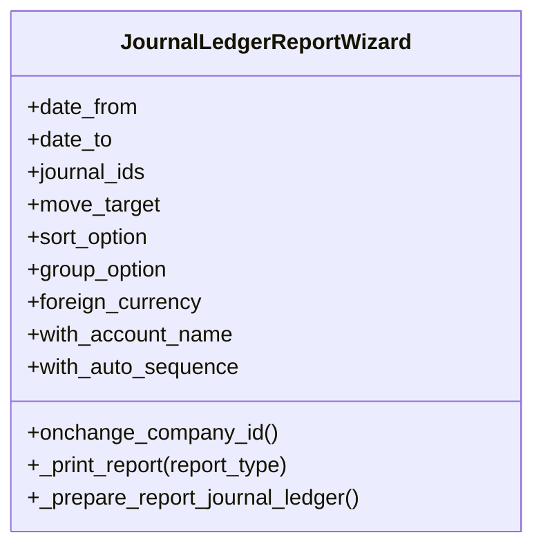
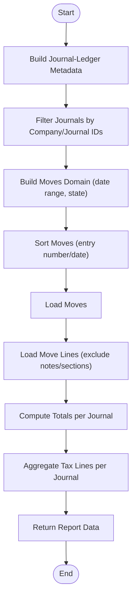
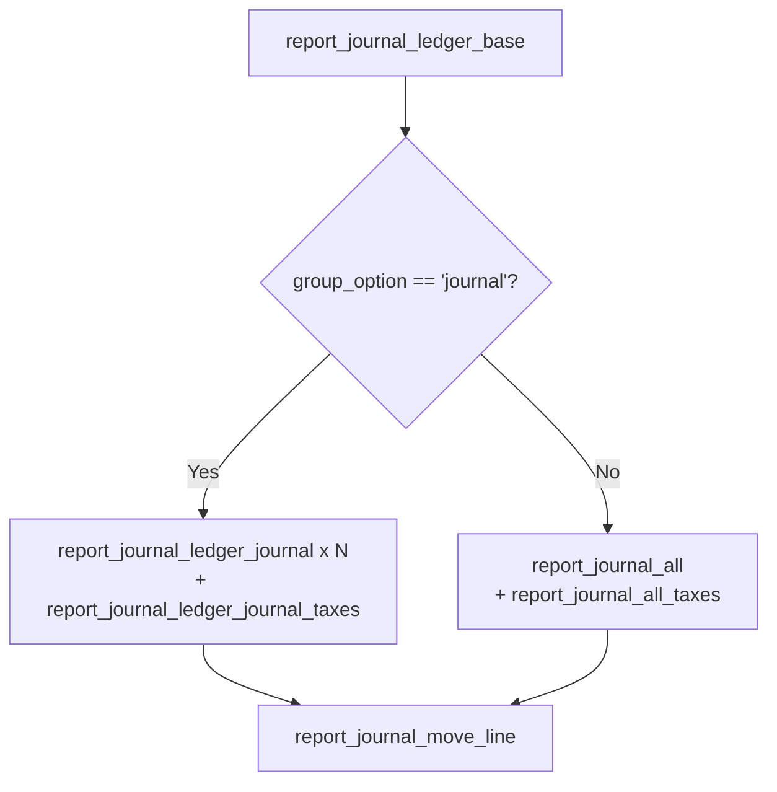
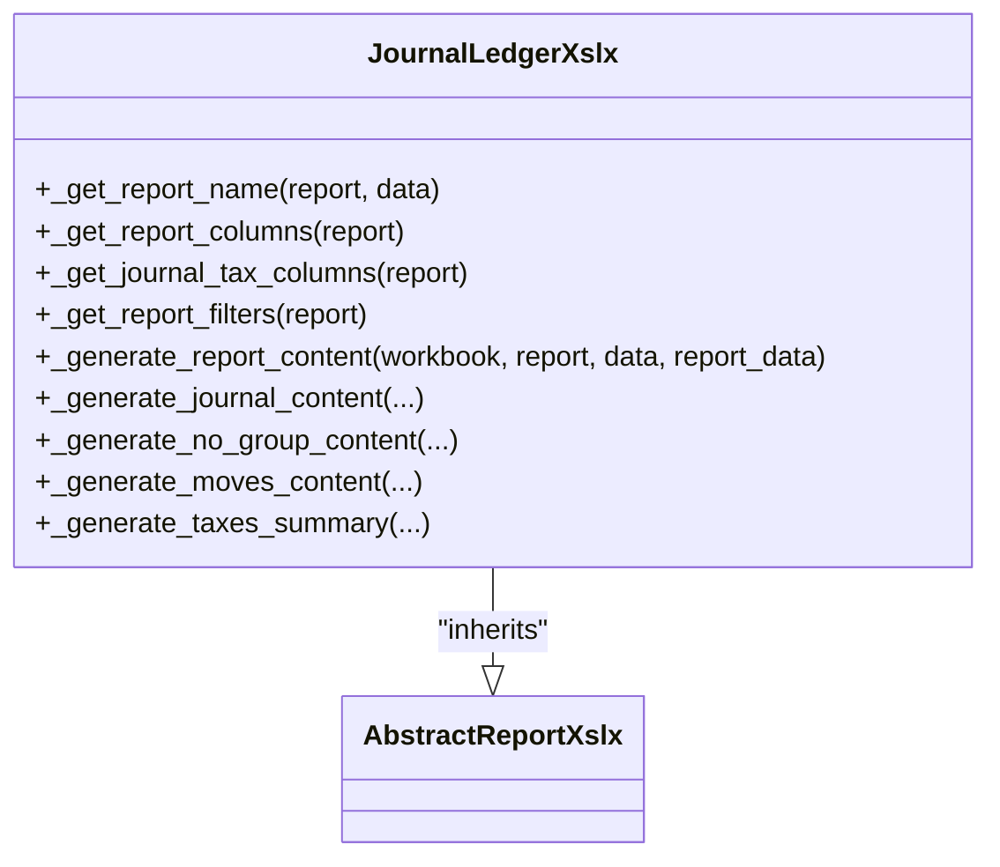
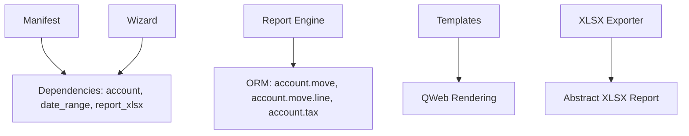

# Journal Ledger Report

<cite>
**Referenced Files in This Document**
- [journal_ledger.py](file://report/journal_ledger.py)
- [journal_ledger_xlsx.py](file://report/journal_ledger_xlsx.py)
- [journal_ledger_wizard.py](file://wizard/journal_ledger_wizard.py)
- [journal_ledger_wizard_view.xml](file://wizard/journal_ledger_wizard_view.xml)
- [journal_ledger.xml](file://report/templates/journal_ledger.xml)
- [report_journal_ledger.xml](file://view/report_journal_ledger.xml)
- [abstract_report_xlsx.py](file://report/abstract_report_xlsx.py)
- [test_journal_ledger.py](file://tests/test_journal_ledger.py)
- [__manifest__.py](file://__manifest__.py)
</cite>

## Table of Contents
1. [Introduction](#introduction)
2. [Project Structure](#project-structure)
3. [Core Components](#core-components)
4. [Architecture Overview](#architecture-overview)
5. [Detailed Component Analysis](#detailed-component-analysis)
6. [Dependency Analysis](#dependency-analysis)
7. [Performance Considerations](#performance-considerations)
8. [Troubleshooting Guide](#troubleshooting-guide)
9. [Conclusion](#conclusion)
10. [Appendices](#appendices)

## Introduction
The Journal Ledger Report provides a comprehensive view of financial transactions organized by journal type and sequence. It enables users to analyze posted and draft entries, filter by journals, periods, and entry types, and understand how individual journal entries are displayed with their line items. The report supports both grouped-by-journal and ungrouped displays, offers multiple export formats (HTML, PDF, XLSX), and includes tax summaries for each journal.

## Project Structure
The Journal Ledger implementation spans wizard configuration, report generation, template rendering, and XLSX export. Key components:
- Wizard: collects user selections (company, date range, journals, sorting, grouping, display options)
- Report engine: builds datasets for journals, moves, and move lines; computes totals and tax summaries
- Templates: render HTML/PDF views grouped by journal or ungrouped
- XLSX exporter: generates spreadsheets with configurable columns and tax summaries

**Diagram sources**
- [journal_ledger_wizard.py:10-117](file://wizard/journal_ledger_wizard.py#L10-L117)
- [journal_ledger.py:302-375](file://report/journal_ledger.py#L302-L375)
- [journal_ledger.xml:14-54](file://report/templates/journal_ledger.xml#L14-L54)
- [journal_ledger_xlsx.py:159-176](file://report/journal_ledger_xlsx.py#L159-L176)

**Section sources**
- [__manifest__.py:19-46](file://__manifest__.py#L19-L46)

## Core Components
- Journal Ledger Wizard: defines filters and options including company, date range, journals, move target (all/posted/draft), sort option (entry number/date), group option (journal/no group), foreign currency, account name, and auto sequence.
- Journal Ledger Report Engine: constructs journal-ledger data, retrieves moves and move lines, computes totals per journal, and aggregates tax lines per journal.
- Templates: render grouped-by-journal or ungrouped views with line items, totals, and tax summaries.
- XLSX Exporter: produces spreadsheets with configurable columns and tax summaries.

**Section sources**
- [journal_ledger_wizard.py:14-53](file://wizard/journal_ledger_wizard.py#L14-L53)
- [journal_ledger.py:15-375](file://report/journal_ledger.py#L15-L375)
- [journal_ledger.xml:14-511](file://report/templates/journal_ledger.xml#L14-L511)
- [journal_ledger_xlsx.py:159-269](file://report/journal_ledger_xlsx.py#L159-L269)

## Architecture Overview
The report pipeline integrates wizard input, ORM queries, data aggregation, and rendering/export.

**Diagram sources**
- [journal_ledger_wizard.py:96-117](file://wizard/journal_ledger_wizard.py#L96-L117)
- [journal_ledger.py:302-375](file://report/journal_ledger.py#L302-L375)
- [journal_ledger.xml:14-54](file://report/templates/journal_ledger.xml#L14-L54)
- [journal_ledger_xlsx.py:159-176](file://report/journal_ledger_xlsx.py#L159-L176)

## Detailed Component Analysis

### Wizard Configuration
The wizard collects:
- Company and date range (or date range selector)
- Journals (optional; defaults to company journals if none selected)
- Move target: all, posted, or draft
- Sort option: by entry number or by date
- Group option: by journal or no group
- Display options: foreign currency, show account name, show auto sequence

**Diagram sources**
- [journal_ledger_wizard.py:10-117](file://wizard/journal_ledger_wizard.py#L10-L117)

**Section sources**
- [journal_ledger_wizard.py:14-53](file://wizard/journal_ledger_wizard.py#L14-L53)
- [journal_ledger_wizard_view.xml:8-41](file://wizard/journal_ledger_wizard_view.xml#L8-L41)

### Report Data Pipeline
The report engine:
- Builds journal-ledger metadata (id, name, currency)
- Filters journals by company and selected journals
- Retrieves moves within date range and state (all/posted/draft)
- Sorts moves by entry number or date
- Loads move lines excluding notes/sections, ordered by move_id
- Computes totals per journal and aggregates tax lines per journal
- Returns structured data for templates and XLSX

**Diagram sources**
- [journal_ledger.py:27-375](file://report/journal_ledger.py#L27-L375)

**Section sources**
- [journal_ledger.py:15-375](file://report/journal_ledger.py#L15-L375)

### Template Rendering (HTML/PDF)
Templates support two modes:
- Grouped by journal: renders a page per journal with entries and tax summary
- Ungrouped: renders a single page with all entries and a global tax summary

Key rendering elements:
- Header with title, company, currency, date range, move target
- Table headers adjust based on display options (auto sequence, account name, foreign currency)
- Line items include entry, date, account (and optional name), partner, label, taxes, debit, credit, and optionally currency and amount in currency
- Tax summary per journal or globally

**Diagram sources**
- [journal_ledger.xml:14-54](file://report/templates/journal_ledger.xml#L14-L54)
- [journal_ledger.xml:67-92](file://report/templates/journal_ledger.xml#L67-L92)
- [journal_ledger.xml:56-66](file://report/templates/journal_ledger.xml#L56-L66)
- [journal_ledger.xml:316-414](file://report/templates/journal_ledger.xml#L316-L414)
- [journal_ledger.xml:415-510](file://report/templates/journal_ledger.xml#L415-L510)

**Section sources**
- [journal_ledger.xml:14-511](file://report/templates/journal_ledger.xml#L14-L511)
- [report_journal_ledger.xml:3-8](file://view/report_journal_ledger.xml#L3-L8)

### XLSX Export
The XLSX exporter:
- Defines report name with company and currency
- Configures columns dynamically (auto sequence, account name, foreign currency)
- Writes filters and report content
- Generates separate sheets for each journal and a tax summary sheet per journal
- Supports grouped and ungrouped modes

**Diagram sources**
- [journal_ledger_xlsx.py:10-110](file://report/journal_ledger_xlsx.py#L10-L110)
- [abstract_report_xlsx.py:8-698](file://report/abstract_report_xlsx.py#L8-L698)

**Section sources**
- [journal_ledger_xlsx.py:15-269](file://report/journal_ledger_xlsx.py#L15-L269)
- [abstract_report_xlsx.py:18-698](file://report/abstract_report_xlsx.py#L18-L698)

## Dependency Analysis
- Wizard depends on account and date_range modules and report_xlsx for export.
- Report engine depends on account.move, account.move.line, and account.tax.
- Templates depend on Odoo QWeb rendering and layout templates.
- XLSX exporter inherits from abstract XLSX report base.

**Diagram sources**
- [__manifest__.py:18-46](file://__manifest__.py#L18-L46)
- [journal_ledger.py:8-8](file://report/journal_ledger.py#L8-L8)
- [journal_ledger_xlsx.py:13-13](file://report/journal_ledger_xlsx.py#L13-L13)

**Section sources**
- [__manifest__.py:18-46](file://__manifest__.py#L18-L46)

## Performance Considerations
- Move lines are loaded with prefetch disabled to improve performance with large datasets.
- Tax exigibility is computed efficiently by pre-fetching IDs and using SQL queries to fetch tax associations.
- Grouping and ordering leverage database-level sorting and Python’s itertools.groupby for memory efficiency.
- XLSX generation uses constant memory workbook option and writes data in batches.

[No sources needed since this section provides general guidance]

## Troubleshooting Guide
Common issues and resolutions:
- No journals selected: the wizard defaults to all journals in the chosen company.
- Unexpected empty results: verify date range and move target; drafts are excluded unless “All” is selected.
- Foreign currency not displayed: enable the foreign currency option in the wizard.
- Tax discrepancies: ensure taxes are correctly linked to move lines and that exigibility conditions match your setup.

**Section sources**
- [journal_ledger_wizard.py:96-117](file://wizard/journal_ledger_wizard.py#L96-L117)
- [journal_ledger.py:171-249](file://report/journal_ledger.py#L171-L249)

## Conclusion
The Journal Ledger Report provides a flexible, configurable view of financial transactions across journals and periods. Users can filter by journals, periods, and entry types, choose grouping or ungrouped display, and export to multiple formats. The underlying engine efficiently aggregates totals and tax summaries, while templates and XLSX exporters deliver consistent, readable outputs suitable for audits, reconciliations, and transaction verification.

[No sources needed since this section summarizes without analyzing specific files]

## Appendices

### Practical Examples

- Audit trail: Use grouped-by-journal mode with “All” move target and date range covering the period under review. Export to PDF for signed review.
- Journal reconciliation: Select a specific journal, set date range to the month-end, and export to XLSX. Compare totals against bank statements.
- Transaction verification: Choose “Posted” only, sort by date, and export to XLSX. Review line items for account postings and amounts.

[No sources needed since this section provides general guidance]

### Display Formats and Interpretation
- HTML/PDF: grouped by journal with per-journal totals and tax summaries; ungrouped view lists all entries in a single page.
- XLSX: separate sheets per journal and a tax summary sheet per journal; columns include entry, date, account, partner, label, taxes, debit, credit, and optionally currency and amount in currency.

**Section sources**
- [journal_ledger.xml:14-511](file://report/templates/journal_ledger.xml#L14-L511)
- [journal_ledger_xlsx.py:24-110](file://report/journal_ledger_xlsx.py#L24-L110)

### Filtering Options Summary
- Journals: optional multi-select; defaults to company journals if none selected
- Periods: start and end date or date range
- Entry types: all, posted, or draft
- Sorting: by entry number or by date
- Grouping: by journal or no group
- Display: foreign currency, account name, auto sequence

**Section sources**
- [journal_ledger_wizard.py:14-53](file://wizard/journal_ledger_wizard.py#L14-L53)
- [journal_ledger_wizard_view.xml:13-41](file://wizard/journal_ledger_wizard_view.xml#L13-L41)

### Transaction Analysis Capabilities
- Individual journal entries are displayed with line items, including account postings, partner, label, taxes, and amounts.
- Totals per journal are computed and shown.
- Tax summaries are aggregated per journal and can be exported to XLSX.

**Section sources**
- [journal_ledger.py:302-375](file://report/journal_ledger.py#L302-L375)
- [journal_ledger.xml:207-315](file://report/templates/journal_ledger.xml#L207-L315)

### Tests Reference
Automated tests demonstrate:
- Total debit/credit computation across posted and draft entries
- Tax base and tax amounts aggregation for sales and purchase invoices

**Section sources**
- [test_journal_ledger.py:163-283](file://tests/test_journal_ledger.py#L163-L283)