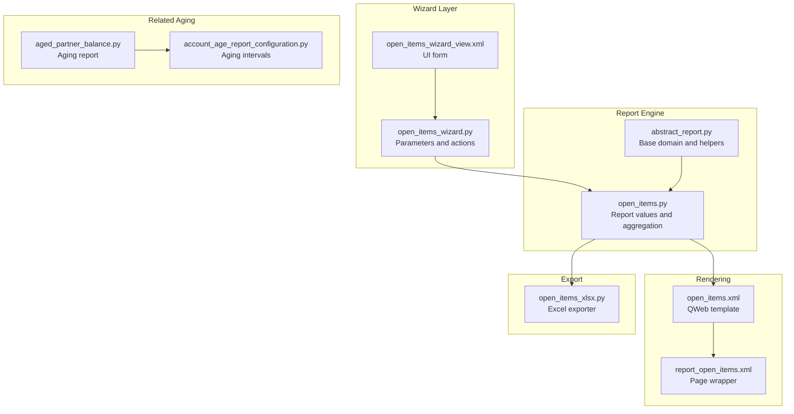
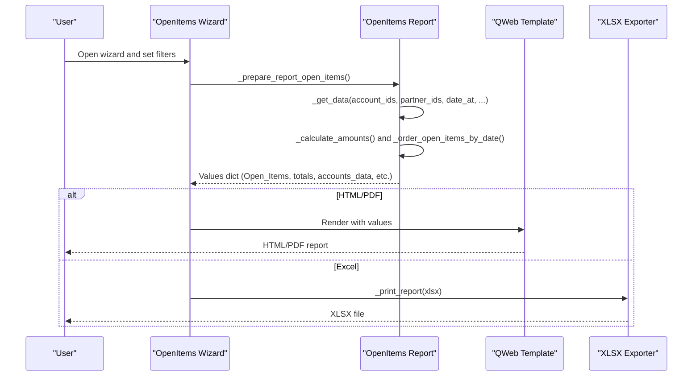
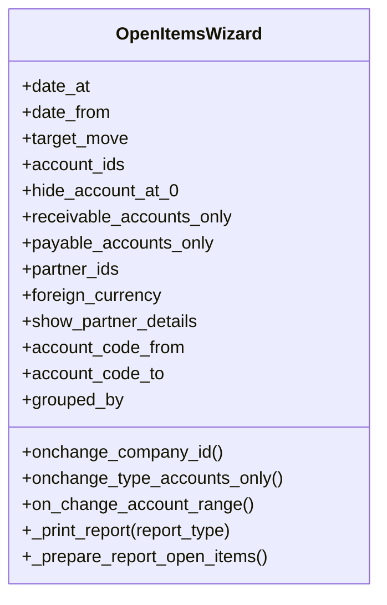
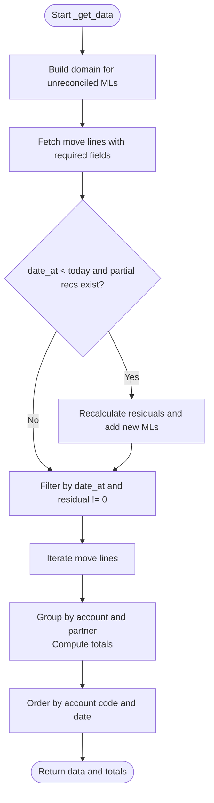
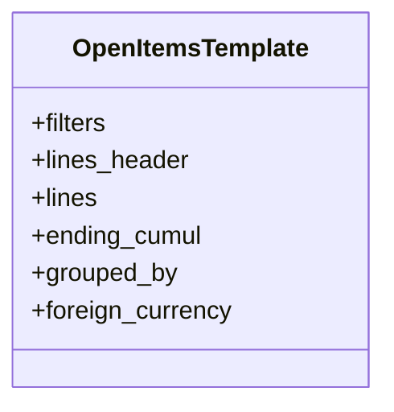
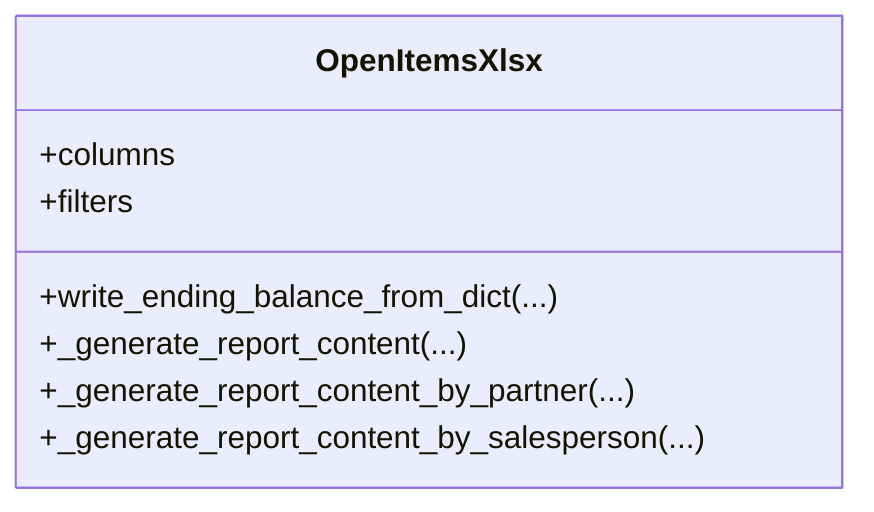
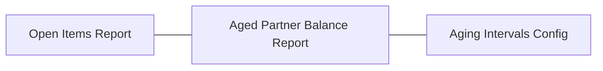
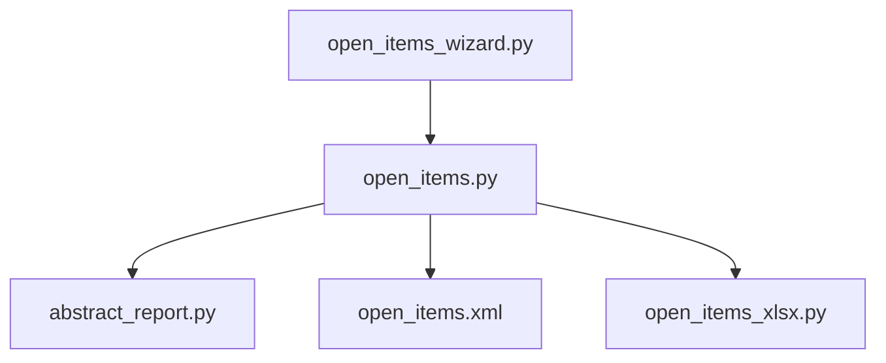

# Open Items Report

<cite>
**Referenced Files in This Document**
- [open_items.py](file://report/open_items.py)
- [open_items_wizard.py](file://wizard/open_items_wizard.py)
- [open_items.xml](file://report/templates/open_items.xml)
- [report_open_items.xml](file://view/report_open_items.xml)
- [open_items_wizard_view.xml](file://wizard/open_items_wizard_view.xml)
- [open_items_xlsx.py](file://report/open_items_xlsx.py)
- [abstract_report.py](file://report/abstract_report.py)
- [aged_partner_balance.py](file://report/aged_partner_balance.py)
- [account_age_report_configuration.py](file://models/account_age_report_configuration.py)
- [DESCRIPTION.md](file://readme/DESCRIPTION.md)
- [CONFIGURE.md](file://readme/CONFIGURE.md)
- [__manifest__.py](file://__manifest__.py)
- [test_open_items.py](file://tests/test_open_items.py)
</cite>

## Table of Contents
1. [Introduction](#introduction)
2. [Project Structure](#project-structure)
3. [Core Components](#core-components)
4. [Architecture Overview](#architecture-overview)
5. [Detailed Component Analysis](#detailed-component-analysis)
6. [Dependency Analysis](#dependency-analysis)
7. [Performance Considerations](#performance-considerations)
8. [Troubleshooting Guide](#troubleshooting-guide)
9. [Conclusion](#conclusion)
10. [Appendices](#appendices)

## Introduction
The Open Items report displays all unreconciled, open account move lines for selected accounts and partners as of a specified date. It is commonly used for tracking outstanding receivables and payables, performing collections management, and monitoring supplier payments. The report supports filtering by company, accounts (including by account code range), partners, and target moves (posted vs all). It can group by partner or by partner’s salesperson and can optionally show detailed transaction lines or summarize by account only. The report also supports exporting to PDF and Excel.

This document explains how to configure the report, how it tracks outstanding items, how to interpret the aging-related columns and totals, and how to use the report for collections and supplier payment tracking.

## Project Structure
The Open Items report is implemented as part of the Account Financial Reports module. Key components include:
- Wizard for collecting report parameters
- Report engine that queries and aggregates open move lines
- QWeb template for HTML/PDF rendering
- XLSX generator for Excel export
- Tests validating wizard behavior and grouping options

**Diagram sources**
- [open_items_wizard.py:1-190](file://wizard/open_items_wizard.py#L1-L190)
- [open_items.py:1-310](file://report/open_items.py#L1-L310)
- [abstract_report.py:1-165](file://report/abstract_report.py#L1-L165)
- [open_items.xml:1-455](file://report/templates/open_items.xml#L1-L455)
- [report_open_items.xml:1-10](file://view/report_open_items.xml#L1-L10)
- [open_items_xlsx.py:1-350](file://report/open_items_xlsx.py#L1-L350)
- [aged_partner_balance.py:1-473](file://report/aged_partner_balance.py#L1-L473)
- [account_age_report_configuration.py:1-50](file://models/account_age_report_configuration.py#L1-L50)

**Section sources**
- [__manifest__.py:19-46](file://__manifest__.py#L19-L46)
- [DESCRIPTION.md:1-22](file://readme/DESCRIPTION.md#L1-L22)

## Core Components
- Open Items Wizard: Collects filters (company, date range, target moves, accounts/partners, grouping, display options) and prepares the report payload.
- Open Items Report: Queries unreconciled move lines, recalculates residuals considering future partial reconciliations, aggregates by account and partner, computes totals, and orders output.
- QWeb Template: Renders the report in HTML/PDF with filters, headers, line details, and ending totals.
- XLSX Exporter: Generates Excel output with the same columns and totals as the PDF.
- Abstract Report Base: Provides shared domain construction and helper methods for move line queries.

Key capabilities:
- Filter by company, accounts (by code range or explicit list), partners, and target moves (posted/all).
- Group by partner or by salesperson (requires partner to have a salesperson).
- Show partner details or summarize by account only.
- Foreign currency display support.
- Hide accounts with zero residual balances.

**Section sources**
- [open_items_wizard.py:16-66](file://wizard/open_items_wizard.py#L16-L66)
- [open_items.py:62-189](file://report/open_items.py#L62-L189)
- [open_items.xml:235-453](file://report/templates/open_items.xml#L235-L453)
- [open_items_xlsx.py:23-116](file://report/open_items_xlsx.py#L23-L116)
- [abstract_report.py:21-165](file://report/abstract_report.py#L21-L165)

## Architecture Overview
The Open Items report follows a standard Odoo reporting pipeline: wizard collects parameters, the report engine computes data, and templates render the output. The wizard delegates to the report engine to compute totals and ordered data.

**Diagram sources**
- [open_items_wizard.py:170-189](file://wizard/open_items_wizard.py#L170-L189)
- [open_items.py:245-297](file://report/open_items.py#L245-L297)
- [open_items.xml:3-11](file://report/templates/open_items.xml#L3-L11)
- [open_items_xlsx.py:154-168](file://report/open_items_xlsx.py#L154-L168)

## Detailed Component Analysis

### Wizard: Parameter Collection and Actions
The wizard defines the UI and parameters for the report:
- Filters: company, date_at, date_from, target_move, show_partner_details, grouped_by, hide_account_at_0, foreign_currency.
- Accounts: either explicit list or by code range (receivable/payable toggles and from/to code fields).
- Partners: many2many filter.
- Actions: View (HTML), Export PDF, Export XLSX.

Important behaviors:
- Receivable/payable toggles dynamically filter accounts by account type.
- Company change updates domains for accounts and partners.
- Account code range populates account_ids automatically.
- Default foreign currency depends on user group “base.group_multi_currency”.

**Diagram sources**
- [open_items_wizard.py:9-189](file://wizard/open_items_wizard.py#L9-L189)

**Section sources**
- [open_items_wizard.py:16-66](file://wizard/open_items_wizard.py#L16-L66)
- [open_items_wizard.py:98-123](file://wizard/open_items_wizard.py#L98-L123)
- [open_items_wizard.py:124-140](file://wizard/open_items_wizard.py#L124-L140)
- [open_items_wizard.py:170-189](file://wizard/open_items_wizard.py#L170-L189)
- [open_items_wizard_view.xml:1-119](file://wizard/open_items_wizard_view.xml#L1-L119)

### Report Engine: Data Retrieval, Aggregation, and Ordering
The report engine performs:
- Domain construction for unreconciled move lines, applying filters for company, accounts, partners, and target moves.
- Recalculation of residual amounts when there are future partial reconciliations occurring after the report date.
- Building a nested structure keyed by account and partner, enriching each line with computed fields (dates, original amount, labels).
- Computing totals per account and per partner.
- Sorting by account code, then by date and partner depending on grouping and display options.

**Diagram sources**
- [open_items.py:62-189](file://report/open_items.py#L62-L189)
- [abstract_report.py:21-123](file://report/abstract_report.py#L21-L123)

**Section sources**
- [open_items.py:62-189](file://report/open_items.py#L62-L189)
- [open_items.py:191-243](file://report/open_items.py#L191-L243)
- [abstract_report.py:21-123](file://report/abstract_report.py#L21-L123)

### Rendering: HTML/PDF Output
The QWeb template renders:
- Filters section (Date at, Target moves, Hide account at 0).
- Account headers and optional partner headers.
- Column headers: Date, Entry, Journal, Account, Partner, Ref - Label, Due date, Original, Residual, and optional foreign currency columns.
- Line rows with monetary formatting.
- Ending totals per partner and per account.

Grouping modes:
- Grouped by partners: one table per account, with partner headers and totals.
- Grouped by salesperson: one page per salesperson, with account and partner sections.

**Diagram sources**
- [open_items.xml:13-211](file://report/templates/open_items.xml#L13-L211)
- [open_items.xml:235-453](file://report/templates/open_items.xml#L235-L453)

**Section sources**
- [open_items.xml:213-234](file://report/templates/open_items.xml#L213-L234)
- [open_items.xml:235-277](file://report/templates/open_items.xml#L235-L277)
- [open_items.xml:278-380](file://report/templates/open_items.xml#L278-L380)
- [open_items.xml:381-453](file://report/templates/open_items.xml#L381-L453)
- [report_open_items.xml:3-8](file://view/report_open_items.xml#L3-L8)

### Export: Excel Output
The XLSX exporter:
- Defines columns (Date, Entry, Journal, Account, Partner, Ref - Label, Due date, Original, Residual, optional foreign currency).
- Writes filters and totals consistently with the PDF.
- Supports grouped-by-salesperson mode by writing separate sheets per salesperson.

**Diagram sources**
- [open_items_xlsx.py:9-350](file://report/open_items_xlsx.py#L9-L350)

**Section sources**
- [open_items_xlsx.py:23-116](file://report/open_items_xlsx.py#L23-L116)
- [open_items_xlsx.py:310-323](file://report/open_items_xlsx.py#L310-L323)
- [open_items_xlsx.py:325-349](file://report/open_items_xlsx.py#L325-L349)

### Relationship to Aging Reports
While the Open Items report focuses on open items as of a date, the Aged Partner Balance report categorizes receivables/payables by due date ranges (aging buckets). The Open Items report does not compute aging buckets itself; however, it displays the Due date column and Residual amounts, which can be used for manual aging analysis or combined with the Aging report.

**Diagram sources**
- [open_items.py:155-157](file://report/open_items.py#L155-L157)
- [aged_partner_balance.py:12-91](file://report/aged_partner_balance.py#L12-L91)
- [account_age_report_configuration.py:8-50](file://models/account_age_report_configuration.py#L8-L50)

**Section sources**
- [aged_partner_balance.py:12-91](file://report/aged_partner_balance.py#L12-L91)
- [account_age_report_configuration.py:8-50](file://models/account_age_report_configuration.py#L8-L50)

## Dependency Analysis
- Wizard depends on the report engine for data preparation and on the report registry for printing actions.
- Report engine inherits from the abstract report base for shared domain building and move line helpers.
- Templates depend on the report values produced by the report engine.
- XLSX exporter depends on the report engine for data and on the report registry for report actions.

**Diagram sources**
- [open_items_wizard.py:170-189](file://wizard/open_items_wizard.py#L170-L189)
- [open_items.py:16-16](file://report/open_items.py#L16-L16)
- [abstract_report.py:8-165](file://report/abstract_report.py#L8-L165)
- [open_items.xml:3-11](file://report/templates/open_items.xml#L3-L11)
- [open_items_xlsx.py:154-168](file://report/open_items_xlsx.py#L154-L168)

**Section sources**
- [open_items_wizard.py:170-189](file://wizard/open_items_wizard.py#L170-L189)
- [open_items.py:16-16](file://report/open_items.py#L16-L16)
- [abstract_report.py:8-165](file://report/abstract_report.py#L8-L165)

## Performance Considerations
- Filtering by company and accounts reduces dataset size early.
- Using “Hide account ending balance at 0” avoids rendering empty accounts when appropriate.
- Grouping by salesperson increases pages and sheets but improves readability for large datasets.
- Exporting to Excel can be slower for large datasets; consider limiting date ranges and filters.
- Partial reconciliation recalculation occurs only when date_at is in the past; otherwise, it is skipped for performance.

[No sources needed since this section provides general guidance]

## Troubleshooting Guide
- No data appears:
  - Verify target moves setting (posted vs all) and date range.
  - Confirm accounts are reconcileable and selected.
  - Ensure partners are included in the filters.
- Foreign currency not displayed:
  - Check “Show foreign currency” and user group “base.group_multi_currency”.
- Unexpected totals:
  - Review “Hide account at 0” and whether partners are filtered (which affects trial balance totals).
- Grouping by salesperson yields blank pages:
  - Ensure partners have a salesperson assigned.
- Export errors:
  - Confirm the report action exists and the wizard prepared the data correctly.

**Section sources**
- [open_items_wizard.py:30-51](file://wizard/open_items_wizard.py#L30-L51)
- [open_items_wizard.py:124-140](file://wizard/open_items_wizard.py#L124-L140)
- [open_items_xlsx.py:154-168](file://report/open_items_xlsx.py#L154-L168)

## Conclusion
The Open Items report provides a flexible, configurable view of outstanding receivables and payables. By combining filters for company, accounts, and partners, and choosing grouping and display options, users can tailor the report for collections management, customer follow-ups, and supplier payment tracking. While it does not compute aging buckets internally, it offers the necessary columns and totals to support aging analysis alongside the dedicated Aged Partner Balance report.

[No sources needed since this section summarizes without analyzing specific files]

## Appendices

### How to Configure the Report for Outstanding Receivables and Payables
- Select company and date at (and optionally date from).
- Choose target moves: Posted or All.
- Filter accounts:
  - Option A: Select specific accounts (must be reconcileable).
  - Option B: Use From Code and To Code to select a range; optionally toggle Receivable accounts only or Payable accounts only.
- Filter partners (optional).
- Choose grouping:
  - Partners: one table per account with partner sections.
  - Partner Salesperson: one page per salesperson with account and partner sections.
- Toggle Show partner details to include transaction lines or summarize by account only.
- Toggle Show foreign currency to display currency columns.
- Toggle Hide account at 0 to suppress accounts with zero residual balances.

**Section sources**
- [open_items_wizard.py:16-66](file://wizard/open_items_wizard.py#L16-L66)
- [open_items_wizard.py:67-94](file://wizard/open_items_wizard.py#L67-L94)
- [open_items_wizard.py:98-123](file://wizard/open_items_wizard.py#L98-L123)
- [open_items_wizard.py:124-140](file://wizard/open_items_wizard.py#L124-L140)

### Aging Analysis Features and Interpretation
- The Open Items report does not compute aging buckets automatically.
- Aging analysis is performed by the Aged Partner Balance report, which uses configurable aging intervals.
- To use aging analysis:
  - Configure aging intervals in Settings > Invoicing > OCA Aged Report Configuration.
  - Run the Aged Partner Balance report and select your configuration.
- The Open Items report displays:
  - Due date column for each line.
  - Residual amount column for the outstanding balance per line.
  - Optional foreign currency columns when enabled.

**Section sources**
- [aged_partner_balance.py:12-91](file://report/aged_partner_balance.py#L12-L91)
- [account_age_report_configuration.py:8-50](file://models/account_age_report_configuration.py#L8-L50)
- [open_items.py:155-157](file://report/open_items.py#L155-L157)

### Partner Detail Reporting and Transaction Details
- When Show partner details is enabled:
  - The report lists individual transaction lines per account and partner.
  - Columns include Date, Entry, Journal, Account, Partner, Ref - Label, Due date, Original, Residual, and optional foreign currency.
- When disabled:
  - The report summarizes by account only, still showing totals per account and per partner.

**Section sources**
- [open_items.xml:235-380](file://report/templates/open_items.xml#L235-L380)
- [open_items_xlsx.py:23-71](file://report/open_items_xlsx.py#L23-L71)

### Difference Between Showing All Open Items vs Filtering by Criteria
- Showing all open items:
  - Includes all unreconciled lines for the selected company and accounts as of the report date.
- Filtering by criteria:
  - Limits to specific accounts, partners, and target moves.
  - Can reduce report size and focus on specific segments (e.g., receivables only, recent activity).

**Section sources**
- [abstract_report.py:21-38](file://report/abstract_report.py#L21-L38)
- [open_items.py:72-78](file://report/open_items.py#L72-L78)

### Practical Examples
- Collections management:
  - Filter by Receivable accounts only and a recent date_at to focus on overdue receivables.
  - Enable Show partner details and Show foreign currency to track multi-currency receivables.
- Customer follow-ups:
  - Select specific customer partners and group by salesperson to allocate follow-ups by salesperson.
- Supplier payment tracking:
  - Filter by Payable accounts only and review Due date and Residual columns to prioritize payments.

**Section sources**
- [open_items_wizard.py:38-44](file://wizard/open_items_wizard.py#L38-L44)
- [open_items_wizard.py:124-140](file://wizard/open_items_wizard.py#L124-L140)

### Display Options and Totals Interpretation
- Display options:
  - Show partner details: enables per-line detail view.
  - Grouped by: Partners or Partner Salesperson.
  - Hide account at 0: suppresses accounts with zero residual.
  - Show foreign currency: displays currency name and foreign currency balances.
- Totals interpretation:
  - Ending balance per account: sum of residual amounts across all partners for that account.
  - Ending balance per partner: sum of residual amounts for that partner across all selected accounts.
  - Partner subtotal (when grouped by salesperson): subtotal per partner within a salesperson’s sheet.

**Section sources**
- [open_items.xml:381-453](file://report/templates/open_items.xml#L381-L453)
- [open_items_xlsx.py:325-349](file://report/open_items_xlsx.py#L325-L349)

### Tests and Validation
- Tests validate:
  - Default partner filtering behavior when invoked from partner records.
  - Grouping by salesperson and account range selection.

**Section sources**
- [test_open_items.py:36-72](file://tests/test_open_items.py#L36-L72)