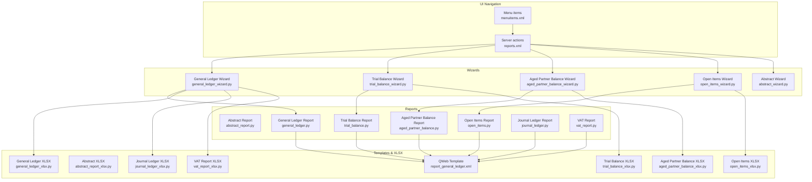
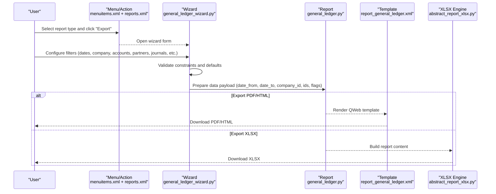
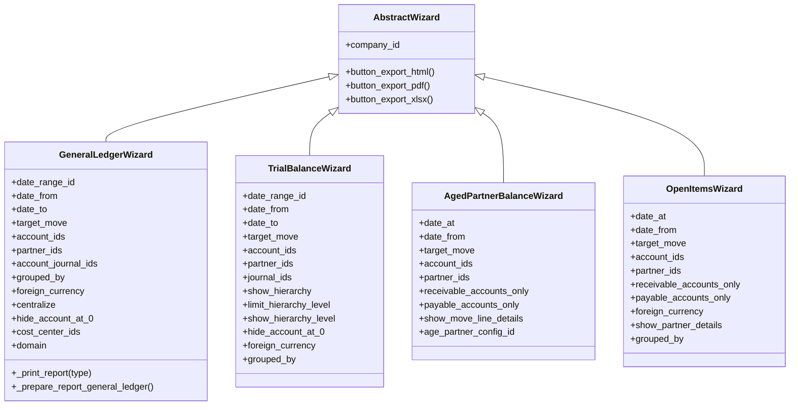
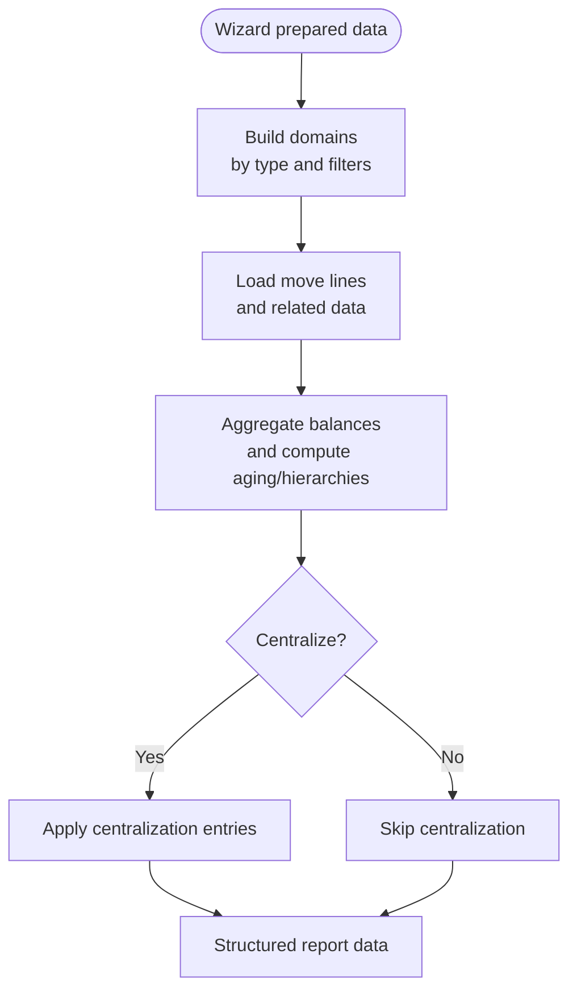
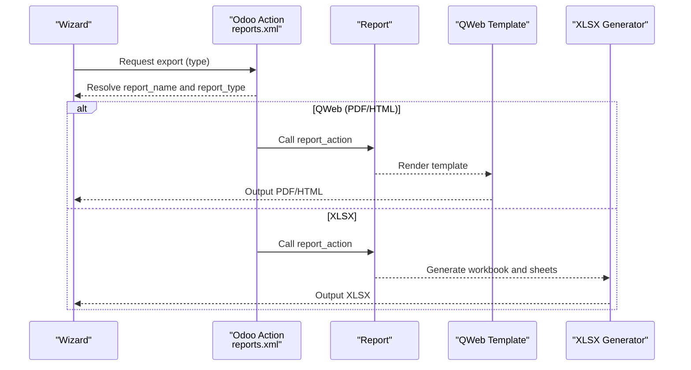
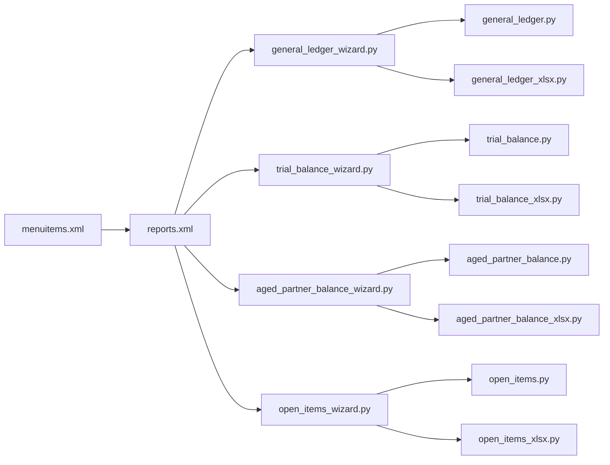

# Report Generation Workflow

<cite>
**Referenced Files in This Document**
- [__manifest__.py](file://__manifest__.py)
- [menuitems.xml](file://menuitems.xml)
- [reports.xml](file://reports.xml)
- [static/src/xml/report.xml](file://static/src/xml/report.xml)
- [wizard/abstract_wizard.py](file://wizard/abstract_wizard.py)
- [wizard/general_ledger_wizard.py](file://wizard/general_ledger_wizard.py)
- [wizard/trial_balance_wizard.py](file://wizard/trial_balance_wizard.py)
- [wizard/aged_partner_balance_wizard.py](file://wizard/aged_partner_balance_wizard.py)
- [wizard/open_items_wizard.py](file://wizard/open_items_wizard.py)
- [report/abstract_report.py](file://report/abstract_report.py)
- [report/general_ledger.py](file://report/general_ledger.py)
- [report/trial_balance.py](file://report/trial_balance.py)
- [report/aged_partner_balance.py](file://report/aged_partner_balance.py)
- [report/open_items.py](file://report/open_items.py)
- [report/abstract_report_xlsx.py](file://report/abstract_report_xlsx.py)
- [report/general_ledger_xlsx.py](file://report/general_ledger_xlsx.py)
- [report/trial_balance_xlsx.py](file://report/trial_balance_xlsx.py)
- [report/aged_partner_balance_xlsx.py](file://report/aged_partner_balance_xlsx.py)
- [report/open_items_xlsx.py](file://report/open_items_xlsx.py)
- [report/vat_report.py](file://report/vat_report.py)
- [report/vat_report_xlsx.py](file://report/vat_report_xlsx.py)
- [report/journal_ledger.py](file://report/journal_ledger.py)
- [report/journal_ledger_xlsx.py](file://report/journal_ledger_xlsx.py)
- [view/report_general_ledger.xml](file://view/report_general_ledger.xml)
</cite>

## Table of Contents
1. [Introduction](#introduction)
2. [Project Structure](#project-structure)
3. [Core Components](#core-components)
4. [Architecture Overview](#architecture-overview)
5. [Detailed Component Analysis](#detailed-component-analysis)
6. [Dependency Analysis](#dependency-analysis)
7. [Performance Considerations](#performance-considerations)
8. [Troubleshooting Guide](#troubleshooting-guide)
9. [Conclusion](#conclusion)
10. [Appendices](#appendices)

## Introduction
This document explains the universal report generation workflow shared across all financial reports in the module. It covers the three-phase process:
1) Wizard configuration: users set report parameters and filters.
2) Data processing: the system validates inputs and prepares report data.
3) Report generation: the final output is produced in the selected format (PDF, HTML, XLSX).

It also explains how to navigate between different report types, understand common configuration options (date ranges, companies, currencies), preview reports before final generation, and provides troubleshooting tips and best practices.

## Project Structure
The module organizes functionality by concerns:
- Wizards: user-facing forms that collect parameters and trigger report generation.
- Reports: backend logic that computes and formats data.
- Templates: QWeb views for PDF/HTML rendering.
- XLSX: Excel export via report_xlsx.
- XML actions: Odoo server-side actions that bind wizards to report templates.

**Diagram sources**
- [menuitems.xml:1-46](file://menuitems.xml#L1-L46)
- [reports.xml:1-174](file://reports.xml#L1-L174)
- [wizard/abstract_wizard.py:1-52](file://wizard/abstract_wizard.py#L1-L52)
- [wizard/general_ledger_wizard.py:1-322](file://wizard/general_ledger_wizard.py#L1-L322)
- [wizard/trial_balance_wizard.py:1-200](file://wizard/trial_balance_wizard.py#L1-L200)
- [wizard/aged_partner_balance_wizard.py:1-154](file://wizard/aged_partner_balance_wizard.py#L1-L154)
- [wizard/open_items_wizard.py:1-190](file://wizard/open_items_wizard.py#L1-L190)
- [report/abstract_report.py:1-165](file://report/abstract_report.py#L1-L165)
- [report/general_ledger.py:1-931](file://report/general_ledger.py#L1-L931)
- [report/trial_balance.py:1-981](file://report/trial_balance.py#L1-L981)
- [report/aged_partner_balance.py:1-473](file://report/aged_partner_balance.py#L1-L473)
- [report/open_items.py](file://report/open_items.py)
- [report/journal_ledger.py](file://report/journal_ledger.py)
- [report/vat_report.py](file://report/vat_report.py)
- [report/abstract_report_xlsx.py:1-698](file://report/abstract_report_xlsx.py#L1-L698)
- [report/general_ledger_xlsx.py](file://report/general_ledger_xlsx.py)
- [report/trial_balance_xlsx.py](file://report/trial_balance_xlsx.py)
- [report/aged_partner_balance_xlsx.py](file://report/aged_partner_balance_xlsx.py)
- [report/open_items_xlsx.py](file://report/open_items_xlsx.py)
- [report/journal_ledger_xlsx.py](file://report/journal_ledger_xlsx.py)
- [report/vat_report_xlsx.py](file://report/vat_report_xlsx.py)
- [view/report_general_ledger.xml:1-10](file://view/report_general_ledger.xml#L1-L10)

**Section sources**
- [__manifest__.py:1-58](file://__manifest__.py#L1-L58)
- [menuitems.xml:1-46](file://menuitems.xml#L1-L46)
- [reports.xml:1-174](file://reports.xml#L1-L174)

## Core Components
- Abstract Wizard: Provides shared fields and export handlers (HTML, PDF, XLSX) for all report wizards.
- Report Abstract Model: Supplies common move line domain builders, residual recalculations, and shared data loaders.
- Report Implementations: Specialize data retrieval and grouping per report type.
- XLSX Generator: Standardized Excel export pipeline with reusable formatting and layout helpers.
- Odoo Actions: Bind wizards to report templates and formats.

Key responsibilities:
- Wizard configuration: Collects company, date range, target moves, accounts/partners/journals/filters, and export format.
- Data processing: Validates inputs, builds domains, loads move lines, aggregates balances, and prepares structured data.
- Report generation: Renders QWeb PDF/HTML or generates XLSX using standardized column definitions and formats.

**Section sources**
- [wizard/abstract_wizard.py:1-52](file://wizard/abstract_wizard.py#L1-L52)
- [report/abstract_report.py:1-165](file://report/abstract_report.py#L1-L165)
- [report/abstract_report_xlsx.py:1-698](file://report/abstract_report_xlsx.py#L1-L698)

## Architecture Overview
The universal workflow is consistent across report types:

**Diagram sources**
- [menuitems.xml:1-46](file://menuitems.xml#L1-L46)
- [reports.xml:1-174](file://reports.xml#L1-L174)
- [wizard/general_ledger_wizard.py:274-322](file://wizard/general_ledger_wizard.py#L274-L322)
- [report/general_ledger.py:763-800](file://report/general_ledger.py#L763-L800)
- [view/report_general_ledger.xml:1-10](file://view/report_general_ledger.xml#L1-L10)
- [report/abstract_report_xlsx.py:18-42](file://report/abstract_report_xlsx.py#L18-L42)

## Detailed Component Analysis

### Wizard Configuration Phase
- Shared fields and behaviors:
  - Company selection and domain scoping.
  - Date range and individual date fields with fiscal year computation.
  - Target moves (posted vs all).
  - Filters: accounts, partners, journals, analytic accounts, custom domain.
  - Export buttons: HTML, PDF, XLSX.
- Type-specific fields:
  - General Ledger: grouping by partners/taxes, centralization, foreign currency, hide at 0, unaffected earnings account, cost centers.
  - Trial Balance: hierarchy options, grouping by analytic account, show partner details.
  - Aged Partner Balance: single date “at” and optional from date, intervals configuration.
  - Open Items: “at” date, grouping by partners/salesperson, foreign currency, show details.
- Validation and constraints:
  - Company/date range consistency checks.
  - Domain scoping per company for related records.
  - Fiscal year boundary computation.

**Diagram sources**
- [wizard/abstract_wizard.py:1-52](file://wizard/abstract_wizard.py#L1-L52)
- [wizard/general_ledger_wizard.py:1-322](file://wizard/general_ledger_wizard.py#L1-L322)
- [wizard/trial_balance_wizard.py:1-200](file://wizard/trial_balance_wizard.py#L1-L200)
- [wizard/aged_partner_balance_wizard.py:1-154](file://wizard/aged_partner_balance_wizard.py#L1-L154)
- [wizard/open_items_wizard.py:1-190](file://wizard/open_items_wizard.py#L1-L190)

**Section sources**
- [wizard/abstract_wizard.py:1-52](file://wizard/abstract_wizard.py#L1-L52)
- [wizard/general_ledger_wizard.py:1-322](file://wizard/general_ledger_wizard.py#L1-L322)
- [wizard/trial_balance_wizard.py:1-200](file://wizard/trial_balance_wizard.py#L1-L200)
- [wizard/aged_partner_balance_wizard.py:1-154](file://wizard/aged_partner_balance_wizard.py#L1-L154)
- [wizard/open_items_wizard.py:1-190](file://wizard/open_items_wizard.py#L1-L190)

### Data Processing Phase
- Abstract report utilities:
  - Move line domain builders for initial/fiscal-year balances and period data.
  - Recalculation of residual amounts considering future reconciliations.
  - Shared fields for move lines and data loaders for accounts/journals/taxes/analytics.
- Report-specific processors:
  - General Ledger: reads initial balances, aggregates by account/partner/tax, computes cumulative balances, centralizes entries if requested.
  - Trial Balance: constructs initial and period domains, supports hierarchy and analytic grouping.
  - Aged Partner Balance: computes aging buckets based on configured intervals and due dates.
  - Open Items: lists unreconciled items up to a cut-off date, optionally grouped by partner or salesperson.
  - Journal Ledger and VAT Report: similar preparation pipeline specialized for their structures.

**Diagram sources**
- [report/abstract_report.py:21-165](file://report/abstract_report.py#L21-L165)
- [report/general_ledger.py:763-800](file://report/general_ledger.py#L763-L800)
- [report/trial_balance.py:17-173](file://report/trial_balance.py#L17-L173)
- [report/aged_partner_balance.py:17-200](file://report/aged_partner_balance.py#L17-L200)
- [report/open_items.py](file://report/open_items.py)

**Section sources**
- [report/abstract_report.py:1-165](file://report/abstract_report.py#L1-L165)
- [report/general_ledger.py:763-800](file://report/general_ledger.py#L763-L800)
- [report/trial_balance.py:1-200](file://report/trial_balance.py#L1-L200)
- [report/aged_partner_balance.py:1-200](file://report/aged_partner_balance.py#L1-L200)
- [report/open_items.py](file://report/open_items.py)

### Report Generation Phase
- PDF/HTML:
  - Actions defined in XML bind wizards to QWeb templates.
  - Templates render the final output with report headers, filters, and data tables.
- XLSX:
  - Abstract XLSX defines workbook creation, formats, column widths, and content writing helpers.
  - Each report’s XLSX module implements column definitions, filters, and content generation.

**Diagram sources**
- [reports.xml:20-174](file://reports.xml#L20-L174)
- [report/abstract_report_xlsx.py:18-42](file://report/abstract_report_xlsx.py#L18-L42)
- [view/report_general_ledger.xml:1-10](file://view/report_general_ledger.xml#L1-L10)

**Section sources**
- [reports.xml:1-174](file://reports.xml#L1-L174)
- [report/abstract_report_xlsx.py:1-698](file://report/abstract_report_xlsx.py#L1-L698)
- [view/report_general_ledger.xml:1-10](file://view/report_general_ledger.xml#L1-L10)

## Dependency Analysis
- Navigation and binding:
  - Menu items under the Finance Reports menu point to actions.
  - Actions declare report_name/report_type and link to templates or XLSX generators.
- Wizard-to-Report coupling:
  - Wizards prepare a data dictionary passed to report models.
  - Reports inherit shared utilities to build domains and load data.
- XLSX pipeline:
  - Abstract XLSX defines workbook and formatting; report-specific XLSX modules implement columns and content.

**Diagram sources**
- [menuitems.xml:1-46](file://menuitems.xml#L1-L46)
- [reports.xml:1-174](file://reports.xml#L1-L174)
- [wizard/general_ledger_wizard.py:274-322](file://wizard/general_ledger_wizard.py#L274-L322)
- [wizard/trial_balance_wizard.py:1-200](file://wizard/trial_balance_wizard.py#L1-L200)
- [wizard/aged_partner_balance_wizard.py:1-154](file://wizard/aged_partner_balance_wizard.py#L1-L154)
- [wizard/open_items_wizard.py:1-190](file://wizard/open_items_wizard.py#L1-L190)
- [report/general_ledger.py:763-800](file://report/general_ledger.py#L763-L800)
- [report/trial_balance.py:1-200](file://report/trial_balance.py#L1-L200)
- [report/aged_partner_balance.py:1-200](file://report/aged_partner_balance.py#L1-L200)
- [report/open_items.py](file://report/open_items.py)
- [report/general_ledger_xlsx.py](file://report/general_ledger_xlsx.py)
- [report/trial_balance_xlsx.py](file://report/trial_balance_xlsx.py)
- [report/aged_partner_balance_xlsx.py](file://report/aged_partner_balance_xlsx.py)
- [report/open_items_xlsx.py](file://report/open_items_xlsx.py)

**Section sources**
- [menuitems.xml:1-46](file://menuitems.xml#L1-L46)
- [reports.xml:1-174](file://reports.xml#L1-L174)

## Performance Considerations
- Domain filtering: Use precise filters (company, accounts, journals, partners) to minimize dataset size.
- Grouping: Prefer grouping by fewer categories (e.g., accounts only) when not needed to reduce aggregation overhead.
- Centralization: Enable only when required; it adds extra computation for monthly aggregations.
- Foreign currency: Enabling foreign currency increases data volume and formatting complexity; disable if not needed.
- XLSX memory: The abstract XLSX sets constant memory mode to handle large datasets efficiently.

[No sources needed since this section provides general guidance]

## Troubleshooting Guide
Common configuration errors and resolutions:
- Company mismatch with date range:
  - Symptom: Validation error when selecting a date range from another company.
  - Resolution: Ensure the wizard’s company matches the date range’s company.
  - Section sources
    - [wizard/general_ledger_wizard.py:218-232](file://wizard/general_ledger_wizard.py#L218-L232)
    - [wizard/trial_balance_wizard.py:185-199](file://wizard/trial_balance_wizard.py#L185-L199)

- Invalid account range:
  - Symptom: No accounts loaded after setting start/end codes.
  - Resolution: Verify both start and end codes are numeric and within the company’s chart of accounts.
  - Section sources
    - [wizard/general_ledger_wizard.py:97-111](file://wizard/general_ledger_wizard.py#L97-L111)
    - [wizard/open_items_wizard.py:67-93](file://wizard/open_items_wizard.py#L67-L93)
    - [wizard/aged_partner_balance_wizard.py:47-73](file://wizard/aged_partner_balance_wizard.py#L47-L73)

- Hierarchy level constraint:
  - Symptom: Error when hierarchy is enabled but level is not set.
  - Resolution: Set a positive hierarchy level when enabling hierarchy.
  - Section sources
    - [wizard/trial_balance_wizard.py:99-108](file://wizard/trial_balance_wizard.py#L99-L108)

- Reconciliation adjustments:
  - Symptom: Aging or residual balances appear incorrect around cutoff dates.
  - Resolution: Ensure the “at” date and posted-only mode align with expectations; future reconciliations are considered in calculations.
  - Section sources
    - [report/aged_partner_balance.py:143-200](file://report/aged_partner_balance.py#L143-L200)
    - [report/abstract_report.py:57-124](file://report/abstract_report.py#L57-L124)

- Export format not available:
  - Symptom: XLSX export fails or opens blank.
  - Resolution: Confirm the report action exists for the selected report type and that the report_xlsx dependency is installed.
  - Section sources
    - [reports.xml:124-174](file://reports.xml#L124-L174)
    - [__manifest__.py:18](file://__manifest__.py#L18)

Best practices:
- Always set a company and date range before generating reports.
- Use “Posted Entries” unless you need draft entries for review.
- Narrow filters early to improve performance and readability.
- Preview PDF/HTML before exporting XLSX for large datasets.

**Section sources**
- [wizard/general_ledger_wizard.py:218-232](file://wizard/general_ledger_wizard.py#L218-L232)
- [wizard/trial_balance_wizard.py:99-108](file://wizard/trial_balance_wizard.py#L99-L108)
- [wizard/trial_balance_wizard.py:185-199](file://wizard/trial_balance_wizard.py#L185-L199)
- [wizard/aged_partner_balance_wizard.py:47-73](file://wizard/aged_partner_balance_wizard.py#L47-L73)
- [wizard/open_items_wizard.py:67-93](file://wizard/open_items_wizard.py#L67-L93)
- [report/abstract_report.py:57-124](file://report/abstract_report.py#L57-L124)
- [reports.xml:124-174](file://reports.xml#L124-L174)
- [__manifest__.py:18](file://__manifest__.py#L18)

## Conclusion
The module implements a consistent, extensible report generation workflow across financial reports. Users configure parameters via wizards, the system validates inputs and prepares data, and outputs are generated in PDF, HTML, or XLSX. By understanding the shared components and report-specific behaviors, users can efficiently navigate between report types, apply appropriate filters, preview outputs, and troubleshoot common configuration issues.

[No sources needed since this section summarizes without analyzing specific files]

## Appendices

### Navigating Between Report Types
- Use the Finance Reports menu to open each wizard.
- Each wizard exposes a subset of common and type-specific filters.
- After configuring, choose Export to PDF/HTML/XLSX.

**Section sources**
- [menuitems.xml:1-46](file://menuitems.xml#L1-L46)

### Common Configuration Options
- Company: Filters all downstream selections (accounts, journals, partners).
- Date Range: Either a date range or individual from/to dates; fiscal year computed automatically.
- Target Moves: Posted vs All entries.
- Accounts: Explicit selection or range by code; some reports restrict to reconcilable accounts.
- Partners/Journals/Cost Centers: Optional filters to narrow results.
- Grouping: By partners, taxes, analytic account, or none.
- Foreign Currency: Toggle to display currency columns.
- Centralization: Consolidate monthly entries for General Ledger.

**Section sources**
- [wizard/general_ledger_wizard.py:25-92](file://wizard/general_ledger_wizard.py#L25-L92)
- [wizard/trial_balance_wizard.py:19-74](file://wizard/trial_balance_wizard.py#L19-L74)
- [wizard/aged_partner_balance_wizard.py:16-46](file://wizard/aged_partner_balance_wizard.py#L16-L46)
- [wizard/open_items_wizard.py:16-66](file://wizard/open_items_wizard.py#L16-L66)

### Previewing Reports
- Use the Export button to generate PDF/HTML previews directly from the wizard.
- For XLSX, confirm the workbook opens with expected columns and filters.

**Section sources**
- [wizard/abstract_wizard.py:38-52](file://wizard/abstract_wizard.py#L38-L52)
- [reports.xml:20-122](file://reports.xml#L20-L122)
- [static/src/xml/report.xml:1-19](file://static/src/xml/report.xml#L1-L19)