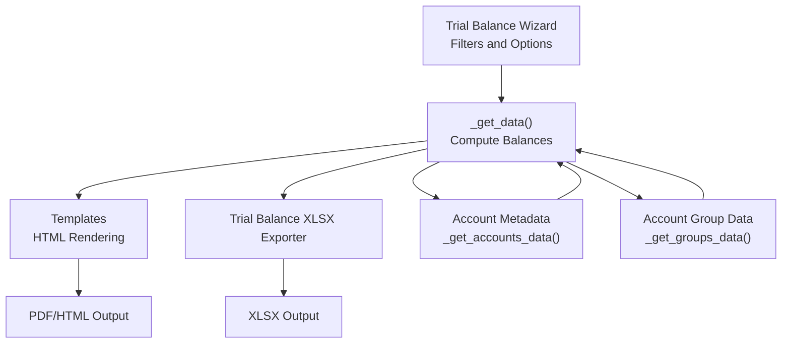
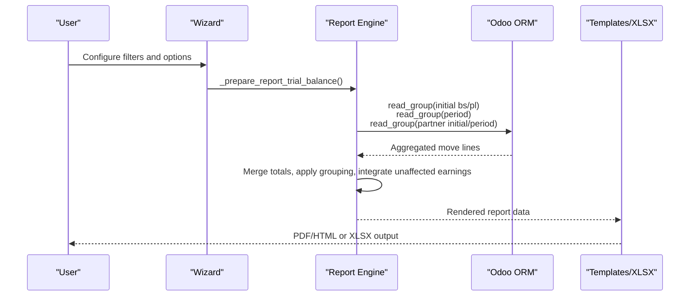
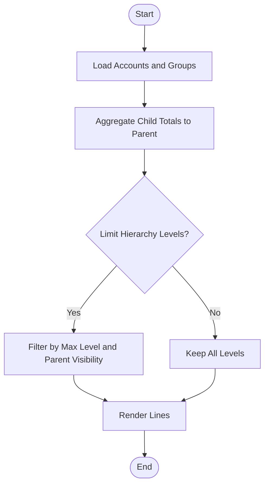
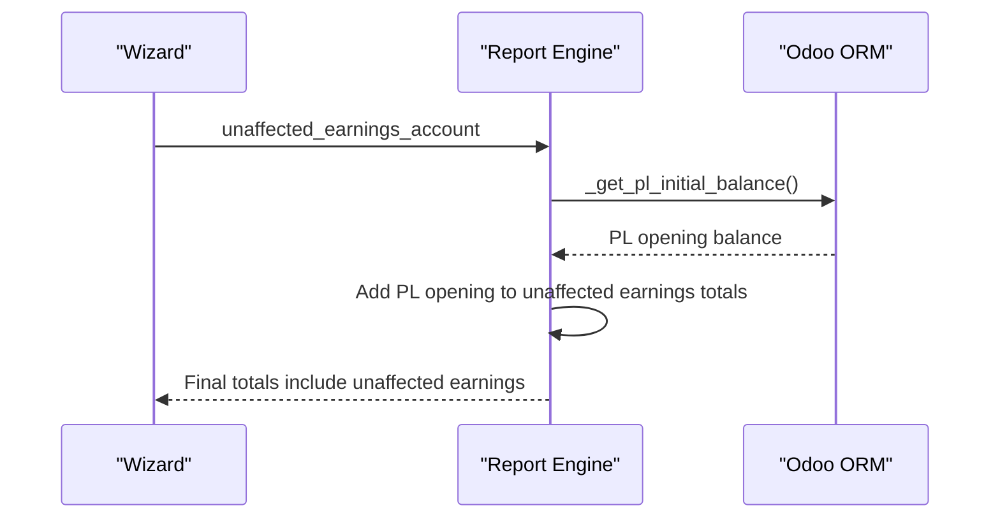
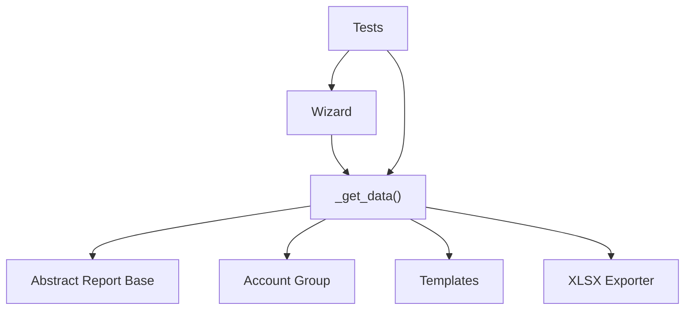

# Trial Balance Report

<cite>
**Referenced Files in This Document**
- [trial_balance.py](file://report/trial_balance.py)
- [trial_balance_wizard.py](file://wizard/trial_balance_wizard.py)
- [trial_balance_wizard_view.xml](file://wizard/trial_balance_wizard_view.xml)
- [trial_balance.xml](file://report/templates/trial_balance.xml)
- [trial_balance_xlsx.py](file://report/trial_balance_xlsx.py)
- [abstract_report.py](file://report/abstract_report.py)
- [account_group.py](file://models/account_group.py)
- [test_trial_balance.py](file://tests/test_trial_balance.py)
- [README.rst](file://README.rst)
</cite>

## Table of Contents
1. [Introduction](#introduction)
2. [Project Structure](#project-structure)
3. [Core Components](#core-components)
4. [Architecture Overview](#architecture-overview)
5. [Detailed Component Analysis](#detailed-component-analysis)
6. [Dependency Analysis](#dependency-analysis)
7. [Performance Considerations](#performance-considerations)
8. [Troubleshooting Guide](#troubleshooting-guide)
9. [Conclusion](#conclusion)
10. [Appendices](#appendices)

## Introduction
The Trial Balance Report provides a comprehensive snapshot of account balances over a specified period, including initial and ending balances, debits, credits, and optional foreign currency columns. It supports hierarchical grouping via account groups, filtering by partners, analytical grouping, and the special treatment of the “unaffected earnings” equity account. This document explains how to configure account hierarchy levels, how the report aggregates child balances to parents, how unaffected earnings are integrated, and how to choose between showing all accounts or only those with activity.

## Project Structure
The Trial Balance implementation spans wizard-driven configuration, backend computation, templated rendering, and Excel export. Key areas:
- Wizard and views: user-configurable filters and options
- Report engine: computes balances, applies grouping, and prepares totals
- Templates: HTML rendering for PDF and web views
- Excel exporter: structured XLSX output
- Shared base: common report utilities and account metadata retrieval

**Diagram sources**
- [trial_balance_wizard.py:12-285](file://wizard/trial_balance_wizard.py#L12-L285)
- [trial_balance.py:406-622](file://report/trial_balance.py#L406-L622)
- [trial_balance.xml:1-179](file://report/templates/trial_balance.xml#L1-L179)
- [trial_balance_xlsx.py:10-324](file://report/trial_balance_xlsx.py#L10-L324)
- [abstract_report.py:125-143](file://report/abstract_report.py#L125-L143)
- [account_group.py:8-109](file://models/account_group.py#L8-L109)

**Section sources**
- [trial_balance_wizard.py:12-285](file://wizard/trial_balance_wizard.py#L12-L285)
- [trial_balance.py:406-622](file://report/trial_balance.py#L406-L622)
- [trial_balance.xml:1-179](file://report/templates/trial_balance.xml#L1-L179)
- [trial_balance_xlsx.py:10-324](file://report/trial_balance_xlsx.py#L10-L324)
- [abstract_report.py:125-143](file://report/abstract_report.py#L125-L143)
- [account_group.py:8-109](file://models/account_group.py#L8-L109)

## Core Components
- Trial Balance Wizard: collects filters (date range, journals, partners, accounts), target moves, hierarchy options, and grouping preferences. It also computes the fiscal year start date and validates the presence of a single unaffected earnings account per company.
- Report Engine: builds domains for initial and period move lines, reads grouped balances, merges initial and period data, optionally groups by analytical accounts, and integrates the unaffected earnings account into totals.
- Templates: render either flat account lines or grouped-by-analytical-account sections, with optional partner detail rows.
- Excel Exporter: mirrors the template structure and writes totals and footers consistently.
- Shared Base: provides common move-line fields and account metadata retrieval.

Key configuration options:
- Date range and target moves (posted vs all)
- Hide accounts at zero
- Show foreign currency
- Show hierarchy and hierarchy level limits
- Group by analytical account
- Show partner details (mutually exclusive with certain grouping)
- Filters for accounts, journals, and partners

**Section sources**
- [trial_balance_wizard.py:19-74](file://wizard/trial_balance_wizard.py#L19-L74)
- [trial_balance_wizard_view.xml:17-110](file://wizard/trial_balance_wizard_view.xml#L17-L110)
- [trial_balance.py:406-622](file://report/trial_balance.py#L406-L622)
- [trial_balance.xml:180-179](file://report/templates/trial_balance.xml#L180-L179)
- [trial_balance_xlsx.py:24-156](file://report/trial_balance_xlsx.py#L24-L156)
- [abstract_report.py:125-143](file://report/abstract_report.py#L125-L143)

## Architecture Overview
The Trial Balance pipeline:
1. Wizard prepares a data payload with filters and options.
2. Report engine computes:
   - Initial balances (before the reporting period) split into balance sheet and profit-and-loss components
   - Period balances (within the reporting window)
   - Optional partner-detail aggregation
   - Optional analytical-account grouping
   - Integration of the unaffected earnings account into totals
3. Templates render the report with appropriate grouping and totals.
4. Excel exporter produces a structured spreadsheet.

**Diagram sources**
- [trial_balance_wizard.py:258-280](file://wizard/trial_balance_wizard.py#L258-L280)
- [trial_balance.py:438-622](file://report/trial_balance.py#L438-L622)
- [trial_balance.xml:39-179](file://report/templates/trial_balance.xml#L39-L179)
- [trial_balance_xlsx.py:164-267](file://report/trial_balance_xlsx.py#L164-L267)

## Detailed Component Analysis

### Account Hierarchy Levels and Roll-up
- Hierarchical display is controlled by the wizard’s hierarchy options and applied in templates. When enabled, the report can limit visible levels and optionally hide parent levels.
- The report engine constructs group-level totals by aggregating child account balances. It ensures parent groups accumulate child totals across initial, debit, credit, and ending balances, including currency totals when enabled.

**Diagram sources**
- [trial_balance.py:690-745](file://report/trial_balance.py#L690-L745)
- [trial_balance.xml:108-122](file://report/templates/trial_balance.xml#L108-L122)

**Section sources**
- [trial_balance_wizard.py:29-37](file://wizard/trial_balance_wizard.py#L29-L37)
- [trial_balance.py:690-745](file://report/trial_balance.py#L690-L745)
- [trial_balance.xml:108-122](file://report/templates/trial_balance.xml#L108-L122)

### Unaffected Earnings Integration
- The unaffected earnings account is automatically included in the report totals when present. Its initial and ending balances incorporate the profit-and-loss opening balance from prior fiscal years, excluding current-year P&L entries that post to regular income/expense accounts.
- The wizard validates that only one unaffected earnings account exists per company; otherwise, the wizard prevents report generation.

**Diagram sources**
- [trial_balance_wizard.py:53-56](file://wizard/trial_balance_wizard.py#L53-L56)
- [trial_balance.py:174-207](file://report/trial_balance.py#L174-L207)
- [trial_balance.py:584-622](file://report/trial_balance.py#L584-L622)

**Section sources**
- [trial_balance_wizard.py:122-129](file://wizard/trial_balance_wizard.py#L122-L129)
- [trial_balance_wizard.py:226-240](file://wizard/trial_balance_wizard.py#L226-L240)
- [trial_balance.py:584-622](file://report/trial_balance.py#L584-L622)
- [test_trial_balance.py:510-683](file://tests/test_trial_balance.py#L510-L683)

### Showing All Accounts vs Only Those with Activity
- The hide_account_at_0 option removes accounts whose initial balance, debit, credit, and ending balance are all zero. When disabled, all accounts are shown.
- The wizard enforces that if a specific account list is provided, the unaffected earnings account is excluded from automatic inclusion.

**Section sources**
- [trial_balance_wizard.py:41-47](file://wizard/trial_balance_wizard.py#L41-L47)
- [trial_balance.py:426-428](file://report/trial_balance.py#L426-L428)
- [trial_balance.py:495-554](file://report/trial_balance.py#L495-L554)

### Calculating and Displaying Debits, Credits, and Ending Balances
- The report engine computes:
  - Initial balances: before the reporting period (split into balance sheet and profit-and-loss components)
  - Period balances: within the reporting window (debit, credit, and net balance)
  - Ending balances: initial plus period net
- Totals are aggregated per account and optionally per analytical account when grouping is enabled.
- Foreign currency columns are included when the foreign currency option is enabled and the account has a secondary currency configured.

**Section sources**
- [trial_balance.py:174-207](file://report/trial_balance.py#L174-L207)
- [trial_balance.py:498-512](file://report/trial_balance.py#L498-L512)
- [trial_balance.py:624-688](file://report/trial_balance.py#L624-L688)
- [trial_balance.xml:213-249](file://report/templates/trial_balance.xml#L213-L249)
- [trial_balance_xlsx.py:24-127](file://report/trial_balance_xlsx.py#L24-L127)

### Grouping Options and Presentation Impact
- Group by analytical account: The report presents sections per analytical account with a total row and per-account subsections. The wizard disables certain other options (like partner details) when this grouping is selected.
- Partner details: When enabled, the report shows per-partner lines beneath each account; this also restricts other grouping options.
- Hierarchy display: When enabled, groups are rendered with special styling and can be limited to a maximum level with optional parent-level suppression.

**Section sources**
- [trial_balance_wizard.py:71-79](file://wizard/trial_balance_wizard.py#L71-L79)
- [trial_balance_wizard_view.xml:12-16](file://wizard/trial_balance_wizard_view.xml#L12-L16)
- [trial_balance_wizard_view.xml:42-56](file://wizard/trial_balance_wizard_view.xml#L42-L56)
- [trial_balance.xml:41-88](file://report/templates/trial_balance.xml#L41-L88)
- [trial_balance.xml:126-177](file://report/templates/trial_balance.xml#L126-L177)

### Practical Examples: Month-end Closing and Financial Statement Preparation
- Month-end closing:
  - Run the Trial Balance for the month with “All Posted Entries” to capture all posted transactions.
  - Enable “Hide accounts at 0” to focus on accounts with activity.
  - Review ending balances to confirm that debits equal credits across the report.
- Financial statement preparation:
  - Use “Show foreign currency” to reconcile multi-currency accounts.
  - Apply “Group by analytical account” to analyze cost centers or projects.
  - Verify that the unaffected earnings account reflects prior-year retained earnings adjustments and excludes current-year P&L movements posted to regular income/expense accounts.

[No sources needed since this section provides general guidance]

## Dependency Analysis
- The Trial Balance wizard depends on:
  - Fiscal year start computation
  - Domain construction for move lines
  - Validation of a single unaffected earnings account
- The report engine depends on:
  - Abstract report base for shared utilities and account metadata
  - Account groups for hierarchical roll-ups
  - Templates and XLSX exporter for presentation
- Tests validate:
  - Hierarchy roll-up behavior
  - Partner detail aggregation
  - Unaffected earnings integration and totals equality

**Diagram sources**
- [trial_balance_wizard.py:109-120](file://wizard/trial_balance_wizard.py#L109-L120)
- [trial_balance.py:406-622](file://report/trial_balance.py#L406-L622)
- [abstract_report.py:125-143](file://report/abstract_report.py#L125-L143)
- [account_group.py:8-109](file://models/account_group.py#L8-L109)
- [test_trial_balance.py:256-415](file://tests/test_trial_balance.py#L256-L415)

**Section sources**
- [trial_balance_wizard.py:109-120](file://wizard/trial_balance_wizard.py#L109-L120)
- [trial_balance.py:406-622](file://report/trial_balance.py#L406-L622)
- [abstract_report.py:125-143](file://report/abstract_report.py#L125-L143)
- [account_group.py:8-109](file://models/account_group.py#L8-L109)
- [test_trial_balance.py:256-415](file://tests/test_trial_balance.py#L256-L415)

## Performance Considerations
- Using grouped read_group queries reduces database round trips for initial and period balances.
- Limiting hierarchy levels and hiding zero-balance accounts reduces rendering overhead.
- Enabling foreign currency adds extra aggregation fields; use judiciously when not needed.

[No sources needed since this section provides general guidance]

## Troubleshooting Guide
- No unaffected earnings account found: The wizard prevents report generation if more than one unaffected earnings account exists per company. Ensure a single unaffected earnings account is defined.
- Hierarchy structure errors: If group parent-child relationships are inconsistent, the report raises an error during hierarchy roll-up. Verify group structures and codes.
- Unexpected zeros: If “Hide accounts at 0” is enabled, accounts with zero totals are omitted. Disable the option to include all accounts.
- Conflicting options: Enabling “Group by analytical account” disables certain other options (e.g., partner details). Adjust selections accordingly.

**Section sources**
- [trial_balance_wizard.py:122-129](file://wizard/trial_balance_wizard.py#L122-L129)
- [trial_balance.py:702-708](file://report/trial_balance.py#L702-L708)
- [trial_balance_wizard.py:75-79](file://wizard/trial_balance_wizard.py#L75-L79)
- [trial_balance_wizard.py:217-225](file://wizard/trial_balance_wizard.py#L217-L225)

## Conclusion
The Trial Balance Report offers flexible configuration for financial reporting, including hierarchical grouping, analytical grouping, partner detail views, and multi-currency support. Proper configuration of account groups, unaffected earnings handling, and visibility options ensures accurate month-end closing and reliable financial statement preparation.

[No sources needed since this section summarizes without analyzing specific files]

## Appendices

### Appendix A: Configuration Checklist
- Confirm a single unaffected earnings account per company.
- Define account groups with proper parent-child relationships.
- Choose appropriate filters: date range, journals, accounts, and partners.
- Select display options: hierarchy levels, hide-zero accounts, foreign currency, and grouping.

**Section sources**
- [trial_balance_wizard.py:122-129](file://wizard/trial_balance_wizard.py#L122-L129)
- [trial_balance_wizard.py:29-37](file://wizard/trial_balance_wizard.py#L29-L37)
- [trial_balance_wizard.py:41-47](file://wizard/trial_balance_wizard.py#L41-L47)
- [trial_balance_wizard.py:57-62](file://wizard/trial_balance_wizard.py#L57-L62)
- [trial_balance_wizard.py:71-73](file://wizard/trial_balance_wizard.py#L71-L73)

### Appendix B: How Totals Are Verified
- The tests demonstrate that total initial balances, total debits, and total credits sum to zero, and total ending balances sum to zero, validating the correctness of roll-ups and unaffected earnings integration.

**Section sources**
- [test_trial_balance.py:674-683](file://tests/test_trial_balance.py#L674-L683)