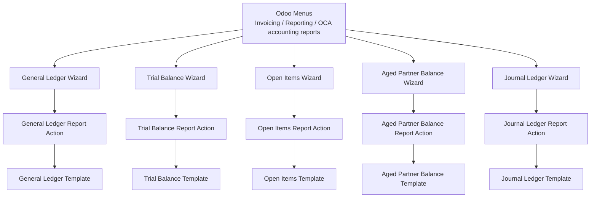
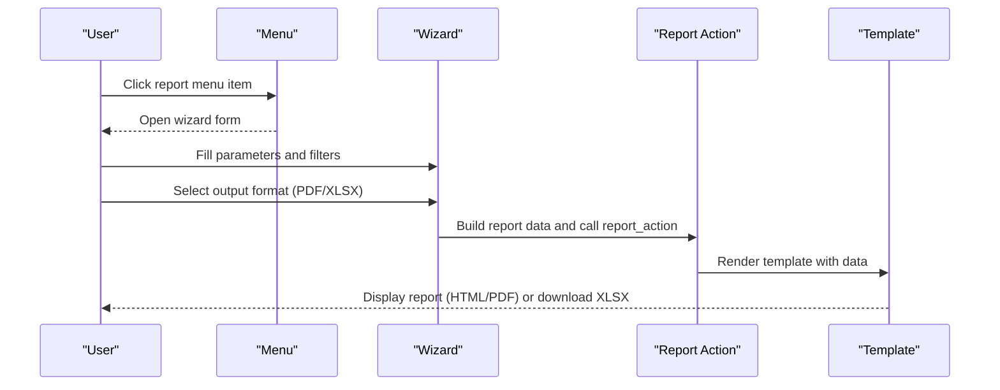
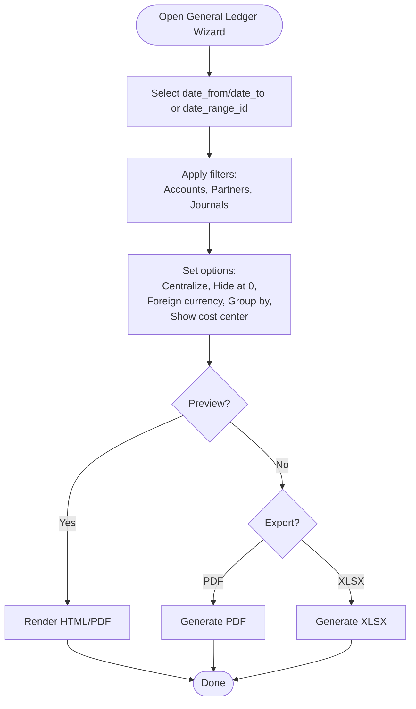
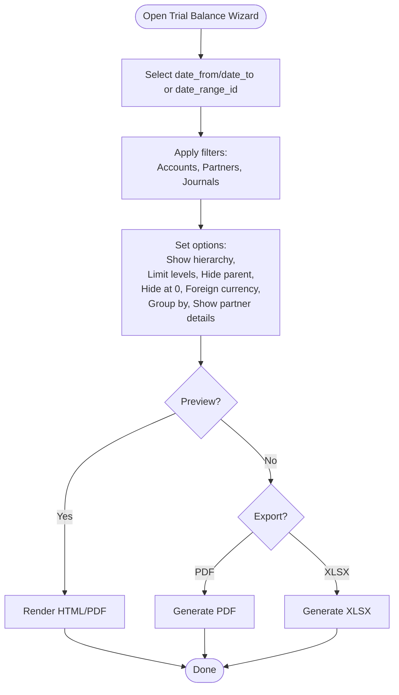
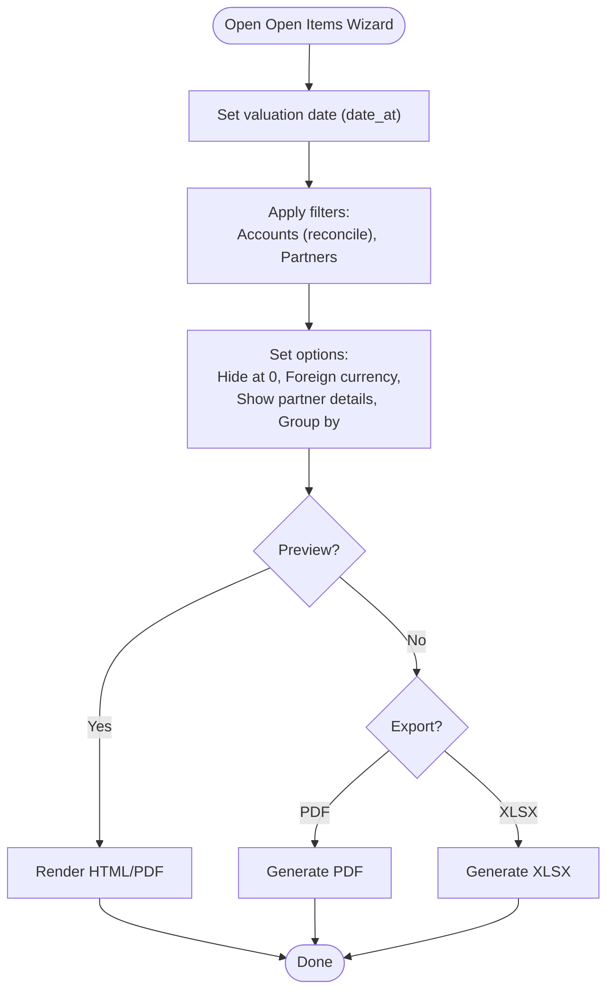
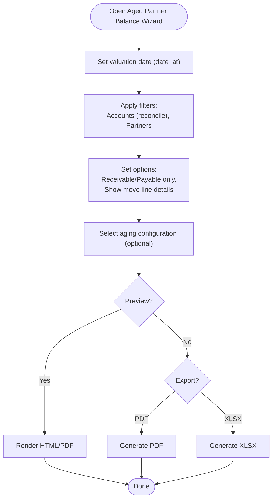
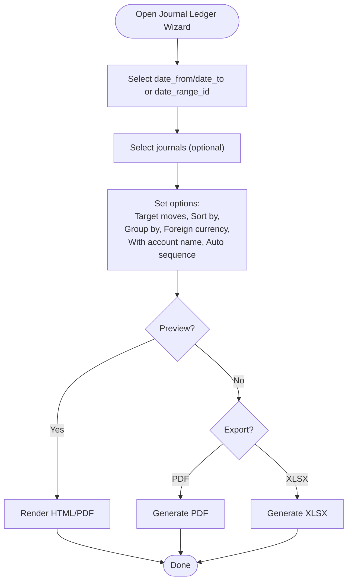
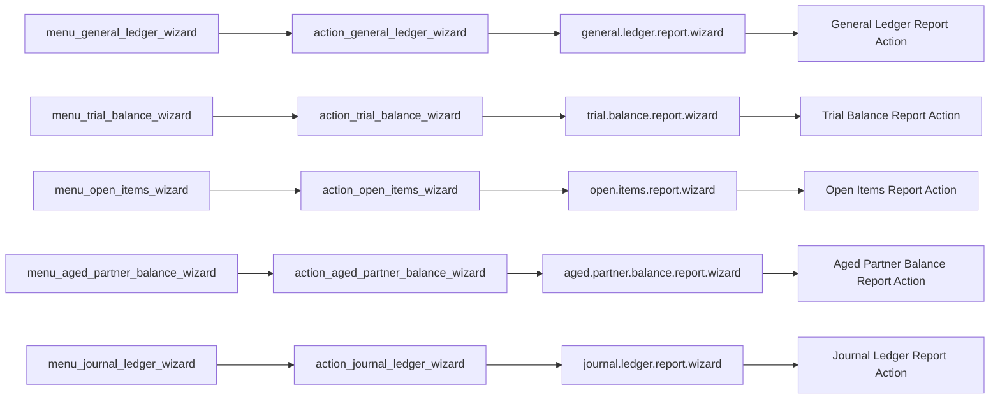

# User Guide

<cite>
**Referenced Files in This Document**
- [__manifest__.py](file://__manifest__.py)
- [README.rst](file://README.rst)
- [menuitems.xml](file://menuitems.xml)
- [abstract_wizard.py](file://wizard/abstract_wizard.py)
- [general_ledger_wizard.py](file://wizard/general_ledger_wizard.py)
- [trial_balance_wizard.py](file://wizard/trial_balance_wizard.py)
- [open_items_wizard.py](file://wizard/open_items_wizard.py)
- [aged_partner_balance_wizard.py](file://wizard/aged_partner_balance_wizard.py)
- [journal_ledger_wizard.py](file://wizard/journal_ledger_wizard.py)
- [abstract_report.py](file://report/abstract_report.py)
- [general_ledger.xml](file://report/templates/general_ledger.xml)
- [trial_balance.xml](file://report/templates/trial_balance.xml)
- [open_items.xml](file://report/templates/open_items.xml)
- [aged_partner_balance.xml](file://report/templates/aged_partner_balance.xml)
- [report_general_ledger.xml](file://view/report_general_ledger.xml)
</cite>

## Table of Contents
1. [Introduction](#introduction)
2. [Project Structure](#project-structure)
3. [Core Components](#core-components)
4. [Architecture Overview](#architecture-overview)
5. [Detailed Component Analysis](#detailed-component-analysis)
6. [Dependency Analysis](#dependency-analysis)
7. [Performance Considerations](#performance-considerations)
8. [Troubleshooting Guide](#troubleshooting-guide)
9. [Conclusion](#conclusion)
10. [Appendices](#appendices)

## Introduction
This user guide explains how to generate financial reports using the wizard-based configuration interface included in the module. It covers navigation between report wizards, configuring parameters, applying filters, and customizing report settings. It also explains advanced features such as multi-currency handling, date range selection, partner filtering, account grouping options, and output format preferences. Finally, it clarifies how wizard configurations relate to final report generation, including preview and customization options.

## Project Structure
The module exposes six financial reports via Odoo menus. Each report has a dedicated wizard model and a wizard view, and each produces HTML and XLSX outputs through a shared report action. The wizard inherits a common abstract wizard to provide shared behaviors such as company scoping, partner defaults, and export actions.

**Diagram sources**
- [menuitems.xml:1-46](file://menuitems.xml#L1-L46)
- [general_ledger_wizard.py:21-23](file://wizard/general_ledger_wizard.py#L21-L23)
- [trial_balance_wizard.py:15-17](file://wizard/trial_balance_wizard.py#L15-L17)
- [open_items_wizard.py:12-14](file://wizard/open_items_wizard.py#L12-L14)
- [aged_partner_balance_wizard.py:12-14](file://wizard/aged_partner_balance_wizard.py#L12-L14)
- [journal_ledger_wizard.py:10-12](file://wizard/journal_ledger_wizard.py#L10-L12)
- [general_ledger.xml:1-11](file://report/templates/general_ledger.xml#L1-L11)
- [trial_balance.xml:1-11](file://report/templates/trial_balance.xml#L1-L11)
- [open_items.xml:1-11](file://report/templates/open_items.xml#L1-L11)
- [aged_partner_balance.xml:1-13](file://report/templates/aged_partner_balance.xml#L1-L13)

**Section sources**
- [menuitems.xml:1-46](file://menuitems.xml#L1-L46)
- [__manifest__.py:19-45](file://__manifest__.py#L19-L45)

## Core Components
- Abstract Wizard: Provides shared fields and behaviors (company, partner defaults, export actions).
- Report Wizards: Specialized wizards for each report type with distinct parameters and filters.
- Report Templates: QWeb templates rendering HTML and XLSX outputs.
- Menus: Central entry points to open each wizard.

Key capabilities:
- Multi-currency display for compatible reports.
- Date range selection via calendar ranges or explicit date fields.
- Partner filtering and grouping options.
- Output format preferences (HTML/PDF, XLSX).
- Preview and customization via template rendering.

**Section sources**
- [abstract_wizard.py:7-52](file://wizard/abstract_wizard.py#L7-L52)
- [general_ledger_wizard.py:18-322](file://wizard/general_ledger_wizard.py#L18-L322)
- [trial_balance_wizard.py:12-285](file://wizard/trial_balance_wizard.py#L12-L285)
- [open_items_wizard.py:9-190](file://wizard/open_items_wizard.py#L9-L190)
- [aged_partner_balance_wizard.py:9-154](file://wizard/aged_partner_balance_wizard.py#L9-L154)
- [journal_ledger_wizard.py:7-162](file://wizard/journal_ledger_wizard.py#L7-L162)
- [abstract_report.py:7-165](file://report/abstract_report.py#L7-L165)

## Architecture Overview
The wizard-to-report flow is consistent across report types:
- Open a wizard from the menu.
- Configure parameters and filters.
- Choose output format (HTML/PDF or XLSX).
- Generate the report via a shared report action.

**Diagram sources**
- [menuitems.xml:1-46](file://menuitems.xml#L1-L46)
- [abstract_wizard.py:38-52](file://wizard/abstract_wizard.py#L38-L52)
- [general_ledger_wizard.py:274-316](file://wizard/general_ledger_wizard.py#L274-L316)
- [trial_balance_wizard.py:242-284](file://wizard/trial_balance_wizard.py#L242-L284)
- [open_items_wizard.py:154-190](file://wizard/open_items_wizard.py#L154-L190)
- [aged_partner_balance_wizard.py:120-154](file://wizard/aged_partner_balance_wizard.py#L120-L154)
- [journal_ledger_wizard.py:80-122](file://wizard/journal_ledger_wizard.py#L80-L122)
- [general_ledger.xml:1-11](file://report/templates/general_ledger.xml#L1-L11)
- [trial_balance.xml:1-11](file://report/templates/trial_balance.xml#L1-L11)
- [open_items.xml:1-11](file://report/templates/open_items.xml#L1-L11)
- [aged_partner_balance.xml:1-13](file://report/templates/aged_partner_balance.xml#L1-L13)

## Detailed Component Analysis

### Wizard Navigation and Entry Points
- Access reports from the menu: Invoicing → Reporting → OCA accounting reports.
- Each report menu item opens the corresponding wizard form.

Practical steps:
- Navigate to the menu.
- Click the desired report menu item to open its wizard.

**Section sources**
- [menuitems.xml:3-44](file://menuitems.xml#L3-L44)

### General Ledger Wizard
Purpose: Produce a detailed list of ledger entries per account and optionally grouped by partner or tax.

Key configuration fields:
- Date range: date_from, date_to, date_range_id.
- Target moves: posted/all.
- Accounts: account_ids or range via account_code_from/account_code_to.
- Partners: partner_ids.
- Journals: account_journal_ids.
- Options: centralize, hide_account_at_0, foreign_currency, grouped_by, show_cost_center, domain, fy_start_date.

Preview and output:
- Use “Preview” to render HTML/PDF.
- Export to XLSX.

Advanced features:
- Multi-currency: foreign_currency toggles per-line currency columns.
- Grouping: grouped_by supports partners/taxes.
- Analytic distribution: show_cost_center displays analytic distributions.

**Diagram sources**
- [general_ledger_wizard.py:25-91](file://wizard/general_ledger_wizard.py#L25-L91)
- [general_ledger_wizard.py:274-316](file://wizard/general_ledger_wizard.py#L274-L316)
- [general_ledger.xml:105-134](file://report/templates/general_ledger.xml#L105-L134)

**Section sources**
- [general_ledger_wizard.py:18-322](file://wizard/general_ledger_wizard.py#L18-L322)
- [general_ledger.xml:1-789](file://report/templates/general_ledger.xml#L1-L789)

### Trial Balance Wizard
Purpose: Show ending account balances with optional hierarchy and partner details.

Key configuration fields:
- Date range: date_from, date_to, date_range_id.
- Target moves: posted/all.
- Accounts: account_ids or range via account_code_from/account_code_to.
- Partners: partner_ids.
- Journals: journal_ids.
- Options: show_hierarchy, limit_hierarchy_level, show_hierarchy_level, hide_parent_hierarchy_level, hide_account_at_0, foreign_currency, grouped_by, show_partner_details.

Preview and output:
- Use “Preview” to render HTML/PDF.
- Export to XLSX.

Advanced features:
- Hierarchy: display grouped accounts with levels and limits.
- Multi-currency: foreign_currency toggles per-line currency columns.
- Partner details: show balances per partner within accounts.

**Diagram sources**
- [trial_balance_wizard.py:19-80](file://wizard/trial_balance_wizard.py#L19-L80)
- [trial_balance_wizard.py:242-284](file://wizard/trial_balance_wizard.py#L242-L284)
- [trial_balance.xml:180-212](file://report/templates/trial_balance.xml#L180-L212)

**Section sources**
- [trial_balance_wizard.py:12-285](file://wizard/trial_balance_wizard.py#L12-L285)
- [trial_balance.xml:1-993](file://report/templates/trial_balance.xml#L1-L993)

### Open Items Wizard
Purpose: List outstanding receivable/payable items per account and partner.

Key configuration fields:
- Date at: date_at (valuation date).
- Target moves: posted/all.
- Accounts: account_ids (filtered to reconcile-enabled).
- Partners: partner_ids.
- Options: hide_account_at_0, foreign_currency, show_partner_details, grouped_by (partners or salesperson).

Preview and output:
- Use “Preview” to render HTML/PDF.
- Export to XLSX.

Advanced features:
- Multi-currency: foreign_currency toggles per-line currency columns.
- Grouping: grouped_by supports partners and salesperson.
- Partner details: show_partner_details aggregates by partner.

**Diagram sources**
- [open_items_wizard.py:16-65](file://wizard/open_items_wizard.py#L16-L65)
- [open_items_wizard.py:154-190](file://wizard/open_items_wizard.py#L154-L190)
- [open_items.xml:213-234](file://report/templates/open_items.xml#L213-L234)

**Section sources**
- [open_items_wizard.py:9-190](file://wizard/open_items_wizard.py#L9-L190)
- [open_items.xml:1-455](file://report/templates/open_items.xml#L1-L455)

### Aged Partner Balance Wizard
Purpose: Show receivables/payables aged by due date bands or custom intervals.

Key configuration fields:
- Date at: date_at (valuation date).
- Target moves: posted/all.
- Accounts: account_ids (filtered to reconcile-enabled).
- Partners: partner_ids.
- Options: receivable_accounts_only, payable_accounts_only, show_move_line_details.
- Aging configuration: age_partner_config_id (dynamic intervals).

Preview and output:
- Use “Preview” to render HTML/PDF.
- Export to XLSX.

Advanced features:
- Dynamic aging bands via age_partner_config_id.
- Move line details: show_move_line_details displays underlying lines.

**Diagram sources**
- [aged_partner_balance_wizard.py:16-45](file://wizard/aged_partner_balance_wizard.py#L16-L45)
- [aged_partner_balance_wizard.py:120-154](file://wizard/aged_partner_balance_wizard.py#L120-L154)
- [aged_partner_balance.xml:92-108](file://report/templates/aged_partner_balance.xml#L92-L108)

**Section sources**
- [aged_partner_balance_wizard.py:9-154](file://wizard/aged_partner_balance_wizard.py#L9-L154)
- [aged_partner_balance.xml:1-812](file://report/templates/aged_partner_balance.xml#L1-L812)

### Journal Ledger Wizard
Purpose: Display posted journal entries with sorting and grouping options.

Key configuration fields:
- Date range: date_from, date_to, date_range_id.
- Journals: journal_ids (optional; empty means all journals in company).
- Target moves: posted/draft/all.
- Options: foreign_currency, sort_option (by entry number or date), group_option (by journal or none), with_account_name, with_auto_sequence.

Preview and output:
- Use “Preview” to render HTML/PDF.
- Export to XLSX.

Advanced features:
- Optional journal filtering.
- Sorting and grouping controls.

**Diagram sources**
- [journal_ledger_wizard.py:14-37](file://wizard/journal_ledger_wizard.py#L14-L37)
- [journal_ledger_wizard.py:80-122](file://wizard/journal_ledger_wizard.py#L80-L122)

**Section sources**
- [journal_ledger_wizard.py:7-162](file://wizard/journal_ledger_wizard.py#L7-L162)

### Abstract Wizard and Shared Behaviors
- Provides company_id defaulting and domain scoping.
- Supplies partner defaults based on active context.
- Exposes export actions for HTML, PDF, and XLSX.

Common fields and helpers:
- company_id
- _default_partners()
- button_export_html/pdf/xlsx()

These methods are reused by all report wizards to ensure consistent export behavior.

**Section sources**
- [abstract_wizard.py:7-52](file://wizard/abstract_wizard.py#L7-L52)

### Report Rendering and Templates
- Each report wizard prepares a data payload and calls the corresponding report action.
- Templates render either HTML/PDF or XLSX depending on the chosen output.
- Some templates include filters display and totals/footer rows.

Highlights:
- General Ledger template shows filters, lines, and cumulative balances; supports foreign currency columns.
- Trial Balance template supports hierarchy, grouping, and partner details; shows totals and currency columns.
- Open Items template supports grouping by partner or salesperson; shows totals and currency columns.
- Aged Partner Balance template supports dynamic aging bands and move line details; shows totals and percentages.
- Journal Ledger template supports sorting and grouping; shows auto sequence and account names.

**Section sources**
- [general_ledger.xml:105-787](file://report/templates/general_ledger.xml#L105-L787)
- [trial_balance.xml:180-753](file://report/templates/trial_balance.xml#L180-L753)
- [open_items.xml:213-453](file://report/templates/open_items.xml#L213-L453)
- [aged_partner_balance.xml:92-812](file://report/templates/aged_partner_balance.xml#L92-L812)
- [report_general_ledger.xml:1-10](file://view/report_general_ledger.xml#L1-L10)

## Dependency Analysis
- Menus depend on actions that open the respective wizards.
- Wizards inherit the abstract wizard to share common logic.
- Report actions are resolved by report_name and report_type.
- Templates are invoked by report actions to render outputs.

**Diagram sources**
- [menuitems.xml:1-46](file://menuitems.xml#L1-L46)
- [general_ledger_wizard.py:274-316](file://wizard/general_ledger_wizard.py#L274-L316)
- [trial_balance_wizard.py:242-284](file://wizard/trial_balance_wizard.py#L242-L284)
- [open_items_wizard.py:154-190](file://wizard/open_items_wizard.py#L154-L190)
- [aged_partner_balance_wizard.py:120-154](file://wizard/aged_partner_balance_wizard.py#L120-L154)
- [journal_ledger_wizard.py:80-122](file://wizard/journal_ledger_wizard.py#L80-L122)

**Section sources**
- [menuitems.xml:1-46](file://menuitems.xml#L1-L46)
- [general_ledger_wizard.py:274-316](file://wizard/general_ledger_wizard.py#L274-L316)
- [trial_balance_wizard.py:242-284](file://wizard/trial_balance_wizard.py#L242-L284)
- [open_items_wizard.py:154-190](file://wizard/open_items_wizard.py#L154-L190)
- [aged_partner_balance_wizard.py:120-154](file://wizard/aged_partner_balance_wizard.py#L120-L154)
- [journal_ledger_wizard.py:80-122](file://wizard/journal_ledger_wizard.py#L80-L122)

## Performance Considerations
- Filtering by company and scoping domains reduces dataset size early.
- Limiting hierarchy levels and hiding zero balances can reduce rendering workload.
- Using XLSX export avoids server-side HTML rendering for large datasets.
- Multi-currency calculations add overhead; enable only when needed.

## Troubleshooting Guide
Common issues and resolutions:
- Company mismatch with date range: Ensure the wizard’s company matches the date range’s company; otherwise reset the date range.
- No journals visible: If no journals are selected, the Journal Ledger wizard will include all company journals; select specific journals to narrow results.
- Reconciled accounts only: Some wizards restrict accounts to reconcile-enabled; confirm filters accordingly.
- Foreign currency availability: Multi-currency columns appear only when accounts have secondary currencies configured.

Where to look:
- Validation constraints and domain computations in each wizard.
- Export method behavior in the abstract wizard.

**Section sources**
- [general_ledger_wizard.py:218-232](file://wizard/general_ledger_wizard.py#L218-L232)
- [journal_ledger_wizard.py:60-78](file://wizard/journal_ledger_wizard.py#L60-L78)
- [open_items_wizard.py:27-29](file://wizard/open_items_wizard.py#L27-L29)
- [abstract_wizard.py:38-52](file://wizard/abstract_wizard.py#L38-L52)

## Conclusion
The wizard-based interface provides a consistent, configurable way to generate financial reports. By leveraging date ranges, filters, grouping, and output preferences, users can tailor reports to their needs. Advanced features like multi-currency, dynamic aging bands, and hierarchy levels enhance analytical depth. The modular architecture ensures predictable behavior across report types, while templates deliver flexible rendering for both HTML/PDF and XLSX outputs.

## Appendices

### Step-by-Step Workflows by Report Type
- General Ledger
  - Open menu: Invoicing → Reporting → OCA accounting reports → General Ledger.
  - Configure: date_from/date_to or date_range_id, target moves, accounts/partners/journals, centralize, hide at 0, foreign currency, grouped_by, show cost center.
  - Preview or export to PDF/XLSX.

- Trial Balance
  - Open menu: Invoicing → Reporting → OCA accounting reports → Trial Balance.
  - Configure: date_from/date_to or date_range_id, target moves, accounts/partners/journals, hierarchy options, hide at 0, foreign currency, grouped_by, show partner details.
  - Preview or export to PDF/XLSX.

- Open Items
  - Open menu: Invoicing → Reporting → OCA accounting reports → Open Items.
  - Configure: date_at, target moves, accounts (reconcile), partners, hide at 0, foreign currency, show partner details, grouped_by.
  - Preview or export to PDF/XLSX.

- Aged Partner Balance
  - Open menu: Invoicing → Reporting → OCA accounting reports → Aged Partner Balance.
  - Configure: date_at, target moves, accounts (reconcile), partners, receivable/payable only, show move line details, aging configuration.
  - Preview or export to PDF/XLSX.

- Journal Ledger
  - Open menu: Invoicing → Reporting → OCA accounting reports → Journal Ledger.
  - Configure: date_from/date_to or date_range_id, journals (optional), target moves, sort/group options, foreign currency, with account name/auto sequence.
  - Preview or export to PDF/XLSX.

### Advanced Features Reference
- Multi-currency handling: Enable foreign_currency in applicable wizards; columns reflect per-line currency balances.
- Date range selection: Use date_range_id or explicit date_from/date_to; fiscal year start computed automatically.
- Partner filtering: Use partner_ids; some wizards auto-enable receivable/payable filters when partners are selected.
- Account grouping: grouped_by options vary by report; Trial Balance supports analytic grouping; General Ledger supports grouping by partners/taxes.
- Output format preferences: Use HTML/PDF or XLSX export buttons; templates render appropriate formats.

**Section sources**
- [README.rst:45-51](file://README.rst#L45-L51)
- [general_ledger_wizard.py:63-69](file://wizard/general_ledger_wizard.py#L63-L69)
- [trial_balance_wizard.py:57-62](file://wizard/trial_balance_wizard.py#L57-L62)
- [open_items_wizard.py:45-51](file://wizard/open_items_wizard.py#L45-L51)
- [journal_ledger_wizard.py:23-37](file://wizard/journal_ledger_wizard.py#L23-L37)
- [aged_partner_balance_wizard.py:32-33](file://wizard/aged_partner_balance_wizard.py#L32-L33)