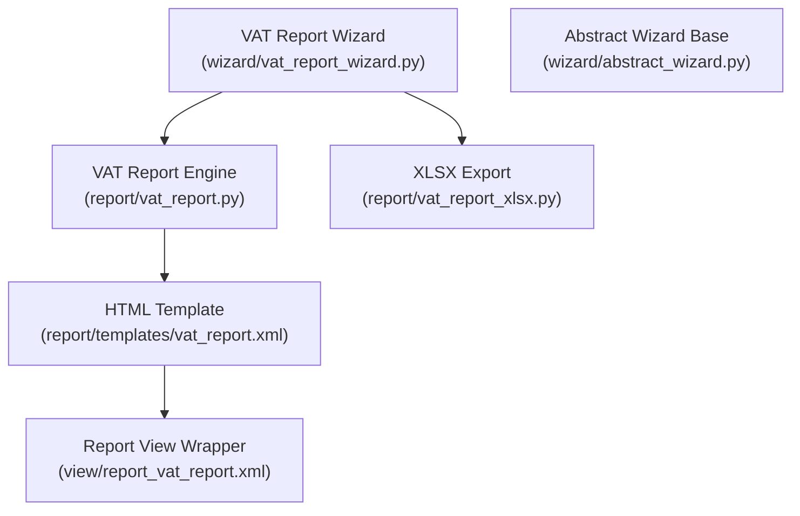
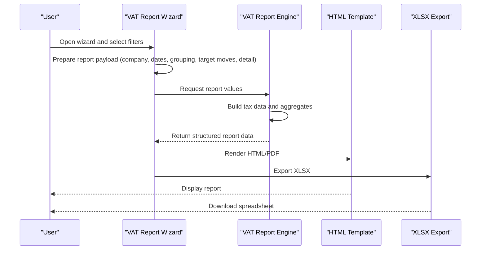
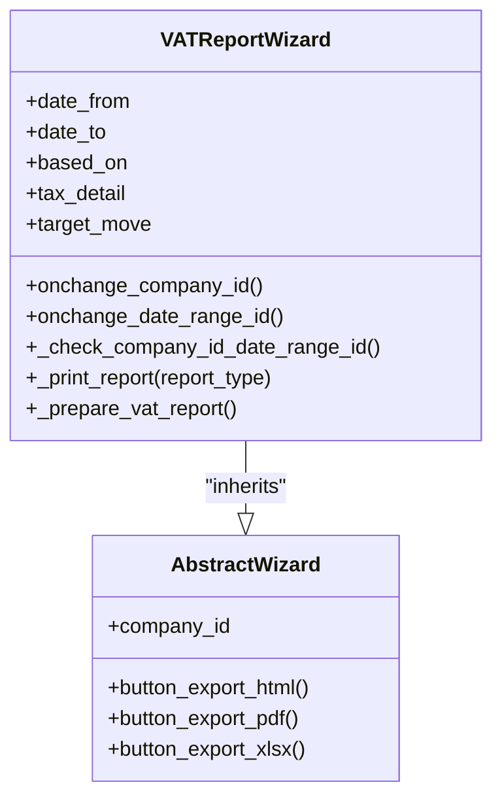
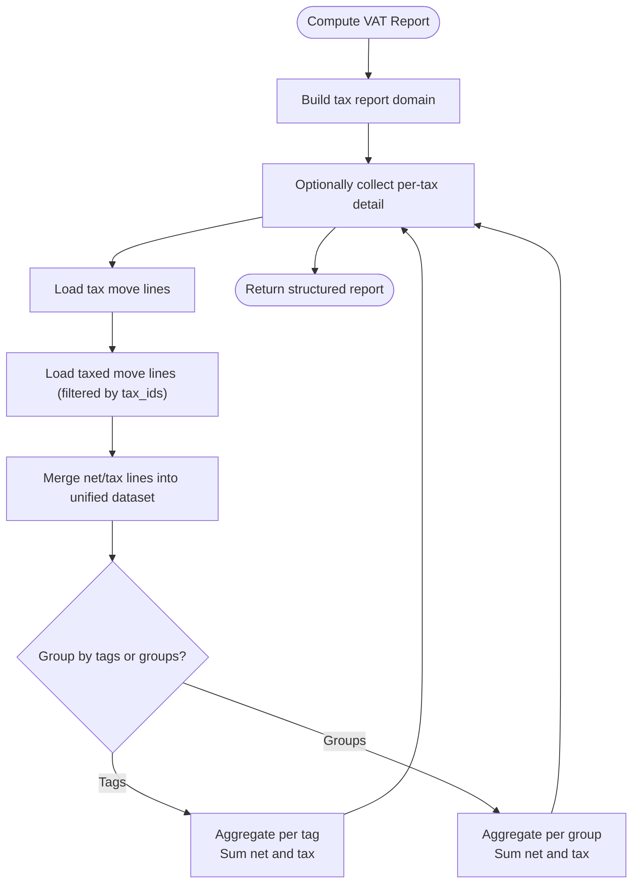
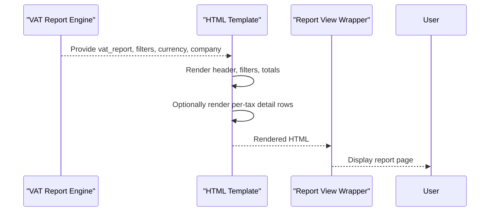
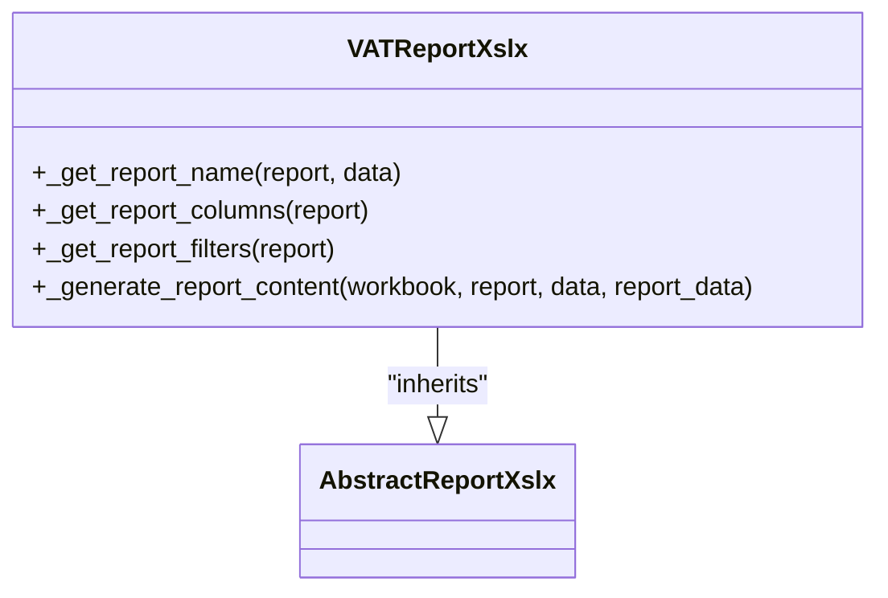
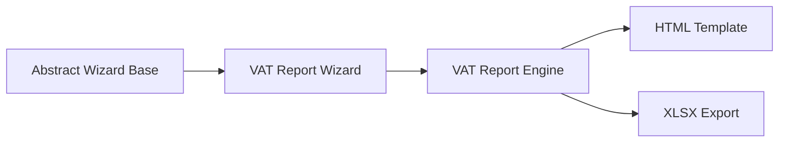
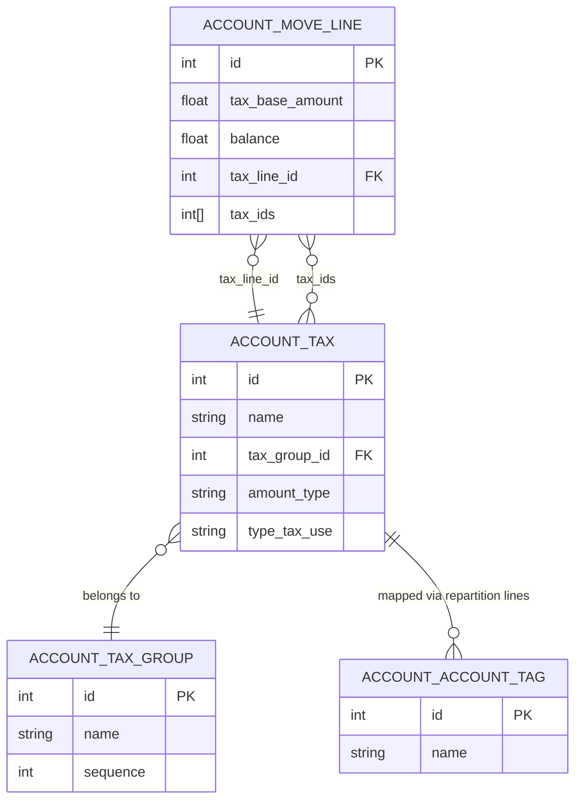

# VAT Report

<cite>
**Referenced Files in This Document**
- [vat_report.py](file://report/vat_report.py)
- [vat_report_xlsx.py](file://report/vat_report_xlsx.py)
- [vat_report_wizard.py](file://wizard/vat_report_wizard.py)
- [vat_report.xml](file://report/templates/vat_report.xml)
- [report_vat_report.xml](file://view/report_vat_report.xml)
- [vat_report_wizard_view.xml](file://wizard/vat_report_wizard_view.xml)
- [abstract_wizard.py](file://wizard/abstract_wizard.py)
- [test_vat_report.py](file://tests/test_vat_report.py)
- [__manifest__.py](file://__manifest__.py)
- [menuitems.xml](file://menuitems.xml)
</cite>

## Table of Contents
1. [Introduction](#introduction)
2. [Project Structure](#project-structure)
3. [Core Components](#core-components)
4. [Architecture Overview](#architecture-overview)
5. [Detailed Component Analysis](#detailed-component-analysis)
6. [Dependency Analysis](#dependency-analysis)
7. [Performance Considerations](#performance-considerations)
8. [Troubleshooting Guide](#troubleshooting-guide)
9. [Conclusion](#conclusion)
10. [Appendices](#appendices)

## Introduction
This document explains how to configure and use the VAT Report for tax calculation, compliance reporting, and regulatory submissions. It covers how the report aggregates tax lines by tax tags or tax groups, how different VAT rates and tax categories are handled, and how to tailor the report for jurisdiction-specific requirements. Practical examples demonstrate filing, audit preparation, and tax analysis scenarios.

## Project Structure
The VAT Report feature spans wizard-driven configuration, backend report computation, templated HTML/PDF rendering, and XLSX export. The key modules are:
- Wizard: collects user selections (date range, company, grouping basis, target moves, detail toggle)
- Report engine: computes net and tax totals grouped by tags or groups
- Templates: render the report in HTML/PDF and define filters
- Export: XLSX export with standardized columns

**Diagram sources**
- [vat_report_wizard.py:1-101](file://wizard/vat_report_wizard.py#L1-L101)
- [abstract_wizard.py:1-52](file://wizard/abstract_wizard.py#L1-L52)
- [vat_report.py:1-244](file://report/vat_report.py#L1-L244)
- [vat_report.xml:1-168](file://report/templates/vat_report.xml#L1-L168)
- [report_vat_report.xml:1-10](file://view/report_vat_report.xml#L1-L10)
- [vat_report_xlsx.py:1-62](file://report/vat_report_xlsx.py#L1-L62)

**Section sources**
- [__manifest__.py:19-44](file://__manifest__.py#L19-L44)
- [menuitems.xml:41-44](file://menuitems.xml#L41-L44)

## Core Components
- VAT Report Wizard: captures filters and prepares report payload (company, dates, grouping basis, target moves, detail toggle).
- VAT Report Engine: builds tax data from posted and draft entries, aggregates net and tax amounts by tax tags or tax groups, and optionally drills down to individual taxes.
- Templates: render the report with filters and totals, and optionally expand to per-tax lines.
- XLSX Export: exports a tabular representation with code, name, net, and tax columns.

Key capabilities:
- Grouping by tax tags or tax groups
- Detail taxes toggle
- Target moves: posted vs all entries
- Compliance-ready totals and drilldown

**Section sources**
- [vat_report_wizard.py:13-27](file://wizard/vat_report_wizard.py#L13-L27)
- [vat_report.py:14-97](file://report/vat_report.py#L14-L97)
- [vat_report.xml:147-166](file://report/templates/vat_report.xml#L147-L166)
- [vat_report_xlsx.py:22-28](file://report/vat_report_xlsx.py#L22-L28)

## Architecture Overview
The VAT Report follows a standard Odoo reporting pipeline: wizard collects parameters, engine computes data, templates render output, and export adapters produce PDF/XLSX.

**Diagram sources**
- [vat_report_wizard.py:69-96](file://wizard/vat_report_wizard.py#L69-L96)
- [vat_report.py:203-234](file://report/vat_report.py#L203-L234)
- [vat_report.xml:3-11](file://report/templates/vat_report.xml#L3-L11)
- [vat_report_xlsx.py:46-62](file://report/vat_report_xlsx.py#L46-L62)

## Detailed Component Analysis

### VAT Report Wizard
Responsibilities:
- Collects company, date range, grouping basis (tax tags vs tax groups), target moves (posted/all), and detail taxes toggle.
- Validates company/date range alignment.
- Prepares the report payload passed to the report engine.

Key fields and behaviors:
- Company selection with domain constraints for date range.
- Date range change handler updates start/end dates.
- Validation ensures wizard company matches selected date range company.
- Export actions route to QWeb HTML/PDF or XLSX.

**Diagram sources**
- [abstract_wizard.py:7-52](file://wizard/abstract_wizard.py#L7-L52)
- [vat_report_wizard.py:8-101](file://wizard/vat_report_wizard.py#L8-L101)

**Section sources**
- [vat_report_wizard.py:13-27](file://wizard/vat_report_wizard.py#L13-L27)
- [vat_report_wizard.py:29-67](file://wizard/vat_report_wizard.py#L29-L67)
- [vat_report_wizard.py:69-96](file://wizard/vat_report_wizard.py#L69-L96)
- [vat_report_wizard_view.xml:3-52](file://wizard/vat_report_wizard_view.xml#L3-L52)

### VAT Report Engine
Responsibilities:
- Builds tax data from posted and draft entries using exigibility domains.
- Aggregates net and tax amounts by tax tags or tax groups.
- Optionally expands to per-tax detail lines.
- Returns structured report data for templates and exports.

Core logic:
- Domain construction for tax lines and taxed lines, honoring posted/draft selection.
- Field selection for move lines (base amount, balance, tax line id, tax ids).
- Two aggregation modes:
  - Based on tax tags: sums per tag, then per tax within tag.
  - Based on tax groups: sums per group, then per tax within group.
- Tax metadata includes group id, amount type, and tags.

**Diagram sources**
- [vat_report.py:32-75](file://report/vat_report.py#L32-L75)
- [vat_report.py:116-153](file://report/vat_report.py#L116-L153)
- [vat_report.py:164-201](file://report/vat_report.py#L164-L201)

**Section sources**
- [vat_report.py:14-97](file://report/vat_report.py#L14-L97)
- [vat_report.py:116-201](file://report/vat_report.py#L116-L201)

### Templates and Rendering
- HTML template renders filters and totals, with optional per-tax detail rows.
- Filters include date range and grouping basis.
- Totals show code, name, net, and tax for each tag/group.
- Detail rows show individual tax lines when enabled.

**Diagram sources**
- [vat_report.py:203-234](file://report/vat_report.py#L203-L234)
- [vat_report.xml:12-166](file://report/templates/vat_report.xml#L12-L166)
- [report_vat_report.xml:3-7](file://view/report_vat_report.xml#L3-L7)

**Section sources**
- [vat_report.xml:12-166](file://report/templates/vat_report.xml#L12-L166)
- [report_vat_report.xml:3-7](file://view/report_vat_report.xml#L3-L7)

### XLSX Export
- Standardized column headers: code, name, net, tax.
- Filters displayed as report metadata.
- Iterates over aggregated report lines and optionally per-tax detail.

**Diagram sources**
- [vat_report_xlsx.py:8-62](file://report/vat_report_xlsx.py#L8-L62)

**Section sources**
- [vat_report_xlsx.py:13-62](file://report/vat_report_xlsx.py#L13-L62)

## Dependency Analysis
- Wizard depends on abstract wizard base for shared export actions and company defaults.
- Report engine depends on Odoo’s move line exigibility domain and tax metadata.
- Templates depend on report engine output and company currency for monetary formatting.
- XLSX export depends on the report engine and abstract XLSX base.

**Diagram sources**
- [abstract_wizard.py:7-52](file://wizard/abstract_wizard.py#L7-L52)
- [vat_report_wizard.py:8-11](file://wizard/vat_report_wizard.py#L8-L11)
- [vat_report.py:10-12](file://report/vat_report.py#L10-L12)
- [vat_report_xlsx.py:9-11](file://report/vat_report_xlsx.py#L9-L11)

**Section sources**
- [__manifest__.py:18-44](file://__manifest__.py#L18-L44)

## Performance Considerations
- Aggregation uses search_read on move lines; ensure database indices exist for performance (e.g., account_move_line indexing discussed in related modules).
- Filtering by posted vs all entries affects query size; prefer “posted” for production runs.
- Exigibility domain filtering reduces irrelevant lines early in the process.
- XLSX export iterates aggregated lines; keep grouping reasonable to avoid large spreadsheets.

[No sources needed since this section provides general guidance]

## Troubleshooting Guide
Common issues and resolutions:
- Company mismatch with date range: the wizard enforces that the selected company matches the date range company; adjust either selection accordingly.
- No data in report: verify target moves setting (posted vs all) and date range; ensure taxes are exigible during the period.
- Unexpected totals: confirm grouping basis (tax tags vs tax groups) aligns with your tagging strategy; enable detail taxes to inspect per-tax contributions.
- Export errors: ensure the report action exists for the chosen format (PDF/XLSX); the wizard selects the correct report action dynamically.

**Section sources**
- [vat_report_wizard.py:54-67](file://wizard/vat_report_wizard.py#L54-L67)
- [vat_report_wizard.py:69-83](file://wizard/vat_report_wizard.py#L69-L83)

## Conclusion
The VAT Report provides a flexible, compliance-ready mechanism to aggregate and present tax information by tax tags or tax groups. It supports drill-down detail, multiple output formats, and configurable filters for different jurisdictions and filing requirements. Proper configuration of tax tags/groups and target moves ensures accurate, auditable submissions.

[No sources needed since this section summarizes without analyzing specific files]

## Appendices

### Practical Examples

- Filing VAT returns:
  - Select date range covering the reporting period.
  - Choose grouping basis aligned with your tax authority’s classification (tax tags or tax groups).
  - Enable detail taxes to reconcile totals with underlying transactions.
  - Export PDF for submission and XLSX for internal reconciliation.

- Audit preparation:
  - Use “All Entries” target moves temporarily to include draft entries for review.
  - Compare totals across tags/groups to identify discrepancies.
  - Drill down to per-tax detail to support audit queries.

- Tax analysis:
  - Switch grouping basis to compare tag-based vs group-based views.
  - Filter by company to isolate subsidiaries or branches.
  - Export XLSX for pivot analysis and trend reporting.

**Section sources**
- [vat_report_wizard.py:16-27](file://wizard/vat_report_wizard.py#L16-L27)
- [vat_report.py:215-222](file://report/vat_report.py#L215-L222)
- [vat_report_xlsx.py:46-62](file://report/vat_report_xlsx.py#L46-L62)

### Configuration and Customization

- Tax tags and groups:
  - Configure tax tags and tax groups in your chart of taxes; the report aggregates by whichever basis you select.
  - Ensure tax repartition lines include appropriate tags for tag-based grouping.

- Jurisdiction-specific reporting:
  - Align grouping basis with local requirements (e.g., use tax groups to match statutory categories).
  - Customize templates to add jurisdiction-specific headers or footers if needed.

- Target moves:
  - Use “All Posted Entries” for official submissions; “All Entries” for internal reviews.

**Section sources**
- [test_vat_report.py:101-178](file://tests/test_vat_report.py#L101-L178)
- [vat_report.py:116-153](file://report/vat_report.py#L116-L153)

### Data Model Relationships

**Diagram sources**
- [vat_report.py:14-30](file://report/vat_report.py#L14-L30)
- [vat_report.py:236-243](file://report/vat_report.py#L236-L243)